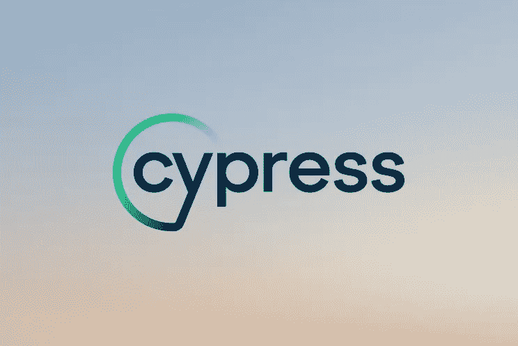
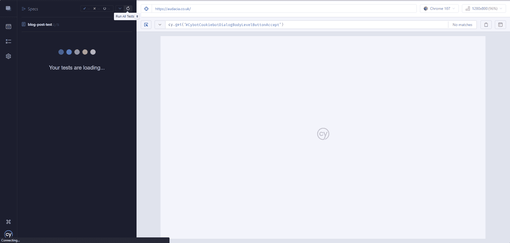

# 测试自动化:在 QA 过程中使用 Cypress

> 原文：<https://levelup.gitconnected.com/automation-first-why-qa-teams-might-uses-cypress-cdc1665fd095>



在 Audacia，我们一直在寻找通过自动化测试来增强测试流程的方法。这促使我们寻找能够帮助我们进行健壮的 UI 测试的软件。Cypress 是被 Selenium 等竞争对手选中的软件。

Cypress 也是一个著名的行业标准自动化工具，拥有大量的文档和我们需要的功能灵活性。当 QA 工程师运行测试时，它被证明比 Selenium 更可靠，能让测试一致通过。这意味着 Audacia 可以轻松提高 QA 团队的技能，并向加入公司的具有手工测试背景的新员工介绍 Cypress。

从那时起，我们已经将 Cypress 整合到我们项目的自动化优先方法中(与 [API 测试](https://audacia.co.uk/technical-blog/automated-testing-of-apis)一起)，QA 团队已经接受了关于该产品的大量内部培训。

本文将探讨什么是 Cypress，Cypress 的用途，Cypress 的利与弊，以及我们为什么在 Audacia 使用这个工具。

# 柏树是什么？

Cypress 是一个成熟的自动化测试软件框架，允许 QA 工程师使用他们选择的编程语言编写 UI 测试。在 Audacia，我们选择用 TypeScript 编写，因为它比 JavaScript 更容易维护，也更容易编写。此外，我们的软件测试人员已经熟悉了 C#，这意味着向用 TypeScript 而不是 JavaScript 编码的过渡并不那么严重。

然后，可以使用 QA 工程师选择的任何浏览器，通过测试运行程序运行测试。Cypress 还在测试中提供了调试功能，这意味着 QA 工程师可以准确定位测试失败的位置，对测试进行更改，然后立即再次运行测试。

自动化测试可以在任何网站上运行，并使用默认和自定义命令与页面上的元素进行交互，以定义自动化在浏览器中的作用。例如，下面的测试将导航到一个网页，输入一个搜索，然后点击正确的结果。然后，它可以验证它已经到达正确的网页，并且测试将通过。如果由于任何原因，测试失败，那么 Cypress 将通知用户测试失败的地方，并给他们一个直接的错误消息。

```
describe('As a user, I should be able to access the Audacia website', () => {
  it('As a user, I should be able to access the Audacia website and verify the ADM project page exists', () => {
    // Navigate to the Audacia website
    cy.visit('www.audacia.co.uk');

    // Verify the URL is correct
    cy.url().should('contain', 'audacia.co.uk/');

    // Accept the website cookies
    cy.get('[data-test-id = "AcceptCookiesButton"]').click();

    // Click on the projects page
    cy.get('[data-test-id = "project-name"]').click();

    // Verify the URL is correct
    cy.url().should('contain', '/projects');

    // Click ADM
    cy.get('[data-test-id = ADMProject]').click();

    // Check the header displays the correct information
    cy.get('h1').should('contain', 'A commodities trading platform to support £1bn contracts annually');
  });
});
```

在真正的测试中，选择器将驻留在一个单独的选择器类文件中，以便在页面上的任何元素发生变化时，它们能够为将来做好准备。这使得维护测试的 QA 工程师能够在一个地方修改它们，而不是跨越多个文件。一旦编写了测试，就可以执行任意次。



# 我们为什么要用柏树？

Cypress 允许 QA 团队用 TypeScript 为他们的 Audacia 项目编写可靠的 UI 测试，并通过专用的 Cypress 测试运行程序运行这些测试。当然，UI 可以手动测试。然而，即使在一个小的应用程序中，一个回归包可能有数百个测试用例，需要由 QA 工程师单独运行。

Cypress 允许测试人员让自动化来完成工作，重点是维护和调试代码，而不是运行案例。

赛普拉斯为 Audacia 提供了各种利弊:

## 赞成的意见

速度:由于易于使用的 web 测试运行器和浏览器自动化，在 Cypress 中运行回归包要比手工回归运行快得多。

可靠性:在 Cypress 中，测试可以连续运行多次，可以添加断言(比如检查按钮在不应该显示的时候是不可见的)，并且可以在运行中调试测试。

在 DevOps 管道中使用:Cypress 可以集成到 DevOps 的发布管道中，以便在需要时跨多个环境(如 QA、UAT 或生产/现场)运行，并提供测试运行的完整输出日志。

设置简单快速:Cypress 可以使用 npm 命令轻松安装，并通过简单的模板文件结构集成到项目中，该模板文件结构可用于集成到管道中，以便按设定的时间表运行。

易于学习:Cypress 开发团队已经编写了大量的[文档](https://docs.cypress.io/guides/overview/why-cypress)和在线教程，解释了从设置软件到高级学习技术的一切。还有一个活跃的社区论坛和定期发布，包括更新和新功能。

Git 插件:Cypress 提供了对各种类型插件的支持，以增强测试。Audacia 目前使用一个插件来上传图片，一个插件来标记，以允许 QA 工程师根据他们或客户的要求运行某些类型的测试。我们一直在寻找新的插件来增强我们的测试结构。

## 骗局

Cypress 没有像其他框架那样全面的跨浏览器支持。例如，他们的 Safari 支持仍处于试验阶段。

值得注意的是，Cypress 并不总是用于每个测试场景的最可行的工具，维护这些测试的时间可能会超过好处。在这种情况下，可以探索手动测试或其他自动化渠道，以找到最省时的解决方案。

# 结论

通过使用 Cypress，我们可以继续我们的自动化优先的项目方法，它将使我们能够创建更可靠的测试，可以与我们的其他测试策略一起工作，并有利于发布的速度和我们 QA 团队的技能提升。尽管目前使用的是 Cypress，但我们一直在积极寻找其他有利于我们项目的框架(进一步阅读:[剧作家](https://playwright.dev/docs/intro)

Audacia 是一家领先的软件开发公司，总部位于英国利兹。在我们的[技术洞察博客](https://audacia.co.uk/technical-blog)上查看来自我们顾问、业务分析师、开发人员和测试人员团队的更多技术洞察。

*本文由 Audacia Associate 软件测试员，*[*Simon Tabram*](https://uk.linkedin.com/in/simon-tabram-23352b5a)*撰写。*