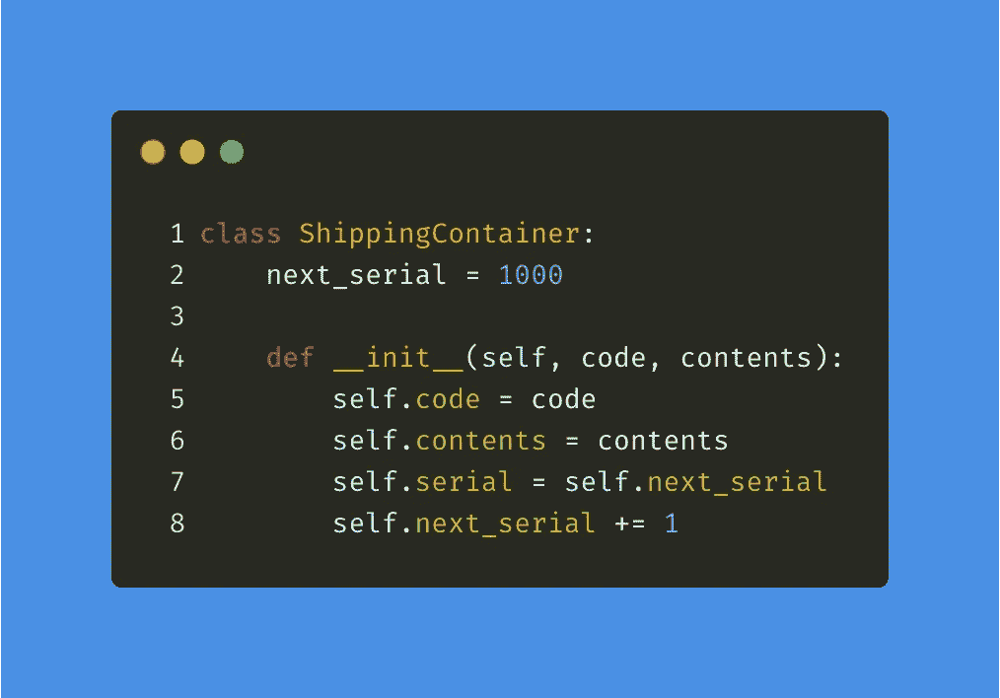
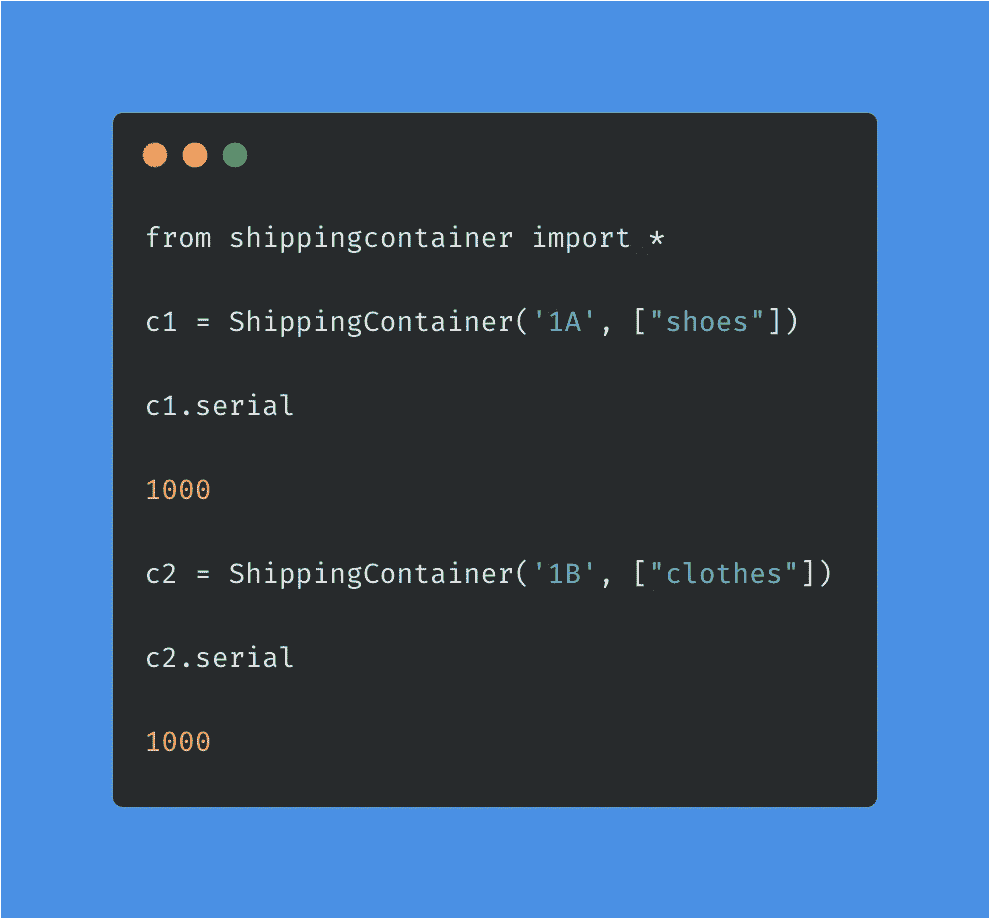
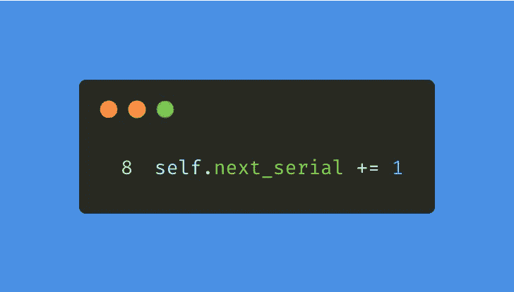
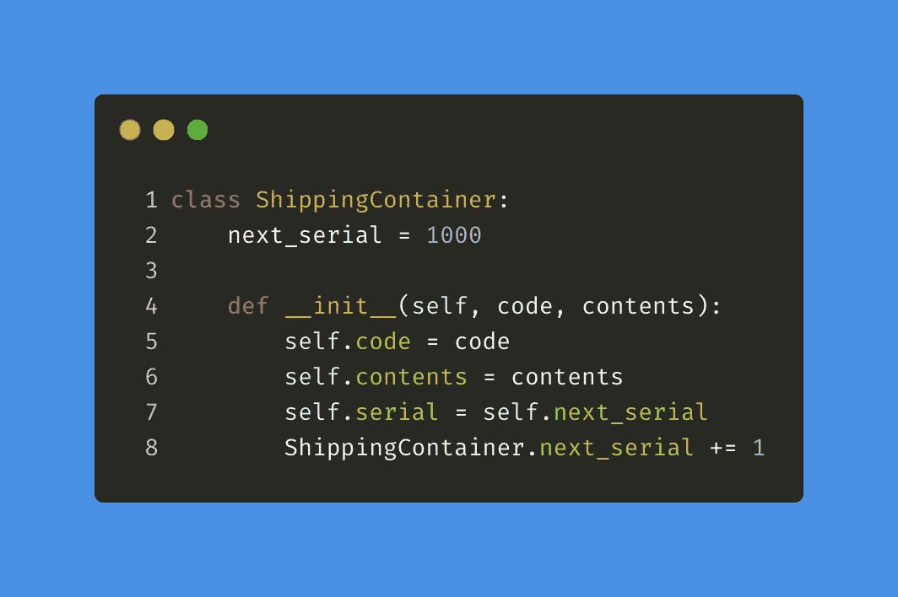
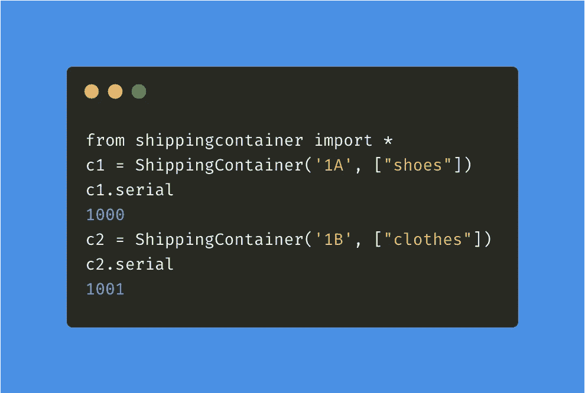
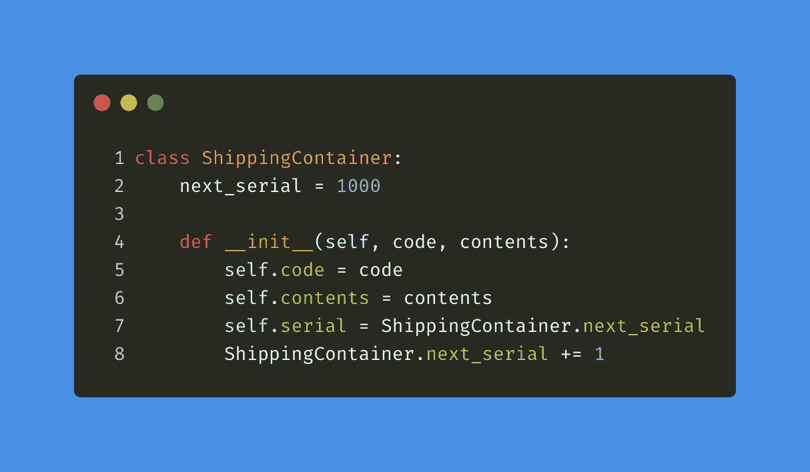

# 避免通过 python 中的实例访问类属性

> 原文：<https://levelup.gitconnected.com/avoid-accessing-class-attributes-through-instance-in-python-9f81304c0634>

## 虽然您可以使用实例来访问类属性，但是这样做是不安全的

埃里克·麦克林在 [Unsplash](https://unsplash.com/photos/NpQSc0DzvBg) 上的照片

在 python 中，类的实例由关键字 **self 引用。使用这个关键字，你不仅可以访问所有的实例属性，还可以访问类属性。虽然尝试使用 self 读取类属性不成问题，但是尝试分配/修改类属性将不起作用。**

在本文中，我将使用一个简单的例子来演示这一点，在这个例子中，我们使用一个 class 属性来分配和跟踪集装箱的序列号。

# 让我们从例子开始

假设我们希望所有的集装箱都以序列号 1000 开始。用于创建该类实例的 **__init__** 方法试图将实例属性 **serial** 赋给第 7 行中的类属性 **next_serial** 。这没问题，但是我们在第 8 行遇到了一个问题，我试图使用实例更新类属性 **next_serial** 。让我们看看这在终端中是否有效

那没用。两个集装箱都有相同的序列号。但是为什么呢？让我们再来看看我们的类定义

在第 8 行中，我们试图使用实例修改类属性 **next_serial** ，但是这里发生的是我们创建了一个新的实例属性 **next_serial。**

因此，让我们致力于我们的类定义，并尝试解决这个问题

这次我们使用类名而不是 self 直接访问类属性 next_serial。让我们在终端中再次运行代码

我们找到了。现在起作用了！

最后，让我们清理代码，使它更加明确我们打算访问的类属性

# 结论

虽然您可以出于读取目的使用实例来访问类属性，但是您不能修改它们。要修改类属性，您需要使用类名访问该属性。此外，使用类名访问类属性使读者更清楚您想要访问哪个属性，因此这有助于项目维护。不小心这个陷阱可能会导致调试失败。