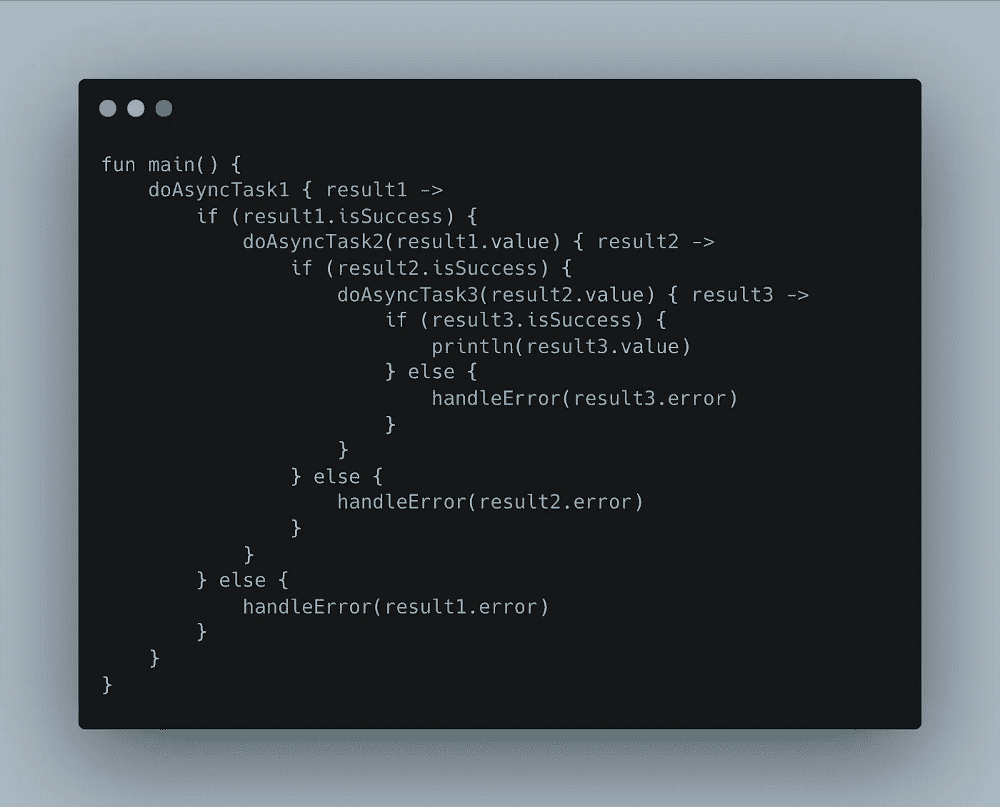

# 用 Kotlin 协程避免回调

> 原文：<https://levelup.gitconnected.com/avoid-callback-hell-with-kotlin-coroutines-7a72a2a8a701>

## 只需几行代码就可以将嵌套的回调调用替换为一次性操作或订阅操作



一个 Kotlin 回调地狱的例子由 [ChatGPT](https://openai.com/blog/chatgpt/)

回调地狱是异步任务的后果，每个遇到过它的开发人员都讨厌它。

它很难阅读，看起来很丑，维护是一种痛苦，尤其是当开始一个新的代码库时。

多亏了 Kotlin，现在有了一个彻底摆脱回调地狱的解决方案，这就是 Kotlin 协程的用武之地。

科特林的协程很棒。它们易于学习，轻量级，被集成到语言中，使异步代码像顺序代码一样可读。

对我来说，它的一个最大的特点是，他们允许开发者避免回调地狱噩梦，这就是我们将要看到如何做。

# 摆脱回调

为了消除回调地狱，我们将使用 Kotlin 协程和 **suspend** 函数。

我们将用这个 **suspend** 函数替换两种类型的回调。一次触发的回调和作为订阅者-消费者模型监听更新的回调。

## 一次性复试

首先，让我们从一次性回调开始。为此，我们需要一个 **suspend** 函数来调用一个名为`suspendCoroutine`的函数。如果发生错误，这个函数将返回计算出的值或传播抛出的异常。

`suspendCoroutine`方法接受一个 lambda，这是我们像往常一样使用回调监听器的地方，不同的是，一旦我们有了结果，我们将接受`suspendCoroutine` lambda 的`continuation`参数，并继续执行调用`resume`的协程，并返回值。

除了`resume`还有其他选项，比如`resumeWith`，如果你需要报道失败或成功的案例，需要一个`Result`。如果你想返回一个异常，还有`resumeWithException`，这是在失败的情况下调用`resumeWith`。

我喜欢将这些代码实现为类的扩展函数，我将这些方法从基于回调的方法转换为顺序代码，如下例所示。

这里我使用`suspendCoroutine`函数从 [Firebase 实时数据库](https://firebase.google.com/docs/database/android/read-and-write)中读取数据。

```
suspend fun DatabaseReference.read(): DataSnapshot = suspendCoroutine { continuation ->
    val valueEventListener = object : ValueEventListener {
        override fun onCancelled(error: DatabaseError) {
            continuation.resumeWithException(error.toException())
        }

        override fun onDataChange(snapshot: DataSnapshot) {
            continuation.resume(snapshot)
        }
    }
    addListenerForSingleValueEvent(valueEventListener)
}
```

现在，要调用这段代码，唯一需要的是一个协程作用域，所以在调用函数之前，你必须记住这样做。与您可以直接调用的回调模式相比，这可以被认为是一个缺点，但是如果您忘记了协程作用域，编译器会告诉您，所以我不觉得这有什么不同。

在这里你可以看到如何调用上面创建的方法，现在，防止开发人员使用回调。

```
suspend fun getGroups(): List<Group> {
    return groupRef.read().mapToGroups()
}
```

## 基于订阅的回访

现在，对于不断发出数据的回调，例如，每次数据库中的值改变时，我们将依赖 Kotlin 流**。**

科特林流有一个函数`callbackFlow`，它返回一个`Flow`。这段代码将托管我们想要消除的侦听器，并在每次注意到更新时发出一个值。它还负责在不再需要数据流时执行代码。

和`suspendCoroutine`一样，`callbackFlow`在我们要执行监听器的地方取一个 lambda，每次我们想要发出数据时，都需要调用带有发送对象的`trySend`。

在这个 lambda 中，我们还需要调用`awaitClose`，它也需要一个 lambda，一旦不再需要`Flow`就会执行这个 lambda。这是强制性的，如果不这样做，代码就会崩溃。

遗憾的是，编译器不会提醒我们这一点，所以不要忘记添加它以避免运行时错误。

在下面的代码片段中，您可以看到如何使用`callbackFlow`来监听 Firebase 实时数据库中的变化，同样是在扩展函数中实现的。

```
suspend fun DatabaseReference.subscribe(): Flow<Player> = callbackFlow {
    val childEventListener = object : ChildEventListener {
        override fun onChildAdded(snapshot: DataSnapshot, previousChildName: String?) {
            trySend(
                Player(
                    snapshot.key
                )
            )
        }
        override fun onChildChanged(snapshot: DataSnapshot, previousChildName: String?) {}
        override fun onChildRemoved(snapshot: DataSnapshot) {}
        override fun onChildMoved(snapshot: DataSnapshot, previousChildName: String?) {}
        override fun onCancelled(error: DatabaseError) {}
    }
    addChildEventListener(childEventListener)
    awaitClose {
        removeEventListener(childEventListener)
    }
}
```

由于这是返回一个普通的`Flow`，我们只需要在我们的消费者中调用`collect`来读取发出的数据，并对它做我们想做的任何事情，如下面的例子所示，其中`flow`变量是之前由`callbackFlow`返回的变量。

```
flow.collect { result ->
    _player.postValue(cachePlayers)
}
```

# 结论

这实际上很容易实现，最后以回调地狱结束。有了这些改变，你可以调用曾经是回调的代码，一个接一个地按顺序调用，没有无限的缩进，并且更新一些被认为是用 Java 而不是 Kotlin 来使用的旧库。

同样，如果你在 Android 上使用这个，现在你可以用一个用例层实现干净的架构，更容易更干净地管理错误，如果你使用的是 [MVVM](https://medium.com/codex/should-you-migrate-your-android-projects-from-mvp-to-mvvm-d8ca3ded037c) ，只需使用`viewModelScope`作为你的协程作用域。

如果你想阅读更多这样的内容，并支持我，不要忘记检查我的个人资料，或给媒体一个机会，成为会员，以获得我和其他作家的无限故事。每月只有 5 美元，如果你使用这个[链接](https://medium.com/@molidev8/membership)，我会得到一小笔佣金。

[](https://medium.com/@molidev8/membership) [## 通过我的推荐链接加入 Medium—Miguel

### 阅读米格尔的每一个故事(以及媒体上成千上万的其他作家)。你的会员费直接支持米盖尔…

medium.com](https://medium.com/@molidev8/membership)