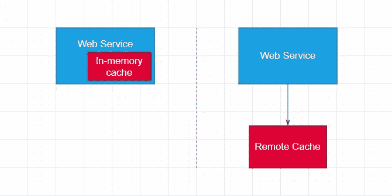
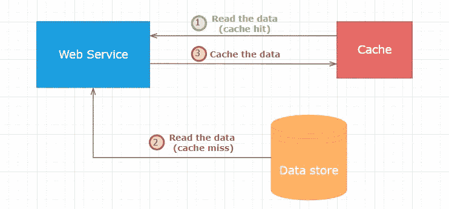

# 避免在应用程序中使用缓存，或者正确使用

> 原文：<https://levelup.gitconnected.com/avoid-using-cache-in-your-application-or-do-it-right-9650214797bc>

## 实现应用程序缓存之前要考虑的系统设计问题。

丹尼尔·伊德里在 [Unsplash](https://unsplash.com?utm_source=medium&utm_medium=referral) 上的照片

将数据库中的数据缓存到离应用程序更近的地方可以大大提高性能。然而，在您开始在应用程序级别实现缓存之前，重要的是要问自己许多不同的问题，以便做出正确的设计决策并最终把事情做好。

# 应用程序真的需要缓存吗？

我认为这是在开始实现缓存之前要问自己的主要问题，因为缓存会使应用程序的设计变得复杂。

对“应用程序真的需要缓存吗？”可以节省大量开发和维护工作，因为您不必处理缓存失效、缓存回收策略、缓存未命中、与数据不一致相关的错误以及缓存可能给系统带来的其他问题。

那么，您如何知道自己是否真的需要缓存呢？你可以从这些问题开始:

*   **我真的需要**来提高应用性能吗？现在项目的 nfr(非功能需求)是什么？客户对性能不满意吗，或者我只是想让系统更快，而没有业务需求？
*   不实现缓存能否提高性能**？我能否运行 SQL 事件探查器或查询执行计划分析器并优化查询、创建缺失索引、减少资源争用/阻塞、对数据进行反规范化等？？**
*   除了应用级高速缓存(SQL Server 高速缓存、CDN、浏览器高速缓存等)之外，还可以有其他高速缓存级别**。)解决当前的性能问题？**
*   我能在应用程序中找到与数据库无关的其他瓶颈吗？对托管堆的大量分配、缺乏并行性、跨大型集合的线性搜索等。app 现在免费了吗？

或许可以询问更多与您的特定项目相关的问题，以了解是否真的需要缓存。估计缓存需求对于避免应用程序设计过于复杂非常重要。

# 内存缓存还是远程缓存？

内存缓存意味着数据缓存在 web 服务的本地内存中。远程缓存意味着数据缓存在与 web 服务通信的远程服务器上，比如 Redis 或 Memcached。

**远程缓存**通常在以下情况下使用:

*   几个不同的 web 服务需要从缓存中读取数据。在这种情况下，缓存数据的责任应该委托给一个单独的组件—远程缓存服务器。
*   同一个 web 服务的几个**实例/节点**(例如自动伸缩)需要访问缓存中的数据。如果每个节点在其本地内存中缓存相同的数据，则使所有节点的缓存无效将更加困难。
*   **千兆字节** **的数据**需要缓存。由于高内存消耗、内存不足问题、频繁的垃圾收集等原因，在 web 服务的内存中存储大量数据会降低速度。
*   远程缓存服务器**已经在项目中进行了配置和使用**，用于会话存储、分布式锁定、流等。开始使用远程缓存服务器来完成一项额外的任务——缓存数据可以是一项快速而简单的任务(但是要小心，首先要权衡利弊)。

**内存中**缓存通常在以下情况下使用:

*   有一个单独的 web 服务，它有一个单独的节点,负责填充和读取缓存的数据，使缓存失效，以及更新数据库。
*   对于 web 服务来说，性能是至关重要的。在远程缓存服务器上缓存数据将需要 web 服务进行定期的网络调用，这平均需要几百毫秒。从本地内存读取数据要快得多。
*   当不同的 web 服务或同一 web 服务的多个节点需要缓存**静态数据**(从不改变的数据)**、**时，它们可以简单地使用自己的本地内存。每个 web 服务可以在启动时简单地加载静态数据的副本，并将其无限期地缓存在内存中。
*   web 服务的许多节点从远程缓存服务器读取缓存数据**会成为高负载下的瓶颈**。在这种情况下，在每个节点的内存中额外缓存数据可以显著减少对远程缓存服务器的网络调用次数，并消除瓶颈。

# 实现什么样的缓存模式？

根据缓存模式的优缺点和应用程序的业务需求，可供选择的缓存模式很少。

## 缓存备用模式

应用程序本身充当缓存层或缓存服务器和数据源的中介。当相同的数据被多次请求，并且很少更新该数据时(大量读取的工作负载)，这种模式工作得很好。此外，使用缓存备用，应用程序只能缓存需要缓存的内容，但是要获得很少使用的数据，应用程序总是可以直接查询数据库。

这种模式的缺点是，当您在更新数据源中的数据后忘记使缓存无效、忘记为缓存项设置 TTL，或者在更新数据库中的数据和使缓存无效的过程中出现竞争情况时，很容易在缓存和数据源之间出现数据不匹配。

## 通读缓存模式

该模式非常类似于缓存备用，但不同之处在于应用程序总是从缓存层或缓存服务器读取数据。缓存层或服务器负责从数据库读取数据，并在缓存未命中的情况下缓存数据，或者在缓存命中的情况下返回缓存的数据。

该模式通常与直写或后写模式结合使用，以支持数据库更新。

## 直写高速缓存模式

与通读模式一样，应用程序只与缓存层或服务器交互，但在这里，应用程序将数据写入缓存，缓存负责将数据同步写入数据库。

直写增加了写操作的延迟，因为数据必须先写入缓存，然后再写入数据库。然而，另一方面，缓存将始终与数据库保持一致，无需担心实现缓存失效技术。

## **回写(后写)高速缓存模式**

该模式类似于直写模式，但关键区别在于，将数据写入数据库是通过一些作业或消息队列完全异步完成的。

写回模式用于写密集型应用程序，因为在将数据写入缓存后立即将控制返回给调用者，从而实现低延迟和高吞吐量。

# 应该使用哪种缓存回收策略？

专用于缓存数据的内存可能会完全填满远程缓存服务器或 web 服务的本地内存，因此有几种称为缓存回收策略的策略来防止内存不足问题。通常，默认的缓存回收策略是 LRU(最近最少使用)，这意味着最近最少使用的项目将首先被丢弃。

然而，LRU 并不适合所有可能的情况。例如，一些缓存项可能很少被访问，但它们不应该被自动从缓存中清除，因为由于它们的大小，重新缓存它们的成本很高。

以下是一些通用的缓存回收策略:

*   最近使用的(MRU):最先丢弃最近使用的项目。
*   最不常用(LFU):最不常用的项目从缓存中清除，而最常用的项目保留。
*   随机替换(RR):缓存项被随机收回。
*   不逐出:缓存项永远不会从缓存中被逐出。

根据高速缓存库或高速缓存服务器的不同，上述高速缓存回收策略可能会有各种变化。

# 结论

在这篇文章中，我们讨论了开发人员和架构师在实现应用级缓存之前应该考虑的一些要点。

实现缓存不是一项简单的任务。错误可能发生在设计阶段或实施的不同阶段。另一方面，由于需求的变化或新需求的引入，昨天有效的实现今天将不再有效。因此，定期检查当前的实现是否满足当前的业务需求，并在必要时尽早对设计进行调整是非常重要的。

感谢阅读。如果你喜欢你所读到的，看看下面这个故事:

 [## 微服务之间建立通信的 4 种方式

### 每种方法的主要优缺点

levelup.gitconnected.com](/4-ways-to-establish-communication-between-microservices-984207f29497) 

还有，考虑成为[中等会员](https://esashamathews.medium.com/membership)。

# 分级编码

感谢您成为我们社区的一员！在你离开之前:

*   👏为故事鼓掌，跟着作者走👉
*   📰更多内容请查看[升级编码刊物](https://levelup.gitconnected.com/?utm_source=pub&utm_medium=post)
*   🔔关注我们:[推特](https://twitter.com/gitconnected) | [LinkedIn](https://www.linkedin.com/company/gitconnected) | [时事通讯](https://newsletter.levelup.dev)

🚀👉 [**加入升级人才集体，找到一份神奇的工作**](https://jobs.levelup.dev/talent/welcome?referral=true)