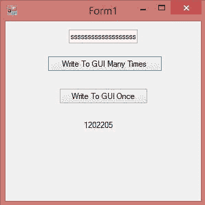
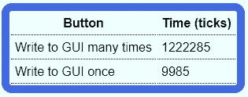

# 避免写入 GUI

> 原文：<https://levelup.gitconnected.com/avoid-writing-to-the-gui-ed70ad535c00>

Joshua Woroniecki 在 [Unsplash](https://unsplash.com/) 上的照片

让我们来看看通过在 for 循环中创建一个大字符串来将它写入 TextBox 和通过每次在 for 循环中将文本追加到 TextBox 来将字符串写入 GUI 之间的时间差异。

为了测试这一点，我创建了一个类似如下的 Windows 窗体:

这是按钮单击事件的代码:

# 结果

以下是每个按钮的计时结果:

*写 GUI 一次*按钮比*写 GUI 多次*按钮快 1212300 个节拍。

如您所见，首先准备字符串，然后将其写入 GUI，这比多次将字符串的一部分写入 GUI 要快得多。

这里的教训是尽量减少你写 GUI 的次数。