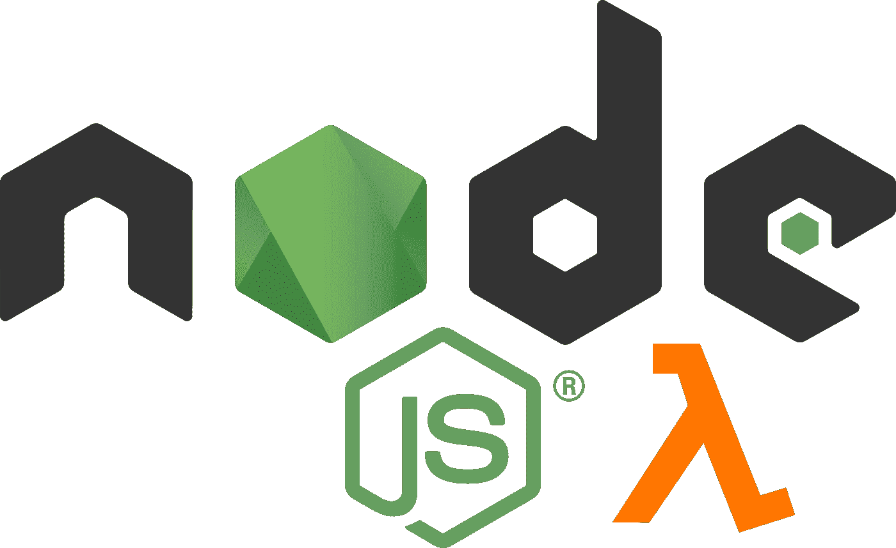

# 避免 AWS Lambda 中 async Node.js 函数的缺陷

> 原文：<https://levelup.gitconnected.com/avoiding-the-pitfalls-of-async-node-js-functions-in-aws-lambda-941220582e7a>



自从[在 AWS Lambda](https://aws.amazon.com/blogs/compute/node-js-8-10-runtime-now-available-in-aws-lambda/) 中引入 Node.js 8.10 运行时以来，我们已经能够享受使用 *async/await* 语法的好处，并编写优雅、易于维护的干净代码。

您可以编写一个简单的异步函数处理程序:

```
export const handler = async (event, context) => { 
  const response = await someAsyncFunc();
  return response;
}
```

这实际上与仅仅返回承诺是一样的，因为 [AWS Lambda 将自动等待异步处理程序](https://docs.aws.amazon.com/lambda/latest/dg/nodejs-prog-model-handler.html)中的承诺:

```
export const handler = async (event, context) => { 
  return someAsyncFunc();
}
```

但是为了清楚起见，我们将使用更详细的版本。
现在让我们在函数处理程序中添加一个异步副作用——比如一个 DB 计数器，它必须在 Lambda:

```
export const handler = async (event, context) => {  const response = await someAsyncFunc();
  **asyncIncrementDBCounter();
**  return response;
}
```

我们不等待它，因为我们不关心返回值。我们只知道它最终会执行。因此，如果在 Lambda 被调用之前，计数器的值是 **0** ，那么在执行结束时，值会是什么呢？

结果答案并非如此微不足道——它可能会增加到 **1** ，它可能会保持 **0** ，或者它可能会在未来某个不可预测的时间增加。

等等，什么？为了理解这种行为，我们需要理解 Node.js 如何处理异步任务。

# Node.js 事件循环的简要概述

[事件循环](https://nodejs.org/de/docs/guides/event-loop-timers-and-nexttick/)允许 Node.js 执行非阻塞 I/O 操作，尽管 JavaScript 是单线程的。

Node.js 使用事件循环将异步任务卸载到系统内核(它是多线程的)，系统内核在任务完成时通知 Node.js。这就是 Node.js 如此伟大和无阻塞的原因。

[承诺本质上是异步操作](https://developer.mozilla.org/en-US/docs/Web/JavaScript/Guide/Using_promises)，所以使用事件循环将它们卸载到内核，当它们被解析时，内核会将结果传回 Node.js。

## 回到我们的λ

```
export const handler = async (event, context) => { 
  const response = await someAsyncFunc();
  asyncIncrementDBCounter();
  return response;
}
```

在我们的例子中，对***someAsyncFunc()***的调用是 *await* ed。被卸载后，它下面的代码只有在承诺被解析时才会被处理，就像一个好的 ol '回调一样。

当***asyncIncrementDBCounter()***被调用时，它也被卸载，但是由于它不是*wait*ed，所以执行继续并将响应返回给 lambda 调用者。

在返回响应时，增量任务仍然可以在事件循环队列 ***、*、**中，这取决于它在返回时是否完成了它的处理。

为了理解接下来会发生什么，我们需要理解 Lambdas 是如何执行代码的。

# 到 Lambda 执行上下文中

每当一个 Lambda 函数被调用时，一个临时的运行时环境被调用，该环境具有根据其配置运行该函数所需的资源。这被称为**执行上下文**。

由于这个引导过程需要时间，AWS Lambda 试图为 Lambda 的后续调用重用相同的执行上下文，以最小化“冷启动”开销——例如连接到数据库。

Lambda 执行完毕后，上下文将被冻结以备后用。官方文件中写道:

> 如果 AWS Lambda 选择重用执行上下文，则由 Lambda 函数发起的后台进程或回调(在函数结束时未完成)将恢复**。**

现在我们可以理解我们的选择了。

## 那么柜台会怎么样呢？

如果***asyncIncrementDBCounter()***在初始调用期间执行完毕，计数器将递增到 **1** 。简单。

但是如果它没有完成，处理就被“冻结”在之前的 Lambda 执行上下文中，它只能在下一次 Lambda 调用**时恢复——并且只有在相同的执行上下文被重用的情况下。**

这基本上意味着增量可以在稍后的某个时间点发生，或者根本不发生，保持计数器在 **0** 。它很容易导致错误和无法解释的行为。
(好吧，至少对没看这个帖子的人来说是这样；) )

# 结论

在 AWS Lambdas 异步处理程序上，总是等待您的异步函数。

我们变得习惯于只在我们需要结果的承诺上*等待*，或者当我们想要在调用者中使用 *try/catch* 子句来处理错误时。但是在 AWS Lambdas 的情况下，我们应该改变我们的心态。

官方文件强化了这一观念:

> 您应该确保代码中的任何后台进程或回调在代码退出之前都已完成。

回到代码。天真的解决方案将会奏效:

```
export const handler = async (event, context) => { 
  const response = await someAsyncFunc();
 **await** asyncIncrementDBCounter();
  return response;
}
```

但是既然这两个函数互不依赖，不如用[*promise . all*](https://developer.mozilla.org/en-US/docs/Web/JavaScript/Reference/Global_Objects/Promise/all)*并行运行异步函数，*一起等待*它们的结果:*

```
*export const handler = async (event, context) => { 
  const [response, dbResult] = 
    await Promise.all([
      someAsyncFunc(), 
      asyncIncrementDBCounter()
    ];  

   return response;
}*
```

*注意:如果某个函数失败， *Promise.all* 的快速失效机制将阻止其他承诺的解析。这超出了本文的范围，但是这里有一些缓解措施。*

*感谢阅读！这是一个令人着迷的研究主题，也是一个令人紧张的调试主题:)如果我遗漏了什么或者犯了一个错误，请在评论中告诉我。*