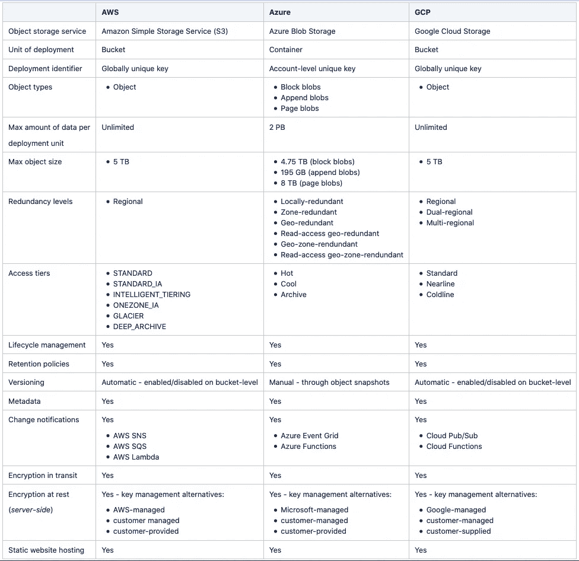

# GCP Azure 的 AWS:对象存储服务

> 原文：<https://levelup.gitconnected.com/aws-azure-gcp-object-storage-services-5f1b2945cc11>

图片来自 Pexels 的 panumas nikhomkhai

本文的目的是提供三个最大的云提供商的对象存储服务的高层次总结:亚马逊网络服务(AWS)，微软 Azure 和谷歌云平台(GCP)。我们的目标不是对不同的平台进行评级，对它们进行排序，或者推荐一个平台。在较高层次上讨论了不同的功能，并提供了更详细信息的链接。

下表概述了 AWS、Azure 和 GCP 的对象存储服务。所有的平台都提供或多或少相同的特性，但是它们的设计和实现方式在不同的平台之间有所不同。本文后面将更详细地讨论不同的特性。

图一。AWS、Azure 和 GCP 的对象存储服务概述

# 对象存储服务

所有这三个平台都提供全球可访问的、完全受管的对象存储服务，这些服务具有几乎无限的存储容量，并且没有管理开销。这些服务可用于在指定的存储单元中存储二进制对象和非结构化数据。数据具有高可用性和持久性，并基于选定的冗余级别进行复制。所有平台都支持多个冗余级别和访问层、传输中和静态加密、对象生命周期管理、保留策略、静态网站托管等。

这些对象存储服务的用户体验与文件系统有许多相似之处，所有这三个平台都提供了类似文件系统的 API。然而，必须注意，对象存储服务不是文件系统。在存储单元中，对象以键值对的形式存储，每个对象都有一个键、数据和元数据。密钥或密钥名在存储单元中必须是唯一的。元数据包含有关对象的信息，并且可能包含系统生成的和自定义的元数据。对象关键字通常是路径(例如“/dir/file.txt”)，即使底层存储结构是平面的，并且没有子文件夹的层次结构。

## 自动警报系统

[简单对象存储](https://docs.aws.amazon.com/AmazonS3/latest/dev/Introduction.html#CoreConcepts) (S3)是亚马逊的分布式对象存储服务。在 S3，部署单位被称为桶，二进制对象被称为对象。单个桶中可以存储的数据量是无限的，但是单个对象的最大大小是 5 TB。存储桶由全局唯一键标识，并且对象名在存储桶中必须是唯一的。

存储在 S3 存储桶中的数据在区域级别是冗余的。区域是一个单一的地理区域，例如爱尔兰，它由多个孤立的、物理上独立的数据中心组成。当创建新的存储桶时选择该区域，并且存储在该存储桶中的数据永远不会离开所选择的区域，除非它被明确地转移到另一个区域。不能更改现有存储桶的区域。如果对象必须复制到多个区域，可以使用[跨区域复制](https://docs.aws.amazon.com/AmazonS3/latest/dev/replication.html)跨不同区域的桶复制对象。

S3 为创建新对象和相关元数据提供了强大的写后读一致性。这意味着写操作之后的下一个读操作返回新创建的对象。但是，如果在创建对象之前对键名发出了读请求，S3 将提供最终的写后读一致性。这意味着后续的读取可能会也可能不会返回新创建的对象。对于更新和删除操作，S3 提供了最终的一致性。这意味着后续读取可能会返回旧数据或更新的数据。然而，损坏的或部分的数据永远不会返回。

对象的可用性和定价模型是通过访问层设置的。在 S3，定义访问层的属性被称为[存储类](https://docs.aws.amazon.com/AmazonS3/latest/dev/storage-class-intro.html)。默认存储分类由 S3 定义，不能在存储段级别更改。相反，当创建新对象时，可以在对象级别定义存储类，现有对象的存储类可以在对象生命周期的任何时间点通过生命周期管理手动或自动更改。

支持的存储类别包括标准、标准 IA、智能分层、one zone IA、GLACIER 和 DEEP ARCHIVE。标准存储是用于存储频繁访问的数据的通用存储，也是 S3 的默认存储类别。与其他层相比，它的访问成本最低，但存储成本较高。STANDARD_IA 和 ONEZONE_IA 适用于长期、不常访问的数据，它们的最短存储期限为 30 天。与标准存储相比，它们具有更低的存储成本和更高的访问成本。GLACIER 和 DEEP_ARCHIVE 用于长期归档，它们的最小存储持续时间分别为 90 (GLACIER)天和 180 (DEEP_ARCHIVE)天。他们的存储成本最低，但数据检索成本最高。GLACIER 的数据检索时间从几分钟到几小时不等，DEEP_ARCHIVE 的默认数据检索时间为 12 小时。智能分层通过自动将数据移动到最经济高效的访问层来优化成本。这是通过监视访问模式的变化，并在频繁访问层和低成本的非频繁访问层之间移动对象来实现的。

## 蔚蓝的

在 Azure 中，包括对象存储在内的多个数据存储服务被组织在一个[存储帐户](https://docs.microsoft.com/en-us/azure/storage/common/storage-account-overview)下，该帐户为数据提供了一个唯一的名称空间。有多种不同的存储帐户类型支持不同的功能，并有自己的定价模式。帐户类型定义了支持的存储服务、冗余级别、访问层和加密替代方案。在这种情况下，我将专注于为大多数使用 Azure 存储的场景推荐的[存储帐户类型](https://docs.microsoft.com/en-us/azure/storage/common/storage-account-overview#types-of-storage-accounts):通用 v2 帐户。

Azure 的对象存储服务是 [Blob storage](https://docs.microsoft.com/en-us/azure/storage/blobs/storage-blobs-overview) ，它是存储帐户下的服务之一。部署单元被称为[容器](https://docs.microsoft.com/en-us/azure/storage/blobs/storage-blobs-introduction#containers)，二进制对象被称为[blob](https://docs.microsoft.com/en-us/azure/storage/blobs/storage-blobs-introduction#blobs)，它们可以有三种不同的类型:块 blob、附加 blob 和页面 blob。Block blobs 用于存储二进制数据和文本。追加 blob 类似于块 blob，但针对追加操作进行了优化。页面 blobs 充当 Azure 虚拟机的磁盘。单个容器中可存储的最大数据量为 2 PB，该限制适用于存储帐户级别—如果存储帐户包含多个容器和/或其他存储服务，则它们的总大小不能超过 2 PB。单个 blob 的最大大小因 blob 类型而异，从 195 GB 到 8 GB 不等。容器用帐户级别的唯一键标识，并且 blob 名称在容器中必须是唯一的。Blob 存储提供了强大的写后读一致性—当对象被更改或删除时，后续操作总是返回该对象的最新版本。

数据冗余是在存储帐户级别定义的，这意味着存储在同一存储帐户下的容器中的所有对象都具有相同的冗余级别。创建新存储帐户时选择复制策略，并且可以在不停机的情况下更改现有存储帐户的复制策略。支持的[冗余级别](https://docs.microsoft.com/en-us/azure/storage/common/storage-redundancy)有[本地冗余](https://docs.microsoft.com/en-us/azure/storage/common/storage-redundancy-lrs)(LRS)[区域冗余](https://docs.microsoft.com/en-us/azure/storage/common/storage-redundancy-zrs)(ZRS)[地理冗余](https://docs.microsoft.com/en-us/azure/storage/common/storage-redundancy-grs)(GRS)[读访问地理冗余](https://docs.microsoft.com/en-us/azure/storage/common/storage-redundancy-grs)(RA-GRS)[地理区域冗余](https://docs.microsoft.com/en-us/azure/storage/common/storage-redundancy-gzrs) (GZRS)和[读访问地理区域冗余](https://docs.microsoft.com/en-us/azure/storage/common/storage-redundancy-gzrs?toc=%2fazure%2fstorage%2fblobs%2ftoc.json#use-ra-gzrs-for-high-availability) (RA-GZRS)。LRS 在一个数据中心内复制数据三次，ZRS 在一个区域内跨三个分区数据中心复制数据，GRS 和 RA-GRS 跨两个区域复制数据，GZRS 和 RA-GZRS 跨一个区域内的三个分区和两个区域复制数据。当使用 GRS 和 GZRS 时，只有当 Microsoft 启动从主区域到辅助区域的故障转移时，辅助区域中的数据才可供读取。当使用 RA-GRS 和 RA-GZSR 时，辅助区域中的数据始终可供读取。

对象的可用性和定价模型是通过访问层和冗余级别设置的。可以在存储帐户级别定义默认访问层，并将其应用于没有在对象级别显式设置的所有 blobs。当访问层设置为 blob 级别时，默认层不适用。默认访问层可以随时更改。

Blob 存储支持三个[访问层](https://docs.microsoft.com/en-us/azure/storage/blobs/storage-blob-storage-tiers):热、冷、存档。Hot 适用于频繁访问的数据，其访问成本最低，但存储成本高于其他层。冷存储用于存储至少 30 天的不经常访问的数据，与热存储相比，它具有较低的存储成本和较高的访问成本。与热层相比，冷层中的数据可用性略低。存档用于存储至少 180 天的很少访问的数据，它的存储成本最低，但数据检索成本最高。归档层中的数据离线存储，因此可能需要几个小时才能检索到。如果 blob(冷却或存档)在达到最小存储持续时间之前被删除或移动到其他层，则收取提前删除费。

## GCP

[谷歌云存储](https://cloud.google.com/storage/docs/introduction)是 GCP 的分布式对象存储服务。在 Google 云存储中，部署单元被称为 bucket，二进制对象被称为 objects。单个桶中可以存储的数据量是无限的，但是单个对象的最大大小是 5 TB。存储桶由全局唯一键标识，并且对象名在存储桶中必须是唯一的。

数据冗余是在存储桶级别定义的，这意味着同一存储桶中的所有对象都具有相同的冗余级别。[支持的冗余级别](https://cloud.google.com/storage/docs/locations)有区域、双区域和多区域。区域是一个单一的地理区域，例如伦敦，由多个孤立的、物理上独立的数据中心组成。双区域是一对区域，例如芬兰和荷兰，多区域是包含至少两个区域的大地理区域，例如欧盟。当创建新的存储桶时，存储桶的位置被选定，并且以后不能改变。将数据上传到存储桶时，数据总是被复制到所选位置内的多个数据中心。

云存储为关于写入和删除对象的操作提供了强大的[一致性](https://cloud.google.com/storage/docs/consistency)。实际上，这意味着成功的写或删除操作之后的读操作总是返回对象及其元数据的最新版本。相反，与访问权限管理相关的操作最终是一致的。这意味着在成功操作后，后续读取操作可能会返回过时数据，并且可能需要一段时间操作才会生效。

对象的可用性和定价模型是通过访问层设置的。此外，可用性还受到存储对象的存储桶的冗余级别的影响。在云存储中，定义访问层的属性称为[存储类](https://cloud.google.com/storage/docs/storage-classes)。可以为一个桶定义一个默认的存储类，该存储类由单个对象继承，除非另外明确设置。可以随时更改存储桶的默认存储类，但是更改不会影响存储桶中已经存在的任何对象。通过生命周期管理，可以随时手动或自动更改现有对象的存储类别。

支持的存储类别有标准、近线和冷线。标准存储最适合于频繁访问的数据和/或仅存储很短时间的数据。标准存储类别没有最短存储期，它提供最低的数据访问成本和最高的静态存储成本。近线存储用于不经常访问的数据，其最短存储期限为 30 天。它非常适合平均每月访问一次或更少的数据。与标准存储相比，静态存储成本较低，但数据访问成本较高，可用性略低。Coldline 存储用于数据归档，最短存储期限为 90 天。尽管数据是冷的，但它在几毫秒内就可用了。Coldline 存储非常适合平均每年访问一次或更少的数据。与标准存储和近线存储相比，静态存储的成本较低，但数据访问和每次操作的成本较高，可用性略低。如果对象(近线或冷线)在达到最小存储持续时间之前被删除，则收取提前删除费用。

# 生命周期管理、保留策略和版本控制

## 自动警报系统

[生命周期配置规则](https://docs.aws.amazon.com/AmazonS3/latest/dev/object-lifecycle-mgmt.html)在存储桶级别定义，它们可以应用于该存储桶中的所有对象或对象子集。生命周期配置由条件、操作和过滤器组成，条件和过滤器定义了一组要应用操作的对象。过滤器定义规则是应用于存储桶中的所有对象还是对象子集。此外，生命周期规则中的每个操作都有一个期限条件。该操作将应用于符合年龄条件和过滤标准的所有对象。因此，单个生命周期配置规则可以定义多个操作，这些操作应用于符合相同过滤条件但年龄不同的对象。支持的操作类型有转换操作和到期操作，如果在存储桶中启用了版本控制，它们可以应用于当前和非当前对象。转换操作用于将对象从一个存储类转换到另一个存储类，到期操作用于删除到期的对象。关于在存储类别之间转移对象，存在一些[约束](https://docs.aws.amazon.com/AmazonS3/latest/dev/object-lifecycle-mgmt.html)，但一般来说，支持将对象转移到访问频率较低的存储层。

[对象版本控制](https://docs.aws.amazon.com/AmazonS3/latest/dev/object-lifecycle-mgmt.html)可以通过在一个桶中保存一个对象的多个版本来防止对象被意外覆盖和删除。版本控制在存储桶级别启用，并应用于存储桶中的所有对象。启用版本控制后，每次更新或删除最新版本时，都会创建对象的非当前版本。对象的不同版本由版本 ID 标识。通过在删除请求中定义版本 ID，可以永久删除对象。当在删除请求中没有定义版本 ID 时，当前对象变成非当前对象，并且删除标记变成新的当前对象。使用生命周期管理，可以手动或自动永久删除非当前对象版本。

[对象锁](https://docs.aws.amazon.com/AmazonS3/latest/dev/object-lifecycle-mgmt.html)可用于在一段固定时间内或永久防止对象被覆盖或删除。对象锁定在存储桶级别启用，它要求在存储桶中启用对象版本控制—对象锁定适用于单个对象版本，而不是对象的所有版本。启用对象锁定仅适用于新的存储桶，一旦创建了启用了对象锁定的存储桶，就不能禁用锁定或暂停存储桶的版本控制。如果为存储桶配置了默认保留期，它会自动应用于存储桶中放置的所有新对象。对象锁支持两种类型的锁:[保持期](https://docs.aws.amazon.com/AmazonS3/latest/dev/object-lock-overview.html#object-lock-retention-periods)和[合法持有](https://docs.aws.amazon.com/AmazonS3/latest/dev/object-lock-overview.html#object-lock-legal-holds)。保留期将对象版本锁定一段固定的时间，而合法保留将锁定对象版本，直到明确取消保留。一个对象版本可以有两个锁，或者只有一个锁，或者两个都没有。对象锁支持两种[保留模式](https://docs.aws.amazon.com/AmazonS3/latest/dev/object-lock-overview.html#object-lock-retention-modes):治理模式和遵从模式。在治理模式下，具有特殊权限的用户可以更改锁定设置并更新/删除对象版本。在保护模式下，不能更新/删除对象版本，不能更改保留模式，也不能缩短保留期。此外，不能删除包含受对象锁保护的对象版本的存储桶。

## 蔚蓝的

[生命周期管理规则](https://docs.microsoft.com/en-us/azure/storage/blobs/storage-lifecycle-management-concepts)在存储帐户级别定义，它们可能适用于容器和/或 blobs 的子集。生命周期管理规则由一个操作集和一个过滤器集组成。动作集由动作-条件对组成，唯一支持的条件是 blob 的年龄。支持的操作包括将 blob 转移到较冷的存储层和删除 blob。过滤器可用于将规则定向到特定容器和/或 blobs 的子集。一个生命周期管理规则可以包含多个动作-条件对，并且规则中的每个动作都被应用到匹配条件的所有容器和/或 blobs。换句话说，相同的生命周期管理规则可以根据不同的容器和/或 blobs 的年龄对它们应用不同的动作。

【blob 存储的不可变存储提供了容器级别的保留策略，它适用于容器中所有现有和未来的 blob。保留策略定义了 blob 必须在容器中停留的最短时间，在保留期间不能删除或更新 blob。但是，尽管有保留期，存储类别仍可以更改。此外，不可变存储支持合法保留，可用于存储不可变数据，直到合法保留被清除，以防保留时间间隔未知。一旦 blob 的年龄大于保留期和/或合法保留被清除，blob 就可以被更新或删除。如果存储帐户或容器包含受不可变策略保护的 blobs，则不允许删除它们。基于时间的保留策略可以被锁定，这意味着它不能被删除，并且有效保留期最多允许增加五次。

Blob 存储不直接支持 blob 的版本控制，但是创建一个 [blob 快照](https://docs.microsoft.com/en-us/rest/api/storageservices/creating-a-snapshot-of-a-blob)可以达到相同的结果。快照是 blob 在特定时刻的只读版本。可以读取、复制和删除快照，但不能修改。

## GCP

[生命周期管理规则](https://cloud.google.com/storage/docs/lifecycle)被分配给一个存储桶，它们可以应用于该存储桶中的所有对象或对象子集。生命周期管理规则由一组条件和一个操作组成，该操作应用于与规则中定义的所有条件相匹配的对象。生命周期规则支持两种类型的操作:删除和设置存储类。删除操作可用于删除对象，设置存储类操作可用于更改对象的存储类。如果单个对象受到多个操作，则只执行其中一个操作，并在执行任何其他操作之前重新评估该对象。支持的条件是对象的年龄、创建日期、版本和当前存储类别。所有条件都是可选的，但至少需要一个条件。

[保留策略](https://cloud.google.com/storage/docs/bucket-lock)是在存储桶级别定义的，它适用于存储桶中所有现有和未来的对象。保留策略定义了对象必须保留在存储桶中的最短时间，即在保留期间不能删除或更新对象。但是，尽管有保留期，存储类别仍可以更改。一旦对象的年龄超过保留期，就可以更新或删除该对象。如果对象被更新，则在更新之后，它将再次受到保留期的约束，并且不能被删除，直到它的年龄大于保留期。可以锁定保留策略，将其永久设置在存储桶上。这意味着不能删除策略，并且只有当存储桶中的每个对象都满足保留期的要求时，才可能删除存储桶。

[对象保持](https://cloud.google.com/storage/docs/bucket-lock#object-holds)是防止删除对象的另一种方式。保留是放置在对象级别的元数据标志，不能删除放置了保留的对象。云存储支持两种类型的保留:基于事件的保留和临时保留。当存储桶没有保留策略时，这两种类型的行为方式相同。相反，当存储桶具有保留策略时，两种类型的区别在于，基于事件的保留会重置对象在存储桶中的时间，而临时保留则不会。

[对象版本](https://cloud.google.com/storage/docs/object-versioning)可用于保护对象不被意外覆盖或删除。当为存储桶启用版本控制时，每次更新或删除最新版本时，都会创建对象的非当前版本。非当前版本由生成号标识。通过在删除请求中定义版本号，可以永久删除对象版本。使用生命周期管理可以手动或自动永久删除较旧的对象版本。

# 加密

所有这三个平台都提供传输中和静态数据加密。默认情况下，静态数据使用平台管理的加密密钥进行加密。如果需要对加密进行更多的控制，这三个平台都为数据加密和密钥管理提供了额外的选择。

**AWS**

*   [AWS 管理的密钥](https://docs.aws.amazon.com/AmazonS3/latest/dev/UsingServerSideEncryption.html)
*   [客户管理的密钥](https://docs.aws.amazon.com/AmazonS3/latest/dev/UsingKMSEncryption.html)
*   [客户提供的钥匙](https://docs.aws.amazon.com/AmazonS3/latest/dev/ServerSideEncryptionCustomerKeys.html)
*   [客户端加密](https://docs.aws.amazon.com/AmazonS3/latest/dev/UsingClientSideEncryption.html)

**蔚蓝色**

*   [微软管理的密钥](https://docs.microsoft.com/en-us/azure/storage/common/storage-service-encryption#microsoft-managed-keys)
*   [客户管理的密钥](https://docs.microsoft.com/en-us/azure/storage/common/storage-service-encryption#customer-managed-keys-with-azure-key-vault)
*   [客户提供的钥匙](https://docs.microsoft.com/en-us/azure/storage/common/storage-service-encryption#customer-provided-keys-preview)
*   [客户端加密](https://docs.microsoft.com/en-us/azure/storage/common/storage-client-side-encryption)

**GCP**

*   [谷歌管理的密钥](https://cloud.google.com/storage/docs/encryption/default-keys)
*   [客户管理的密钥](https://cloud.google.com/storage/docs/encryption/customer-managed-keys)
*   [客户提供的钥匙](https://cloud.google.com/storage/docs/encryption/customer-supplied-keys)
*   [客户端加密](https://cloud.google.com/storage/docs/encryption/client-side-keys)

# 静态网站托管

对象存储服务也可用于托管包含静态内容的静态网站，如 HTML 页面、CSS 样式、JavaScript 脚本和图像。取而代之的是服务器端脚本，比如 PHP、Python、JSP 等。不支持。所有这三个平台都提供托管动态网站的其他服务，但是它们超出了本文的范围。

*   [AWS](https://docs.aws.amazon.com/AmazonS3/latest/dev/WebsiteHosting.html)
*   [天蓝色](https://docs.microsoft.com/en-us/azure/storage/blobs/storage-blob-static-website)
*   [GCP](https://cloud.google.com/storage/docs/hosting-static-website)