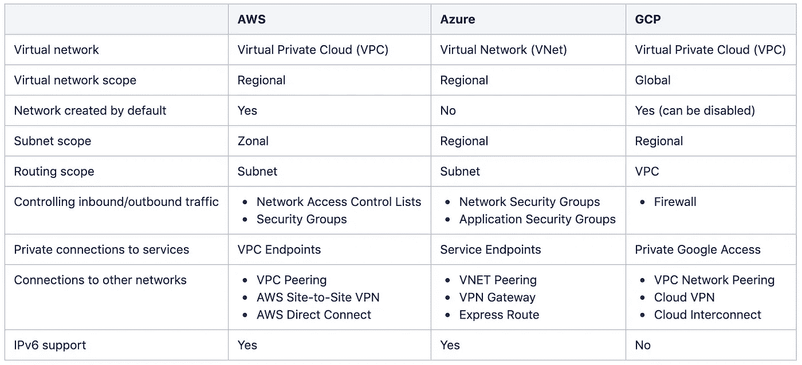

# AWS，Azure，GCP:虚拟网络概念

> 原文：<https://levelup.gitconnected.com/aws-azure-gcp-virtual-networking-concepts-645e5e17b497>

马库斯·斯皮斯克·temporausch.com 摄于 Pexels

本文的目的是提供三个最大的云平台的虚拟网络概念的高层次总结:亚马逊网络服务(AWS)，微软 Azure 和谷歌云平台(GCP)。我们的目标不是对不同的平台进行评级，对它们进行排序，或者推荐一个平台。对不同领域进行了高层次的讨论，并提供了更详细信息的链接。

下表概述了 AWS、Azure 和 GCP 的虚拟网络概念。所有平台都提供了相同的概念，但是它们的设计和实现方式因平台而异。本文后面将更详细地讨论不同的概念。

图一。网络概念总结。

# 虚拟网络

AWS、Azure 和 GCP 都提供虚拟网络服务，可用于启动计算资源，在隔离的安全环境中运行它们，将它们连接到其他云服务和在其他网络中运行的服务，在云端或内部。所有平台都允许用户控制虚拟网络环境，包括 IP 地址范围、子网、访问控制规则和路由。通常，虚拟网络是物理网络的虚拟版本，如数据中心网络。与物理网络相比，虚拟网络更加灵活和可扩展。

## 自动警报系统

[VPC](https://docs.aws.amazon.com/vpc/latest/userguide/what-is-amazon-vpc.html) 是一个逻辑隔离的虚拟网络，创建于 AWS 区域，跨越该区域的所有可用性区域。可以为 VPC 指定 IP 范围、添加子网、关联安全组和配置路由表。一个 VPC 可以有多个子网，并且每个子网必须完全位于一个可用性区域内—跨可用性区域是不可能的。创建新子网时，会为该子网指定一个 IP 范围，该范围必须是 VPC IP 范围的子集。

不能修改现有 VPC 或子网的 IP 范围。相反，可以向现有 VPC 添加辅助 IP 范围。子网可以是公共的，也可以是私有的，公共子网有通往互联网的路由，而私有子网没有。换句话说，如果没有代理或 NAT 网关，位于私有子网中的计算资源就无法访问互联网。或者，不为虚拟机分配公共 IP 地址也可以达到同样的效果。

创建新的 AWS 帐户时，每个区域都有一个自动创建的[默认 VPC](https://docs.aws.amazon.com/vpc/latest/userguide/default-vpc.html) ，每个可用性区域有一个默认公共子网。VPC 附带一个默认配置，包括路由和安全组，允许位于默认网络中的虚拟机之间的连接和所有传出连接。

默认情况下，来自互联网的访问被阻止，必须由用户手动配置。如果不需要默认的 VPC，可以将其删除。创建新 VPC 时，可以在默认 VPC 和非默认 VPC 之间进行选择。这两种方案的区别在于，默认配置附带默认 VPC，而非默认 VPC 必须手动配置。

## 蔚蓝的

[Azure 虚拟网络](https://docs.microsoft.com/en-us/azure/virtual-network/virtual-networks-overview) (VNet)是一个逻辑隔离的虚拟网络，其范围是 Azure 区域，并跨越该区域中的所有可用性区域。然而，并不是所有的 Azure 区域都支持可用性区域。子网、路由、网络安全组和应用程序安全组都是区域性资源。一个虚拟网络可以有多个子网，跨越该区域的所有可用性区域。每个虚拟网络都有一个在创建虚拟网络时指定的 IP 地址范围。

可以扩展现有虚拟网络的 IP 范围，但只有在没有任何子网与虚拟网络相关联时，才支持缩小 IP 范围。还可以为虚拟网络添加和删除额外的 IP 范围。创建新子网时，会为其分配 VNet IP 范围的一个子集。在 Azure 中，没有公共和私有子网的概念，但可以手动更新子网特定的路由表，并删除/更新互联网路由。或者，不为虚拟机分配公共 IP 地址也可以达到同样的效果。

创建新的 Azure 订阅时，它不包含默认的 VNet。当手动创建新的虚拟网络时，它会附带一些默认配置，例如带有系统路由的子网特定路由表。

## GCP

[VPC](https://cloud.google.com/vpc/docs/overview) 网络是逻辑上孤立的虚拟网络，与任何特定的地区或区域都没有关联，它们是全球资源。路由和防火墙规则是在 VPC 网络级别定义的，但也支持将它们选择性地应用于 VPC 网络中的特定计算资源。一个 VPC 网络可以有多个子网，每个子网位于一个区域内。子网跨越它们所在区域的所有区域。IP 地址范围与 VPC 网络无关，而是为子网定义的。

可以扩展现有子网的前缀长度，但是一旦创建了子网，就不能替换或缩小子网的主 IP 范围。此外，还可以定义一个或多个辅助 IP 范围。在 GCP，没有私有和公有子网的概念，因为路由是在 VPC 网络层而不是子网层定义的。但是，可以有选择地应用路由规则，并从选定的计算资源中删除通往互联网的路由。与私有子网相比，结果是相同的，只是在计算资源级别应用了配置，而不是在子网级别。或者，不为虚拟机分配公共 IP 地址也可以达到同样的效果。

默认情况下，新项目从一个[默认网络](https://cloud.google.com/vpc/docs/vpc#default-network)开始，该网络在每个 GCP 地区都有一个自动创建的子网，每个子网都有一个预定义的 IP 范围。此外，默认网络带有一些预填充的防火墙规则，例如，允许网络中虚拟机之间的连接，允许 TCP 端口 22 上从任何源到网络中任何虚拟机的传入连接，允许所有传出连接。

默认网络是自动模式网络，可以删除或转换为自定义模式网络。创建新的 VPC 网络时，可以指定子网[创建模式](https://cloud.google.com/vpc/docs/vpc#subnet-ranges)，可以是自动模式或自定义模式。这两种模式的区别在于，自动模式会在每个 GCP 地区自动创建一个具有预定义 IP 范围的子网，而自定义模式不会自动创建子网。相反，必须手动配置自定义模式 VPC 网络。

# 按指定路线发送

## 自动警报系统

VPC 有一个与 VPC 一起自动创建的主[路由表](https://docs.aws.amazon.com/vpc/latest/userguide/VPC_Route_Tables.html)。创建新的非默认 VPC 时，主路由表仅包含一条本地路由。此外，还可以创建默认为空的自定义路由表，并且可以根据需要手动添加路由。路由表隐式或显式地与子网相关联。主路由表和自定义路由表可以明确地与零个或多个子网相关联。主路由表隐式地与所有没有显式地与任何其它路由表相关联的子网相关联。可以在主路由表中添加、删除和修改路由。不能删除主路由表，但支持用自定义路由表替换主路由表。

## 蔚蓝的

VNet 在网络层没有[路由表](https://docs.microsoft.com/en-us/azure/virtual-network/virtual-networks-udr-overview)，因为路由表与子网相关联。因此，路由表必须明确关联到路由表需要关联的每个子网。多个子网可以共享一个路由表，一个子网可以有零个或一个与之关联的路由表。Azure 会为 VNet 中的每个子网自动创建包含系统默认路由的路由表。不能手动创建或删除系统路线，但其中一些路线可以用自定义路线替代。系统路由和自定义路由应用于路由表关联的子网中的所有虚拟机。

## GCP

VPC 网络有一个路由表，它在 VPC 网络级别定义了[路由](https://cloud.google.com/vpc/docs/routes)。创建新的 VPC 网络时，系统会生成两条路由:1)默认路由，定义流量离开 VPC 网络的路径；2)子网路由，定义通往 VPC 网络中每个子网的路径。系统生成的路由适用于 VPC 网络中的所有虚拟机。可以删除默认路由或用自定义路由替换它，例如，离开 VPC 网络的所有流量都被路由到 VPN 网关，而不是互联网。

添加、修改或删除子网时，子网路由会自动更新和删除。除了系统生成的路线之外，还可以创建自定义路线。自定义路由可以是手动创建的静态路由，也可以是自动维护的动态路由。自定义静态路由可应用于所有虚拟机或具有已定义网络标记的特定虚拟机。相反，动态路由是基于动态路由模式应用的。

# 控制入站/出站流量

## 自动警报系统

可以使用两种不同的机制来控制入站和出站流量:[安全组](https://docs.aws.amazon.com/vpc/latest/userguide/VPC_SecurityGroups.html)和[网络访问控制列表](https://docs.aws.amazon.com/vpc/latest/userguide/vpc-network-acls.html) (ACL)。安全组在虚拟机级别充当防火墙，在子网级别充当网络 ACL。

安全组充当虚拟机的防火墙，在虚拟机级别控制入站和出站流量。入站和出站流量的规则可以单独指定，并且它们与网络接口相关联。一个网络接口可以与一个或多个安全组相关联，一个安全组可以与零个或多个网络接口相关联。VPC 附带一个默认的安全组，如果在启动虚拟机时没有指定不同的安全组，新虚拟机的默认网络接口会自动与其关联。默认安全组允许来自分配给同一安全组的网络接口的入站连接和所有出站连接。相反，新的自定义安全组允许所有出站流量，但不允许入站流量。

如果网络接口与多个安全组相关联，则在决定是否允许流量之前，会评估所有规则。安全组仅支持允许规则—没有规则的安全组会阻止所有入站和出站流量。除了单个 IP 地址和 IP 地址范围之外，还可以在入站规则中使用其他安全组来指定流量的来源，在出站规则中指定流量的目标，例如，安全组 SG1 允许 TCP 流量从与安全组 SG2 关联的所有网络接口流向端口 80。安全组是有状态的，这意味着如果从虚拟机发送请求，则无论入站安全组规则如何，都允许响应流量流入。

网络 ACL 充当子网的防火墙，在子网级别控制入站和出站流量。一个子网必须与一个网络 ACL 关联，而一个网络 ACL 可以与多个子网关联。VPC 附带一个默认网络 ACL，用于子网未与网络 ACL 明确关联的情况。

默认网络 ACL 允许所有入站和出站流量。相反，默认情况下，新的自定义网络 ACL 会拒绝所有流量。网络 ACL 支持允许规则和拒绝规则，每个规则可以允许或拒绝流量。规则按顺序评估，第一个匹配的规则用于确定是否允许流量进出与网络 ACL 关联的任何子网。网络 ACL 是无状态的，这意味着如果请求是从虚拟机发送的，则响应受入站流量规则的约束。

## 蔚蓝的

[网络安全组](https://docs.microsoft.com/en-us/azure/virtual-network/security-overview)可用于过滤进出虚拟网络中计算资源的网络流量。安全组可以应用于子网和网络接口级别。当应用于子网级别时，安全组的规则将应用于所有到达和离开子网的连接。相反，当应用于网络接口级别时，安全组的规则将应用于所有到达和离开网络接口的连接。规则可以允许或拒绝流量，并且它适用于传入或传出流量，而不是两者都适用。规则是有状态的—一旦会话建立，它们就允许双向通信。规则不能拒绝关联的响应流量。

安全组附带默认规则，允许虚拟网络内计算资源之间的所有连接，允许来自 Azure 负载平衡器的传入连接，拒绝来自虚拟网络外部的所有传入连接，并允许到互联网的传出连接。无法删除默认规则，但可以通过创建优先级更高的规则来覆盖它们。除了单个 IP 地址和 IP 地址范围之外，入站和出站规则中还可以使用[服务标签](https://docs.microsoft.com/en-us/azure/virtual-network/security-overview#service-tags)和[应用安全组](https://docs.microsoft.com/en-us/azure/virtual-network/security-overview#application-security-groups)来指定流量的源和目标。

服务标签是 Azure 托管的 Azure 云服务的 IP 地址前缀组，例如 API 管理、Azure 负载平衡器等。创建安全规则时，可以使用服务标签来代替显式定义 Azure 服务的 IP 地址。应用程序安全组可用于对虚拟机进行分组，并基于这些组定义规则。Azure 自动处理应用程序安全组的显式 IP 地址的维护。网络接口可以是零个或多个应用程序安全组的成员。

## GCP

每个 GPC 网络都有一个[防火墙](https://cloud.google.com/vpc/docs/firewalls)，在虚拟机级别控制传入和传出连接。防火墙存在于 VPC 网络和其他网络之间，以及同一个 VPC 网络内的各个虚拟机之间。防火墙规则与 VPC 网络相关联，即使它们是在虚拟机级别实施的。防火墙规则可以允许或拒绝流量，它适用于传入或传出流量，但不能同时适用于两者。防火墙规则是有状态的，一旦会话建立，它们就允许双向通信。防火墙规则不能拒绝相关的响应流量。每个 VPC 网络都有两条隐含的防火墙规则，它们可以被覆盖，但不能被删除。隐含的防火墙规则允许所有传出流量并阻止所有传入流量。防火墙规则根据其优先级应用，即应用组件与传入/传出流量匹配的最高优先级规则，忽略其他防火墙规则。使用目标[标签](https://cloud.google.com/vpc/docs/add-remove-network-tags)或目标[服务账户](https://cloud.google.com/vpc/docs/firewalls#serviceaccounts)可以将防火墙规则应用于 VPC 网络中的所有实例或特定实例。同样，除了 IP 地址和 IP 地址范围之外，源标记和源服务帐户也可用于定义入站防火墙规则的流量源。

# 服务的专用连接

AWS、Azure 和 GCP 支持将虚拟网络私下连接到同一云平台的其他服务。这意味着支持私有连接的云服务可以在没有公共 IP 地址的情况下连接，虚拟网络和其他服务之间的流量不会离开云提供商的网络。默认情况下，其他服务使用其公共端点，这需要公共 IP 地址，流量通过公共网络传输。下面列出了启用到其他服务的专用连接的服务:

*   AWS: [VPC 端点](https://docs.aws.amazon.com/vpc/latest/userguide/vpc-endpoints.html)
*   Azure: [服务端点](https://docs.microsoft.com/en-us/azure/virtual-network/virtual-network-service-endpoints-overview)
*   GCP: [私人谷歌访问](https://cloud.google.com/vpc/docs/configure-private-google-access)

# 与其他网络的连接

通常需要连接两个网络，以便位于不同网络中的资源能够通过专用连接使用专用 IP 地址相互通信。网络可以是位于同一云平台的两个独立的虚拟网络，位于不同云平台的两个虚拟网络，或者位于云中的虚拟网络和物理本地网络。AWS、Azure 和 GCP 都提供支持不同场景的服务。服务可以分为三类:1)同一云平台上的两个虚拟网络之间的连接，2)虚拟网络和其他网络(内部或其他云平台)之间的加密连接，以及 3)数据中心和云平台之间的专用连接。下面按类别列出了支持不同类型连接的服务:

**AWS**

1.  [VPC 对等](https://docs.aws.amazon.com/vpc/latest/peering/what-is-vpc-peering.html)
2.  [AWS 站对站 VPN](https://docs.aws.amazon.com/vpn/latest/s2svpn/VPC_VPN.html)
3.  [AWS 直接连接](https://docs.aws.amazon.com/directconnect/latest/UserGuide/Welcome.html)

**蔚蓝色**

1.  [VNET 对等](https://docs.microsoft.com/en-us/azure/virtual-network/virtual-network-peering-overview)
2.  [VPN 网关](https://docs.microsoft.com/en-us/azure/vpn-gateway/vpn-gateway-about-vpngateways)
3.  [快速路线](https://docs.microsoft.com/en-us/azure/expressroute/expressroute-introduction)

**GCP**

1.  [VPC 网络对等，](https://cloud.google.com/vpc/docs/vpc-peering) [共享 VPC](https://cloud.google.com/vpc/docs/shared-vpc)
2.  [云 VPN](https://cloud.google.com/vpn/docs/concepts/overview)
3.  [云互联](https://cloud.google.com/interconnect/docs/concepts/overview)