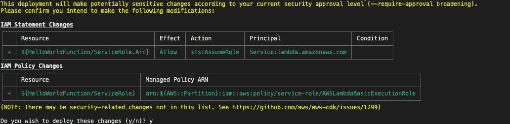

# AWS 初学者 CDK

> 原文：<https://levelup.gitconnected.com/aws-cdk-for-beginners-e6c05ad91895>


> 本文的目标读者是不熟悉 Amazon Web Services (AWS)或 AWS 云开发工具包(CDK)的人。

在本文中，我们将了解什么是 AWS CDK，以及它能为对自动化 AWS 基础设施的各个方面感兴趣的开发人员做些什么。(提示:如果您对 DevOps 有一点点兴趣，您将会爱上这个框架——相信我)。

你可能想知道为什么 AWS 和为什么 AWS CDK？在接下来的章节中，我将简要描述我为每个项目选择 AWS 和 AWS CDK 的原因。

# 自动气象站简史

> AWS 是云基础设施即服务领域的领导者。[魔力象限连续 9 年排名 it 第一。](https://aws.amazon.com/blogs/aws/aws-named-as-a-leader-in-gartners-infrastructure-as-a-service-iaas-magic-quadrant-for-the-9th-consecutiveyear/)

AWS 每年都会发布新的服务和功能。AWS 于 2006 年 3 月 19 日公开推出，向公众提供近 2-3 项服务，快进到今天，它为开发者提供了大量的服务(根据[维基百科](https://en.wikipedia.org/wiki/Amazon_Web_Services)，2020 年，这个数字约为 212)。

你可以想象，这使得要掌握所有这些变得非常困难。实际上，我还没有遇到一个人可以在 400 级别上深入研究所有的服务。掌握多种 AWS 服务本身就是一项了不起的成就，但不幸的是，这超出了本文的范围。

# CDK 自动气象站简史

> AWS CDK 是一个开源框架，允许开发人员使用他们喜欢的编程语言来自动化 AWS 基础设施。

AWS 提供的众多服务之一是 [AWS CloudFormation](https://aws.amazon.com/cloudformation/) 。AWS CloudFormation 允许您使用代码自动化您的 AWS 基础设施，称为基础设施即代码(IaC)。简单地说，你可以使用 [YAML](https://en.wikipedia.org/wiki/YAML) 或 [JSON](https://en.wikipedia.org/wiki/JSON) 来描述你想要如何配置和部署你的 AWS 基础设施。

当您独自工作或有一小组需要交互的服务时，以这种方式自动化您的 AWS 基础架构是很好的，但如果您有一个大型开发团队一起工作，这可能会很快失控，这使得维护和在以后重新访问基础架构非常困难，因为它可能非常脆弱。

2019 年 7 月 11 日，AWS 使 [AWS CDK 正式上市](https://aws.amazon.com/blogs/aws/aws-cloud-development-kit-cdk-typescript-and-python-are-now-generally-available/)，基础设施自动化的世界被彻底改造。

# AWS CDK 和 AWS CloudFormation 有什么区别？

AWS CDK 和 AWS CloudFormation 都允许您自动化 AWS 基础架构，但是使用 AWS CDK，您需要使用编程语言(如 TypeScript、JavaScript、Python、Java 和 C#/)。NET)来完成，而 AWS CloudFormation 使用 YAML 或 JSON 来完成。

默认情况下，AWS CDK 实际上会根据您在部署之前输入的代码生成一个 YAML AWS CloudFormation 模板。请记住，AWS CDK 不是一项服务，而是一个开源框架，允许开发人员使用他们最喜欢的编程语言来配置和部署他们的 AWS 基础设施。

AWS CDK 使开发人员更容易使用 AWS 基础设施，因为您的 AWS 基础设施现在可以使用熟悉的编程语言进行逻辑描述，并完全成为您整个代码库的一部分。

# 为什么我应该使用 AWS CDK？

> 无论你是个人开发者还是团队开发者，AWS CDK 的好处都是巨大的。当自动化 AWS 基础设施时，你应该始终考虑[不要重复](https://en.wikipedia.org/wiki/Don%27t_repeat_yourself)(干)原则，这从使用 AWS CDK 开始。

如果 AWS 的好处 CDK 还没有欣然接受，请允许我列举几个:

1.  您可以按照对您和您的团队有意义的方式组织您的 AWS 基础设施代码。您想要一个包含所有 AWS 基础设施的堆栈吗？去吧。或者您可能希望为每个开发人员创建一个堆栈？没问题。也许你想强迫你的开发者确保所有的 S3 桶在默认情况下总是私有的。成交。
2.  您可以利用现有团队在流行编程语言(如 Python 或 TypeScript)方面的技能来自动化 AWS 基础设施。当你使用自动气象站 CDK 时，你不再需要自动气象站云形成“专家”。
3.  类型安全、代码补全和开源拯救世界！出了事不用揪头发；查看源代码，信任框架，并在使用 AWS CDK 时消除常见错误。

使用 AWS CDK 有很多好处，我无法一一列举。但值得一提的是，与纯粹的基于 SAML 或 JSON 的方法相比，有了 AWS CDK，您现在有了更多的结构化编程语言控制。想一想，当代码编辑可以访问源代码时，他们现在可以做些什么。内置代码完成、文档和(对于类型化语言，如 TypeScript)代码编译，以防止常见的用户错误。

从一个已经做了十年这类工作的人那里听听吧。它真的为我节省了前所未有的自动化基础设施的无数时间，并使我和我的团队在修改基础设施时非常敏捷。

# 你好，世界——在 CDK！

> 下面的例子是用 TypeScript 编写的，但是可以随意使用 AWS CDK 支持的任何其他编程语言。

在这个 Hello World 示例中，我们将创建一个全新的 CDK 项目，该项目将包含一个 AWS Lambda 函数，该函数只返回“Hello World！”执行时。

## 开始之前

1.  确保您已经创建了一个 [AWS 帐户](https://aws.amazon.com/)。
2.  确保您已经安装了 [AWS CLI](https://docs.aws.amazon.com/cli/latest/userguide/cli-chap-install.html) 并配置了 SDK 以使用 AWS 概要文件。要进行验证，请在终端中运行`aws --version`。
3.  确保您已经安装了 [Node.js](https://nodejs.org/en/download/) 并且版本高于 10.3.0。要进行验证，请在终端中运行`node --version`。
4.  确保您已经安装了 AWS CDK CLI。为了验证，在终端中使用下面的
    `npm install -g aws-cdk`命令。

## 创建一个空目录

让我们创建一个包含我们的 CDK 项目的空目录，并导航到它。

在终端中运行以下代码:`mkdir HelloWorldCDK && cd HelloWorldCDK`

## 创建初学者模板

我们将使用 CDK CLI 为 TypeScript 生成一个启动模板。

在终端中运行下面的代码:`cdk init --language typescript`

## 创建 Lambda 函数

我们将创建一个 JavaScript Lambda 函数，返回“Hello World！”在执行时的响应正文中。

在终端中运行以下代码:`mkdir -p functions/helloworld && touch functions/helloworld/index.js`

使用您最喜欢的代码编辑器(注意:我更喜欢使用[而不是代码](https://code.visualstudio.com/)，将以下代码粘贴到`functions/helloworld/index.js`:

```
exports.handler = (event, context, callback) => {
 callback(null, "Hello World!");
};
```

## 安装@aws-cdk/aws-lambda 模块

除了默认模块之外，基本项目不包括任何模块。因为我们需要使用 AWS Lambda，所以我们需要引入@aws-cdk/aws-lambda 模块。查看 [API 参考](https://docs.aws.amazon.com/cdk/api/latest/docs/aws-construct-library.html)页面，了解为 AWS CDK 提供的所有模块的详细列表。

在终端中运行以下代码:`npm install @aws-cdk/aws-lambda`

## 部署 Lambda 函数

我们在本地创建了 Lambda 函数并安装了 Lambda 模块，但现在我们需要使用 AWS CDK 来部署它。为此，我们将使用 Lambda 模块创建一个 Lambda 函数的实例，该实例引用我们创建的本地代码，然后我们将运行 CDK 部署，将其实际部署到我们的 AWS 帐户。

使用您最喜欢的代码编辑器，用下面的代码替换`lib/hello_world_cdk_lambda_stack.ts`:

```
import * as cdk from "[@aws](http://twitter.com/aws)-cdk/core";
import * as lambda from "[@aws](http://twitter.com/aws)-cdk/aws-lambda";export class HelloWorldCdkLambdaStack extends cdk.Stack {
  constructor(scope: cdk.Construct, id: string, props?: cdk.StackProps) {
    super(scope, id, props);// The code that defines your stack goes here
    const helloWorldFunction = new lambda.Function(this, "HelloWorldFunction", {
      code: lambda.Code.fromAsset("functions/helloworld"),
      handler: "index.handler",
      runtime: lambda.Runtime.NODEJS_12_X,
      description:
        "This Lambda Function returns the message: 'Hello World!' in the response body",
    });
  }
}
```

在终端中运行下面的代码:`cdk deploy --profile {AWS_PROFILE}`，但是要确保用您的 AWS 概要文件替换`{AWS_PROFILE}`。

您应该会看到如下所示的内容:



IAM 策略更新

在键盘上点击`y`并按下回车键。然后，您应该会看到如下所示的内容:


部署进度和状态更新

## 幕后发生了什么？

当您运行`cdk deploy`时，我们放在`lib/hello_world_cdk_lambda_stack.ts`中的代码被 CDK 框架解析，然后生成位于`cdk.out`文件夹中的 CloudFormation 模板，最后将其部署到 CloudFormation。

我们的代码非常简单，我们所做的只是实现了一个简单的 Hello World Lambda 函数处理程序，并且创建了一个 Lambda 的实例。引用 Lambda 函数处理程序的函数类。当我们运行`cdk deploy`时，我们注意到 AWS CDK 实际上部署的不仅仅是 Lambda 函数。它还生成一个具有基本 Lambda 执行权限的 IAM 角色，并允许 AWS Lambda 假定它正确执行。

## AWS CDK 何时会自动生成额外的 AWS 资源？

如果你正在实例化的类名以`Cfn`开头，那么它被认为是一个低级构造，否则它被认为是一个高级构造。低级构造通常是到原始云信息资源的一对一映射，这意味着它们通常只旋转一个 AWS 资源，而高级构造是由 AWS CDK 团队、开源社区或您自己定制的类，它们执行附加逻辑，例如将多个低级构造组合在一起以简化特定任务。

在上面的例子中，我们使用了名为`lambda.Function`的高级结构，如果你查看这个类的源代码，你会发现它负责为你管理一些依赖项，比如创建一个基本的执行角色 IAM 策略并将其附加到函数上。

有趣的是，我们不需要自己编写任何代码，但 CDK 会在 CloudFormation 模板中自动生成这些资源，因为我们在代码中使用了高级的`lambda.Function`构造。

## 运行 Lambda 函数

在 AWS 控制台中，导航到 AWS Lambda，您应该会看到 Lambda 函数实际上已经创建好了。

点击 Lambda 函数并测试它(你可以提供任何你喜欢的请求体)。

你应该看到“你好，世界！”在类似如下的响应中返回:


Lambda 成功响应

## **清理**

要删除我们创建的所有内容，您可以在 AWS 控制台上手动删除 CloudFormation 堆栈(但这并不有趣),或者使用 CDK CLI 来完成！让我们使用 CDK 命令行界面来删除它们。

在终端中运行下面的代码:`cdk destroy --profile {AWS_PROFILE}`，但是确保用您的 AWS 概要文件替换`{AWS_PROFILE}`。

# 结论

AWS CDK 使得以我们喜欢的任何方式自动化 AWS 资源变得非常容易。事实上，通过为我们生成必要的依赖关系，高级结构的使用简化了我们必须做的工作。

在上面的例子中，我们展示了通过 AWS CDK 部署本地定义的 AWS Lambda 函数是多么快速和容易，而无需手动创建 CloudFormation 模板。

我希望这篇文章对你强调使用 AWS CDK 的一些好处是有用的。如果你有任何问题或想看到更多这样的例子，请联系我，让我知道！

感谢您的阅读！

# 你可能喜欢的其他文章

[](/amazon-sumerian-hosts-how-to-reduce-your-amazon-polly-cost-eb13db90a47d) [## 亚马逊苏美尔主机:如何降低你的亚马逊波利成本

### 本文的目标读者是已经熟悉亚马逊苏美尔主机并且正在寻找…

levelup.gitconnected.com](/amazon-sumerian-hosts-how-to-reduce-your-amazon-polly-cost-eb13db90a47d) [](/how-to-publish-your-unity3d-html5-application-or-game-to-aws-3bb053b59d21) [## 如何将您的 Unity3D HTML5 应用程序或游戏发布到 AWS

### 本文的目标读者是已经熟悉 Unity3D WebGL 并且正在寻找一个…

levelup.gitconnected.com](/how-to-publish-your-unity3d-html5-application-or-game-to-aws-3bb053b59d21)