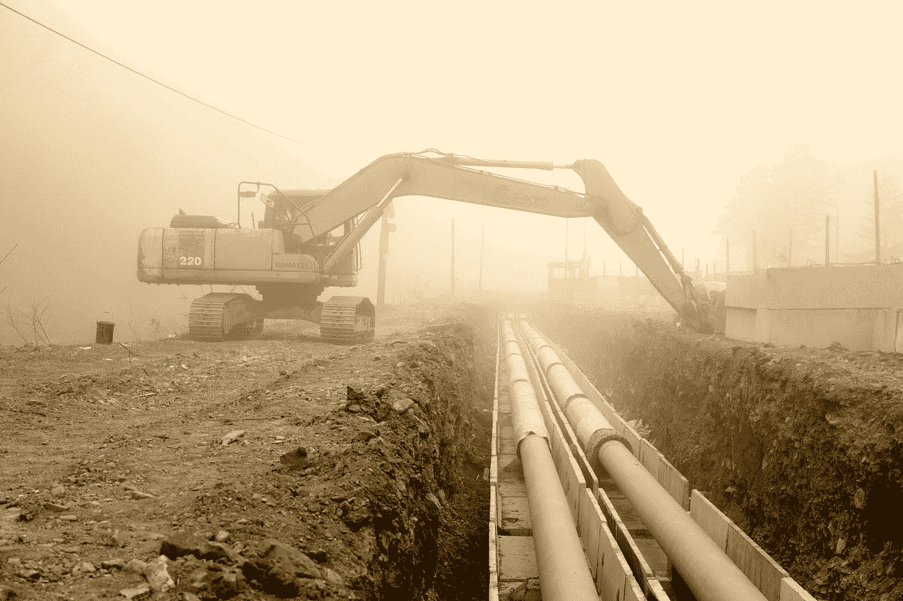

# AWS CDK 管道:真实世界的提示和技巧(第 2 部分)

> 原文：<https://levelup.gitconnected.com/aws-cdk-pipelines-real-world-tips-and-tricks-part-2-7a0d093a89a0>

罗曼·彭丁在 [Unsplash](https://unsplash.com?utm_source=medium&utm_medium=referral) 上拍摄的照片

*在本文中，我将与您分享一些使用 AWS CDK 管道的有用提示和技巧，这些提示和技巧超越了简单的演示，可以在您的实际应用程序中实现。这是我关于 AWS CDK 管道系列的第二篇文章。走* [*这里*](https://medium.com/swlh/aws-cdk-pipelines-real-world-tips-and-tricks-part-1-544601c3e90b) *为第一个。*

AWS 云开发工具包( [AWS CDK](https://docs.aws.amazon.com/cdk/latest/guide/home.html) )是一个强大的开源开发框架，用于创建和部署云应用资源，可以被视为一个*基础设施即代码*工具。AWS CDK 管道是这个框架中的一个库，它通过我称之为*自变异管道代码将基础设施自动化带到了一个新的水平。*这样的 CDK 管道包含应用程序代码*、*相应的*代码管道*，应用程序的云基础设施，以及*基础设施管道*，全部由代码定义，并且能够自动适应自身。在本系列的[上一篇文章](https://medium.com/swlh/aws-cdk-pipelines-real-world-tips-and-tricks-part-1-544601c3e90b)中可以找到关于 CDK 和管道的更深入的介绍。

目前，CDK 管道公司仍处于开发者预览阶段，但是大量的团队和人员已经跳上了创新的快车。然而，由于它仍处于测试阶段，开发团队和社区都还没有很好地定义最佳实践。因此，我想与您分享一些我在几个 CDK 管道应用程序(在生产中运行)中总结的技巧和诀窍。)目前的工作。

与第一篇文章类似，接下来的部分都回答了我的一个具体问题——很可能你也会回答。所有部分都遵循简单的格式“**我该怎么做*这个？***又可以认为是单机。它们不是按时间顺序排列的，也没有解释 CDK 管道的基本情况。没有一个章节描述特定问题的唯一解决方案，而是基于个人和专业经验的*解决方案。与第一篇文章不同的是，这篇文章将使用 Python 作为开发语言，而不是 TypeScript，因为我和其他开发人员更喜欢 Python。因此，在第一个 CDK 管道应用程序之后，我们转换了语言。然而，CDK 管道问题的解决方案是跨语言的，无论您使用哪种 CDK 开发语言，都将使您受益。*

*免责声明:随着 CDK 开发团队高速扩展 CDK 库，并包括突破性的变化，一些细节可能不会完全按照您阅读本文时的方式工作。*

# 如何管理所有环境的配置？

结构化配置总是一件困难的事情。我甚至在第一篇文章中避免了它，因为我自己还没有想出一个好的方法。但是现在我对我的方法很满意。

配置在两个级别上定义和管理:

1.  原始配置文件
2.  通过处理原始配置文件创建的配置对象

如果您希望跨多个 CDK 管道应用程序标准化配置，还有第三个级别，我将参考“*如何管理跨 CDK 应用程序的配置”一节。*

**原始配置文件**

我区分两种类型的配置。影响 AWS 环境中资源的配置和影响 CDK 应用程序本身的配置。因此，原始配置文件由这两部分组成，以及*应用*部分和*环境*部分。这是此类文件的高级结构:

配置文件的高层结构。

应用程序部分包含应用程序的名称、它正在监视的 git 存储库、中央 AWS 构建环境的帐户和区域、CDK 库的版本……环境部分包含每个*应用程序环境*的部分，例如开发、试运行和生产，不要与 AWS 环境混淆，AWS 环境是帐户+区域的组合。在本例中，它还包含一个默认环境部分，该部分指定了所有环境的默认行为，除非在相应的部分中被显式覆盖。这不是必需的，您可以选择不包括这一部分。至少，每个环境部分需要包含资源必须部署到的客户和区域。此外，这还可以包含项目特定资源的配置(例如，存储段名称、自动缩放组详细信息、标准资源标签等)。
此类文件的示例如下所示:

配置文件的更详细的例子。

**从原始配置文件创建的配置对象**

就像配置文件一样，通过定义两个配置类来区分应用程序和资源配置。一个`AppConfig`类和一个`ResourceConfig`类，用于从原始配置文件创建配置对象。实际上，第三个`RawConfig`类有助于解析原始配置文件，并将默认配置合并到每个环境部分中。
快速总结:

*   `RawConfig`
    用于将整个原始配置文件处理成更多可用的部分。这个类的一个实例应该足够了。
*   `AppConfig`
    用于将所有原始应用程序配置转换成一个应用程序配置对象。这需要`RawConfig`实例的输入。这个类的一个实例应该足够了。
*   `ResourceConfig`
    用于将所有原始的环境特定配置转换成一个环境配置对象。这需要`RawConfig`实例的输入。
    应该创建该类的多个实例，每个 AWS 环境一个(帐户+区域组合)。

下面是这些类的一些片段

RawConfig 类的代码段。

AppConfig 类的代码段。

ResourceConfig 类的代码段。

然后，这些类可以在 CDK 管道应用程序中使用。首先，在`app.py`文件中创建一个`PipelineStack`实例需要 AWS 环境，这个管道需要部署到这个环境中。这正是`AppConfig`实例的`build_environment`属性。

如何使用配置对象创建 PipelineStack 实例的代码片段。

将`RawConfig`和`AppConfig`实例传递给`PipelineStack`构造函数也很有用，因为在创建堆栈时需要它们的内容。例如，应用程序配置包含要查看的存储库的详细信息，并且需要原始配置实例来创建特定于环境的配置对象。这就是所有这些的组合方式:

如何使用 AppConfig 实例字段并为每个环境创建 ResourceConfig 实例的代码片段。

如何分阶段使用配置对象的代码片段。

如何在堆栈中使用配置对象的代码片段。

请注意，阶段和堆栈级别所需的所有信息都包含在配置对象中。

# 如何管理 CDK 应用程序的配置？

为了标准化处理 CDK 管道配置 arccos 多应用程序的方式，在*中讨论了配置类如何管理所有环境的配置？*可以作为基类。每个应用程序都可以通过继承这些基类来创建更多特定于应用程序的配置类。将基类发布为 Python 包，这也将使可用性更容易。

在每个 CDK 管道应用程序中，创建一个包含这些类的`configuration.py`文件:

特定于应用程序的配置类片段。

现在，您可以在应用程序的其余部分使用这些更具体的配置类。此外，您可以根据需要定制配置类，例如添加额外的字段、包含额外的逻辑、扩展构造函数方法等等

# 如何更新我的应用程序的 CDK 版本？

这听起来像是一个有着明显答案的直觉问题，但由于 CDK 管道的自我突变方面，它远非如此。为了正确回答这个问题，让我们先来谈谈我所说的*应用程序的 CDK 版本是什么意思。*

**首先介绍一下 CDK 版本的背景:**
您可以在您的 CDK 管道应用程序中指定多个 CDK 版本。有两种主要类型，一种是 CDK CLI 版本，用于为您的堆栈合成云形成模板，另一种是 CDK 构造(Python)包版本，用于通过代码定义您的构造。前者应始终等于或高于后者。此外，确保所有 CDK 软件包都有相同的版本。

请注意，可以在管道应用程序中指定多个 CDK CLI 版本。在您的`package.json`中指定的那个用于本地开发和预定义的管道动作，例如`SimpleSynthAction.standard_npm_synth()`。如果没有使用标准的 synth 操作，最好明确说明您的代码构建应该使用哪个 CDK CLI 版本。此外，当您的代码管道执行某些操作时，也可以使用 CDK CLI 命令。默认情况下，它使用最新的 CDK 版本，但您可以指定一个特定的版本。

为避免意外，最好保持所有版本的 CDK CLI 和 CDK 软件包相同:

在何处指定 CDK 版本以保持它们相同的示例。

**升级您的 CDK 包**
当您想要将您的应用程序的 CDK 包版本升级到`x.yz`时，您首先需要将您的管道的 CDK CLI 版本更新为等于或大于`x.yz`(无论`<CDK_VERSION>`是在何处定义的，例如在配置文件和`package.json`文件中)**和**触发管道(通过提交/合并/…)，以便它在更新管道/自变异阶段/操作期间更新自身。接下来，用`pip install aws-cdk.pipelines=x.yz`将应用程序的 CDK 包更新到版本`x.yz`(确保更新所有的`aws-cdk.abcd`包，而不仅仅是`pipelines`)。当使用 Python 开发时，不要忘记导出一个更新的`environment.yml`文件(或等效文件),这样这些新版本也将在管道执行中使用。下次触发管道时，升级 CDK 版本将创建资源。

如果您不首先更新管道的 CDK CLI 版本，管道将尝试使用低于您应用程序的 CDK 软件包版本的 CDK CLI 版本合成云信息模板，这将失败。合成发生在代码构建实例中构建阶段的合成动作期间，该代码构建实例具有已经存在的管道规范，即具有低于升级包版本的 CDK CLI 版本。只有在 PipelineUpdate 阶段成功之后，才会更新下一个 synth 操作的 CodeBuild 实例。

# 我如何从失败的构建阶段中恢复过来？

当错误配置 CodeBuild 实例的规范时，可能会陷入失败的构建阶段(Synth 操作)。由于配置错误(例如，`SimpleSynthAction`的安装命令输入错误)，该步骤可能会失败。此示例拼错了“install”:

synth action install 命令中的输入错误示例。

在你意识到你的错别字后，你修复它并用一个新的提交再次触发管道。然而，构建阶段又失败了。您注意到您的错别字修复还没有包括在内。乍一看，这似乎很奇怪，但实际上这是意料之中的行为。您的管道需要更新(错别字修复)，但这只发生在构建阶段之后的`UpdatePipeline/SelfMutate`阶段/动作*。由于构建阶段仍然具有带有错别字的配置，因此不可能通过自变异来修复管道。*

有两种解决方案。

1.  如果您(作为一名开发人员)拥有部署 CDK 管道的权限，您可以重新部署一个新的管道，该管道将直接拥有带有错别字修复的规范。你可以在你的本地机器上用`npx cdk deploy`来做这件事。
2.  您可以通过 AWS 控制台手动修复代码构建规范(`Build project -> Build details -> Buildspec`)中的错别字，并使用`Release Change`按钮再次触发管道。

我个人更倾向于第二种方案，因为这样更快。

在一开始开发 CDK 管道时，这个问题经常发生。不仅仅是打字错误，错误的构建命令、错误的变量……都可能发生。为了避免将来出现这样的问题，在您的 CDK 管道源代码之外的一个单独的文件中指定 install/build/…命令的细节是一个**好的做法。一个有用的地方是`package.json`文件，并从管道的代码构建中调用`npm`脚本。这样，代码构建的规范可以始终保持不变，例如`npm run ci_build`意味着代码构建实例不需要更新/自变异。如果您在`ci_build`脚本中犯了一个错误，您可以很容易地修复它，并使用新的提交再次触发管道。但是这一次，代码构建不会陷入失败状态，因为从代码构建的角度来看，命令仍然是`npm run ci_build`。**

如何在 synth 操作命令中引用 npm 脚本的片段。

显式编写为 npm 脚本的 synth 操作命令片段。

# 如何删除我的 CDK 管道？

就像通过`cdk deploy <my-pipeline-stack>`部署管道一样，可以通过从您的机器上调用 `cdk destroy <my-pipeline-stack>`来删除它。

通过`cdk destroy` **移除 CDK 管道只会**破坏管道，而**不会**破坏其部署的资源。

# 我如何拆除我的基础设施资源？

因为通过`cdk destroy` **移除 CDK 管线仅**会破坏管线，而**不会破坏**其已经部署的资源，所以必须单独破坏资源。

最简单的方法是通过 AWS 控制台手动完成。进入部署资源的账户中的云阵，按下所有所需堆栈的`delete`按钮。

您也可以尝试自动完成这项工作，但是我目前还没有创建一种从管道内部完成这项工作的方法。然而，在 GitHub 上有一些关于这个[的有趣讨论。棘手的是，您需要以正确的(相反的)顺序销毁它们**和**您的销毁操作需要在部署的帐户中承担具有正确权限的角色，以便执行`cdk destroy` 操作](https://github.com/aws/aws-cdk/issues/10190)

# 如何在不干扰管道的情况下开发 CDK 堆栈？

当开发团队很大时，可能需要单个开发人员创建/测试一些 AWS 资源，而不破坏/干扰开发环境。如果是这种情况，开发人员可以将源资源部署到一个单独的 *spike* 环境中，而不触发管道，从而保持管道不变。

假设已经引导了 spike 环境，开发人员必须采取以下步骤:

1.  在所需 stage 构造的`app.py`中为 spike 环境创建一个新的 stage 对象。**始终创建个人阶段，而不是该级别的堆栈**，因为否则 CDK 将不会在下一步创建新的`assembly-*` 目录，而是会将该内容直接生成到`cdk.out/`。在这个具体示例中，spike 帐户的配置遵循*我如何管理所有环境的配置中描述的方法？*

如何创建独立于 CDK 管道的个人舞台的片段。

1.  构建 CDK 应用程序，并使用`npx cdk synth.`在本地合成云信息模板。这将创建一个文件夹`cdk.out/assembly-Personal`，其中包含部署资源所需的所有文件。
2.  用
    `npx cdk -a cdk.out/assembly-Personal deploy`将个人舞台资源调配到秒杀账号
3.  开发堆栈，进行一些测试，探索 AWS 服务，…
4.  当不再需要这些资源时，通过用
    T3 摧毁舞台来移除它们

请注意，不应提交个人阶段的任何更改，因为不应触发管道。这种类型的开发只与单个开发人员的临时开发相关。

# 如何避免使用 from_lookup()？

在`vpc.from_lookup()`T22 的情况下，文档已经提供了答案:

> 此功能仅需要用于使用您的 CDK 应用程序中未定义的 VPC。如果您希望在堆栈之间共享 VPC，您可以在堆栈之间传递 Vpc 对象并正常使用它。

如果所需的`vpc`是外部的(其他应用或其他阶段/环境)，您可以用`vpc.from_vpc_attributes()`创建它的一个*虚拟* `vpc`对象。该方法要求至少知道外部`vpc`的`availability_zones`和`vpc_id`。使用*虚拟*对象，您只能使用创建时提供的属性。因此，如果您需要将`vpc`的私有子网的`SubnetSelection`传递给另一个构造，您需要将这些`private_subnet_ids`传递给`vpc.from_vpc_attributes()`方法。

这里有一个例子:

如何使用 vpc.from_lookup()的代码片段。

这个解释对于`route53.from_lookup()`是等价的。您需要使用`from_hosted_zone_attributes()`方法并为其提供`hosted_zone_id`和`zone_name`。

`from_vpc_attributes()` **不会从实际外部资源获取信息！**

当**不是**使用 CDK 管道时，调用此方法将导致在执行 CDK CLI 时进行查找。因此，您不能使用任何仅在 CloudFormation 执行时可用的值(即令牌)。`vpc`信息将被缓存在`cdk.context.json`中，相同的`vpc`将在以后的运行中使用。要刷新查找，您必须使用`cdk context`命令从缓存中清除该值。有关上下文的更多信息可在[文档](https://docs.aws.amazon.com/cdk/latest/guide/context.html)中找到。

但是因为 CDK 管道不使用上下文查询，用`from_vpc_attributes()`显式地提供属性相当于将它们存储在`cdk.context.json`中，只是现在您将它们存储在配置文件中。

这对于其他`from_xxx_attributes()`方法是等效的。

# 如何避免使用 stack.availability_zones()？

[文档](https://docs.aws.amazon.com/cdk/api/latest/python/aws_cdk.core/Stack.html#aws_cdk.core.Stack.availability_zones)揭示了问题:

> 返回与此堆栈关联的 AWS 环境(帐户/区域)中可用的 az 列表。
> …
> 如果它们在上下文中不可用，则返回一组空值并报告它们丢失，并让 CLI 通过调用目标环境上的 EC2 DescribeAvailabilityZones 来解决它们。

由于 CDK 管道不支持上下文查询，`stack.availability_zones()`将返回空值。解决方案是用正确的可用性区域覆盖`vpc`堆栈中的 get `availability_zones()` getter 方法。在 Python 中开发时，需要使用正确的 getter 装饰器:

如何重写 stack.availability()方法的代码片段。

我再一次与你分享了我个人的建议和技巧。我确实有更多，尤其是一些 Python 特有的 once。所以请继续关注即将到来的文章。与此同时，AWS CDK 开发团队继续高速扩展 CDK 库，所以我使用/解释的一些细节可能不再有效。

希望这些提示和技巧在某种程度上对你有所帮助！如果你还没有这样做，一定要看看[以前的文章](https://medium.com/swlh/aws-cdk-pipelines-real-world-tips-and-tricks-part-1-544601c3e90b)以获得更多的提示和技巧。

# 一些有用的链接

*   [AWS CDK 知识库](https://github.com/aws/aws-cdk)
*   [关于 CDK 管道的博客](https://aws.amazon.com/blogs/developer/cdk-pipelines-continuous-delivery-for-aws-cdk-applications/)
*   [CDK 管道演示(Python 和 TypeScript)](https://github.com/aws-samples/cdk-pipelines-demo)
*   [CDK 管道库](https://docs.aws.amazon.com/cdk/api/latest/docs/pipelines-readme.html)
*   [CDK Python 库](https://docs.aws.amazon.com/cdk/api/latest/python/)
*   [我的第一篇 CDK 管道文章](https://medium.com/swlh/aws-cdk-pipelines-real-world-tips-and-tricks-part-1-544601c3e90b)