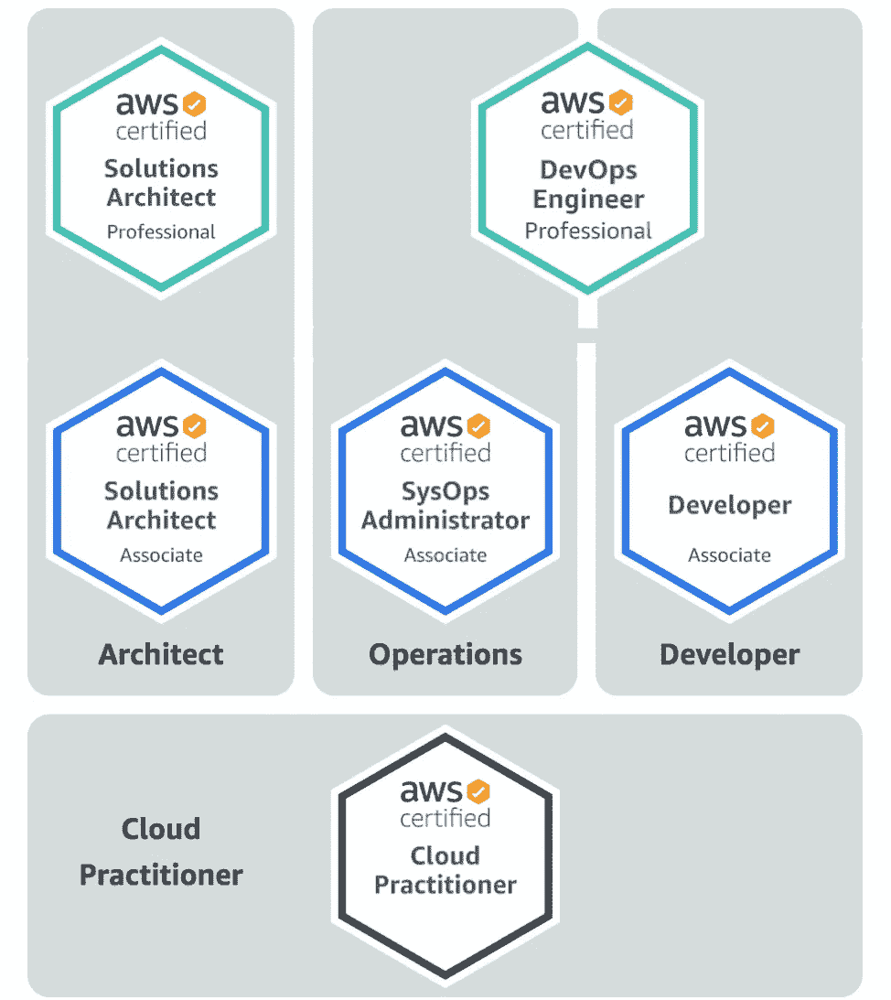

# AWS 认证:简介

> 原文：<https://levelup.gitconnected.com/aws-certification-a-brief-introduction-45f1064114ae>

如果你在 IT 行业工作，你可能听说过亚马逊网络服务。通常缩写为 AWS，这些服务是由亚马逊开发和管理的越来越多的技术，被全球大大小小的企业所利用。AWS 为您提供了简化企业成本、安全性和技术弹性的工具。

但是，和任何工具一样，有一个学习曲线。这并不像创建一个 AWS 帐户并让一切神奇地到位那么简单。我喜欢把 AWS 想象成一个装满食材的储藏室:手头有它们是很好的，但最终你需要学习如何烹饪，以便把这些食材放在一起，做出有用的东西。

很简单，这个学习过程的主要部分是实践经验。如果你想开始使用 AWS，创建一个帐户并开始使用:许多服务都有一个免费层，允许你进行实验，而没有运行大额账单的风险。

在您的 AWS 旅程中，您可能会想要肯定您的知识，或者接受更多关于技术及其功能的正式培训。在这篇文章中，我想回顾一下*为什么*你可能希望努力获得 AWS 认证的一些原因。

## 为什么要获得认证？

截至 2019 年第四季度末，[亚马逊网络服务在三大云提供商](https://www.parkmycloud.com/blog/aws-vs-azure-vs-google-cloud-market-share/)中占有最大的市场份额，为 32.4%，相比之下，微软 Azure 为 17.6%，谷歌云为 6%。显然，AWS 在提供云服务方面处于领先地位。获得任何一家*云提供商的认证都是一个好主意，但如果要选择一家，我认为选择 AWS 是最好的选择，因为它看起来是采用基于云的战略的企业的首选提供商。*

但是仅仅证明你有 X 年的 AWS 经验还不够吗？当然，有可能，但我不确定我会把你的机会和有证书的人相比。让我们从潜在雇主审查简历的角度来看:一名候选人说“我有五年的 AWS 工作经验”，另一名候选人说“我有三年的 AWS 工作经验和 AWS 解决方案架构师认证”。

第一个候选人说他们有更多的经验，但是第二个说“我有经验，AWS 自己说我知道我在说什么”。我知道我会选谁。

随着企业云采用的增加，对合格且有经验的人员的需求也在增加。因此，通过持有 AWS 认证，你很可能比其他候选人更有优势，应该可以期待更有竞争力的工资。[全球知识报告 2019 年美国 AWS 认证人员平均工资](https://www.globalknowledge.com/us-en/resources/resource-library/articles/how-to-earn-a-top-paying-aws-certification-salary/):

*   AWS 认证解决方案架构师-专业:148，456 美元
*   AWS 认证 DevOps 工程师:137724 美元
*   AWS 认证解决方案架构师助理:130，883 美元
*   AWS 认证系统运行管理员——助理:130，610 美元
*   AWS 认证开发人员—助理:130，272 美元

## 学习路径

当开始您的 AWS 认证之旅时，建议您从认证云从业者开始。该认证表明您了解并理解 AWS 和可用服务的基础知识。 [AWS 培训&认证](https://www.aws.training)门户网站提供优秀的培训材料，帮助您达到这一水平。在获得知识的同时，这一认证可以让你更好地了解你在各个阶段的进展情况。

继云从业者级别之后，还有几个更高级(也更具挑战性)的认证可供助理和专业人员级别使用。这些在高层次上被分组为架构师、运营和开发人员路径。你不必按照任何特定的顺序参加考试，如果你愿意，你可以在不同的道路之间移动。

除了这一高级分组之外，还有大量大数据、安全和高级网络领域的专业级别认证。这些认证比他们更通用的同行更侧重于专业科目。

然而，在所有情况下，你会发现这些认证在它们所涵盖的主题和主题上有许多重叠之处。通过获得一个认证，你会发现它在某些方面也为你想追求的任何进一步的认证做好了准备。

您可以[在认证&培训门户](https://aws.amazon.com/training/learning-paths/)上更详细地查看学习路径，以帮助您选择最适合您的路径。

## 总结想法

参加 AWS 认证考试是肯定您的云技术知识并改善您的就业前景和机会的好方法。也就是说，这是一项需要奉献和承诺的任务，尤其是当你提升不同的认证级别时。

云的采用正在增加，但仍有一段路要走，云的故事还远未结束:现在是获得认证并利用这些技能为您带来优势的最佳时机。