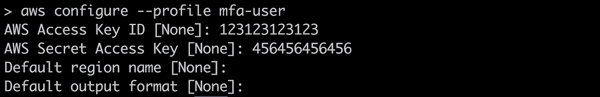
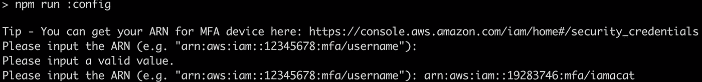

# AWS CLI —临时 MFA 凭据的自动化

> 原文：<https://levelup.gitconnected.com/aws-cli-automation-for-temporary-mfa-credentials-31853b1a8692>


进入齿轮，出来的是自动化！—来源: [pixabay](https://pixabay.com/photos/gears-cogs-machine-machinery-1236578/) ，作者: [MustangJoe](https://pixabay.com/users/MustangJoe-2162920/)

> 多因素身份验证(MFA)是解决安全二分法的灵丹妙药，在这种情况下，密码身份验证是单点故障。
> 
> 那么，`awscli`会出什么问题呢？让我们来了解一下！

最近，我开始更频繁地使用亚马逊网络服务(AWS)的产品。这主要与另一个团队的产品移交有关，其中基础设施的许多方面都在 AWS 上。

当使用 AWS 时，我开始着手其 MFA 相关的工作流。这是因为，作为我工作的地方的安全政策的一部分，MFA/2FA 已经成为我们运营的中心焦点。调用 AWS 的 API，或者更准确地说，使用`awscli`，也不例外；所有帐户都必须启用 MFA。

# “问题”


AWS CLI——参见此处的,了解其代码库

由于 MFA 已经作为访问我们的 AWS 资源的一个要求被启用，`awscli`的各种操作也受到影响。例如，如果我要通过`awscli`访问或删除 EC2 实例，我必须首先检索一些临时凭证。此过程需要我的 MFA 令牌设备的序列号以及临时生成的六位 MFA 代码。序列号可以在[网络控制台](https://console.aws.amazon.com/iam/home#/security_credentials)中找到，而六位数字的 MFA 码是从您的设备中生成的，必须在到期前输入。

当使用`aws sts get-session-token`进行身份验证时，您将获得一组您可以使用的临时凭证，如下所示。


与`aws configure` [命令](https://docs.aws.amazon.com/cli/latest/userguide/cli-chap-configure.html#cli-quick-configuration)不同的是，它没有立即保存到我的机器的选项。因此，使用这些凭证需要一些手动复制和粘贴操作，导致生成和使用这组凭证的过程，总体上是一个麻烦的过程。

让我们看看[文档](https://aws.amazon.com/premiumsupport/knowledge-center/authenticate-mfa-cli/)建议的生成和使用这些凭证的两种方式，以及我们如何能做得更好。

## **文档方法 1 —** 使用带有环境变量的临时凭证

第一种方法详细说明了环境变量的使用，以便与`awscli`一起使用。这被视为如下:

我对这种方法的主要不满有两点:

1.  每次需要使用时，我们都必须从 web 控制台手动检索序列号。
2.  我们必须手动将凭证输出复制并粘贴到环境变量中
3.  一旦过期，我们必须手动“取消设置”环境变量。在不保存过期日期的情况下，知道它是否已过期的唯一方法是在使用临时凭证运行其他 AWS 命令时收到一个指示过期的错误。

从上面可以看出，在每组临时凭证生命周期的开始和结束时，这个过程变得很麻烦。

## 文档方法 2 —对命名配置文件使用临时凭据

第二种方法是将凭证保存为另一个名为概要文件的[。命名配置文件本质上是不同的凭证范围，您可以从中选择一个用于任何`awscli`命令。](https://docs.aws.amazon.com/cli/latest/userguide/cli-configure-profiles.html)

要保存凭证，您可以使用各种`awscli`命令。我刚开始用 MFA 用`awscli`的时候用的是`aws configure`，这是我已经很熟悉的东西了。如下所示:



如果您比较`aws configure`的上述提示(关于可以为之前发布的临时凭证设置什么值),您可能会意识到它缺少一个“会话令牌”参数。对此的直接解决方案是编辑凭证文件`.aws/credentials`，并直接在中添加属性:

一段时间后，我发现了另一种方法，那就是使用`**aws configure set aws_session_token “temp-session-token”**`。这允许我们直接绕过编辑凭证文件的步骤，将所有步骤本地化到 CLI，使其稍微容易一些。

不管怎样，我觉得这个方法对我来说也没有达到目标，原因如下:

1.  每次需要使用时，我们仍然需要从 web 控制台手动检索序列号。
2.  我们仍然需要手动复制和粘贴临时凭证输出。
3.  也不知道证书何时到期。只有当从`awscli`运行的某个命令返回错误时，我们才能知道检索凭证的整个过程必须重新进行。
4.  运行任何`awscli`命令都有一个额外的复杂性，您必须指出命名的概要文件。例如，要用默认概要文件描述 EC2 实例，您可以使用下面的命令— `**aws ec2 describe-instances**` 。但是，要使用命名的概要文件，您必须为每个命令附加一个额外的概要文件标志— `**aws ec2 describe-instances --profile mfa-user**` 。这在整个 MFA 过程中增加了另一个手动步骤。写入缺省配置文件是避免在每个命令中添加该标志的一种选择，但是会产生另一个问题，即您的常规用户凭证必须保存在另一个配置文件中。

# DevOps 之路——“编写脚本”是我的出路

由于我觉得上面提到的方法太麻烦，有太多的手工步骤，我试图找到一种更好的方法来解决这个问题。请注意，这些是我希望通过这一努力实现的目标:

1.  自动化整个过程—用户只需输入 MFA 设备序列号和 MFA 六位令牌码。
2.  如果代码验证失败(非数字输入、多于或少于 6 位数字、代码过期等)，则重新提示用户键入新的 MFA 六位令牌代码。).我们也可以对 MFA 设备序列号进行同样的操作。
3.  这个过程应该基于每个代码库。然而，这些脚本也可以在系统层面上工作。
4.  **(可选)**摘要`awscli`远离开发者。如果开发人员需要在他们的虚拟机中执行一些操作，如外壳操作，提供一个脚本或一些应用程序来允许他们这样做，而不需要服务提供商或底层工具的上下文。**移除上下文是有利的，因为它允许我们为所有工具维护一个公共接口，并且还允许关于如何使用它们的更简洁的文档** *(减少上下文切换和出站工具文档引用)*。在多云环境中，这对开发人员造成的干扰较少，尤其是因为系统的基础设施不应该影响他们的日常工作。

记住以上目标，让我们开始吧！

## 串行代码——自动化的第一步

首先要自动化的是“注册”MFA 设备序列号的过程。这将构成我的 MFA 过程的一部分，其中这将是一次性的步骤，并用于临时凭证的每个后续生成，而不是每次都必须加载 AWS web 控制台并检索该号码。

以下脚本是为执行此“注册”而创建的:

从终端运行时，提示符如下所示:


如果开发人员输入了错误的输入，如空字符串，将重复提示:


输入有效字符串将完成该过程:



## 下一步，获取 MFA——并在后台缓存它，直到它过期

在我们处理了设置序列号的配置过程之后，下一步将是自动输入六位令牌码。临时凭证将以以下 JSON 格式返回:

```
{ "Credentials": { "AccessKeyId": "REDACTED", "SecretAccessKey": "REDACTED", "SessionToken": "REDACTED", "Expiration": "2020-01-23T19:27:32Z" }}
```

有两种方法可以实现这种自动化。一种方法是提取除过期之外的所有属性，并将它们作为环境变量应用于下一个需要凭证的`awscli`命令。

我实现的第二种方法是将临时凭证缓存在一个文件中(和。如果保存在项目的上下文中，gitignored)包含到期时间戳。通过这样做，我能够在逻辑中编写脚本，以便在每次需要临时凭证时检查该文件，并仅在它过期时给出提示。

使用上面的，我[“来源”](https://bash.cyberciti.biz/guide/Source_command)来自所有其他脚本的脚本，它象征着一个开发者可以执行的不同功能。一个这样的例子是能够通过 SSH 连接到虚拟机:


如果凭据没有保存在系统中，我们将提示用户键入 MFA 令牌码。但是，如果用户已经完成了上述操作，并且临时凭证尚未过期，则会发生以下情况:


## 摘要

通过执行上述操作，我能够将一个包含多个手动步骤的流程简化为一个包含一次性配置步骤的流程，以及一个仅在没有有效凭据时发生的定期 MFA 步骤。对于使用这些脚本的每个开发人员来说，这有助于减少计算每个命令上下文的时间，然后是复制+粘贴。

再见。

**旁注:**你可能也已经意识到我在使用 [npm 脚本](https://docs.npmjs.com/misc/scripts)，为开发者提供不同功能的接口。这种集成所做的只是提供一个公共接口来调用实际的 shell 脚本。您也可以这样做，或者使用 makefile 来创建一个公共接口供所有人使用。