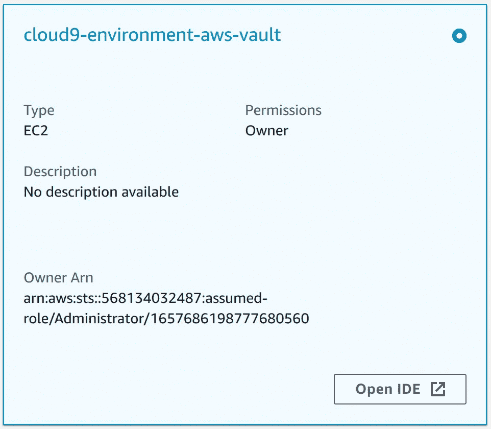

# AWS Cloud9 多帐户和基于角色的访问

> 原文：<https://levelup.gitconnected.com/aws-cloud9-multi-account-and-role-based-access-c5dfe6c88956>

我有多个工作站，我经常在 Linux 和 Windows 之间切换，因为在每个操作系统中我喜欢做不同的事情。在每一个系统上保持开发工具和环境的更新是一件痛苦的事情。

所以…在过去的几天里，我决定尝试一下云。

对于那些没有听说过它的人来说，它是 AWS 对云托管集成开发环境(IDE)的回答。


照片由在 [Unsplash](https://unsplash.com/s/photos/ide?utm_source=unsplash&utm_medium=referral&utm_content=creditCopyText) 上拍摄

与许多 AWS 服务一样，它很容易上手，对于基本用例来说一切都很好。如果您有一个 AWS 帐户，您只需登录到控制台，创建 Cloud9 环境，然后您将能够根据附加到您的用户帐户的 IAM 策略访问您帐户中的服务。所有这些都在您的浏览器中！

然而，我有一个用例，需要做一些工作才能运行起来，这次谷歌并不是我的好朋友。

我的情况是这样的:

1.  我不只有一个账户，我有一个*管理*账户，一个*信息安全*账户，还有一些*开发*、*测试*和*生产*账户。
2.  用户和用户组只存在于 *infosec* 账户中。所有其他访问都假定使用基于角色的访问。
3.  Cloud9 部署在 infosec 帐户中，因为用户在那里登录，这是此类事情的中心帐户。
4.  我通常使用 [aws-vault](https://github.com/99designs/aws-vault) 在我的本地机器上执行 AWS CLI 命令，它支持作为特定角色登录到控制台。

我想在 *infosec* 帐户中托管我的 Cloud9 实例，然后在其他帐户(主要是 *dev* )中承担角色来部署资源。当然，解决这个问题的一个方法是为每个开发人员创建一个专用的沙盒帐户，在其中托管 Cloud9 实例和开发过程中创建的任何资源。

理想情况下，部署到*测试*和*产品*账户应该使用 Cloud9 之外的 CI/CD 管道来完成，如果没有部署到*开发*账户的话。

## 不要使用 aws-vault 登录创建 Cloud9 环境

第一件让我感到困惑的事情是使用 aws-vault 登录控制台，然后创建一个 Cloud9 环境。

问题是，当 aws-vault 启动浏览器窗口并让您登录到控制台时，它是使用联合用户这样做的，并且该角色的 ARN 是临时的，并且是短暂的。一旦您的会话到期，下次登录时，ARN 将会不同。您可以在下图中看到，ARN 包含一个时间戳，因此每次您再次登录时，时间戳都会发生变化。


当创建一个 Cloud9 实例时，它将在会话活动时正常工作，但是因为实例*的所有者*是一个将不再存在的 ARN，所以你也将不能再次启动你的 Cloud9 实例。

最初，它看起来像这样:



但是注销并再次登录后，ARN 将会不同，不再与上面显示的*所有者 Arn* 匹配。*权限*将变为*无*并且控制台中的*打开 IDE* 按钮将变灰。


最后，我不得不使用普通 IAM 用户登录控制台，而不使用 aws-vault。至少这让我以自己的身份进入了 infosec 的账户，而不是一个短暂的实体。

## 附加 *AWSCloud9Administrator* 策略

现在的问题是，即使我登录了，我仍然没有任何权限。我需要给自己 *AWSCloud9Administrator* 或 *AWSCloud9User* 权限，这样我就可以为自己创建一个环境。

为此，我在 *infosec* 帐户中担任了*管理员*角色，并将 *AWSCloud9Administrator* 策略附加到我的用户帐户上。(我在偷工减料——通常我会创建一个用户组，然后将策略附加到该用户组，并将我自己添加到该组中。)

现在我有了这个权限，我可以从我所承担的管理员角色切换回来，继续到 Cloud9 控制台创建一个新环境。

## AWS 管理的临时凭据

AWS 正试图通过为您管理凭证来帮助您。Cloud9 的功能是每 5 分钟自动轮换一次凭证。这些被称为 [AWS 管理的临时凭证](https://docs.aws.amazon.com/cloud9/latest/user-guide/security-iam.html#auth-and-access-control-temporary-managed-credentials)。这是一个类似于 aws-vault 的概念，但它在幕后完成所有工作。

第一个问题是，这些凭证与当前登录的用户具有相同的访问级别，在我的例子中，这意味着几乎没有任何权限。

这是我在 Cloud9 环境中查询自己的身份时得到的结果:

```
OliverSchenk-Admin:~ $ aws sts get-caller-identity
{
    "UserId": "xxxxxxxxxxxxxxxxxxxxx",
    "Account": "xxxxxxxxxxxx",
    "Arn": "arn:aws:iam::xxxxxxxxxxxx:user/OliverSchenk-Admin"
}
```

第二个问题是这些凭证受到限制，只允许有限的 AWS 服务调用。[文档列出了允许进行的调用](https://docs.aws.amazon.com/cloud9/latest/user-guide/security-iam.html#auth-and-access-control-temporary-managed-credentials)，而承担角色不在其中。如果我试图承担一个角色，它会失败。

```
OliverSchenk-Admin:~ $ aws sts assume-role --role-arn arn:aws:iam::<dev_account_id>:role/Administrator --role-session-name OliverSchenk-Admin-DevAn error occurred (InvalidClientTokenId) when calling the AssumeRole operation: The security token included in the request is invalid
```

## 下一个最佳选择

考虑到默认环境凭证无法承担角色，AWS 建议下一个最好的办法是关闭托管临时凭证，转而将 EC2 实例配置文件附加到运行 Cloud9 环境的 EC2 实例。

这实际上意味着 Cloud9 将不再根据其允许的权限为我们生成凭证，而是我们可以创建自己的 IAM 角色和相关策略来管理我们的 Cloud9 环境允许访问的内容。然后，我们可以使用 EC2 实例的元数据作为凭证源。这仍然比在配置文件中硬编码一组固定的 AWS 凭证要好。

## 关闭托管临时凭据

点击右上角的 cog 图标，关闭*首选项*选项卡中的托管临时凭证。在 *AWS 设置>凭证*中，关闭 *AWS 管理的临时凭证*。


这将删除`~/.aws/credentials`文件，Cloud9 将不再配置任何凭证。当我尝试调用 AWS 服务时，我现在得到类似这样的消息:

```
OliverSchenk-Admin:~ $ aws sts get-caller-identityUnable to locate credentials. You can configure credentials by running "aws configure".
```

## 创建并附加实例概要文件

接下来要做的事情是创建一个新的 IAM 策略和角色，然后将其附加到 EC2 控制台中的 EC2 实例。显然，您将配置您希望您的环境拥有的任何权限，但是我真正想要的是能够在 *dev* 环境中承担一个角色。当然，您可以根据需要为您的角色附加任意多的策略。

以下策略允许我在 *dev* 帐户中担任管理员角色。(这假设我已经正确地设置了跨帐户策略——这是另一篇文章的内容！)

```
{
    "Statement": [
        {
            "Action": "sts:AssumeRole",
            "Effect": "Allow",
            "Resource": "arn:aws:iam::<dev_account_id>:role/Administrator",
            "Sid": "AssumeDevAdministratorRole"
        }
    ],
    "Version": "2012-10-17"
}
```

我将上述内容附加到一个新角色，并且还必须设置一个信任关系，以允许 EC2 实例承担该角色:

```
{
    "Version": "2012-10-17",
    "Statement": [
        {
            "Effect": "Allow",
            "Principal": {
                "Service": "ec2.amazonaws.com"
            },
            "Action": "sts:AssumeRole"
        }
    ]
}
```

现在剩下要做的就是进入 EC2 实例，找到 Cloud9 实例，选择它，然后单击*操作>安全>修改 IAM 角色*，选择我刚刚创建的角色*更新 IAM 角色*。

在 Cloud9 环境中，我现在可以看到 EC2 实例所承担的角色。

```
OliverSchenk-Admin:~ $ aws sts get-caller-identity
{
    "UserId": "AROAYIR3NLRT3B7FQ7XGV:i-05a3b97d2929b28d0",
    "Account": "<infosec_account_id>",
    "Arn": "arn:aws:sts::<infosec_account_id>:assumed-role/OliverSchenk-Dev-Account-Cloud9-Instance-Profile/i-05a3b97d2929b28d0"
}
```

## 设置 AWS 配置文件

我创建了一个 AWS 配置概要文件，它将承担 *dev* 帐户中的角色。在 Cloud9 终端中，我编辑了文件`~/.aws/config`并添加了如下内容:

```
[profile OliverSchenk-Admin-Dev]
region = ap-southeast-2
output = yaml
role_arn = arn:aws:iam::<dev_account_id>:role/Administrator
credential_source = Ec2InstanceMetadata
```

`credential_source`获取底层 EC2 实例的凭证，`role_arn`告诉它承担什么角色。

我使用`--profile`参数再次测试了呼叫者身份。我得到了这样的东西:

```
OliverSchenk-Admin:~ $ aws sts get-caller-identity --profile OliverSchenk-Admin-Dev
Account: '<dev_account_id>'
Arn: arn:aws:sts::<dev_account_id>:assumed-role/Administrator/botocore-session-1657689540
UserId: AROAQD4TDLBZ2Wxxxxxxx:botocore-session-1657689540
```

看起来我现在已经成功地从运行在 *infosec* 帐户中的 Cloud9 环境中承担了 *dev* 帐户中的角色。

除了使用`--profile`参数，还可以设置`AWS_PROFILE`环境变量，这样任何包含 AWS CLI 命令的脚本都可以在给定的配置文件下运行。

```
OliverSchenk-Admin:~ $ export AWS_PROFILE=OliverSchenk-Admin-Dev
OliverSchenk-Admin:~ $ aws sts get-caller-identity
Account: '<dev_account_id>'
Arn: arn:aws:sts::<dev_account_id>:assumed-role/Administrator/botocore-session-1657689540
UserId: AROAQD4TDLBZ2Wxxxxxxx:botocore-session-1657689540
```

## 同时在其他账户查看 Cloud9 IDE 和 AWS 控制台

我遇到的一个问题是，我不能同时在同一个浏览器中作为两个不同的 AWS 实体或帐户登录。换句话说，我无法登录到 Cloud9 实例，也无法登录到 *dev* 帐户*。*

有几种方法可以解决这个问题。你可以使用不同的浏览器，你可以使用匿名模式，你可以在 Chrome 中使用不同的“人”配置，或者你可以使用浏览器插件，如 Firefox 多帐户容器。

## AWS CDK CLI 需要一个凭据文件

与 AWS CLI 不同，AWS CDK CLI 在检测凭据时存在一些问题。因为我关闭了临时托管凭证，并且我使用 EC2 实例凭证和基于角色的方法，所以我的环境中没有`~/.aws/credentials`文件。AWS CDK 不喜欢这样，所以只需用`touch ~/.aws/credentials`创建一个空的就可以了。

*今天就到这里，谢谢！如果你有纠正、提示或建议，请给我留下一些评论。*

# 分级编码

感谢您成为我们社区的一员！在你离开之前:

*   👏为故事鼓掌，跟着作者走👉
*   📰查看[升级编码出版物](https://levelup.gitconnected.com/?utm_source=pub&utm_medium=post)中的更多内容
*   🔔关注我们:[Twitter](https://twitter.com/gitconnected)|[LinkedIn](https://www.linkedin.com/company/gitconnected)|[时事通讯](https://newsletter.levelup.dev)

🚀👉 [**加入升级人才集体，找到一份惊艳的工作**](https://jobs.levelup.dev/talent/welcome?referral=true)