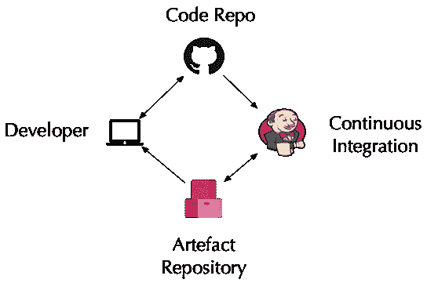
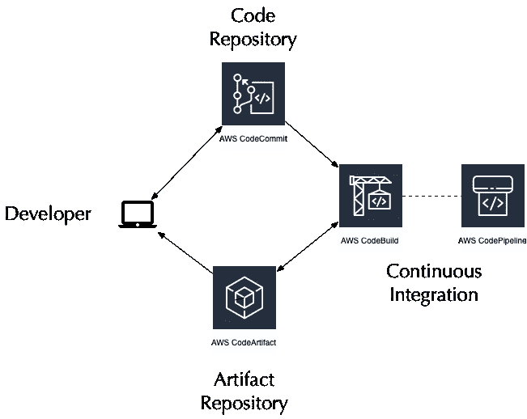
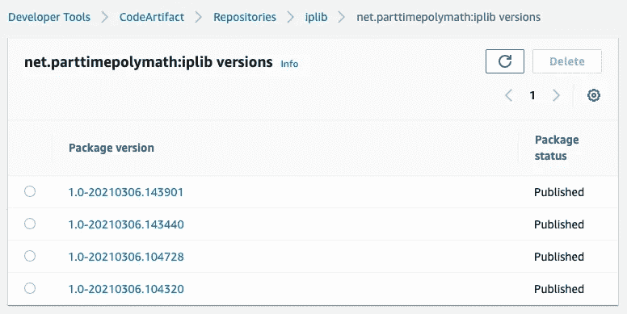

# AWS code artifact with Maven——无服务器的进一步探索

> 原文：<https://levelup.gitconnected.com/aws-codeartifact-with-maven-further-adventures-with-serverless-4ff07fd69e1b>


宁静——作者照片

如果你读过我以前的文章，你会注意到我是一个服务迷，这些服务不需要我在任何地方直接构建和管理服务器。称它们为“无服务器”，称它们为“X-as-a-service”，对我来说，关键是我可以专注于使用服务，而不是太担心它在哪里以及如何运行。

对我来说，CodeArtifact 正好属于这一类。我最近写了一篇关于为 Go 代码构建[无服务器 CI/CD 管道](https://rahook.medium.com/serverless-code-pipelines-on-aws-30dfc91889c6)的文章。对于 Go，管道的最终输出是发布到 S3 桶中的可执行文件。对于 Java 代码，这种方法有点笨拙。

不管喜欢与否，多年来构建和打包 Java 代码的事实标准一直是 [Maven](http://maven.apache.org) 。像 Gradle 这样的替代者逐渐削弱了它的统治地位，但是 Maven 仍然戴着皇冠。我不认为这个星球上的任何人可以说他们喜欢 Maven，但尽管它有许多烦恼，但它可以可靠地重复完成工作。

在 Java 世界中，团队的自动实际开发基础设施看起来和十多年前一样:桌面上的 Eclipse 或 Intellij，与 Maven 项目相对照。某种代码库，通常是 Gitlab 或 Github。Jenkins 或 Hudson 来完成实际的 CI 构建(尽管现在有更好的解决方案)，以及一个工件存储库来存储构建的 jar 并允许它们被共享。同样，多年来事实上的标准一直是来自 JFrog 的广受好评的 Artifactory，CodeArtifact 取代的正是堆栈中的这个组件。



抽象代码管道

现代人工制品仓库的角色相当简单:一个可管理的地方，在那里编译的代码人工制品可以被编目和共享。制品库中一个更重要的想法是代码制品的每个版本都是不同的，并且有一些方法可以追溯到生成代码的版本。大多数人工制品库也可以作为外部库的缓存代理或镜像副本。企业经常使用这个特性来管理开发人员使用什么外部存储库，以及他们可以导入什么外部依赖项。

在 Maven 的情况下，每个项目都由一个或多个 XML 文件定义，通常命名为 *pom.xml* 和 *settings.xml* ，它们(以及许多其他东西)定义了 Maven 将把构建的工件发布到哪里，以及它将在哪里寻找解决依赖关系的方法。这些地方通常是相同的，但并不总是如此，这会导致一定程度的混淆！

作为我探索如何组装[无服务器 CI/CD 管道](https://rahook.medium.com/serverless-code-pipelines-on-aws-30dfc91889c6)的一部分，我终于坐下来思考如何让 CodeBuild、CodeArtifact 和 Maven 合作构建和发布 Java JARs。我将研究下面的一些细节，尽管请参考我以前关于整理代码构建/代码管道片段以提供持续集成和部署所需的所有零碎内容的笔记。在这篇文章中，我将重点关注 CodeArtifact 和 Maven 配置。



无服务器 CI/CD 管道

还要注意，我将给出使用 Terraform 的例子——如果你读过我写的其他东西，你就会知道我喜欢 Terraform，并且非常喜欢使用 Terraform 代码在 AWS 上定义基础设施的想法。

我绊倒的第一件事是，在撰写本文时(2021 年初)，CodeArtifact 仅在有限数量的 AWS 环境中可用。一般来说，我在伦敦(eu-west-2)地区构建东西，因为那是我住的地方，但是让我有点烦恼的是 CodeArtifact 只在爱尔兰(eu-west-1)可用。所以，唉，第一步是在我的 Terraform 代码中添加一个额外的命名提供者:

```
provider "aws" {
  region  = var.aws_region
  profile = var.aws_profile
}provider "aws" {
  alias   = "eu-west-1"
  region  = "eu-west-1"
  profile = var.aws_profile
}
```

下一步，我假设我将在未来中期为更多的 Java 库构建更多的管道，所以我创建了一个项目列表(每个项目都有自己独特的管道和存储库)。这非常简单——一个映射，其中的关键字是我为项目使用的常用名称及其所有的零碎内容，以及一个描述:

```
locals {
  projects = {
    iplib : "Small library for consuming AWS CIDR block data"
  }
}
```

CodeArtifact 是围绕*域*组织的——域是任何适合您的逻辑分组，并且充当一组工件的逻辑容器。你可能想按产品或项目，或按团队，或按组织界限来组织。这真的没关系，除了它给你一个机会使用 IAM 角色和策略来限制谁可以访问给定的域。

关于角色和策略的一个小问题。在下面的例子中，我一直作为一个对帐户有很高访问权限的用户进行操作。您可能需要使用 Terraform 创建资产的权限。

对，所以，*域*。下一步是创建一个域:

```
resource "aws_codeartifact_domain" "development" {
  provider = aws.eu-west-1domain         = "development"
  encryption_key = aws_kms_key.codeartifact.arn
  tags           = merge({ "Name" = "development" }, var.tags)
}
```

你可能会注意到有一个加密密钥。这是强制性的，也是限制访问的另一个潜在工具。它还增加了对存储库中任何工件是真实的保证:对于一个外部不良行为者来说，要破坏密钥和代码工件域以便能够安装欺骗的工件(尽管来自上游存储库的缓存工件可能仍然已经在上游中毒)将花费相当多的精力

键很容易抛出，但是要确保它和域在同一个区域:

```
resource "aws_kms_key" "codeartifact" {
  provider                = aws.eu-west-1
  deletion_window_in_days = 30
  enable_key_rotation     = true
  tags                    = merge({ "Name" = "codeartifact" }, 
                                  var.tags)
}
```

接下来，存储库本身。总的来说，您可能会围绕一个项目来组织这个项目，将所有密切相关的工件放在一个库中:

```
resource "aws_codeartifact_repository" "maven" {
  provider = aws.eu-west-1 domain      = aws_codeartifact_domain.development.domain
  repository  = "maven"
  description = "Repository to install maven artifacts into"
  external_connections {
    external_connection_name = "public:maven-central"
  }
  tags = merge({ "Name" = "maven"}, var.tags)
}
```

我称它为“maven ”,因为在我的脑海中，我将只使用这个库来通过 Maven 读写工件，但是每个库都可以用于 Maven、Gradle、pip、NPM……几乎所有你需要的标准，并且随着时间的推移而增长。

代码构建的定义比我之前[描述的](https://rahook.medium.com/serverless-code-pipelines-on-aws-30dfc91889c6)要简单一点——关键的区别是我没有指定代码构建产生的产品。这是因为发布到 CodeArtifact 的工作是由 Maven 本身完成的:

```
resource "aws_codebuild_project" "maven" {
  for_each = local.projects name         = each.key
  description  = "project to build the ${each.key} project"
  service_role = aws_iam_role.maven.arn build_timeout  = 15
  badge_enabled  = true
  source_version = "refs/heads/main" source {
    git_clone_depth     = 1
    insecure_ssl        = false
    location            = aws_codecommit_repository.maven[each.key].clone_url_http
    report_build_status = false
    type                = "CODECOMMIT" git_submodules_config {
      fetch_submodules = false
    }
  } artifacts {
    type = "NO_ARTIFACTS"
  } environment {
    compute_type                = "BUILD_GENERAL1_SMALL"
    image                       = "aws/codebuild/amazonlinux2-x86_64-standard:3.0"
    image_pull_credentials_type = "CODEBUILD"
    privileged_mode             = false
    type                        = "LINUX_CONTAINER"
  } logs_config {
    cloudwatch_logs {
      status     = "ENABLED"
      group_name = aws_cloudwatch_log_group.maven.name
    } s3_logs {
      encryption_disabled = false
      status              = "DISABLED"
    }
  } tags = merge({ "Name" = each.key }, var.tags)
}
```

除非你非常熟悉 Terraform，否则代码片段中会出现一些微妙的东西——使用 *for_each* 意味着我定义的每个项目都将由相同的代码创建一个管道。添加一个新项目就像在顶部的*本地*列表中添加一个条目一样简单，然后重新运行 Terraform。

另一个细微的差别可能不是很明显 CodeBuild 项目(以及 CodePipeline 管道和 CodeCommit git 存储库)是*而不是`eu-west-1`中的*——不要求 CodeArtifact 存储库与构建和发布工件的零碎部分位于同一区域。

附加到 *service_role* 的策略与我之前发布的策略相同，只是添加了 CodeBuild 使用 CodeArtifact 的权限。如果你想更精确地了解所使用的资源，这可能会有一点细微的差别，稍后我会自己进行调整。最小特权原则是一个非常强大的安全网。

```
data "aws_iam_policy_document" "codebuild" {
  .
  .
  .
  statement {
    actions = [
      "codeartifact:GetAuthorizationToken",
      "codeartifact:GetRepositoryEndpoint",
      "codeartifact:ReadFromRepository",
      "codeartifact:PublishPackageVersion",
      "codeartifact:PutPackageMetadata"
    ]
    resources = ["*"]
  } statement {
    actions   = ["sts:GetServiceBearerToken"]
    resources = ["*"]
    condition {
      test     = "StringEquals"
      variable = "sts:AWSServiceName"
      values = [
        "codeartifact.amazonaws.com"
      ]
    }
  }
}
```

唯一复杂的是使用 STS 来获得一个认证令牌。这是 IAM 原则和策略的世界与(在本例中)Maven 的老派认证世界之间的“粘合剂”。

所以让我们过渡到 Java 项目本身的内容。首先，因为这是一个 CodeBuild 项目，我们需要`buildspec.yml`来告诉 CodeBuild 如何处理代码:

```
version: 0.2

phases:
  install:
    runtime-versions:
      java: corretto11
  pre_build:
    commands:
      - export STAMP="1.0-`date +%Y%m%d.%H%M%S`"
      - export CODEARTIFACT_AUTH_TOKEN=`aws --region eu-west-1 codeartifact get-authorization-token --domain development --domain-owner 304388931199 --query authorizationToken --output text`
  build:
    commands:
      - mvn --no-transfer-progress versions:set -DnewVersion=$STAMP
      - mvn --no-transfer-progress -s settings.xml clean package deploy
artifacts:
  files:
    - target/iplib-$STAMP.jar
  name: iplib-$STAMP.jar
```

从上到下工作:我指定 AWS 的 [Coretto](https://aws.amazon.com/corretto/) 是因为我知道他们已经为它优化了构建环境——简单地说，用 Coretto 构建会更快一点，而且稍微便宜一点。生产的产品完全兼容任何 Java 11(或更高版本)JDK。我还使用当前的日期和时间创建了一个版本标记，你可以看到它被用在更低的人工制品的名字中。

唯一复杂的部分是要求 CodeBuild 获得一个在构建中使用的身份验证令牌。即使调用是`aws codeartifact get-authorisation-token`，在幕后 STS 也参与其中，这就是为什么我们也需要授予对该服务的访问权。

构建采用我们已经配置好的那些位，然后运行一个普通的 Maven 构建，首先设置我们将使用的版本标识符，然后进行构建和部署。

从这里开始，都是 Maven 配置。首先，我们必须在项目的顶部有一个`settings.xml`来为 Maven 指定一个或多个服务器。这就是环境中的身份验证令牌发挥作用的地方。注意，服务器 *id* 是基于 CodeArtifact 域和存储库的，但这只是为了方便起见，以便在整个项目中使用一致的名称。

```
<settings>
    <servers>
        <server>
            <id>development--maven</id>
            <username>aws</username>
            <password>${env.CODEARTIFACT_AUTH_TOKEN}</password>
        </server>
    </servers>
</settings>
```

在`pom.xml`本身中，包含对代码源代码的引用是一个好习惯:

```
<?xml version="1.0" encoding="utf-8"?>
<project 
 xmlns:xsi="http://www.w3.org/2001/XMLSchema-instance"
 xsi:schemaLocation="http://maven.apache.org/POM/4.0.0
 http://maven.apache.org/maven-v4_0_0.xsd">
    <modelVersion>4.0.0</modelVersion>

    <name>IPLib</name>
    <groupId>net.parttimepolymath</groupId>
    <artifactId>iplib</artifactId>
    <version>1.0-SNAPSHOT</version>
    <packaging>jar</packaging>

    <description>Simple library to extract IP ranges fom the IP range set published by AWS</description>
    <url>http://parttimepolymath.net</url>

    <scm>
      <url>scm:ssh://git-codecommit.eu-west-2.amazonaws.com/v1/repos/iplib</url>
      <connection>scm:ssh://git-codecommit.eu-west-2.amazonaws.com/v1/repos/iplib</connection>
      <developerConnection>scm:ssh://git-codecommit.eu-west-2.amazonaws.com/v1/repos/iplib</developerConnection>
      <tag>iplib-1.0-snapshot</tag>
    </scm>
.
.
.
```

但是发布的重要部分是指定 *distributionManagement* :

```
<distributionManagement>
    <repository>
        <id>development--maven</id>
        <name>development--maven</name>
        <url>https://development-304388931199.d.codeartifact.eu-west-1.amazonaws.com/maven/maven/</url>
    </repository>
</distributionManagement>
```

将所有这些组装起来，并将我的 Java 代码推上来，结果非常令人满意地是，各种版本进入了存储库，没有人工干预，没有忙乱，最重要的是*没有服务器需要管理*。



同样的信息也可以从命令行中检索，但这绝对是使用控制台要简单得多的情况之一:

```
% aws --profile XXX --region eu-west-1 codeartifact \
    list-package-versions \
    --namespace net.parttimepolymath --package iplib \
    --domain development --repository maven \
    --format maven{
  "versions": [
    {
      "version": "1.0-20210306.104320",
      "revision": "IsZFITs4QUJ+NQ4f45Sipzxy6RAbM5GOs1DNPYUh0YY=",
      "status": "Published"
    },
    {
      "version": "1.0-20210306.104728",
      "revision": "hCdgGhXuuqVIqUWlSe3r9YKxQZDnWG3LnBAFR4mCqLw=",
      "status": "Published"
    },
 .
 .
 .
```

因此，以上所有这些让我们到达了在我们的无服务器管道中将 Maven 工件部署到 CodeArtifact 中的点。为了结束这个循环，我们需要能够在我们的构建中将工件下拉到桌面——例如在不同的项目中使用 *iplib* 库。好消息是，这非常简单明了。

首先，我们的客户项目需要与上面相同的`settings.xml`(或者，这可以进入您当地的`.m2/settings.xml`，正如在 [AWS 文档](https://docs.aws.amazon.com/codeartifact/latest/ug/using-maven-packages-in-codebuild.html)中所讨论的)。

接下来，`pom.xml`需要分发管理定义来部署:

```
<distributionManagement>
    <repository>
        <id>development--maven</id>
        <name>development--maven</name>
        <url>https://development-304388931199.d.codeartifact.eu-west-1.amazonaws.com/maven/maven/</url>
    </repository>
</distributionManagement>
```

但是我们需要一个额外的项目来从 CodeArtifact 中*提取*依赖项:

```
<repositories>
    <repository>
        <id>development--maven</id>
        <url>https://development-304388931199.d.codeartifact.eu-west-1.amazonaws.com/maven/maven/</url>
    </repository>
</repositories>
```

关于这个定义有一个警告——在没有指定其他库的情况下，这将导致*所有*工件解析都通过我们的 CodeArtifact 实例。这就是为什么在我们的 CodeArtifact 配置中，我们在开始时指定了一个外部连接:我们的实例充当 Maven 中央存储库前面的缓存代理。根据您的需求，这可能不是您想要的，在这种情况下，您可能想要使用[多库](http://maven.apache.org/guides/mini/guide-multiple-repositories.html)。

无论哪种方式，进行本地构建都很容易:

```
$ CODEARTIFACT_AUTH_TOKEN=`aws --region eu-west-1 codeartifact get-authorization-token --domain development --domain-owner 304388931199 --query authorizationToken --output text`
$ mvn -s settings.xml clean package
```

在 maven 构建的初始阶段，您应该会看到从我们的 codeartifact 库下载的依赖项:

```
[**INFO**] Scanning for projects...
[**INFO**]
[**INFO**] **--------------------<** net.parttimepolymath:awscidr **>--------------------** [**INFO**] **Building AWSCidr 1.0-SNAPSHOT** [**INFO**] **--------------------------------[ jar ]---------------------------------** Downloading from development--maven: [https://development-889199313043.d.codeartifact.eu-west-1.amazonaws.com/maven/maven/net/parttimepolymath/iplib/1.0-20210306.194311/iplib-1.0-20210306.194311.pom](https://development-889199313043.d.codeartifact.eu-west-1.amazonaws.com/maven/maven/net/parttimepolymath/iplib/1.0-20210306.194311/iplib-1.0-20210306.194311.pom)
.
.
.
```

最后一点:[定价](https://aws.amazon.com/codeartifact/pricing/)。CodeArtifact 的成本低得离谱，在成本上升到“一杯咖啡的价格”之前，您需要有一个非常活跃的开发环境。更重要的是，这些成本比运行安装了 Artifactory 或类似软件的服务器的成本低几个数量级，更不用说管理该服务器的人力成本了。