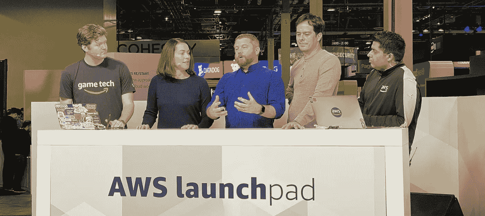
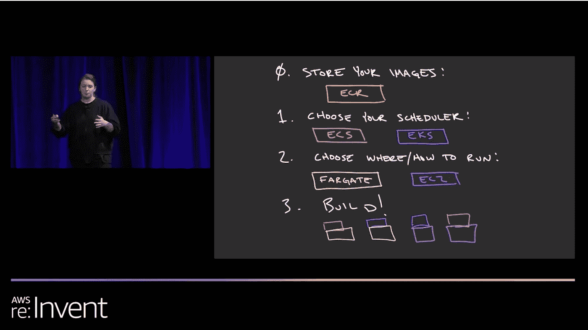
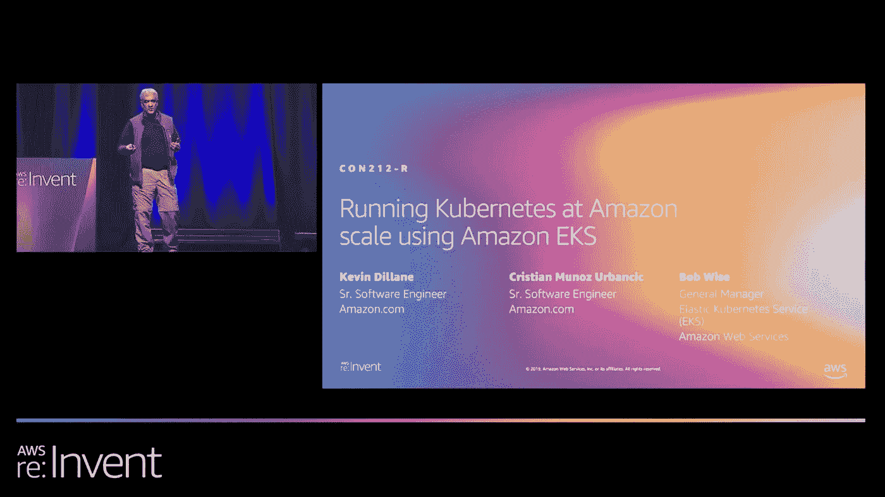
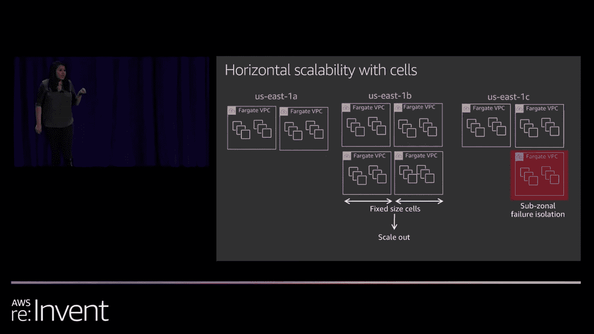
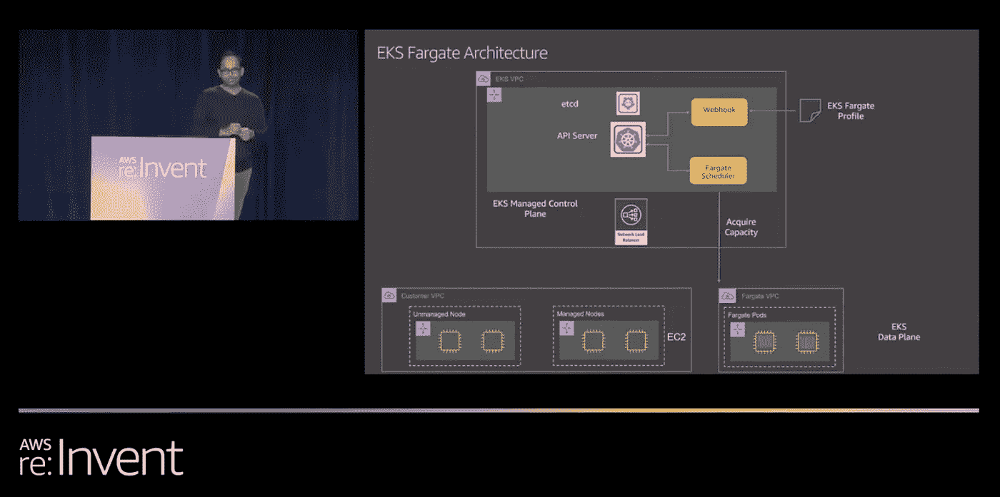
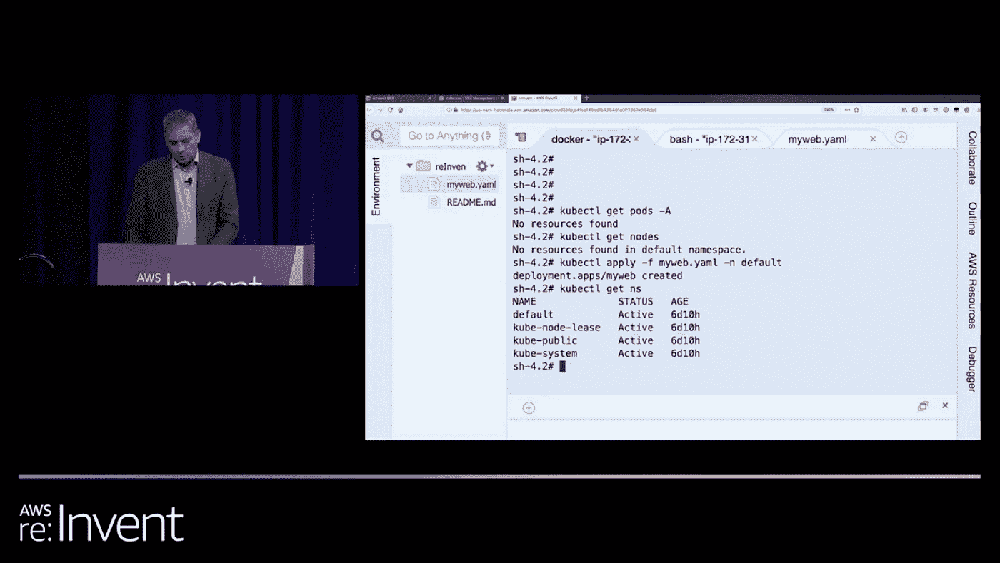
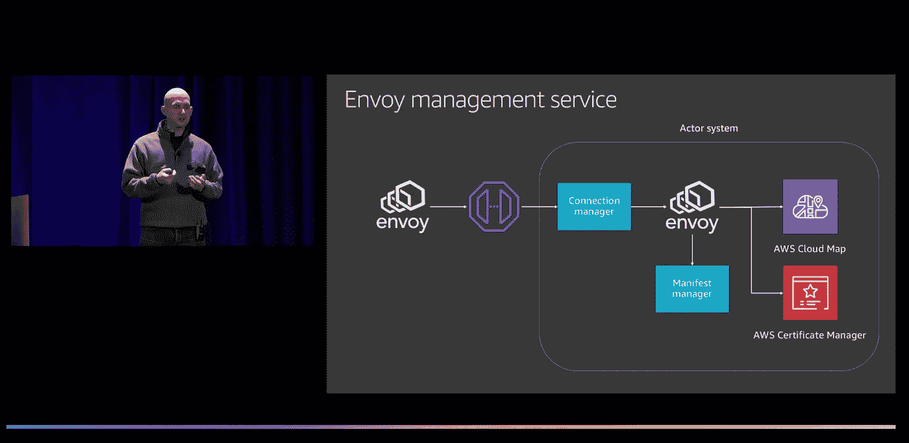
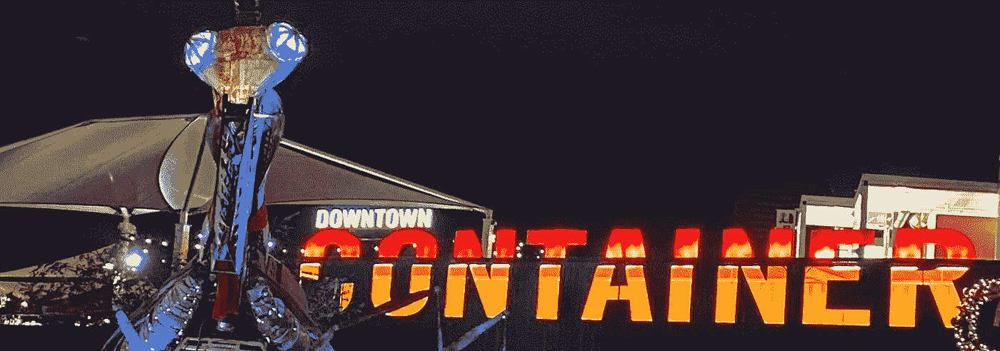

# 每个 IT 专业人员在 re:Invent 2019 后都应该知道的 6 个容器会话

> 原文：<https://levelup.gitconnected.com/aws-container-updates-news-ecs-eks-fargate-appmesh-reinvent-2019-59890d77188f>

你错过了 AWS re:Invent 2019？你去了维加斯却忙于其他话题？不要慌！在维加斯发生的事，会留在维加斯。唯一的例外是在 re:Invent 上宣布的所有技术。这是我从 re:Invent 2019 中(非常)主观地列出的 *AWS 容器会话必看清单。*

AWS 今年在容器领域发布了一些重要公告。然而，这里有一个挑战:要赶上所有会议的细节，你至少要忙上半天。看完所有的电影后，你可能会头晕目眩。

## 以下是一些快速、轻松地了解所有公告的建议:

1.  首先浏览会议标题和摘要。根据你的优先顺序排列它们，然后从最重要到最不重要的顺序观看它们。如果你不能全部看完，不要给自己压力。YOLO 战胜了 FOMO。而是从今天开始。
2.  尝试提高播放速度！我从来不相信用 1.5，1.75 甚至 2.0x 的回放速度我会记住很多。但是今年我一直在训练它。而且很管用！这就是你的新挑战:-)。
3.  参加我们的技术传道者团队在全球举办的 [re:Cap 会议](https://twitter.com/frankmunz/status/1205170377179222016)。查看在你所在城市举办这些会议的 [AWS meetup group](https://aws.amazon.com/developer/community/usergroups/) 。

# 1.AWS 的容器、应用网络和 Amazon Linux 路线图(CON217)

## 演讲者:艾比·富勒
难度:300 级

摘要:在本节中，我们将介绍 AWS 最近发布的容器、Amazon Linux 和应用程序网络，以及它们如何适应用户的大环境。我们还介绍了我们对未来的想法，并讨论了您可以帮助推动我们产品方向的不同方式，例如开发人员预览、公开发布的路线图等等！

# 2.使用亚马逊 EKS (CON212-R1)以亚马逊规模运行 Kubernetes

## 演讲者:鲍勃·怀斯等人
难度:300 级

**摘要**:Amazon.com 在亚马逊弹性库本内特服务(亚马逊 EKS)上建立了一个托管基础设施，为数千万购物者的购物体验提供动力。在本次会议中，我们将深入探讨亚马逊 EKS 如何让一个小团队拥有这一高可用性多租户解决方案的细节。我们探索如何使用亚马逊 EKS 帮助开发人员提高敏捷性，为购物者带来创新。最后，我们深入探讨了这个托管平台如何使 Amazon.com 开发者能够专注于构建卓越的购物体验，而对基础设施层面发生的变化保持幸福的无知。

# 3.引擎盖下的法盖特(CON423-R1)

## 演讲者:阿尔恰娜·斯里坎塔和奥努尔·菲利斯
难度:400 级

**总结** : AWS Fargate 是 AWS 上完全无服务器、容器原生的计算体验。Fargate 不需要用户配置、扩展和管理任何服务器。在 Fargate 的引擎盖下，有一个复杂的架构，其中 AWS 正在进行垂直创新，以构建一个容器优化的虚拟化平台，并在水平方向上构建与周围 AWS 服务的正确集成，以照顾开发人员的无差别繁重工作。在本专题讲座中，向高级工程师了解 AWS Fargate 是如何设计的，以提供可伸缩、安全、无服务器的容器开发体验。

# 4.引擎盖下的亚马逊 EKS(con 421-R1)

## 演讲者:戴维·比尔
难度:300 级

**摘要** : Kubernetes 允许您使用声明式配置和自动化来运行容器化的工作负载和服务。亚马逊弹性 Kubernetes 服务(亚马逊 EKS)是一项托管服务，它可以轻松地在 AWS 上运行 Kubernetes，而无需建立或维护自己的 Kubernetes 集群。亚马逊 EKS 负责保护、修补、认证和升级 Kubernetes 集群的无差别繁重工作。加入我们，看看亚马逊 EKS 如何大规模管理 Kubernetes。我们还讨论了在构建基础设施以管理业界发展最快的开源项目之一时的一些关键设计决策。

# 5.在 AWS Fargate (CON326-R1)上运行 Kubernetes 应用程序

## 演讲者:内森·泰伯和马西莫·雷·费雷'
难度:300 级

**总结** : Fargate 是一个无服务器的容器计算引擎，支持多个编排器。请收听本专题讲座，了解 EKS 和法盖特之间的新集成如何允许开发人员在 kubernetes 集群上部署容器，而无需考虑基础设施。

# 6.R1 con 323 发动机罩下的 AWS 应用程序网格

## 演讲者:戴维·比尔
难度:300 级

**总结**:在这一环节中，资深 AWS 工程师为您带来 AWS App Mesh 构建的幕后花絮。我们讨论这项服务的具体细节，包括为什么我们要构建一个托管控制平面，以及 AWS 如何监控、测试和部署控制平面。您还将了解我们如何进行扩展、调试和日志记录。

如果你像我喜欢写这篇文章一样喜欢阅读它，请为这篇文章鼓掌并关注我的更新。我在 Twitter 上花了太多时间，所以请随意连接:[***@ frankmunz***](https://twitter.com/search?q=frankmunz)***。***

拉斯维加斯，集装箱公园