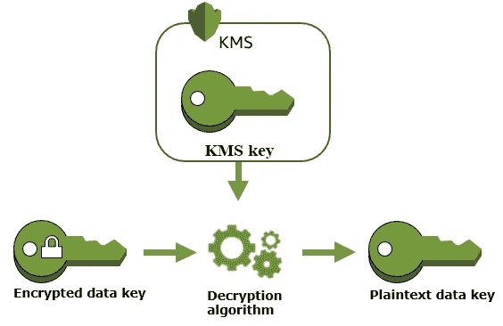

# AWS 加密 SDK

> 原文：<https://levelup.gitconnected.com/aws-encryption-sdk-50c19035fd9d>

## 如何通过加密即服务来保护静态数据


你遇到过这种情况吗？您收到来自银行、信用卡或税务专家的通知，称他们的系统遭到破坏，一些客户信息被“未经授权”的人访问。他们对此非常重视，正在进行调查，尽管他们不知道哪些账户受到了影响，但他们认为你可能会没事。

不幸的是，像这样的事件太常见了，只有最引人注目的事件才会上新闻。为什么会这样？发生这种情况是因为您的敏感客户数据存储在一些未加密的文件系统、数据库或电子邮件服务器中。虽然访问所有这些存储系统都有密码，但它们可能会被窃取，而且通常一些员工可以不受限制地访问数据。

在这种情况下，可以有把握地认为，任何软件系统迟早都会被攻破，其数据也会被访问。当这种情况发生时，保护敏感数据的最佳方法是通过加密来确保它不可理解。您还必须确保用于加密数据的密钥没有存储在与数据相同的位置。这就是加密即服务发挥作用的地方。

# 亚马逊 KMS 和加密 SDK

[本文](https://severalnines.com/blog/database-encryption-why-and-where-you-need-have-data-encryption/)很好地概述了数据加密及其挑战。在这里，我将重点介绍实现并演示一个 Java Springboot 应用程序，它使用 AWS Encryption SDK 来加密关系数据库中的数据。对于存在于其他类型的数据存储中的数据，可以采用类似的方法。

AWS 云产品通过一个名为 [KMS](https://aws.amazon.com/kms/) 的组件提供加密即服务。在 KMS 之上还有一个抽象，叫做 [AWS 加密 SDK](https://docs.aws.amazon.com/encryption-sdk/latest/developer-guide/introduction.html) 。只要你有 AWS 账户，它们都很容易使用。

## 设置用户和密钥

在 AWS 生态系统中导航可能有些令人生畏。本教程提供了关于如何设置使用和密钥的详细的分步指导。

AWS 的服务是现收现付，所以每次使用服务时都会收取少量费用。如果您不想设置 AWS 帐户，在本文的最后，我提供了一个使用 localstack 设置 KMS 的替代方法。 [Localstack](https://localstack.cloud/) 在您的本地计算机上运行 AWS 服务，这是在迁移到云之前测试服务的好方法。

无论哪种方式，一旦您设置了密钥，您将获得一个密钥标识符，如下所示:

```
aws:kms:us-east-1:000000000000:key/34d769e2–4b23–42a7-b9b3–35315c44a2e9
```

这不是秘钥，只是引用它的一种方式。密钥位于 AWS 服务器上。

# 履行

我们首先定义一个连接到加密 SDK 的 Spring 配置。

**KmsMasterKeyProvider** 配置了我们在设置密钥时获得的密钥标识符。我们将通过一个环境变量在配置文件中提供它。

```
aws.key.arn=${AWS_KEY_ARN}
```

第二个 bean， **CryptoMaterialsManager** ，负责我们的程序和 AWS 服务器之间的通信。因为我们将对许多记录的几个列进行加密，所以有必要设置一个本地缓存，以避免对每个加密/解密请求进行服务调用。

当 SDK 尝试连接到远程服务器时，它将查找环境变量 AWS_ACCESS _KEY 和 AWS_SECRET_ACCESS_KEY 进行身份验证。如果您有一个 AWS 帐户，您必须在运行时环境中设置这些变量。

现在我们定义一个服务来处理数据的加密和解密。

在幕后，SDK 将发送描述的主密钥。解密的主密钥将用于解密存储器中的相关部分。



## 数据库加密

我们已经看到，使用 AWS Encryption SDK 实现加密和解密非常容易。我们现在想使用这个简单的服务来加密静态数据，并在需要时解密它。对于这个例子，我们将使用非常流行的关系数据库 [PostreSQL](https://www.postgresql.org/) 。

行动计划如下:

1.  决定哪些字段需要加密，并对它们进行注释。

2.拦截任何进入数据库的数据，识别敏感字段，并对其进行加密。

3.拦截来自数据库的任何数据，识别加密字段，并解密它们。

第一步是想出一种方法来识别要加密的数据字段。为此，我们将定义一个注释:

我们可以使用注释来标记实体中的任何字段，如下所示。

请注意，加密值的类型是 byte[]，因为这是 SDK 加密数据的级别。我们可以将这些字节数组转换成字符串，但我们要避免这样做，因为加密数据通常比原始数据大得多，可能会溢出。

我们将需要数据库中相应的字节数组列。对于 Postgres，这是 BYTEA:

```
CREATE TABLE IF NOT EXISTS customer (
    id uuid DEFAULT uuid_generate_v4() NOT NULL,
    username VARCHAR NOT NULL,
    ssn BYTEA,
    phone_number BYTEA,
    PRIMARY KEY(id)
);
```

最后一步是定义拦截器，以便在数据进出数据库时进行加密和解密。做这件事有许多方法。人们可以使用 Spring AOP，但是在这个例子中，我将使用 Hibernate 事件监听器。

当在数据库中插入或更新记录时，下面的代码处理加密部分。

主要的复杂性是识别标记为加密的字段并获取它们的值。我已经委托了另一个类，[annotedfieldprovider](https://github.com/algorythmist/aws-encryption-sdk-spring/blob/main/src/main/java/com/tecacet/awssecurity/crypto/AnnotatedFieldProvider.java)，为了简洁起见，我在这里省略了它，但是可以在 [GitHub](https://github.com/algorythmist/aws-encryption-sdk-spring) 上与其余代码一起查看。

当从数据库中读取记录时，下面的代码处理解密部分。

# 测试和持续集成

为了完成代码，我们需要集成测试来验证值被无缝地加密和解密。这里有一个例子:

本文的完整代码可以在[GitHub 资源库](https://github.com/algorythmist/aws-encryption-sdk-spring)中找到。您会注意到我已经设置了持续集成，并且正在运行测试。为此，我使用了两种原料:

1.  我通过 GitHub actions 在 Docker 上运行一个 Postress 数据库。这是在这个文件的“服务”部分完成的:[https://github . com/algorythmist/AWS-encryption-SDK-spring/blob/main/。github/workflows/maven.yml](https://github.com/algorythmist/aws-encryption-sdk-spring/blob/main/.github/workflows/maven.yml)
2.  我正在 GitHub 上将 AWS 环境变量设置为秘密。[本文](https://medium.com/gitconnected/keeping-a-secret-a0d7028c6607)介绍了如何做到这一点。

## 本地堆栈

最后，正如我所承诺的，我将向您展示如何在 AWS [localstack](https://localstack.cloud) 上设置 KMS，这样您就不需要连接到实际的亚马逊服务器。

**第一步:安装 localstack**

在安装 localstack 之前，需要安装 Docker 和 Python。安装 python 后，您可以选择创建一个 venv，然后安装以下库:

```
pip install awscli
pip install awscli-local
pip install localstack
```

详细说明可以在[这里](https://docs.localstack.cloud/get-started/)找到。

**第二步:定义 docker-compose.yml 文件**

```
version: '3.9'

services:

  postgres:
      container_name: postgres-aws-demo
      hostname: postgres
      image: postgres:14.1-alpine
      ports: 
        - "5432:5432"
      environment:
        POSTGRES_USER: postgres
        POSTGRES_PASSWORD: postgres

  localstack:
    container_name: localstack
    image: localstack/localstack:latest
    environment:
      - AWS_DEFAULT_REGION=us-east-1
      - EDGE_PORT=4566
      - SERVICES=lambda,s3,kms
    ports:
      - "4566:4566" # The Edge port can multiplex all services
    volumes:
      - "${TEMPDIR:-/tmp/localstack}:/tmp/localstack"
      - "/var/run/docker.sock:/var/run/docker.sock"
```

**第三步:创建密钥**

```
 awslocal kms create-key
```

要查看密钥身份，请使用:

```
 awslocal kms list-keys
```

详细说明可以在[这里](https://docs.localstack.cloud/aws/kms/)找到。

**第四步:连接本地堆栈**

正如我前面提到的，程序将尝试连接到 AWS 服务器，并在环境变量中查找 AWS_ACCESS_KEY 和 AWS_SECRET_ACCESS_KEY。

由于我们将在本地运行 KMS，我们需要连接到本地服务器。为了实现这一点，我对弹簧配置进行了以下修改:

注意，我现在使用配置参数“aws.localstack”来控制是连接到 localstack 还是实际的 aws。如果设置为 true，我将端点重定向到“http://127.0.0.1:4566”并显式设置凭证。凭证是什么并不重要，因为它们会被忽略，但是它们必须被设置为某个值，所以我将它们设置为空字符串。

# 分级编码

感谢您成为我们社区的一员！在你离开之前:

*   👏为故事鼓掌，跟着作者走👉
*   📰查看更多内容请参见[升级编码刊物](https://levelup.gitconnected.com/?utm_source=pub&utm_medium=post)
*   🔔关注我们:[Twitter](https://twitter.com/gitconnected)|[LinkedIn](https://www.linkedin.com/company/gitconnected)|[时事通讯](https://newsletter.levelup.dev)

🚀👉 [**加入升级人才集体，找到一份神奇的工作**](https://jobs.levelup.dev/talent/welcome?referral=true)