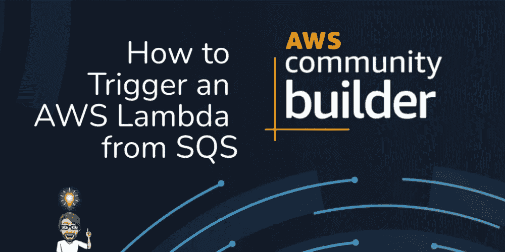
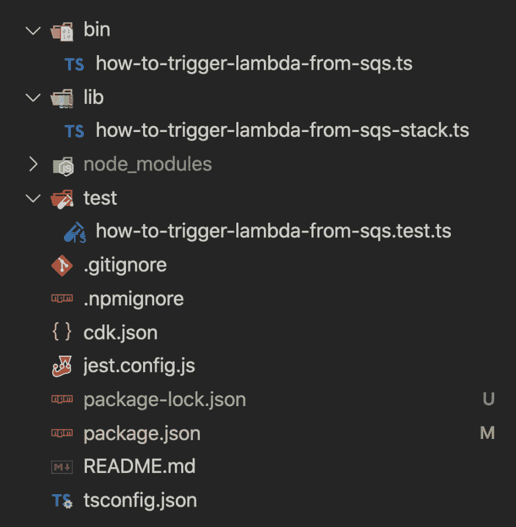
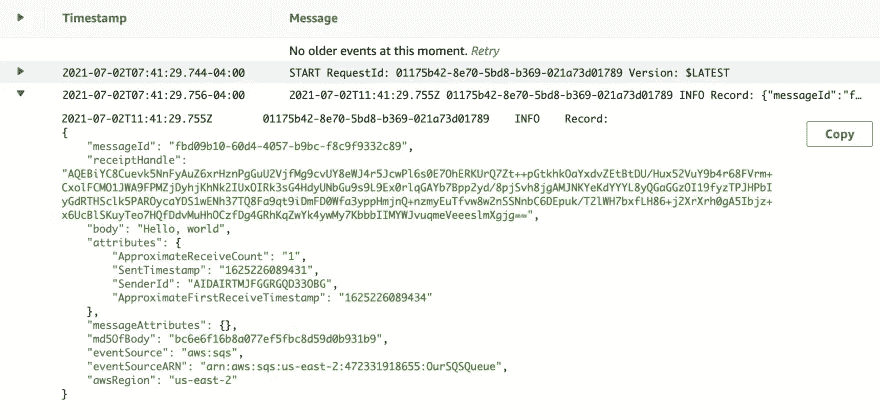

# 通过 AWS CDK 的 AWS 事件驱动的无服务器模式—第 1 部分

> 原文：<https://levelup.gitconnected.com/aws-event-driven-serverless-patterns-via-the-aws-cdk-part-1-bb5dfd348372>

## 如何从 AWS 简单队列服务触发 AWS Lambda 函数(SQS)

图片由作者通过[https://www.kapwing.com](https://www.kapwing.com/)提供

在本帖中，我们将使用 AWS CDK 构建一个从 AWS SQS 消息触发的 AWS Lambda 函数。

所有的代码[都可以在这个库](https://github.com/alexkates/how-to-trigger-lambda-from-sqs)中找到。

# 设置

我们需要运行一些命令来设置我们的 CDK 应用程序，并安装我们需要的 CDK 模块。

这将为您提供以下目录结构。

接下来，确保您已经配置了 AWS CLI。有关更多信息，请遵循[AWS CLI 快速入门指南](https://docs.aws.amazon.com/cli/latest/userguide/cli-configure-quickstart.html)。

最后，如果这是您在 AWS 帐户中的第一个 CDK 应用程序，您将需要执行一次性命令来引导 CDK。

# 构建堆栈

首先，创建 src/index.js，它只记录每个传入的事件记录。

接下来，用下面的 CDK 代码更新 lib/how-to-trigger-lambda-from-SQS-stack . ts。

最后，使用 CDK CLI 部署您的堆栈

# 测试

我们将利用 AWS CLI 来测试我们的堆栈。

首先，我们需要 SQS 队列的队列 URL，您可以使用下面的命令获得它。

接下来，使用上一个命令中的队列 URL，使用 AWS CLI 发送新消息。您的队列 URL 可能会有所不同，但对我来说，这个命令看起来像这样。

通过查看 CloudWatch 来验证 Lambda 是否已执行。找到名为`/aws/lambda/SqsMessageHandler`的日志组，打开最新的日志流。您应该会看到类似如下的一些日志消息。

# 打扫

完成后不要忘记删除您的堆栈！

*原发布于 2019 年 12 月 11 日*[*https://dev . to*](https://dev.to/aws-builders/how-to-trigger-an-aws-lambda-from-sqs-2lkc)*。*