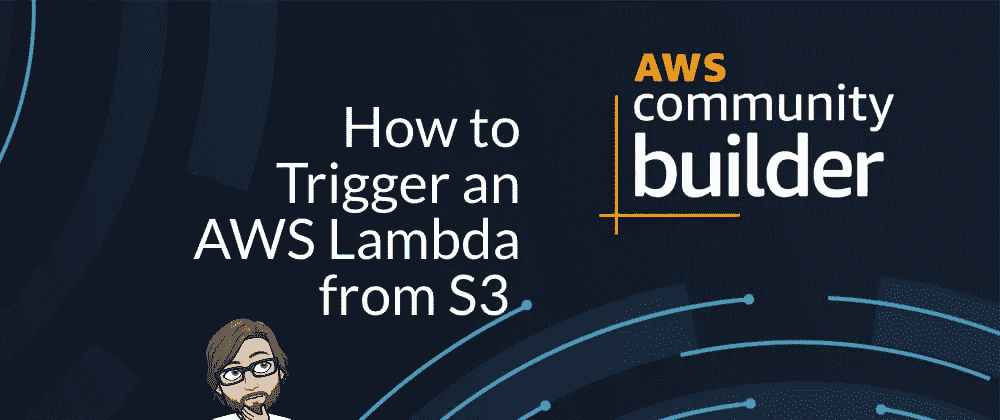
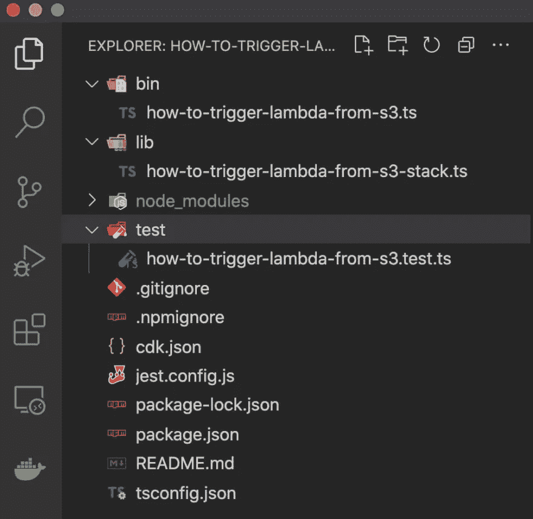
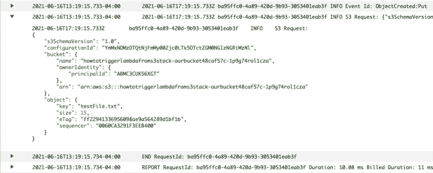

# 通过 AWS CDK 的 AWS 事件驱动的无服务器模式—第 3 部分

> 原文：<https://levelup.gitconnected.com/aws-event-driven-serverless-patterns-via-the-aws-cdk-part-3-359a96799700>

## 如何从 AWS 简单存储服务(S3)中触发 AWS Lambda 函数

在本帖中，我们将使用 AWS CDK 构建一个从 AWS S3 Put 事件触发的 AWS Lambda 函数。

所有的代码都可以在这个库中找到。

# 设置

我们需要运行一些命令来设置我们的 CDK 应用程序，并安装我们需要的 CDK 模块。

这将为您提供以下目录结构。

CDK 初始化后的 VS 代码目录结构

接下来，确保您已经配置了 AWS CLI。有关更多信息，请遵循[AWS CLI 快速入门指南](https://docs.aws.amazon.com/cli/latest/userguide/cli-configure-quickstart.html)。

最后，如果这是您在 AWS 帐户中的第一个 CDK 应用程序，您将需要执行一次性命令来引导 CDK。

# 构建堆栈

首先，创建 src/index.js，它只记录每个传入的事件记录。

接下来，用下面的 CDK 代码更新 lib/how-to-trigger-lambda-from-S3-stack . ts。

最后，使用 CDK CLI 部署您的堆栈

# 测试

我们将利用 AWS CLI 来测试我们的堆栈。

创建一个文本文件，我们将使用它上传到 S3 桶。

使用 AWS CLI 将此文件上传到我们之前的 S3 存储区。您的 bucket 名称会有所不同，但是对我来说，这个命令看起来像这样。

通过查看 CloudWatch 来验证 Lambda 是否已执行。找到名为`/aws/lambda/BucketPutHandler`的日志组，打开最新的日志流。您应该会看到类似如下的一些日志消息。

# 打扫

完成后不要忘记删除您的堆栈！

*原发布于 2019 年 12 月 11 日*[*https://dev . to*](https://dev.to/aws-builders/how-to-trigger-an-aws-lambda-from-s3-events-53c3)*。*