# AWS Fargate:在 AWS ECS 上运行无服务器 Node.js 应用程序。

> 原文：<https://levelup.gitconnected.com/aws-fargate-running-a-serverless-node-js-app-on-aws-ecs-c5d8dea0a85a>

*作者* [*奥斯洛夫莱斯*](https://www.linkedin.com/in/austin-loveless/)*—2020 年 1 月 13 日*


**订阅**AWSMeetupGroup YouTube 频道:[https://www.youtube.com/channel/UCG3Si_vP2tijvvyE5xr7lbg](https://www.youtube.com/channel/UCG3Si_vP2tijvvyE5xr7lbg)

**加入 Meetup.com 上的**AWSMeetupGroup:
[https://www.meetup.com/AWSMeetupGroup/](https://www.meetup.com/AWSMeetupGroup/)

# 项目摘要

我们将封装一个呈现简单静态站点的 Node.js 项目，并将其部署到 Amazon ECS Fargate 集群。我会在[https://github.com/austinloveless/Docker-on-AWS](https://github.com/austinloveless/Docker-on-AWS)提供所有代码。

本教程假设您对 Docker 有基本的了解。如果你是 Docker 的新手，你可以看看我之前的[帖子](https://medium.com/@awsmeetupgroup/docker-on-aws-1855b825de5e)向你介绍 Docker。

# 安装先决条件

# 下载 Docker 桌面。

如果你用的是苹果电脑，去[https://docs.docker.com/docker-for-mac/install/](https://docs.docker.com/docker-for-mac/install/)或者 Windows 去[https://docs.docker.com/docker-for-windows/install/](https://docs.docker.com/docker-for-windows/install/)。遵循安装说明和帐户设置。

# 安装 node.js

在这里下载 Node.js [。](https://nodejs.org/en/)

# 安装 AWS CLI

遵循这里的说明。

# 项目设置

现在我们已经安装了我们的先决条件，我们可以构建我们的应用程序。这个项目不会关注应用程序代码，重点是更熟悉 Docker 和 AWS。所以你可以下载 [Repo](https://github.com/austinloveless/Docker-on-AWS) ，把目录换成`Docker-on-AWS`目录。

如果你想在本地运行应用程序，比如说 screw docker，你可以在`Docker-on-AWS`目录下运行`npm install`。然后跑`node app.js`。要查看本地运行的站点，请访问`[http://localhost:80](http://localhost:80.)` [。](http://localhost:80.)

现在我们已经安装了 docker 并下载了回购协议，我们可以看看`Dockerfile`。您可以将它想象成 Docker 在构建容器或应用程序蓝图时要执行的一系列指令。

```
FROM node:12.4-alpineRUN mkdir /app
WORKDIR /appCOPY package.json package.json
RUN npm install && mv node_modules /node_modulesCOPY . .LABEL maintainer="Austin Loveless"CMD node app.js
```

在顶部，我们声明我们的运行时间是`node:12.4-alpine`。这基本上是我们应用程序的起点。我们从官方 docker hub [节点映像](https://hub.docker.com/_/node)中抓取了这个基础映像。

如果你去链接，你可以看到 12.4-阿尔卑斯山。“-alpine”是一个小得多的基础图像，docker hub 建议“当最终图像尺寸尽可能小时”。我们的应用程序非常小，所以我们将使用阿尔卑斯山的图像。

接下来，在 docker 文件中，我们将创建一个`/app`目录，并将 docker 容器中的工作目录设置为在`/app`中运行。

之后，我们将把`package.json`文件“复制”到 docker 容器上的`package.json`。然后我们从我们的`node_modules`安装我们的依赖项。“复制”整个目录并运行命令`node app.js`在 docker 容器中启动节点应用程序。

# 使用 Docker

现在我们已经讨论了 over 文件的无聊细节，让我们实际构建它。

所以当你安装 Docker 桌面时，它会附带一些工具。Docker 命令行，Docker 编写和 Docker 公证命令行。

我们将使用 Docker CLI 来:

*   建立码头工人形象
*   在本地运行容器

# 建立形象

构建图像的命令是`docker build [OPTIONS] PATH | URL | -`。你可以去[文档](https://docs.docker.com/engine/reference/commandline/build/)查看所有选项。

在应用程序的根目录下，可以运行`docker build -t docker-on-aws .`。这将把我们的形象标记为“docker-on-aws”。

要验证您是否成功创建了映像，您可以运行`docker images`。我的长得像`docker-on-aws latest aa68c5e51a8e About a minute ago 82.8MB`。

# 在本地运行容器

现在，我们将运行新创建的映像，并查看 docker 的运行情况。跑`docker run -p 80:80 docker-on-aws`。`-p`定义了您希望您的应用程序在哪个端口上运行。

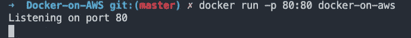

现在可以访问 [http://localhost:80](http://localhost:80) 。

要通过 CLI 查看您的容器是否正在运行，您可以打开另一个终端窗口并运行`docker container ls`。要停止图像，您可以运行`docker container stop <CONTAINER ID>` 。再次用`docker container ls`或`docker ps`确认其停止。

# 亚马逊 ECS 上的 Docker

我们将刚刚创建的映像推送到 Amazon ECR，即弹性容器注册中心，创建一个 ECS 集群，并将映像从 ECR 下载到 ECS 集群。

在进行任何操作之前，我们需要创建一个 IAM 用户并设置我们的 AWS CLI。

# 配置 AWS CLI

我们将使用 AWS CLI 构建一切。

转到 AWS 控制台并搜索 IAM。然后转到“用户”并点击蓝色按钮“添加用户”。

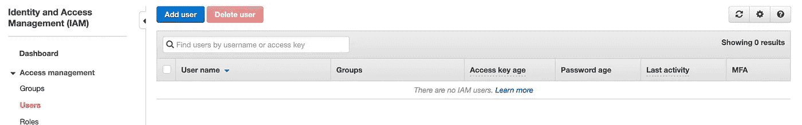

创建一个用户名，如“ECS-User ”,并选择“编程访问”。

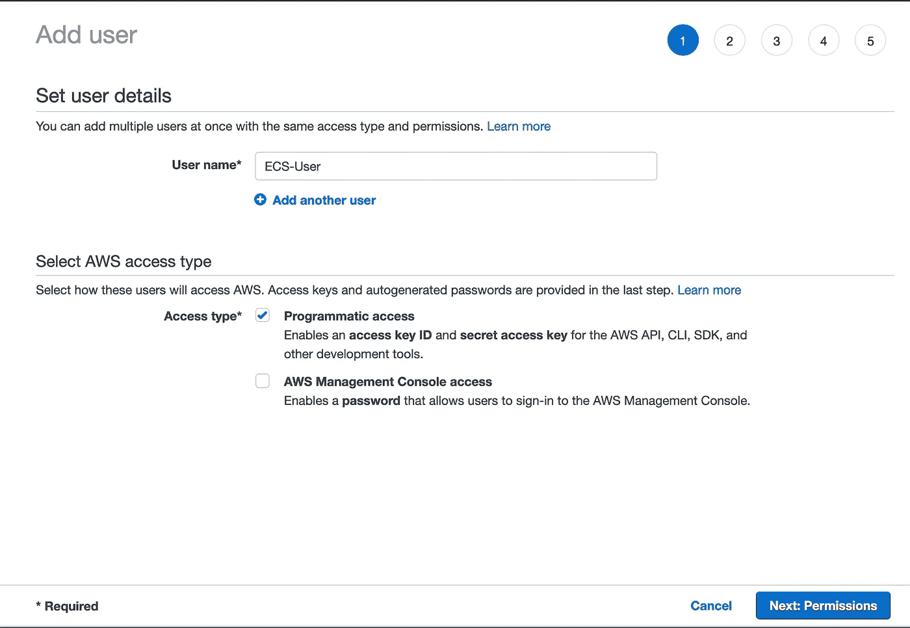

点击“下一步:权限”并选择右上角的“直接附加现有策略”。然后你应该看到“AdministratorAccess”，我们保持这个简单，给管理员访问。

单击“下一步:标签”，然后单击“下一步:查看”，我们不会添加任何标签，然后单击“创建用户”。

现在，您应该看到一个成功页面和一个“访问密钥 ID”和一个“秘密访问密钥”。

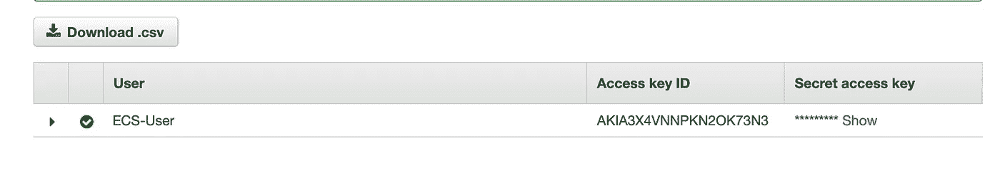

记下访问密钥 ID 和秘密访问密钥。我们将需要它来配置 AWS CLI。

打开一个新的终端窗口，键入`aws configure`并在提示时输入按键。将您的地区设置为`us-east-1`。

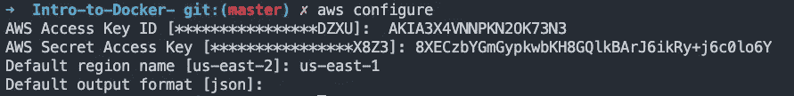

# 创建 ECS 集群

要创建 ECS 集群，您可以运行命令`aws ecs create-cluster --cluster-name docker-on-aws`。

我们可以通过运行`aws ecs list-clusters`来验证我们的集群是如何创建的。

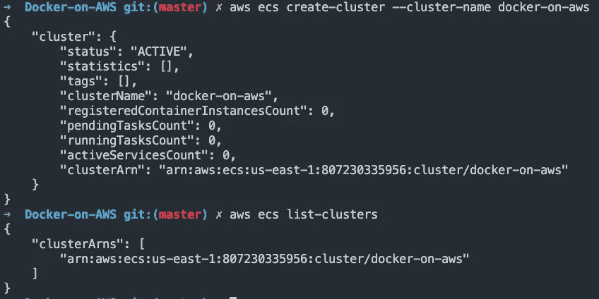

.

如果您想删除集群，您可以运行`aws ecs delete-cluster --cluster docker-on-aws`

# 将图像推送到亚马逊 ECR

现在 CLI 已经配置好了，我们可以标记 docker 映像并将其上传到 ECR。

首先，我们需要登录 ECR。

运行命令`aws ecr get-login --no-include-email`。输出应该是`docker login -u AWS -p`,后跟一个有效期为 12 小时的令牌。复制并运行该命令。这将通过亚马逊 ECR 验证您的身份。如果成功，您应该看到“登录成功”。

通过运行`aws ecr create-repository --repository-name docker-on-aws/nodejs`创建一个 ECR 库。这是群集名称，后跟映像名称。注意输出中的`repositoryUri`。

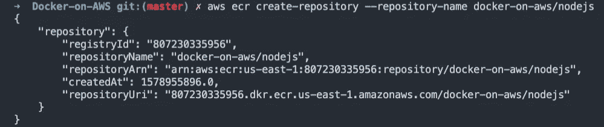

我们必须标记我们的图像，这样我们就可以把它推到 ECR。

运行命令`docker tag docker-on-aws <ACCOUNT ID>.dkr.ecr.us-east-1.amazonaws.com/docker-on-aws/nodejs`。验证您使用`docker images`正确标记了它。

现在将图像推送到您的 ECR repo。运行`docker push <ACCOUNT ID>.dkr.ecr.us-east-1.amazonaws.com/docker-on-aws/nodejs`。验证您是否使用`aws ecr list-images --repository-name docker-on-aws/nodejs`推送了图像。

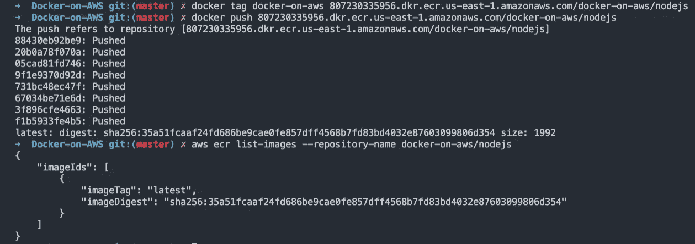

# 将 node.js 应用程序上传到 ECS

最后几个步骤涉及将我们的 node.js 应用程序推送到 ECS 集群。为此，我们需要创建并运行任务定义和服务。在此之前，我们需要创建一个 IAM 角色来允许我们访问 ECS。

# 使用 AWS CLI 创建 ecsTaskExecutionRole

我已经创建了一个名为`task-execution-assume-role.json`的文件，我们将使用它从 CLI 创建 ecsTaskExecutionRole。

```
"Version": "2012-10-17",
    "Statement": [
        {
            "Sid": "",
            "Effect": "Allow",
            "Principal": {
                "Service": "ecs-tasks.amazonaws.com"
            },
            "Action": "sts:AssumeRole"
        }
    ]
}
```

您可以运行`aws iam create-role --role-name ecsTaskExecutionRole --assume-role-policy-document file://task-execution-assume-role.json` 来创建角色。注意输出中的`"Arn"`。

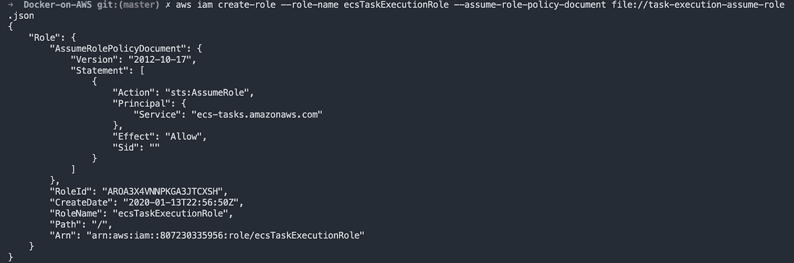

然后运行`aws iam attach-role-policy --role-name ecsTaskExecutionRole --policy-arn arn:aws:iam::aws:policy/service-role/AmazonECSTaskExecutionRolePolicy`来附加“amazonectaskexecutionrolepolicy”。

将你之前复制的`"Arn"`粘贴到`executionRoleArn`的`node-task-definition.json`文件中。

```
{
    "family": "nodejs-fargate-task",
    "networkMode": "awsvpc",
    "executionRoleArn": "arn:aws:iam::xxxxx:role/ecsTaskExecutionRole",
    "containerDefinitions": [
        {
            "name": "nodejs-app",
            "image": "xxxxx.dkr.ecr.us-east-1.amazonaws.com/docker-on-aws/nodejs:latest",
            "portMappings": [
                {
                    "containerPort": 80,
                    "hostPort": 80,
                    "protocol": "tcp"
                }
            ],
            "essential": true
        }
    ],
    "requiresCompatibilities": [
        "FARGATE"
    ],
    "cpu": "256",
    "memory": "512"
}
```

# 注册 ECS 任务定义

一旦您的 IAM 角色被创建并且您用您的`repositoryUri`和`executionRoleArn`更新了`node-task-definition.json`文件，您就可以注册您的任务了。

运行`aws ecs register-task-definition --cli-input-json file://node-task-definition.json`

# 创建和 ECS 服务

此流程的最后一步是创建一个将在 ECS 集群上运行我们的任务的服务。

我们需要创建一个开放端口 80 的安全组，并且需要一个公共子网列表来配置我们的网络。

要创建安全组，请运行`aws ec2 create-security-group --group-name ecs-security-group --description "Security Group us-east-1 for ECS"`。这将输出一个安全组 ID。记下这个 ID。您可以通过运行`aws ec2 describe-security-groups --group-id <YOUR SG ID>`来查看关于安全组的信息。

它将显示我们没有任何 IpPermissions，因此我们需要添加一个 IP permissions 来允许我们的节点应用程序使用端口 80。运行`aws ec2 authorize-security-group-ingress --group-id <YOUR SG ID> --protocol tcp --port 80 --cidr 0.0.0.0/0`添加端口 80。

现在，我们需要获得我们的公共子网列表，然后我们可以创建 ECS 服务。

在输出中运行`aws ec2 describe-subnets`,您应该看到所有子网的`"SubnetArn"`。在这一行的末尾，您会看到“subnet-XXXXXX”。记下这些子网。注意:如果你在`us-east-1`中，你应该有 6 个子网

最后，我们可以创建我们的服务。

用您的 Id 替换子网和安全组 Id，并运行`aws ecs create-service --cluster docker-on-aws --service-name nodejs-service --task-definition nodejs-fargate-task:1 --desired-count 1 --network-configuration "awsvpcConfiguration={subnets=[ subnet-XXXXXXXXXX, subnet-XXXXXXXXXX, subnet-XXXXXXXXXX, subnet-XXXXXXXXXX, subnet-XXXXXXXXXX, subnet-XXXXXXXXXX],securityGroups=[sg-XXXXXXXXXX],assignPublicIp=ENABLED}" --launch-type "FARGATE"`。

运行它将创建服务`nodejs-service`并运行任务`nodejs-fargate-task:1`。`:1`是修订计数。当您更新任务定义时，修订计数将上升。

# 查看 nodejs 应用程序。

既然您已经配置好并运行了所有的东西，那么是时候在浏览器中查看应用程序了。

要查看应用程序，我们需要获取公共 IP 地址。在 AWS 控制台中，转到 ECS 控制面板，然后单击您的群集。

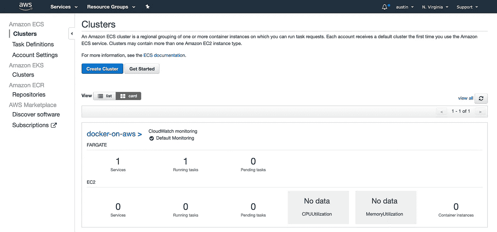

然后单击“任务”选项卡，并单击您的任务 ID。

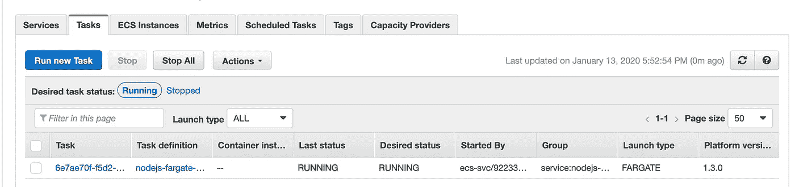

从那里你应该看到一个网络部分和“公共 IP”。

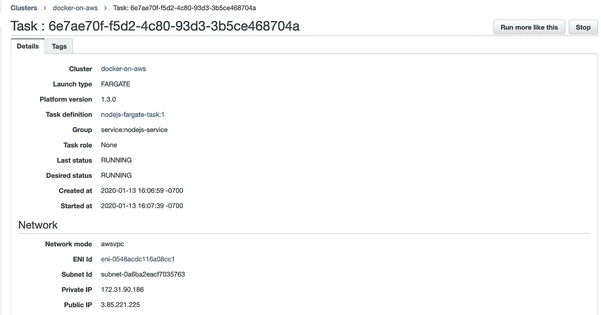

在浏览器中粘贴 IP 地址，就可以看到节点应用。

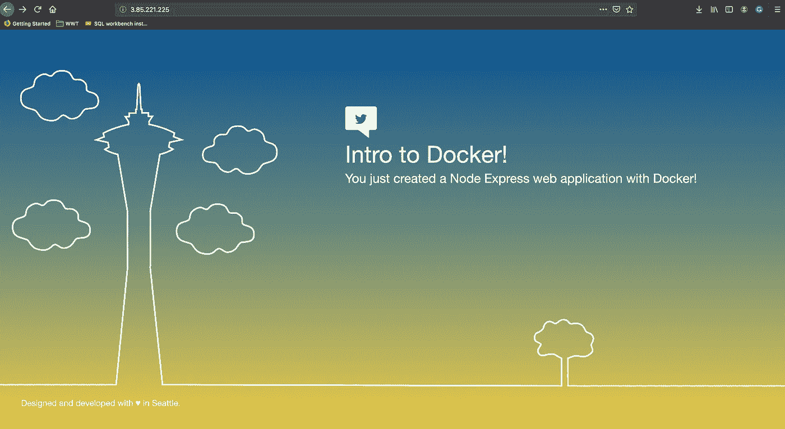

嘭！我们有一个简单的节点应用程序运行在由 Fargate 支持的 Amazon ECS 集群中。

如果你不想使用 AWS，只想学习如何使用 Docker，看看我上一篇[博客](https://medium.com/@awsmeetupgroup/tutorial-docker-and-node-js-2d7fde6eb38b)

此外，我在这里附加了一些链接，以获得更多可以用于其他应用程序的任务定义示例。

[https://docs . AWS . Amazon . com/AmazonECS/latest/developer guide/example _ task _ definitions . html](https://docs.aws.amazon.com/AmazonECS/latest/developerguide/example_task_definitions.html)

[https://github . com/AWS-samples/AWS-containers-task-definitions/blob/master/](https://github.com/aws-samples/aws-containers-task-definitions/blob/master/)