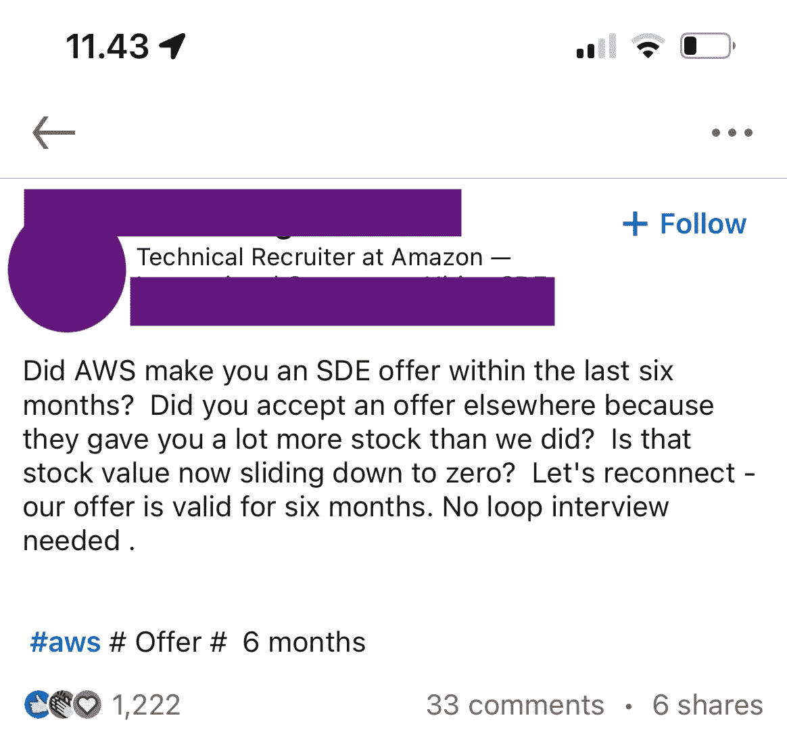

# AWS 在追工程师

> 原文：<https://levelup.gitconnected.com/aws-is-chasing-engineers-afedbe05a0de>

[约翰·托马斯](https://unsplash.com/@capturelight?utm_source=medium&utm_medium=referral)在 [Unsplash](https://unsplash.com?utm_source=medium&utm_medium=referral) 上拍照

2021 年 8 月，我经历了职业生涯中最糟糕的时刻:长达 18 个月的拒绝期。那时我获得了我的第一个 AWS 认证。

那是在安迪·贾西(当时是 AWS 的首席执行官)接替杰夫·贝索斯成为亚马逊首席执行官之后不久。

就在那时，我决定申请亚马逊 AWS 架构师职位。在准备过程中，我学到了高级开发人员工作角色的许多方面。

我坚持不懈地做问答笔记。首先，有星形格式的问题(受 [16 条亚马逊领导原则](https://www.amazon.jobs/en/landing_pages/in-person-interview)的启发)。也有一些非明星问题(例如*告诉我关于你自己的情况*)。

所有这些都要求我以高度批判的态度研究组织行为的原则。

我的分析使我能够写一本关于如何应对高级开发人员面试的电子书，旨在帮助 famg+有志者。(该链接包括对接下来的 30 个中等读者的 50%折扣)。

# 亚马逊 AWS 面试流程:

在我申请的时候，一个 AWS 架构师职位需要参加欧盟职位的以下几轮面试:

## **技术分析评估(60-120 分钟):**

这一轮由第三方平台处理，包括它在内的一切都是自动化的。评估分为两个部分。

**第一部分:**

第一部分有围绕阅读理解、问题分析、优先级的选择题。

一个典型而流行的问题是:

> 给定 Bob、Peter、Alice 和 Johanna 的快递递送时间表，告诉我们谁的效率最高，谁必须休息。

这些问题是多项选择，可能有不止一个正确答案。

另一个示例问题也可能涉及一种情况和 5 种可能的解决方案(A、B、C、D、E)。您必须选择应用 5 个解决方案中的 3 个的顺序。你选择的优先级也是一个考虑因素，所以 B、C 和 D 可能是正确的答案，而 C、D 和 B 可能是错误的。

这些问题很简单，但是和时间赛跑有时会给应试者带来压力。

**第二部分:**

这些又是选择题。内容基于你申请的 AWS 角色。问题内容将依赖于相关的 AWS 认证考试。(解决方案架构师与解决方案助理等)

最好的准备来源是工作描述，其中可能会提到证书。你必须涵盖整个认证大纲。

## 循环面试:

我犯了一个错误，花了太多时间准备循环面试，并对上一轮过于自信。结果是我在第一轮就被淘汰了。

我可怕的循环面试至少持续 4 个多小时，由 AWS 面试官主持。它包含基于场景的问题，这些问题必须以著名的 STAR(情境、任务、行动、解决方案)格式来回答。对于真正优秀的候选人来说，它也需要更长的时间来遏制臭名昭著的酒吧筹款活动。作为其中的一部分，候选人会不断地被问到一些引发压力的问题，以评估他/她的沉着和应对客户的能力。

最后但同样重要的是，根据我的在线研究，循环面试不仅仅包含行为问题。它包含至少一个涵盖 AWS 技术的技术回合，具体取决于职位。

# AWS 在招聘工程师方面已经很糟糕了:

我上面提到的 AWS 拒绝是我的第二次。我不高兴，不是因为我被拒绝了两次，而是因为我没有收到评估的反馈。

在我完成评估后，我对清除它很有信心。然而，我没有听到招聘小组的任何消息。我起初以为他们有很多选择，但事实并非如此。该职位全年都在 LinkedIn 上保持空缺。我所在的地方没有多少 AWS 专业人士认为竞争很激烈。

> 原来我一直在用头撞机器人。

我也认为我不可能达到最低标准。但在没有任何反馈/评级的情况下，这只是一个假设。

当我跟进评估中提到的一封电子邮件时，没有收到任何回复。

然后，我找了一个 AWS 的家伙，他去年给了我一些模糊的反馈。令我惊讶的是，他在南非工作，而不是在欧盟。我给他发了一封跟进邮件。他很幸运地回来了，但他不知道我的申请。

几天后，他能够从负责人(或者一台电脑，可能是？我不知道)。不管怎样，这是个坏消息。不是我太在意，但如果能知道我还差多少就好了。我没有得到更多的信息。

我写了最后一封跟进邮件，询问还要多久才能再次申请，但还是没有得到任何反馈。

原来我一直在用头撞机器人。招聘人员不再像对待顾客一样对待应聘者。

顾客至上到此为止。

# AWS 正在追逐工程师(但他们并不热衷):

最近，我在 LinkedIn 上看到一个帖子，很多编程专业人士都不喜欢。

作者截图

为什么工程师不热衷于加入顶级科技巨头，拥有丰厚的薪水和丰厚的股票期权？

是不是 AWS 竞争力不够？

还是关于 AWS 内部工作氛围不好？

从我和 AWS 工作人员打交道的第一手经验来看，我认为是后者。亚马逊可能会让他们保持警惕，就像网飞一样。然而，就网飞而言，竞争是技术性的。就亚马逊而言，这是销售类工作的压力。换句话说，亚马逊雇佣工程师，但像对待销售人员一样对待他们。

我经常观察到 AWS 的工作人员在**非常响应**(就像亚马逊零售客户服务一样)，但是响应的质量相当低——由于底层服务的技术性质。

围绕领导原则的晦涩难懂使他们成为频繁的响应者，这经常导致客户不满，因为技术客户期望不同于零售客户的服务质量。

> 亚马逊雇佣工程师，但像对待销售人员一样对待他们

一个典型的 AWS 人员通常像客户服务专家一样工作。在 9/10 的情况下，这持续伤害一个人的自尊。人们经常面临一个两难的境地:

*   如果我不回应，我的案例会自动升级
*   如果我以中间状态(*案例进行中*)回应，而客户斥责我的回应，我的平均反馈会下降。

我以为我是一个孤立的顾客从外表推断出这一点。我也认为这仅限于 AWS。但这两点我都错了。

> 亚马逊倦怠背后的主要因素是密集的数据驱动型管理

这篇彭博的文章(发表于 2022 年)提到亚马逊员工流失率为 50%。由于激烈的竞争，员工不断感到威胁。

关于[亚马逊倦怠的恐怖故事可以追溯到 2014 年](https://www.google.com/search?q=amazon+engineer+burnout)，至少在我的谷歌搜索结果中是这样的。我能找到的最早的可信来源是 Slate 的这篇文章，其中详细解释了亚马逊工程师倦怠背后的原因。其背后的主要因素是密集的数据驱动型管理(频繁的基于评级的员工评估)，这种管理存在巨大的误差，并且没有人的角度。

如果你知道亚马逊零售业的情况，这也是剥削小规模亚马逊卖家的相同因素。一些负面评价可能会让一个人的整个亚马逊店面和财务前景处于危险之中。

# 结论:

亚马逊是地球上最赚钱的公司之一。它吹嘘拥有万亿美元的市值。

然而，它不是这一类别中的唯一一个。苹果、微软、Alphabet 和特斯拉也经历过。没有一家公司像亚马逊一样，在工作满意度方面受到如此多的批评。

是时候亚马逊把 16 条领导原则中的 14 条扔出窗外，只关注两条:

*   努力成为地球上最好的雇主
*   成功和规模带来广泛的责任

用心去做，而不是文件。

[**笔磁铁**](https://tipsnguts.medium.com/) 热门资深开发者访谈电子书的作者:

[**高级开发者面试综合方法(40+例题)**](https://tipsnguts.gumroad.com/l/crrzat/zp1vks8) (对于接下来的 **30 个中等读者，**折扣为 **50%** )