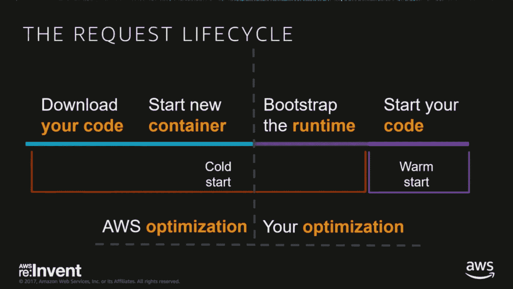
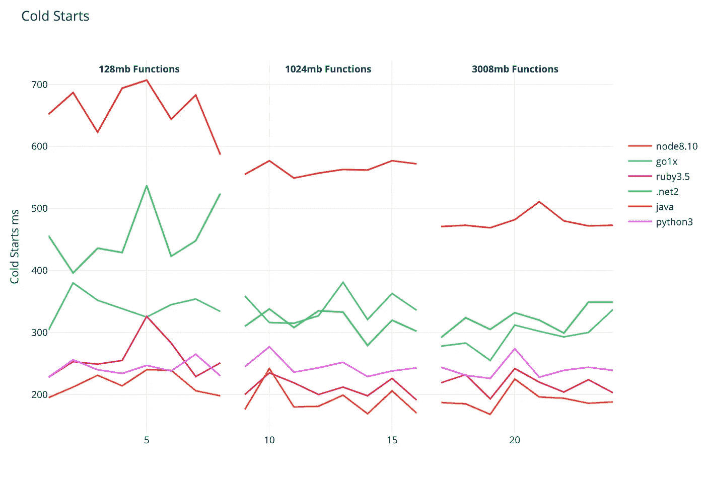
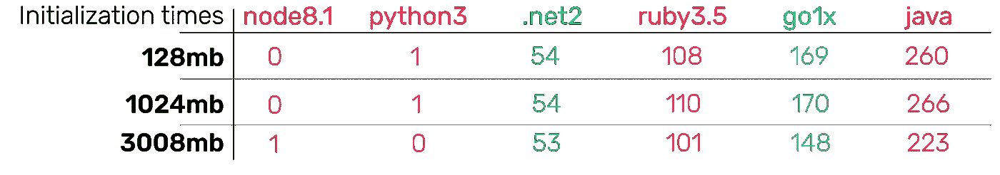
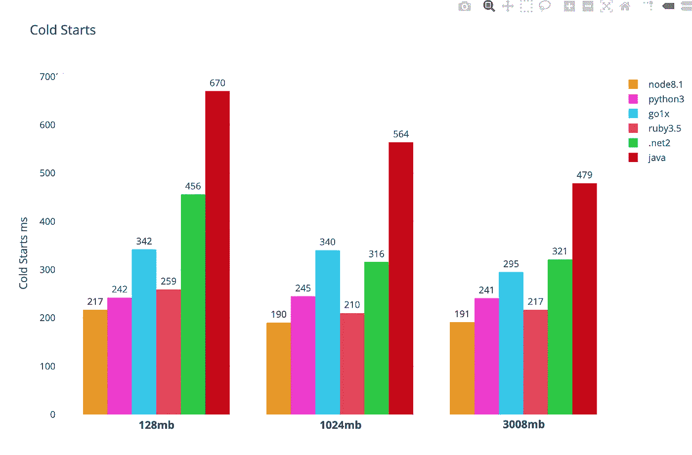
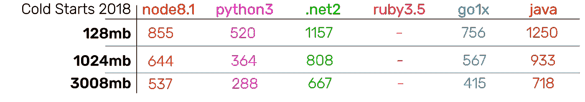
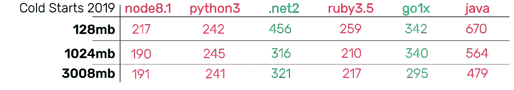
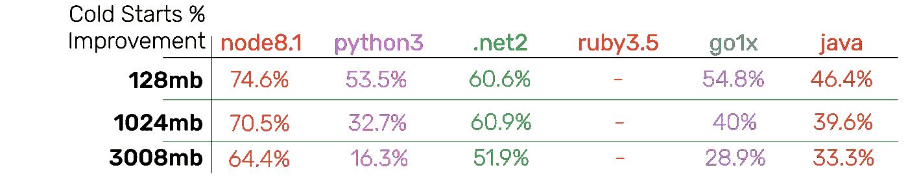

# 自动气象站 Lambda 冷启动语言对比，2019 年版☃️

> 原文：<https://levelup.gitconnected.com/aws-lambda-cold-start-language-comparisons-2019-edition-%EF%B8%8F-1946d32a0244>

约书亚·厄尔在 [Unsplash](https://unsplash.com/search/photos/comparison?utm_source=unsplash&utm_medium=referral&utm_content=creditCopyText) 上的照片

现在是 2019 年，世界是一个不断变化的地方，但其中最大的问题是，自 2018 年以来，兰姆达斯的表现有什么变化？我再次在这里比较 AWS 平台上各竞争语言的冷启动时间。随着最近**红宝石**的加入，结合 2018 年的结果，这应该是一个有趣的分析！[见我 2018 年 4 月语言对比。在不破坏结果的情况下，AWS 团队做出的改进令人兴奋。](https://medium.com/@nathan.malishev/lambda-cold-starts-language-comparison-️-a4f4b5f16a62)

## **冷启动？**

无服务器计算的世界要求功能按需运行，不需要时就扔掉。所有这些仅在需要时运行功能的效率导致了一种称为**冷启动**的现象。

[常规冷启动](https://youtu.be/oQFORsso2go?t=8m5s)(截图自视频)

一次**冷启动**是你的代码在一段时间内(5-25 分钟)第一次被执行。这意味着它需要被下载、装箱、启动并准备运行。此外，这一过程会显著增加延迟，性能会降低 20 到 60 倍。**冷启动的长度取决于几个变量**、语言/运行时间、专用于函数的资源量(MB)&运行函数所需的包/依赖项。

**冷启动时间很重要**,尽管这是一种边缘情况。[每当你遭遇流量高峰](https://theburningmonk.com/2018/01/im-afraid-youre-thinking-about-aws-lambda-cold-starts-all-wrong/)，ever lambda function 就面临着潜在的冷启动！欲了解更多信息，请查看[之前的帖子](https://medium.com/free-code-camp/lambda-vpc-cold-starts-a-latency-killer-5408323278dd)，该帖子进一步解释了冷启动。

## 方法学

我测试了以下语言:Go 1.x，Node.js 8.10，Java 8，Ruby 2.5，Python 3.6 &。netcore 2.1。我为每种语言分别创建了三个函数。该函数除了发出“hello world”之外什么也没做。每种语言都有一个功能，分配给 128 兆、1024 兆和 3008 兆的内存。然后我创建了一个[阶跃函数](https://aws.amazon.com/step-functions/)，来触发所有 18 个函数。我定期手动收集来自 [AWS x 射线](https://aws.amazon.com/xray/)的结果。

## 结果

我收集了冷启动时间和 AWS x 射线引入的一个新变量`initialisation`，它测量环境设置时间。

下面是冷启动图，分为三个部分:在 128mb、1024mb 和 3008mb 内存下运行的功能。

冷启动时间，128mb、1024mb 和 3008mb 分别起作用—毫秒[*交互图形*](https://plot.ly/~nathanmalishev/7/#/)

2018 年出现了同样的总体趋势，增加分配给每种语言的资源会减少启动时间，编译的语言会更慢。
但令人惊讶的是，与 2018 年不同的是 **NodeJs 是大赢家**，Ruby 和 Python 略微落后。2018 年 python 占主导地位，我认为这是因为 Lambda 本身运行在 Python 环境中。这给 python 带来了巨大的优势，因为启动时不需要运行时。有趣的是看到其他运行时得到了优化，以至于它们可以与 Python 竞争。

由 AWS x 射线提供的平均初始化时间—毫秒

以上是每种语言运行时的平均初始化时间。再次有趣的是看到 NodeJS 与 python 在同一水平上竞争，可能 AWS 团队已经为 NodeJS 函数建立了一个单独的优化函数处理程序？

平均冷启动时间—毫秒[*交互图*](https://plot.ly/~nathanmalishev/10/#/)

平均冷启动时间可视化，有助于说明大多数语言现在表现强劲。与 2018 年不同，他们似乎也更加独立于分配给他们的记忆。除了 Java & .Net，我想知道这是否意味着 AWS 的工程团队正在达到无服务器效率的上限。

如果我在 2020 年重新进行这些实验，会发生什么？我们会看到更显著的进步吗？

*2018 年结果*2018 年平均冷启动—毫秒* 2018 年结果*

平均冷启动 2019 —毫秒

过去 16 个月的改善是最令人震惊的发现。随着冷启动变得相当便宜和无后果，全面有了巨大的改进。

> NodeJS 现在是性能最好的语言，仅用了 16 个月就提高了 74.6%或 638 毫秒。

相对于前一年相同领域的冷启动时间改进

这确实是对 AWS 工程团队的证明。他们不仅创造了伟大的产品，而且不会忘记这些产品。**我很期待看到这些效率能发挥到什么程度！**

## 温暖的功能

最后，我想留下一些关于热函数的统计数据。通过这种方式，我们可以了解 lambda 函数在大多数情况下的执行速度。

热启动—毫秒

当 lambda 函数被适当加热时，不管是哪种语言，它都是非常高效的！

## 进一步阅读

 [## 拉姆达冷启动，语言对比🕵 ❄️ (2018)

### 走向无服务器比以往任何时候都更有利可图，但无服务器的警告总是越来越多。避免冷启动…

levelup.gitconnected.com](/lambda-cold-starts-language-comparison-️-a4f4b5f16a62)  [## AWS Lambda 和 VPC 冷启动—🕶⛈的黑暗面

### 所有无服务器计算都遭受可怕的“冷启动”，AWS Lambda 也不例外。我探索过寒冷…

levelup.gitconnected.com](/lambda-vpc-cold-starts-a-latency-killer-5408323278dd)