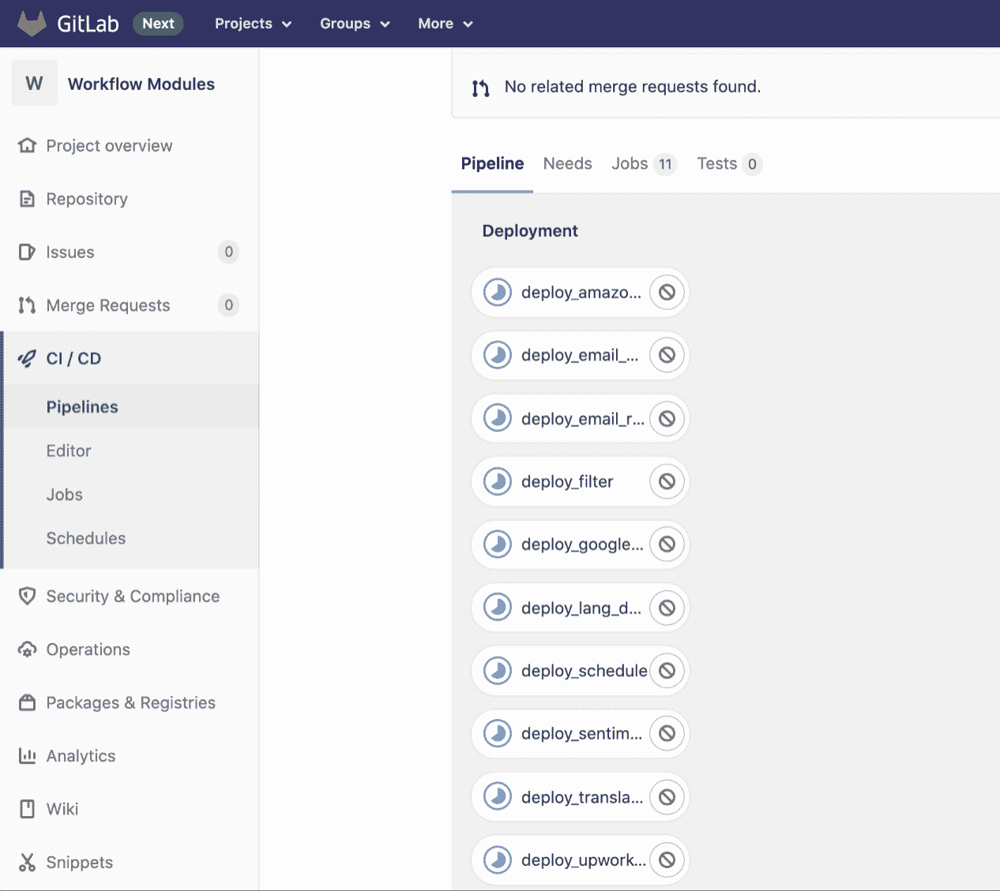

# 一个存储库，多个 AWS Lambda 函数:使用 GitLab CI 的条件部署

> 原文：<https://levelup.gitconnected.com/aws-lambda-in-production-deploy-a-monorepo-with-gitlab-ci-4ecc84f89263>

在 [textcloud](https://www.textcloud.co) ，我们在 AWS Lambda 上运行[我们的工作流自动化平台](https://www.textcloud.co)的核心。这使我们能够为客户提供快速可靠的体验。无论用户是每周运行一次简单的工作流，还是需要对数千个 Airtable 行进行情感分析，我们的基础设施都需要具有极高的可伸缩性。

我们将所有 Lambda 函数的代码存储在一个存储库中。尽管 monorepo 非常适合所有函数共享大量代码的用例，但当涉及到我们的 CI/CD 管道时，它也有缺点:**我们只想构建和部署在提交中发生变化的函数，而不是所有的函数*。****本文展示了我们是如何解决这个问题的。*

*如果你对这个话题感兴趣，你可以在这里找到我的一些其他文章:*

*   *[第 1 部分:通过 GitLab CI 部署 AWS Lambda Python 函数](https://gntrm.medium.com/aws-lambda-in-production-deploy-python-functions-through-gitlab-ci-9c4aa1392600)*
*   *[用 Python 和 boto3 编程调度 Lambda 函数](https://gntrm.medium.com/schedule-your-lambda-functions-with-boto3-cron-e7ee4efc887)*
*   *[用 idea+Airtable+AWS Lambda 建立一个电子邮件列表](https://gntrm.medium.com/goodbye-php-goodbye-mailchimp-how-to-build-a-simple-email-list-directly-from-your-landing-page-fcb776ce7085)*

**

*[马里奥·高](https://unsplash.com/@mariogogh?utm_source=medium&utm_medium=referral)在 [Unsplash](https://unsplash.com?utm_source=medium&utm_medium=referral) 上拍摄的照片*

# *目标是:只部署已经改变的项目*

*这篇短文解释了如何为带有几个子项目的单个存储库配置 GitLab CI。我们的目标是只为提交中已经更改的子项目运行构建/部署管道，而忽略其余的。*

*另一个要求是每个子项目作为不同的作业运行。这为我们提供了更好的控制，并允许我们仅手动触发某些部署。它还加快了速度，因为所有部署都可以并行运行。*

*正如我前面提到的，本文[建立在我之前关于从 GitLab CI](https://gntrm.medium.com/aws-lambda-in-production-deploy-python-functions-through-gitlab-ci-9c4aa1392600) 部署无服务器功能的教程之上，所以我不会详细讨论实际的部署代码。*

# *分步操作:编写 GitLab CI 配置*

## *有什么变化？*

*首先，我们需要获得在当前提交中已经更改的所有文件的列表。我们可以使用以下命令来实现这一点:*

*`git diff-tree --no-commit-id --compact-summary --name-only -r $CI_COMMIT_SHORT_SHA`*

*输出看起来有点像这样:*

```
*lang_detection/poetry.lock
schedule/poetry.lock
sentiment/package.json
template/{{ cookiecutter.project_slug }}/serverless.yml
translation/poetry.lock*
```

*我们实际上并不关心有什么样的变化(添加/删除/修改)，任何变化都应该触发新的部署。*

*下一步是提取每个项目的根文件夹。我们可以通过将输出管道化到 grep: `grep -oE "^\\w+"`来做到这一点。*

*这为我们提供了所有已更改文件夹的列表。但是，我们仍然要清理一下，以消除重复:`sort | uniq`*

*总结起来，以下命令为我们提供了包含变更的所有根文件夹的名称:*

*`git diff-tree --no-commit-id --compact-summary --name-only -r $CI_COMMIT_SHORT_SHA | grep -oE "^\\w+" | sort | uniq`*

## *GitLab CI 中的继承*

*现在让我们进入 GitLab 配置文件:我们的策略是为部署创建一个常规作业，另外为每个项目创建一个作业。每个项目作业都应该从部署作业继承脚本，同时指定其根目录的名称。*

*我们的部署函数可以是这样的:*

*让我解释一下步骤:*

1.  *首先，我们列出所有已更改的文件夹。*
2.  *然后我们检查当前目录是否是这个列表的一部分。*
3.  *我们将部署脚本封装到一个 if 语句中，并运行部署，在本例中:`cd $CURRENT_PROJECT && sls plugin install -n serverless-python-requirements && sls deploy`*

*对于每个文件夹，我们可以定义一个更小的作业:*

```
*deploy_sentiment:
  extends: .deploy
  variables:
    CURRENT_PROJECT: sentiment*
```

*在这个例子中，项目文件夹被称为“情绪”,它包含我们用于情绪分析的 Lambda 函数。我们从`.deploy`函数继承代码，并设置一个变量来指定我们想要检查的文件夹。*

*如果我们现在向 GitLab 推送新的变更，它将运行`deploy_sentiment`作业，检查变更列表，然后决定是否部署。*

*但是这个作业定义看起来还是有点多余:我们已经在作业标题中有了文件夹的名称，为什么还需要再次将其设置为变量呢？幸运的是，部署脚本中有一个`$CI_JOB_NAME`变量！*

*我们简单地添加步骤`export CURRENT_PROJECT=$(echo $CI_JOB_NAME | sed 's/deploy_//g')`来从作业名中去掉前缀`deploy_`并获得目录名。*

**

# *最终 GitLab 配置项配置*

*编码快乐！或者，如果 AWS 已经让您落泪，[看看 textcloud，看看工作流自动化+自然语言处理](https://www.textcloud.co/)如何通过自动化复杂的工作来帮助您的公司节省时间和资金:)*

*如果您在让 AWS Lambda 与 GitLab CI 一起工作时遇到问题，请随时联系我！*