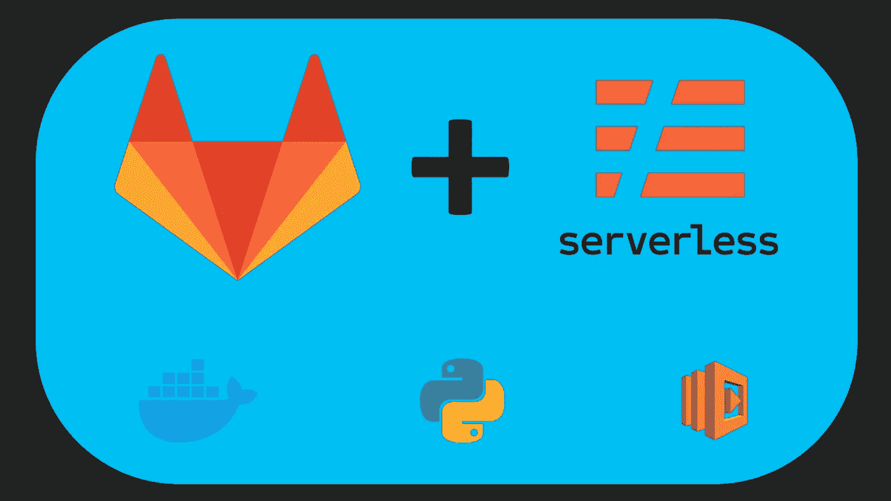

# 通过 GitLab CI 部署 AWS Lambda Python 函数

> 原文：<https://levelup.gitconnected.com/aws-lambda-in-production-deploy-python-functions-through-gitlab-ci-9c4aa1392600>

这是我关于如何在 [textcloud](https://www.textcloud.co) 管理我们的 AWS Lambda 函数系列的另一部分。尽管无服务器范例很棒，但是在处理复杂的项目时，还是会陷入重重陷阱。在本文中，我将详细介绍如何在 GitLab CI 上构建一个 dockerized Python Lambda 函数，以便在我们向存储库推送新的更改时自动部署。

我知道，这听起来应该非常简单，不值得再写一篇文章，但是请耐心听我说:我花了两天时间才做好，我非常愿意分享我的见解，这样你就不必陷入这个兔子洞了。

如果你喜欢这个话题，你可以在这里找到我的其他一些文章:

*   [第 2 部分:用 GitLab CI 部署所有 Lambda 函数的 mono repo](https://gntrm.medium.com/aws-lambda-in-production-deploy-a-monorepo-with-gitlab-ci-4ecc84f89263)
*   [用 Python 和 boto3 编程调度 Lambda 函数](https://gntrm.medium.com/schedule-your-lambda-functions-with-boto3-cron-e7ee4efc887)
*   [用 idea+Airtable+AWS Lambda](https://gntrm.medium.com/goodbye-php-goodbye-mailchimp-how-to-build-a-simple-email-list-directly-from-your-landing-page-fcb776ce7085)建立一个邮件列表

# 目标:Python Lambda 函数的 CI

我们的目标是当我们将新代码推送到 GitLab 存储库的某个分支时，自动部署 AWS Lambda 函数，例如,`develop`或`master`分支。

我们使用[神奇的无服务器工具](https://www.serverless.com/)进行部署，旁边还有`serverless-python-requirements`插件。后者是捆绑我们的 Python 需求所需要的。我们还配置了插件，在一个特殊的 Docker 容器中构建 Python 环境，以确保与 AWS 环境的兼容性。简而言之，一旦你需要编译你的一些需求(我看着你呢，NumPy)，你就需要这个了。

作为旁注，我们也依赖多普勒来管理我们的环境变量。我强烈推荐使用它们，但是当然，您也可以依赖 GitLab 向构建上下文提供您的 env 变量。

如果关键字'**无服务器插件**'和'**构建在一个特殊的 Docker 容器**中，对你来说是一个危险信号，那么你正处在崩溃到来的正确轨道上。

# 分步:使用无服务器从 GitLab CI 部署 AWS Lambda

## 在 GitLab CI 上运行无服务器

我们开始吧！首先，我们需要能够在 GitLab CI 中运行无服务器工具。幸运的是，[有一个 Docker 映像](https://hub.docker.com/r/amaysim/serverless)，我们可以在 GitLab 中直接使用它来运行我们的命令。

我们进展到什么程度了？最初的`.gitlabci.yml`大概是这样的:

啊，第一条错误信息出现了:

`Serverless plugin "serverless-python-requirements" not found. Make sure it's installed and listed in the "plugins" section of your serverless config file.`

好了，让我们安装它，然后继续:

`sls plugin install -n serverless-python-requirements`

下一个错误出现了:

`serverless "TypeError: Os.tmpDir is not a function"`

什么？这到底是怎么回事？这与另一个我们甚至不需要的无服务器插件有关(`serverless-offline-python`)。

我不想告诉你那些血淋淋的细节。我们做了以下工作来最终让它运行起来:

*   从`serverless.yml`上移除`serverless-offline-python`插件
*   删除我们之前检入的`package.json`和`yarn.lock`文件。无服务器通过 NPM 安装插件，这就是文件的来源。

最后，我们安装了插件，万岁！

## 可选:安装多普勒 CLI

Doppler 是一项服务，允许您在一个位置管理您的秘密，并授予对它们的细粒度访问权限。换句话说，我们将配置这个项目所需的所有环境变量都存储在 Doppler 中，只需要将`DOPPLER_TOKEN` env var 添加到 GitLab 中就可以加载它们了。所有能够访问环境变量的命令都必须通过`doppler run -- mycommand`运行。

如果不用多普勒，就跳过那些部分。

这是我们的`.gitlabci.yml`现在的样子:

## 为无服务器配置 AWS 凭据

我们需要无服务器能够代表我们在 AWS 上运行命令，所以让我们配置它:

`doppler run --command "serverless config credentials --provider aws --key \\$AWS_ACCESS_KEY_ID --secret \\$AWS_SECRET_ACCESS_KEY"`

如果不使用多普勒，命令应该是这样的:

`sls config credentials --provider aws --key $AWS_ACCESS_KEY_ID --secret $AWS_SECRET_ACCESS_KEY`，鉴于你在 GitLab 内设置了`AWS_ACCESS_KEY_ID`和`AWS_SECRET_ACCESS_KEY`。

## 正确设置 Python

对于其他设置，这一步可能是可选的，但我们在 textcloud 使用诗歌作为我们的 Python 包管理器。无服务器 Python 插件与 poem 完全兼容，但是需要安装它来打包项目以便部署。这很糟糕，但可以通过安装 Python 和诗歌轻松解决:

## 是时候让 Docker 恢复正常了

现在，几个小时过去了，我们还远没有完成。下一个弹出的错误信息是:`docker: command not found`

啊，对了，我们需要 Docker 以 AWS 兼容的方式打包我们的 Python 项目。让我们安装它，并在 GitLab 中添加一个 Docker-in-Docker 服务:`apk add docker`和`services: ['docker:dind']`应该就可以了。

除了当他们不:`Cannot connect to the Docker daemon at unix:///var/run/docker.sock`

再说一遍，我不想浪费你沮丧的时间，直接跳到解决方案。GitLab 论坛中有很长的线程，但是我们必须告诉 Docker 客户端使用在自己机器之外运行的 Docker 安装。此外，我们需要添加一些其他配置，即使在今天，我还没有完全弄清楚。

现在它应该运行了！但事实并非如此。我仍然不确定这一步是否绝对必要，但我们必须确保容器中的 Docker 客户机与 Docker-in-Docker 服务中的客户机版本相同。为了适应未来，我们必须修正版本。

# 我们终于到了！

有了这些小怪癖，它终于工作了:我们从 Doppler 加载了我们的秘密，我们成功地正确安装了无服务器插件，我们安装了 Python 和 poems，正确使用了 Docker，并登录到 AWS。是时候开一瓶啤酒，到此为止了！

这是我们的最终配置:

编码快乐！或者如果 AWS 已经让你落泪，[看看 textcloud，看看工作流自动化+自然语言处理](https://www.textcloud.co/)如何通过自动化复杂的工作来帮助你的公司节省时间和金钱:)

如果您在让 AWS Lambda 与 GitLab CI 一起工作时遇到问题，请随时联系我！