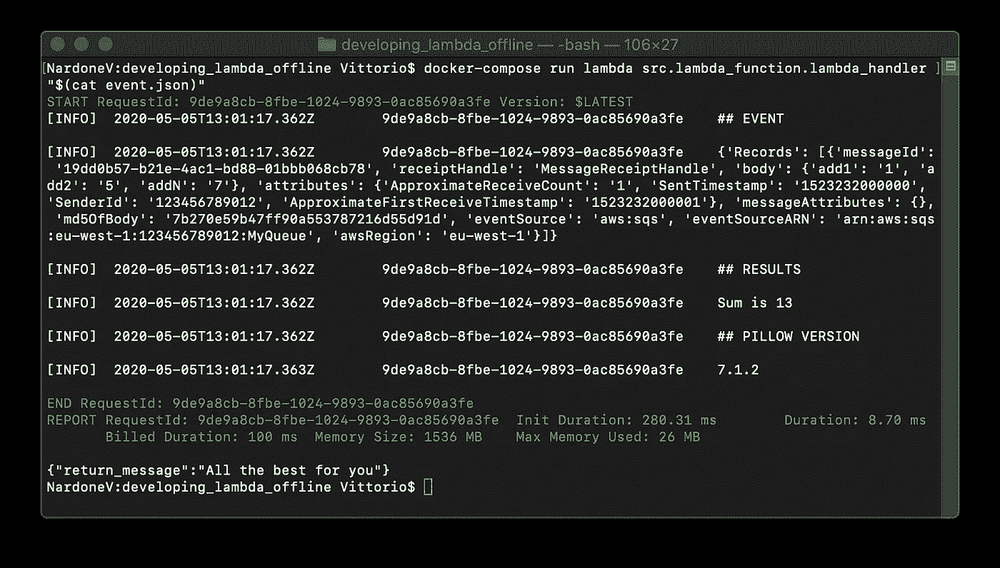

# 用 Docker 进行 AWS Lambda 离线开发

> 原文：<https://levelup.gitconnected.com/aws-lambda-offline-development-with-docker-6a8cf8b186e7>


我从事的项目越来越面向无服务器**范式**，并且越来越多地在 AWS Lambda 平台上实现。能够在您最喜欢的 IDE 中轻松地离线开发 AWS Lambda 函数，而不必上传代码来测试它，可以显著加快活动速度并提高效率。

# docker 中的 AWS Lambda 环境

没错！**允许我们在离线模式下开发 AWS Lambda 代码的解决方案****是** **使用 docker 镜像**，它以与 AWS 实时环境几乎相同的方式复制。DockerHub 上提供的 [docker 映像](https://hub.docker.com/r/lambci/lambda/)构成了一个沙箱，在其中执行其功能，确保找到相同的库、文件结构和相关权限、环境变量以及生产上下文。太棒了。

Lambda 函数很少“独立于”其他资源:它经常需要访问存储在 S3 桶中的对象，在 SQS 上排队消息，或者访问 DynamoDB 表。这个解决方案的有趣之处在于能够离线开发和测试代码，但是只需在环境变量中指定一对 AWS 访问键，就可以与真正的 AWS 服务和资源进行交互。

[lambda ci 项目](https://github.com/lambci/docker-lambda)被频繁地更新和很好地文档化:它包括几个运行时环境，比如 Python，我们将在接下来的段落中使用它。

我用于开发的基本环境在这个库中[可用。](https://github.com/vittorio-nardone/aws-lambda-offline-development)

# 样本函数

假设我们正在处理一个简单的 Python 函数，它处理 SQS 消息，并且使用一个通常不安装在 AWS Lambda Python 环境中的包。示例代码如下。

首先，Logger 对象被实例化:我们将使用它来跟踪 SQS 事件。消息正文中预见到了加数，结果将在日志中报告。我们还将跟踪 PILLOW 包的版本，通常在 AWS Lambda 环境中默认不安装，以验证附加包的安装是否成功。最后，在函数执行结束时，返回一个示例文本消息(“祝您一切顺利”)。

**现在让我们看看如何在 Docker 容器内执行 Lambda 函数**。

# Dockerfile 和 Docker-Compose

首先，我们需要考虑如何安装额外的 Python 包，在我们的示例 PILLOW 中。我们基于***λ/λ:python 3.6***图像使用***Docker 文件*** 创建新的 Docker 图像。让我们安装文件***requirements . txt***中指定的所有附加包

最后，通过一个***docker-compose . yml***文件，我们定义了一个用于离线调试的 **lambda** 服务。目的是映射源代码的主机目录，并设置 **PYTHONPATH** 使用***/var/task/lib***中的附加包

作为第一个测试，只需启动 docker-compose 运行我们的 Lambda 函数，传递处理程序。

```
docker-compose run lambda src.lambda_function.lambda_handler
```

# 事件

我们的函数期望处理一个 SQS 事件。怎么发？首先我们需要获得一个测试 JSON，并将其保存在一个文件中(例如 ***event.json*** )。让我们在 docker-compose 命令行中指定它。

```
docker-compose run lambda \
               src.lambda_function.lambda_handler \
               **"$(cat event.json)"**
```

让我们检查执行结果。



完美！我们的功能执行正确，结果与预期相符。**启动 Docker 容器对应于 AWS Lambda 冷启动**。让我们来看看如何让容器保持活动状态，以便多次调用该函数。

# 继续跑

或者，您可以启动并保持 Lambda 函数的容器运行:您可以快速地进行几次连续调用，而无需等待“冷启动”时间。在这种模式下，会启动一个 API 服务器，默认情况下它会响应端口 9001。

```
docker-compose run **-e DOCKER_LAMBDA_STAY_OPEN=1** \
                   -p 9001:9001 lambda \
                   src.lambda_function.lambda_handler
```

我们将使用例如*来调用我们的函数。*

```
*curl --data-binary "@event.json" \
   [http://localhost:9001/2015-03-31/functions/myfunction/invocations](http://localhost:9001/2015-03-31/functions/myfunction/invocations)*
```

*Lambda 函数的默认处理程序响应 this 端点。 ***data-binary*** 参数允许发送 JSON 文件的内容，采样 SQS 事件。*

# *结论*

*我在这个 GitHub 库中收集了重新创建 Docker 环境所需的文件[，我使用这些文件在 Python 中离线开发和调试 AWS Lambda 函数。为了方便起见，我在一个***Makefile****中收集了最频繁的操作。*](https://github.com/vittorio-nardone/aws-lambda-offline-development)*

*****make lambda-build***命令实现该功能的部署包，包括附加包。**

**下面是一个用 **CloudFormation** 部署 Lambda 函数的例子。**

*****Makefile*** 中可用的其他命令有:**

```
**## create Docker image with requirements 
make docker-build## run "src.lambda_function.lambda_handler" with docker-compose 
## mapping "./tmp" and "./src" folders. 
## "event.json" file is loaded and provided to function 
make lambda-run## run API server on port 9001
make lambda-stay-open**
```

**我们玩得开心吗？下次见！**

***原载于 2020 年 5 月 12 日*[*https://www . vittorionardone . it*](https://www.vittorionardone.it/en/2020/05/12/aws-lambda-offline-development-with-docker/)*。***