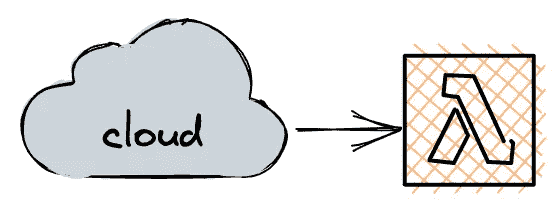
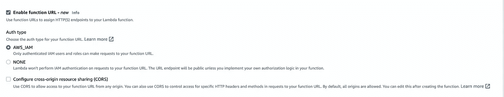
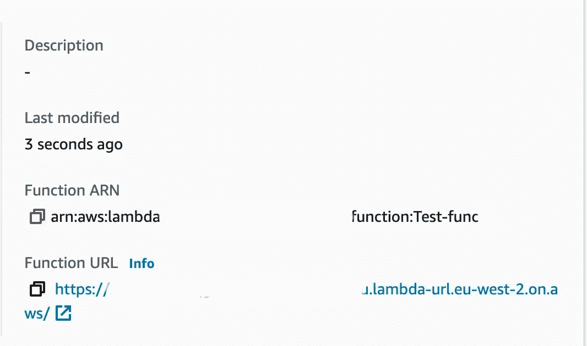

# AWS Lambda 函数 URL

> 原文：<https://levelup.gitconnected.com/aws-lambda-url-72d4a1c40c1f>



AWS 宣布了 Lambda 的一个新特性，Lambda 函数 URL。下面是它们是什么、它们如何工作以及创建它们的两种方法的简要介绍。

## 什么是 Lambda 函数 URL

以前，如果您想通过 HTTP 端点公开 Lambda，您通常会使用完全托管的 API 网关服务，这一新功能将允许您拥有一个直接连接到您的 Lambda 函数的 HTTPS URL，从而省去 API 网关中间人。

一个很大的特点是价格。Lambda 函数 URL 是完全“免费”的。你只需要为调用和内存时间付费，就像普通的 Lambda 一样。这是相对于集成成本较高的 API Gateway 的一个优势。

然而，这并不意味着它们是 API Gateway 的直接替代品。相反，API Gateway 提供了更高级的功能，如 JWT/自定义授权者的能力、请求-响应验证和转换、使用计划、直接内置的 AWS 防火墙支持等。

## 它们是如何工作的

每个 URL 对于调用该函数最新版本的函数别名或函数 ARN 是唯一的。这允许您使用不同的 URL 部署一个功能的多个版本，以便进行测试和迭代开发。

处理请求很简单，通常在 Lambda 中使用的事件对象也填充了与 HTTP 请求相关的属性。例如，您可以从`requestContext`中提取方法。

```
const method = event.requestContext.http.method;
```

URL 上的任何查询参数都可以通过一个`queryStringParameters`属性来访问。

```
const queryParam = event.querySTringParameters.myParam
```

最后，您可以从`body`属性访问请求体。

```
const body = event.body;
```

## 1.通过 ClickOps 创建 Lambda URL

创建 Lambda 时，可以从 UI 启用函数 URL。
首先选择高级选项，然后选择`Enable function URL`。

这将显示一组新选项，您可以在其中查看身份验证设置并配置 CORS 选项。



您将会在函数选项的右侧看到一个新的函数 URL 参数。这是您的功能 URL。



您的代码现在可以通过 web 请求调用，而无需设置 APIGateway！

## 2.通过 Cloudformation 创建 Lambda URL

代替点击，我们可以使用 Cloudformation 来创建我们的 URL 可访问的 Lambda。Cloudformation 是 Amazon 的基础设施代码，允许您以编程方式创建“堆栈”并将它们部署到 AWS。

```
AWSTemplateFormatVersion: "2010-09-09"
Description: "Cloudformation template for Lambda"Resources:
  MattsLambda:
    Type: AWS::Lambda::Function
    Properties:
      Description: my lambda with a url
      FunctionName: MattsTestLambda
      Handler: index.handler
      MemorySize: 128
      Runtime: nodejs14.x
      Timeout: 5
      Role: {{ ADD YOUR ROLE ARN HERE }}
      Code:
        S3Bucket: mybucket
        S3Key: mycode.js
```

如果你以前创建过 Lambdas，你可能会认出上面的大多数字段。您会注意到，我们没有在属性中添加 Lambda 函数 URL 字段。这是因为 Lambda 函数 URL 是一种新的资源类型，而不是直接位于 Lambda 函数资源上的字段。

相反，要创建一个，我们需要添加一个额外的资源并引用回我们正在创建的 URL。

```
AWSTemplateFormatVersion: "2010-09-09"
Description: "Cloudformation template for Lambda"Resources:
  MyLambda:
    Type: AWS::Lambda::Function
    Properties:
      Description: my lambda with a url
      FunctionName: MattsTestLambda
      Handler: index.handler
      MemorySize: 128
      Runtime: nodejs14.x
      Timeout: 5
      Role: {{ ADD YOUR ROLE ARN HERE }}
      Code:
        S3Bucket: mybucket
        S3Key: mycode.js### Lets create the URL ###
  MattsLambdaURL:
    Type: AWS::Lambda::Url
    DependsOn: MyLambda
    Properties:
      AuthType: NONE
      TargetFunctionArn: !GetAtt MyLambda.Arn 
```

我们添加了一个类型为`Lambda::Url`的新资源。但是您应该注意的是，我们还添加了一个`DependsOn`属性。这个属性将确保 CloudFormation 不会部署 URL 资源，直到我们的 Lambda 函数被创建。这是因为它依赖于 can，你可以看到我们在最后一行引用了它。

在终端中运行以下命令将在 Cloudformation 中创建堆栈，然后创建 lambda 和 URL。

```
aws cloudformation create-stack --stack-name MyStackName --template-body file://my-file.yaml
```

或者，您可以通过 AWS 仪表板将堆栈直接上传到 Cloudformation。

这就是 AWS Lambda 函数 URL 的最新特性以及如何自己实现它们的快速概述。

**源代码:**[https://github . com/MattBidewell/snippets/tree/main/AWS/cloud formation/lambda](https://github.com/MattBidewell/snippets/tree/main/aws/cloudformation/lambda)

## 进一步阅读

**AWS 公告:**
https://AWS . Amazon . com/blogs/AWS/announcing-AWS-lambda-function-URLs-built-in-https-endpoints-for-single-function-micro services/

**Cloudformation Lambda 函数:** [https://docs . AWS . Amazon . com/AWS cloud formation/latest/user guide/AWS-resource-Lambda-Function . html](https://docs.aws.amazon.com/AWSCloudFormation/latest/UserGuide/aws-resource-lambda-function.html)

**cloud formation Lambda Url:** [https://docs . AWS . Amazon . com/AWS cloud formation/latest/user guide/AWS-resource-Lambda-Url . html](https://docs.aws.amazon.com/AWSCloudFormation/latest/UserGuide/aws-resource-lambda-url.html)

**亚马逊 API 网关
https://aws.amazon.com/api-gateway/[T21](https://aws.amazon.com/api-gateway/)**