# 使用 pymysql 的带有 RDS 的 AWS Lambda

> 原文：<https://levelup.gitconnected.com/aws-lambda-with-rds-using-pymysql-23ad3cde46c8>

在本教程中，我将向您展示如何创建一个 Lambda 函数，该函数使用 pymysql 库从 RDS 数据库中查询数据。

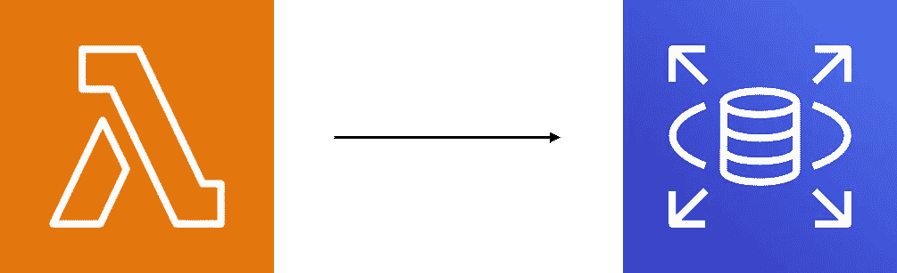

# 1.AWS 帐户设置

如果您已经有了 AWS 帐户设置，请直接跳到第 2 部分。如果你没有，你可以在这里注册一个账户。您将被要求输入付款细节，但注册时您可以获得 12 个月的免费层访问，本教程中的任何内容都不会超过免费层限制。

***注意:*** 如果您的帐户已经超出了免费等级的使用量，您可能需要为使用本教程中描述的 AWS 服务付费。如果保持多个 RDS 实例运行，将会超出可用层限制。

# 2.创建 RDS 实例

在 AWS 控制台中，从服务列表中选择 RDS。从 RDS 仪表板中选择“创建数据库”。我们将创建一个 MySQL 数据库，因此选择它作为引擎类型，您可以将版本保留为默认选项。

***注意:*** 创建数据库时，请确保在 AWS 控制台的右上角选择了所需的区域(通常是地理上离您最近的区域)。

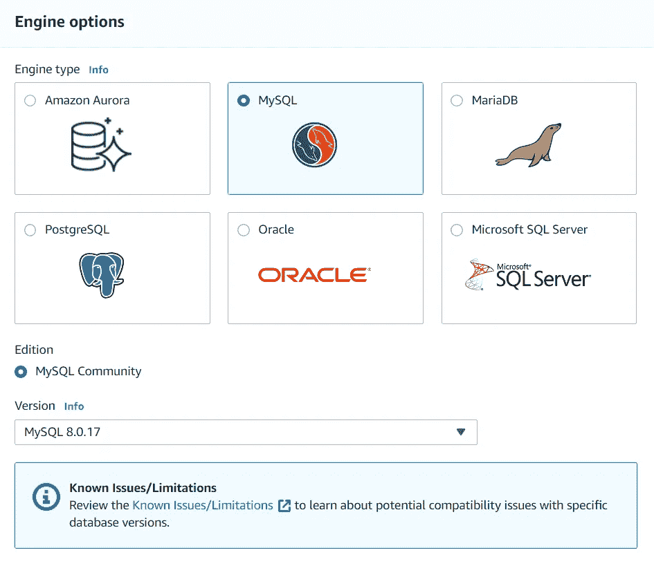

选择“自由层”作为模板。在 Settings 部分，您需要为您的 RDS 实例命名，并提供用于登录到您的实例的主用户名和密码。确保您记得用于设置 RDS 实例的用户名和密码。

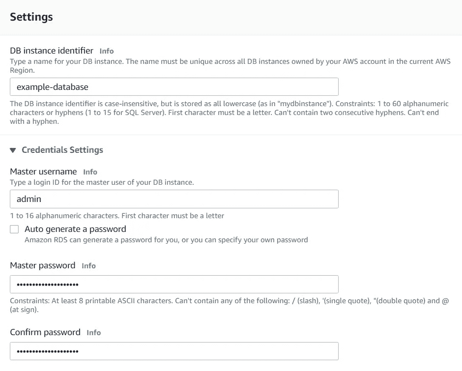

将数据库实例大小、存储以及可用性和持久性部分保留为默认值。在连接部分，展开附加连接配置选项，并将公共访问选项选中为是。

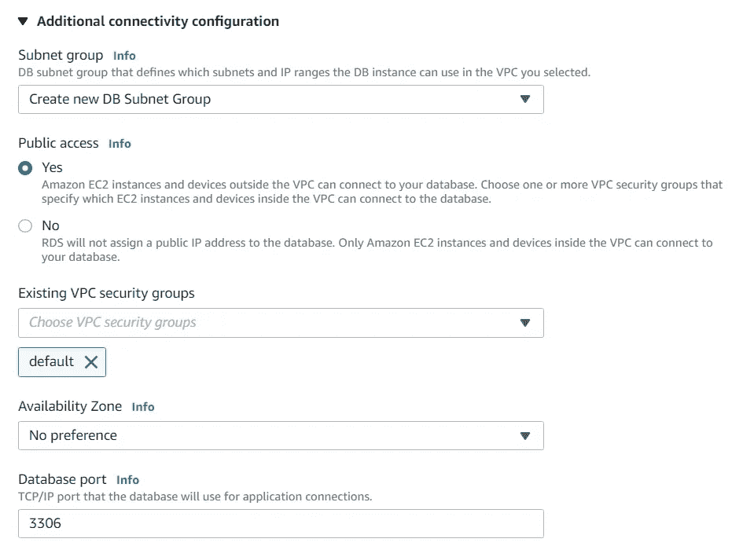

您可以选择指定的最终配置位于附加配置部分。如果您希望在创建 RDS 实例时创建一个数据库，您可以在此部分指定一个初始数据库名称。在本教程中，我将创建一个名为“playlist”的数据库。然后，您可以单击“创建数据库”。RDS 实例启动并运行(状态为“可用”)可能需要几分钟时间。

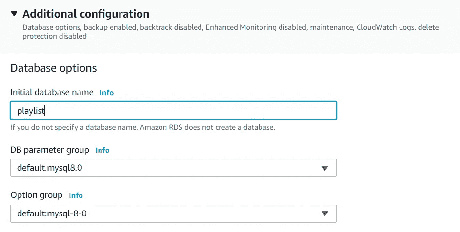

# 3.从 MySQL Workbench 连接到数据库

如果你还没有安装 MySQL 和 Workbench，你需要从[这里](https://dev.mysql.com/downloads/installer/)下载并安装。至少需要安装 MySQL 服务器和工作台。

***注:*** 本教程假设对 MySQL 有一些基本的了解。

创建数据库实例后，选择刚刚创建的数据库，并转到 Connectivity & security 部分。您将在这里看到数据库实例的端点和端口，这是连接到数据库所需要的。

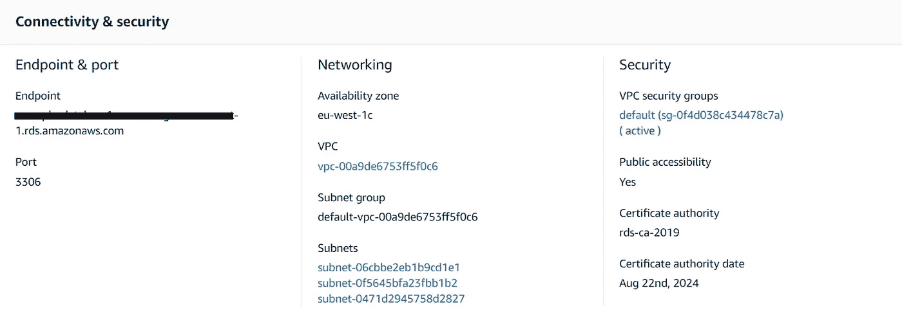

在从 MySQL Workbench 连接到数据库实例之前，我们必须编辑 RDS 实例的 VPC 安全组规则。在 Connectivity & security 部分，单击您的实例的默认 VPC 安全组。选择安全组的入站规则选项卡，然后单击“编辑入站规则”。默认情况下，安全组被配置为允许来自 VPC 安全组内部的所有流量，因此我们需要添加另一个入站规则来允许来自任何 IP 地址的所有流量。

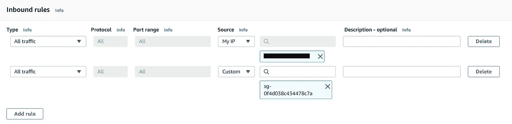

保存规则。现在，您将能够在 MySQL Workbench 中添加连接，并使用端点地址作为主机名以及您创建的主用户名和密码连接到您的 RDS 实例。

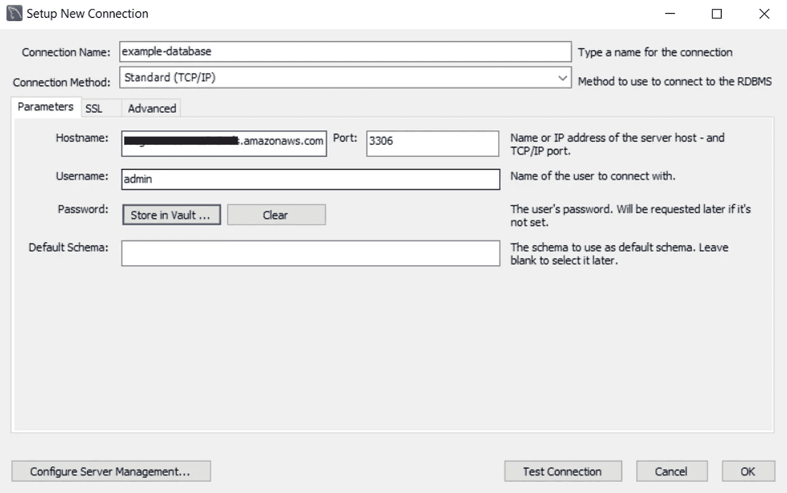

打开到 RDS 实例的连接，您会注意到在左侧的 SCHEMAS 选项卡中已经为我们创建了“playlist”数据库。我们将运行几个简单的 SQL 命令，在数据库中创建一个表，并向表中添加一些数据。

```
use playlist;create table playlist (
    playlist_name varchar(100) not null,
    song_name varchar(100) not null,
    artist varchar(100) not null,
    album varchar(100),
    primary key (playlist_name, song_name, artist)
);insert into playlist (playlist_name, song_name, artist) values ('#1', 'Your Song', 'Elton John');
insert into playlist (playlist_name, song_name, artist) values ('#1', 'Hey Jude', 'The Beatles');
insert into playlist (playlist_name, song_name, artist, album) values ('#1', 'Hotel California', 'The Eagles', 'Hotel California');
insert into playlist (playlist_name, song_name, artist, album) values ('#1', 'Stairway to Heaven', 'Led Zeppelin', 'Led Zeppelin IV');
```

现在我们已经创建了数据库并将数据插入到表中，我们可以将注意力转移到设置 Lambda 函数上了。

# 4.创建你的 Lambda 函数

现在是时候设置你的 Lambda 函数了。打开 Lambda 服务并确保选择了 Functions dashboard。我建议在已经创建的 RDS 实例所在的区域创建 Lambda 函数。

选择“创建函数”并给你的函数起一个名字，我在本教程中使用了“get-playlist-rds”。使用 Python 3.8 作为运行时，将“创建一个具有基本 Lambda 权限的新角色”作为执行角色。创建您的函数。

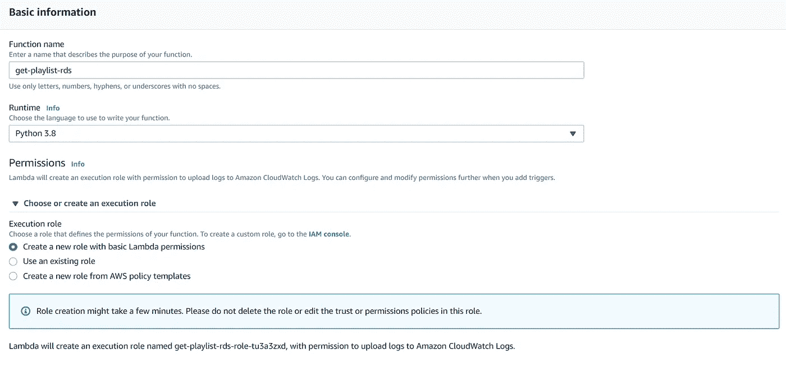

默认情况下，pymysql 库对 Lambda 函数不可用，因此我们需要导入它，以便它可以用于连接 RDS。

# 5.添加 pymysql 库作为 Lambda 层

在我们可以将 pymysql 库作为 Lambda 层添加之前，我们必须首先将这个库打包成一个 zip 文件。在本教程中，我将解释如何在 Windows 上做到这一点，但在 Mac/Linux 上也可以遵循类似的过程。

您需要在本地 Windows PC 上安装 python，并且 python 版本应该与您为 Lambda 函数选择的运行时版本相匹配，在本例中为 Python 3.8。您还需要安装 pip，以便下载 pymysql 包。这里有一个[链接](https://phoenixnap.com/kb/install-pip-windows)指向如何在 Windows 上这样做的说明。

一旦在您的 PC 上安装了 pip，打开命令提示符并导航到您想要的目录，然后运行以下命令。

```
pip install --target ./python pymysql
```

这将在所需的目录中创建一个名为 python 的文件夹。然后，您需要将 python 文件夹压缩为 zip 文件，以便我们可以将其上传到 AWS。

在 Lambda 控制台窗口中，从左侧菜单中选择层选项，然后单击“创建层”。给你的图层命名为“pymysql ”,上传你刚刚创建的 zip 文件。选择 Python 3.8 作为兼容的运行时，然后单击“创建”。

回到你已经创建的“get-playlist-rds”功能，点击 Designer 部分的图层。然后，您可以添加刚刚创建的自定义层(选择版本 1)。现在，您已经准备好配置 Lambda 函数的其余部分了。

***注意:*** 将 Lambda 层添加到您的函数的替代方法是直接将 zip 文件上传到您的 Lambda 函数(在函数代码部分的操作菜单下)。

# 6.从 Lambda 函数连接到数据库

既然 pymysql 库对您的 Lambda 函数代码可用，您可以添加下面的代码来允许您连接到 RDS 实例。该代码设置从 rds_config 导入的数据库连接属性，创建到数据库的连接，并执行一个简单的查询来从我们创建的“playlist”表中获取所有数据。lambda 函数在 HTTP 响应的主体中返回这些数据，该响应可以从 API Gateway 调用(我在之前的[教程](https://medium.com/swlh/aws-api-gateway-lambda-dynamodb-71bb930abe51)中讨论过这一点)。

```
import json
import pymysql
import rds_configrds_host = rds_config.db_endpoint
name = rds_config.db_username
password = rds_config.db_password
db_name = rds_config.db_name
port = 3306try:
    conn = pymysql.connect(host=rds_host,user=name,
                           passwd=password,db=db_name,
                           connect_timeout=5,
                           cursorclass=pymysql.cursors.DictCursor)except:
    sys.exit()def lambda_handler(event, context): with conn.cursor() as cur:
        qry = "select * from playlist"
        cur.execute(qry) body = cur.fetchall() return {
        'statusCode': 200,
        'headers': {
            'Access-Control-Allow-Origin': '*',
            'Access-Control-Allow-Headers': 'Content-Type,X-Amz-Date,Authorization,X-Api-Key,X-Amz-Security-Token',
            'Access-Control-Allow-Credentials': 'true',
            'Content-Type': 'application/json'
        },
        'body': json.dumps(body)
    }
```

下一步是将 rds_config 文件添加到 Lambda 函数中，以获取 Lambda 函数代码中引用的数据库属性。在 Function code 部分，选择 File > New File，并将文件命名为 rds_config.py。您将在此处添加 rds 实例的配置属性。文件的结构如下所示，用 RDS 实例的值替换变量。

```
db_endpoint = '*your_rds_endpoint_address'* db_username = '*your_master_username'* db_password = '*your_master_password'* db_name = '*your_database_name'*
```

在与 RDS 实例通信之前，您需要将 Lambda 函数添加到与 RDS 实例相同的 VPC 中。为此，您需要更新 Lambda 执行角色，以附加 NetworkAdministrator 策略。在 Lambda 函数的 Permissions 选项卡中，单击角色名称以打开 IAM 控制台，您可以在其中附加策略。

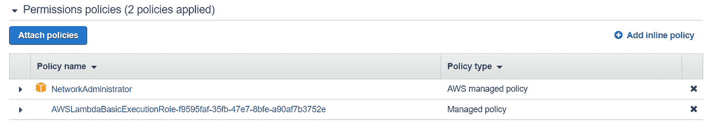

然后，您可以返回到 Configuration 选项卡，配置 VPC 以匹配 RDS 实例 VPC 配置，如上面的第 3 节所示。

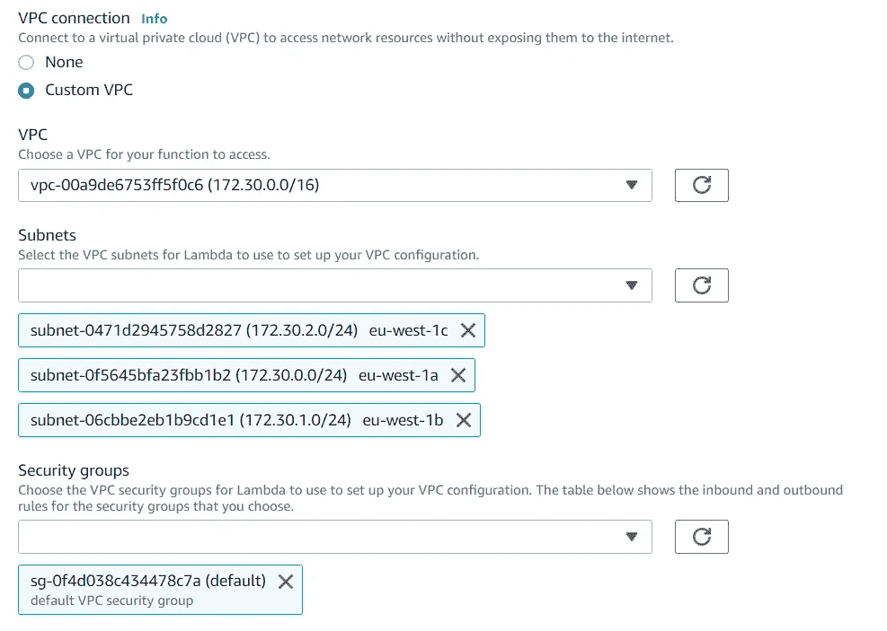

你现在已经准备好测试你的 Lambda 函数了。在 Lambda 函数控制台窗口的右上角，选择“选择测试事件”下拉菜单，然后单击“配置测试事件”。AWS 附带了许多已经配置好的测试事件模板，您可以使用“hello-world”模板。给你的测试事件命名并创建。单击“测试”按钮，验证您的功能是否成功执行。

# 6.结论

现在，您已经成功地创建了一个简单的 RDS 实例，并通过创建 pymysql 层设置了一个 Lambda 函数来查询数据库的内容。