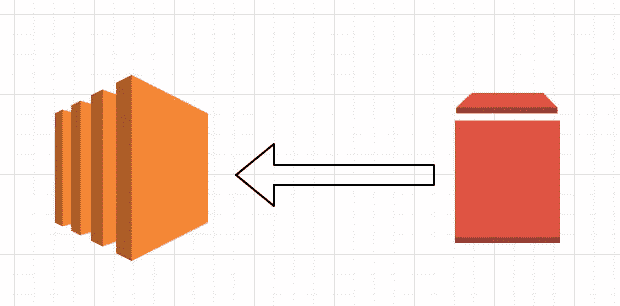

# AWS 将 EBS 卷装载到 EC2

> 原文：<https://levelup.gitconnected.com/aws-mount-ebs-volume-to-ec2-c7c06ac60a48>



AWS 将 EBS 卷装载到 EC2

最近，我不得不在我的 linux EC2 实例上安装一个 EBS 卷。虽然 AWS 有一个非常详细的用户指南，但有些地方我会感到困惑，而且它并不总是有效。因此，我想写这篇小博客，列出所有的步骤和结果，供自己和他人参考。希望你觉得有用！

首先，停止 EC2 实例，然后在 Volumes 部分，选择卷并将其附加到实例(您也可以选择将其附加到正在运行的实例)。请注意，卷和实例必须在同一 AZ 中。

如果卷是新的，它会显示为块设备，并且没有文件系统。因此，如果您是第一次使用该卷，请遵循以下步骤，或者跳到步骤 3。

1.  在卷上创建文件系统。比方说，卷安装在/dev/sdf 上(这在 EC2 控制台上列出)

```
[ec2-user@ip-xxx-xx-x-xxx ~]$ **sudo mkfs -t ext4 /dev/sdf**
mke2fs 1.42.9 (28-Dec-2013)
Filesystem label=
OS type: Linux
Block size=4096 (log=2)
Fragment size=4096 (log=2)
Stride=0 blocks, Stripe width=0 blocks
327680000 inodes, 2621440000 blocks
131072000 blocks (5.00%) reserved for the super user
First data block=0
Maximum filesystem blocks=4294967296
80000 block groups
32768 blocks per group, 32768 fragments per group
4096 inodes per group
Superblock backups stored on blocks:
32768, 98304, 163840, 229376, 294912, 819200, 884736, 1605632, 2654208,4096000, 7962624, 11239424, 20480000, 23887872, 71663616, 78675968,102400000, 214990848, 512000000, 550731776, 644972544, 1934917632,2560000000Allocating group tables: done
Writing inode tables: done
Creating journal (32768 blocks): done
```

**2。**您可以使用“fdisk”命令找到卷所在的目录名，并找到与卷大小匹配的驱动器，或者使用“file -s”命令查看它链接到的位置。

使用“fdisk”命令。这里您可以看到，对于 10TiB 的卷，驱动器是“/dev/nvme1n1”

```
[ec2-user@ip-xxx-xx-x-xxx ~]$ sudo fdisk -l***Disk /dev/nvme1n1: 9.8 TiB, 10737418240000 bytes, 20971520000 sectors*** Units: sectors of 1 * 512 = 512 bytes
Sector size (logical/physical): 512 bytes / 512 bytes
I/O size (minimum/optimal): 512 bytes / 512 bytes**Disk /dev/nvme2n1: 838.2 GiB, 900000000000 bytes, 1757812500 sectors** Units: sectors of 1 * 512 = 512 bytes
Sector size (logical/physical): 512 bytes / 512 bytes
I/O size (minimum/optimal): 512 bytes / 512 bytes**Disk /dev/nvme3n1: 838.2 GiB, 900000000000 bytes, 1757812500 sectors** Units: sectors of 1 * 512 = 512 bytes
Sector size (logical/physical): 512 bytes / 512 bytes
I/O size (minimum/optimal): 512 bytes / 512 bytes**Disk /dev/nvme0n1: 8 GiB, 8589934592 bytes, 16777216 sectors** Units: sectors of 1 * 512 = 512 bytes
Sector size (logical/physical): 512 bytes / 512 bytes
I/O size (minimum/optimal): 512 bytes / 512 bytes
Disklabel type: gpt
Disk identifier: F502FA32–96BF-48E8-BDF0–166C1E74F8FA**Device** **Start** **End** **Sectors** **Size** **Type** /dev/nvme0n1p1 4096 16777182 16773087 8G Linux filesystem
/dev/nvme0n1p128 2048 4095 2048 1M BIOS boot
```

使用“file -s”命令并获取驱动器的名称。在这里，卷安装在/dev/sdf 上。

```
[ec2-user@ip-xxx-xx-x-xxx ~]$ sudo file -s /dev/sdf
/dev/sdf: symbolic link to `**nvme1n1**'
```

**3。**将硬盘安装到设备上的文件夹位置。

```
[ec2-user@ip-xxx-xx-x-xxx ~]$ sudo mount /dev/nvme1n1 /data/ebsmount
```

**4。**卷被装载到设备上，但是如果设备重新启动，装载将会丢失。为了确保在每次重新引导时再次装载卷，需要使用设备的 128 位 UUID 更新/etc/fstab，该文件在分区的整个生命周期内都有效。使用“blkid”命令获取 UUID。

在本例中，您可以看到/dev/nvme1n1 的 UUID 是“7fa 6984 f-4ae 9–41b 0-be30–912640826707”，类型是“ext4”。

```
[ec2-user@ip-xxx-xx-x-xxx ~]$ **sudo blkid**
**/dev/nvme1n1: UUID=”7fa6984f-4ae9–41b0-be30–912640826707" TYPE=”ext4"**
/dev/nvme0n1: PTUUID=”f502fa32–96bf-48e8-bdf0–166c1e74f8fa” PTTYPE=”gpt”
/dev/nvme0n1p1: LABEL=”/” UUID=”a1e1011e-e38f-408e-878b-fed395b47ad6" TYPE=”xfs” PARTLABEL=”Linux” PARTUUID=”48273af3-b295–415e-8978-b786bf246692"
/dev/nvme0n1p128: PARTLABEL=”BIOS Boot Partition” PARTUUID=”48755cf9–8654–40ce-b91b-848334934b6c”
```

**5。**创建/etc/fstab(***CP/etc/fstab/etc/fstab . orig***)文件的备份，并在文件中添加分区的 UUID 和类型。更新后，它看起来会像下面这样。

注意:如果您曾经在没有连接这个卷的情况下引导实例(例如，在将卷移动到另一个实例之后)，那么 *nofail* mount 选项使实例能够引导，即使在装载卷时出现错误。

```
#
UUID=a1e1011e-e38f-408e-878b-fed395b47ad6 / xfs defaults,noatime 1 1
UUID=7fa6984f-4ae9–41b0-be30–912640826707 /data/ebsmount ext4 defaults,discard,nofail 0 0
```

**6。**全部卸载，并测试挂载。如果您收到错误消息，说明存在问题。如果没有错误，您将看到如下输出。

```
[ec2-user@ip-xxx-xx-x-xxx ~]$ sudo umount /data/ebsmount
[ec2-user@ip-xxx-xx-x-xxx ~]$ sudo mount -a — verbose
/             : ignored
/data/ebsount : successfully mounted
```

如果您正在考虑使用 CloudFormation 中的 UserData 或一些代码来自动化卷/驱动器装载过程，正如您所看到的步骤，这并不困难。您可以在实例 AMI 中融合一个脚本，或者只是将代码作为 UserData 传递。

祝你好运！:-)