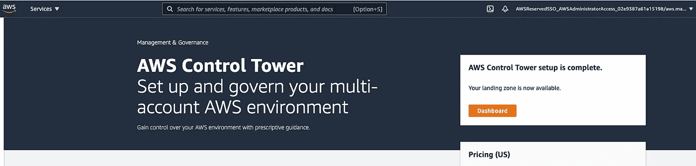
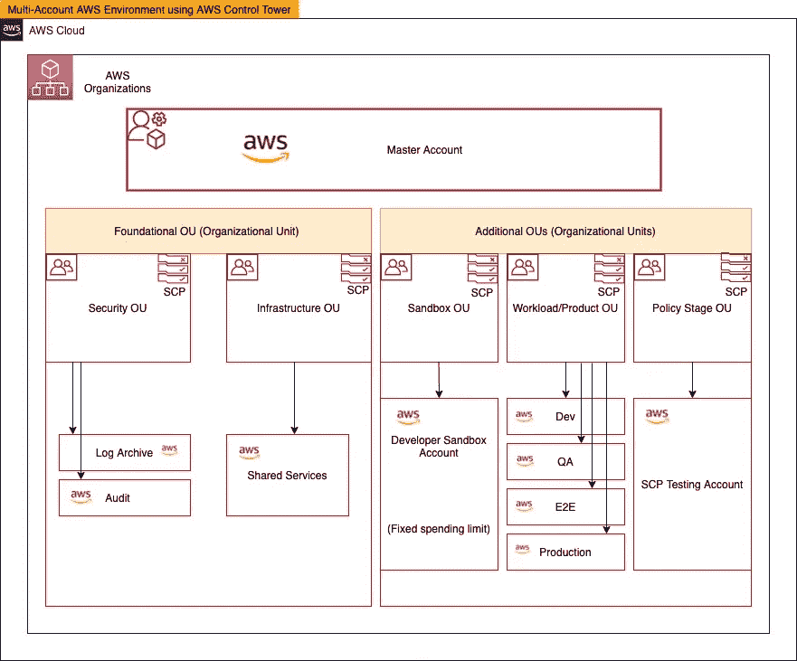
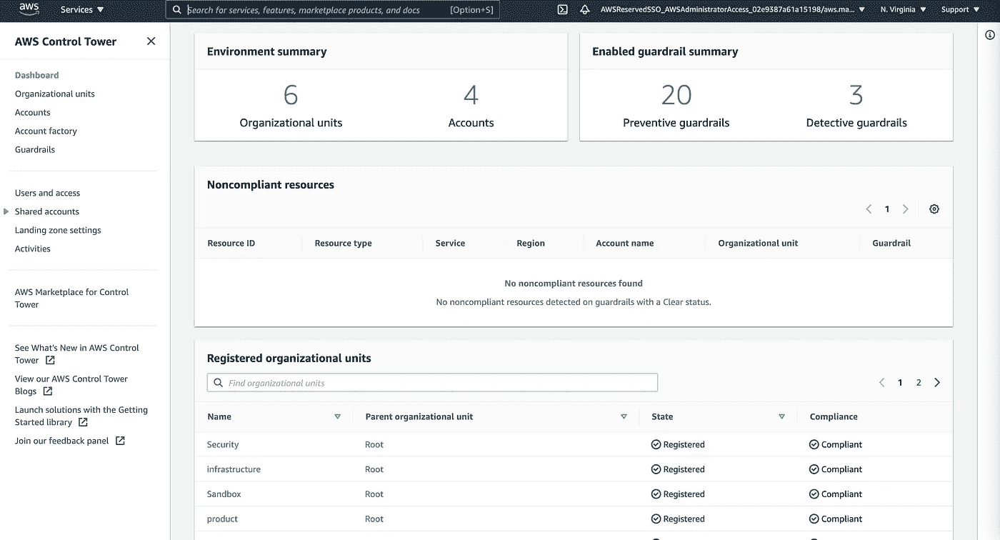
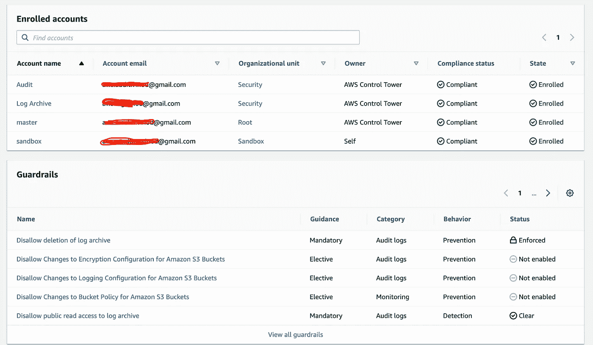
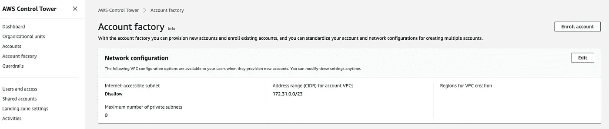
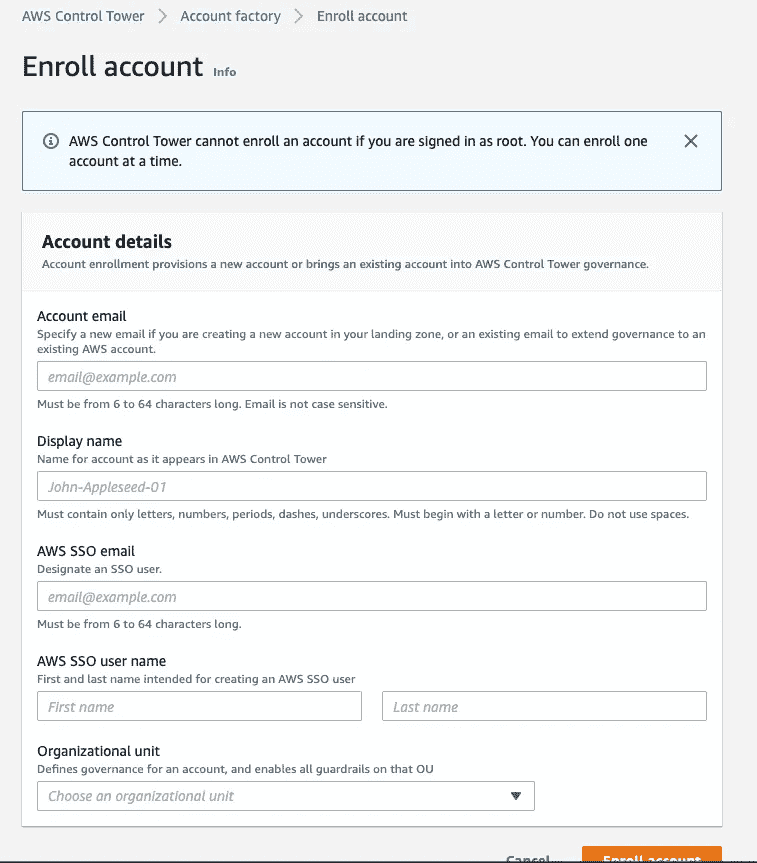
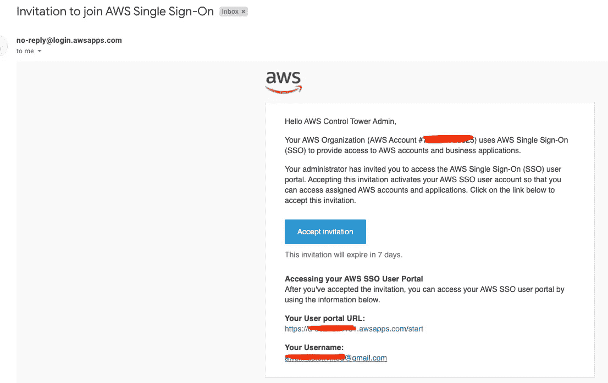
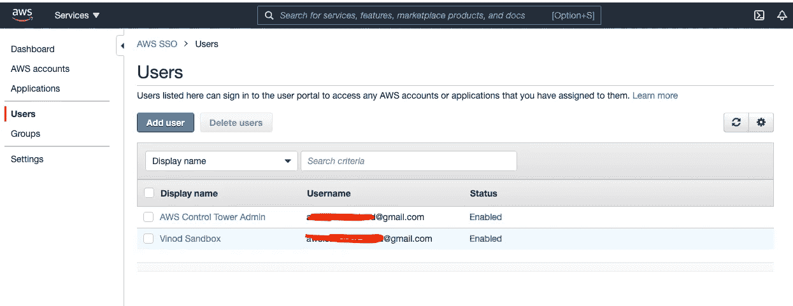
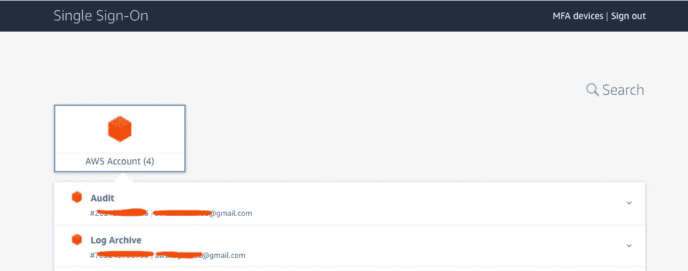

# 具有 AWS 单点登录的 AWS 多帐户体系结构

> 原文：<https://levelup.gitconnected.com/aws-multi-account-architecture-with-aws-single-sign-on-f70af7d7663>

多帐户体系结构为客户提供了全面的治理、安全性、成本优化以及对其 AWS 环境和资源的控制。

有了 **AWS 控制塔**，我们就有了*登陆区*，通过它我们可以使用 *AWS 组织*轻松创建一个安全的多账户 AWS 环境。

自动气象站控制塔为我们提供:-

1.  **防护栏** —既*预防性* & *检测性*防护栏，用于对注册的 AWS 帐户实施策略
2.  **帐户工厂** —提供新的 AWS 帐户，并使用管理的网络配置注册现有帐户

前往 AWS 控制台和 AWS 控制塔服务，并按照指示建立着陆区。

自动气象站控制塔

默认情况下，AWS 会将 ***日志归档*** 和 ***审计*** 账户作为基础 OU 的一部分。作为组织治理的一部分，您可以根据需要添加额外的 ou。

以下架构描述了一个典型的多账户 AWS 环境，其中包含不同的*组织单位(ou)和账户* :-

AWS 多账户架构

设置完成后，通常 AWS 控制塔仪表板看起来与下图相似，其中包含 OU、注册帐户和护栏的摘要:-

AWS 控制塔仪表板

如果有一个帐户不符合预防性护栏，那么它也会在这里提醒那些。

AWS 控制塔仪表板

要注册一个新帐户，请单击“**帐户工厂**”链接(在仪表板菜单链接上)，然后单击“**注册帐户**”。

使用(新帐户的)管理电子邮件地址和 SSO 电子邮件详细信息填写详细信息，并选择新帐户所属的适当 OU:-

帐户工厂—新帐户注册

您还可以使用 AWS CloudFormation StackSets 和 StackSet 实例，通过 CLI 或 CI/CD 实现资源部署的自动化。

与新帐户关联的用户将收到来自 AWS 控制塔的电子邮件，其中包含使用 AWS SSO 登录的用户门户 URL(单点登录)。

现在，默认情况下，用户注册为 AWS SSO 本地目录的一部分，并获得相关的权限集(角色)来访问他们的帐户。像 Google G-Suite 或 Okta 这样的外部第三方身份提供商也可以利用这一点。

AWS SSO

用户现在可以使用给定的权限登录各自的帐户。

# 总结:

有了 AWS 控制塔，您可以轻松地建立一个安全、完全受控的多帐户架构。默认情况下，用户在 AWS SSO 中注册为本机目录，但是我们也可以将它用于作为外部身份提供者(如 Okta)一部分的联合用户。

希望你喜欢这篇文章:)

在下一篇博客中，我将向您展示如何轻松集成像 Okta 这样的外部身份提供者和 AWS 控制塔。