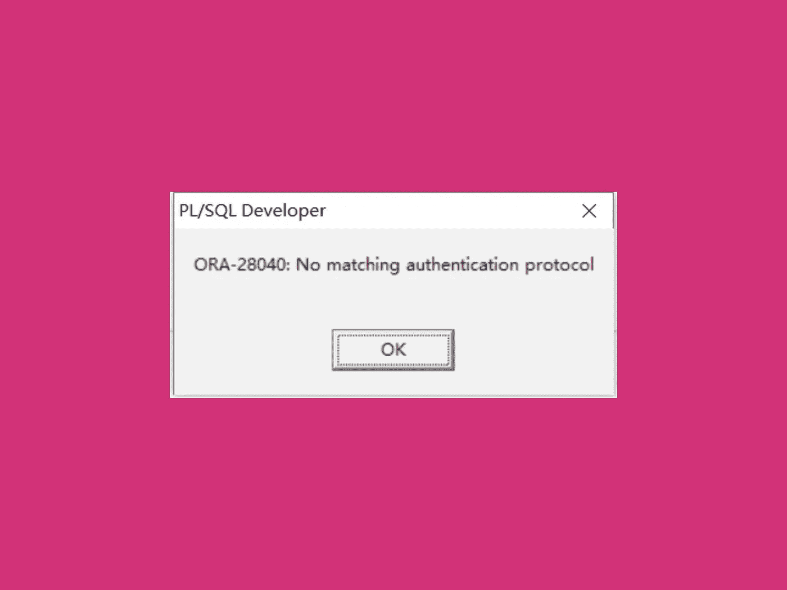
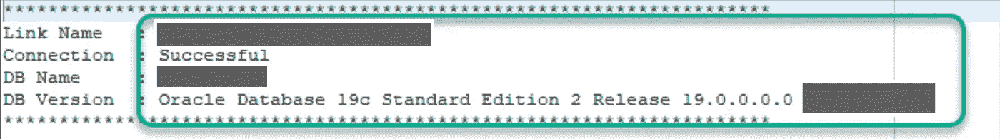

# AWS RDS 升级:如何解决“Oracle RDS ORA-28040:没有匹配的验证协议”问题

> 原文：<https://levelup.gitconnected.com/aws-rds-upgrade-how-to-solve-the-oracle-rds-ora-28040-no-matching-authentication-protocol-issue-122d87af1c82>

*作者:DevOps 工程师 Kerim Koda LCI*

我们不是都去过吗？想知道应用程序是否能继续支持即将到来的数据库升级？在我们的例子中，一开始并没有。这篇博文描述了我们如何在将 12c Oracle RDS 数据库升级到最新的 19c 版本后解决了一个`ORA-28040`错误。

我们的头痛始于 AWS 通知，自 2022 年 7 月 31 日起 [Oracle 将不再支持 Oracle Database 12c Release 1(12.1.0.2)。换句话说，如果我们不采取行动，我们的 AWS RDS 数据库将很快进行自动升级。](https://repost.aws/questions/QUESrwZfKMSSuijzLLHCQkYQ/announcement-amazon-rds-for-oracle-end-of-support-timeline-for-12-c-oracle-release-2-12-2-0-1-and-oracle-release-1-12-1-0-2-major-version)

# 升级 RDS 数据库

要测试新的数据库版本及其与应用程序的兼容性，必须升级 RDS 数据库。不用说，您不应该升级您的生产或非生产数据库。因为一旦升级，就不能降级到以前的版本。要恢复数据库升级，您需要使用 Oracle 数据泵、AWS 数据库迁移服务(DMS)或任何支持的逻辑复制工具。

在我们的例子中，进行 RDS 备份(快照)对测试非常有帮助。为此，我们从快照引导一个新的 Oracle RDS 数据库，并将其升级到 Oracle 的最新版本(在我们的例子中是 19c)。这意味着我们所有的生活环境可以保持在线，如果升级出现问题也不会受到影响。

升级 AWS RDS 非常简单。您在 IaC 中指定一个新的引擎版本并部署它，从而触发 RDS 数据库更新。此外，请注意，主要版本升级可能需要相当长的时间。

# 测试升级后的 RDS 数据库

升级后，断开非生产应用程序与非生产数据库的连接，并重新部署它，指定我们刚刚升级到最新版本的新数据库。这时，我们在连接 Oracle 19c 数据库时遇到了以下错误:`**Error: ORA-28040: No matching authentication protocol**` **。**

经过深入研究，我们发现这是由于 Oracle 数据库服务器和 JDBC 客户端使用的身份验证协议不匹配。更准确地说，它不是按照最新、最安全的标准散列你的密码。

因为升级 JDBC 客户端不是一个选项，我们必须找到另一种方法来解决这个问题。在这里，我们发现 Amazon RDS for Oracle 支持新的客户可修改的 sqlnet.ora 参数— `ALLOWED_LOGON_VERSION_SERVER`和`ALLOWED_LOGON_VERSION_CLIENT`。您可以使用`SQLNET.ALLOWED_LOGON_VERSION_SERVER`参数，并将其设置为连接到 Amazon RDS for Oracle DB 实例时允许的最低身份验证协议。`SQLNET.ALLOWED_LOGON_VERSION_CLIENT`参数可以设置为客户机允许的最低认证协议，当服务器作为客户机连接到 Amazon RDS for Oracle DB 实例时使用。

[Amazon RDS for Oracle 现在支持 ALLOWED_LOGON_VERSION_SERVER 和 ALLOWED _ LOGON _ VERSION _ CLIENT sqlnet . ora 参数](https://aws.amazon.com/about-aws/whats-new/2019/11/amazon-rds-for-oracle-now-supports-allowed-logon-version-server-and-allowed-logon-version-client-sqlnet-ora-parameters/)

# 自定义参数组

参数组技巧是惊人的，因为它允许您继续使用当前的 JDBC 客户端，直到安装一个新版本。您需要创建一个带有`allowed_logon_version_client`和`allowed_logon_version_server`参数的自定义参数组，以在 AWS RDS 中启用该选项。部署新参数组时，将重新启动数据库以实施参数组中的设置。

定制参数组的部署和数据库重启导致了成功的数据库连接，并解决了我们的 Oracle 连接错误。

# 摘要

总的来说，修复`ORA-28040`错误并不困难。我们发现这个问题的解决方案非常简单，只需引入一个自定义参数组，并定义认证协议。

我希望我的博文在某些方面对你有所帮助。如果您有任何问题或意见，请随时联系我。

*原载于 2022 年 7 月 25 日*[*https://www . element 7 . io*](https://www.element7.io/2022/07/aws-rds-upgrade-how-to-solve-the-oracle-rds-ora-28040-no-matching-authentication-protocol-issue/)*。*