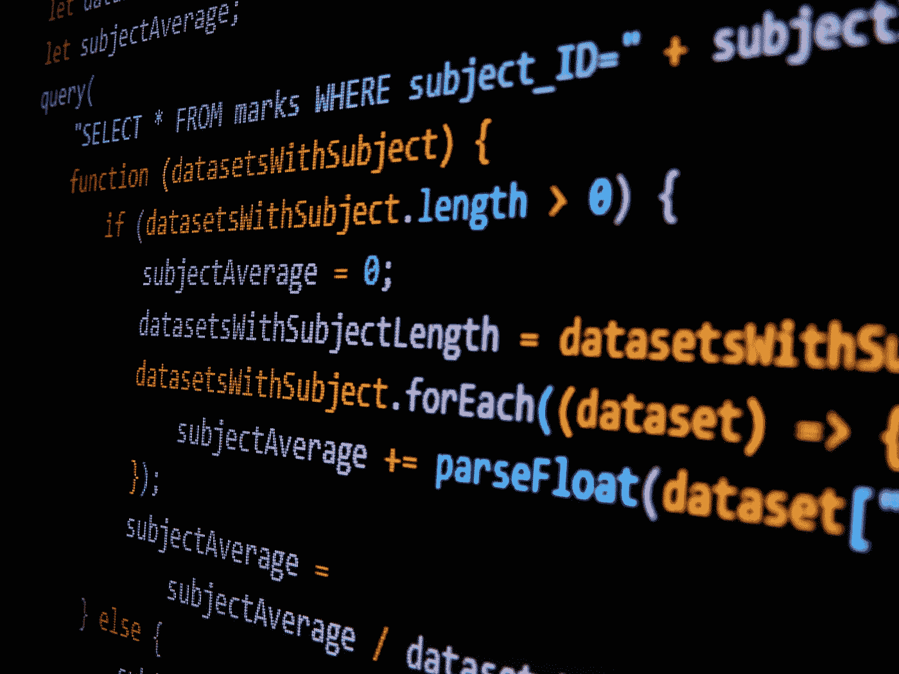

# AWS + React.js 全栈开发教程—构建无服务器锦标赛支架平台(第 4 部分:后端)

> 原文：<https://levelup.gitconnected.com/aws-react-js-full-stack-development-tutorial-build-a-serverless-tournament-bracket-platform-42126274ecef>

加布里埃尔·海因策在 [Unsplash](https://unsplash.com?utm_source=medium&utm_medium=referral) 上的照片

# 第 4 部分:后端

到目前为止，我们已经创建了一个简单的 web 应用程序，它与后端没有任何交互。在本实验中，我们将使用 AWS Lambda 和 AWS API Gateway 创建一个无服务器后端。

# 为后端创建 AWS 资源

## S3

我们将从一个 S3 桶开始来存放我们的 Lambda 代码。在 https://s3.console.aws.amazon.com/s3/home 的[打开 AWS S3 控制台。点击“创建存储桶”。](https://s3.console.aws.amazon.com/s3/home)

S3 水桶

对于存储桶名称，键入“乒乓括号-lambda-”，后跟您的 AWS 帐号。接受剩余的默认配置并创建 bucket。

## DynamoDB

接下来，为括号创建一个 DynamoDB 表。在[https://console.aws.amazon.com/dynamodb](https://console.aws.amazon.com/dynamodb)处打开 AWS DynamoDB 控制台。点击“创建表格”。

创建表格

为“表名”输入“括号”，为“主键”输入“id”(类型:字符串)。不需要排序关键字，并且“使用默认设置”可以保持选中。准备好后点击“创建”。您应该看到“正在创建表”并显示一个加载小部件。该表应该在几分钟内完成创建。

类似于“括号”表，我们将为“游戏”创建另一个表。再次打开控制台并选择 create table。这次输入“games”作为“表名”，输入“id”(类型:字符串)作为“主键”，然后单击“Create”。您应该看到“正在创建表”并显示一个加载小部件。该表应该在几分钟内完成创建。

最后，我们需要一个“用户括号”表。这就是所谓的查找表。在[https://console.aws.amazon.com/dynamodb](https://console.aws.amazon.com/dynamodb)打开 AWS DynamoDB 控制台。点击“创建表格”

与前两个表相比，此表将有所不同。为“表名”输入“用户括号”，为“主键”输入“id”(类型:字符串)。取消选中“使用默认设置”。

## 希腊字母的第 11 个

Lambda 允许您运行代码，而不必在任何地方提供服务器。很酷吧？我们的 Lambda 函数将运行，以响应来自 API 的请求。通过在终端中从工作区的顶级目录运行以下命令来克隆 Lambda 函数代码:

> $ git 克隆[https://github.com/beatleboy501/PingPongBracketsLambda.git](https://github.com/beatleboy501/PingPongBracketsLambda.git)

现在，让我们看看我们将用于无服务器后端的代码。

**SAM 模板:template.yaml**

SAM 代表无服务器应用模型，是 AWS CloudFormation 的超集。它有一个 CLI 组件和一个翻译器/转换器组件，用于将 SAM 语法转换为 CloudFormation。在这种情况下，我们将使用 SAM 模板创建的唯一内容是一组“AWS::Serverless::Function”资源。SAM 中的无服务器函数资源由一个 Lambda 函数组成，该函数充当事件源的控制器。在我们的例子中，事件源是 API 网关端点。我们模板中的每个无服务器函数将具有以下内容:

**函数名**:函数的名称

**CodeUri** :代码的相对路径

**运行时间**:运行时间

**句柄**:句柄函数的引用

**事件**:函数的事件源。

接下来，我们将看看这个模板中引用的一些源代码子目录。

**创建括号:src/create-bracket**

在这个目录中，我们有另一个 template.yaml 文件和一个 create_bracket 子目录。我们希望每个 lambda 函数都可以用于独立的部署，因此 template.yaml 就是这个函数的 SAM 模板。在 create_bracket 子目录中，我们找到 requirements.txt，__init__。如果你熟悉 Python，你肯定知道这些是什么。对于那些新的，requirements.txt 基本上是你的 lambda 函数的依赖列表(类似于 Gemfile 或 package.json)。__init__。在 Python3.3 之前，当引入隐式名称空间包时，py 用于将磁盘上的目录标记为 Python 包。create_rounds 方法中的算法有点复杂:

该算法的目标是获取一组用户和一个括号 ID，并创建一个经过偶数轮比赛的游戏矩阵，以确定冠军。该算法必须根据进入锦标赛的种子选手匹配两组对手，即#1 打#4 和#2 打#3。

**创建结果:src/create-result**

一旦一场比赛已经开始，最终比分已经确定，我们需要一种方法来更新 DynamoDB，游戏和括号表，用这个游戏的新信息，并确定锦标赛中的下一轮比赛。为了与 DynamoDB 交互，我们使用 Python 上的 AWS 标准 SDK，名为 [Boto3](https://boto3.amazonaws.com/v1/documentation/api/latest/guide/quickstart.html) 。

**列出用户:src/get-cognito-users**

这是一个简单的 Node.js Lambda 函数，它为我们提供了平台中的用户列表。用户存储在用户池中，用户池是 [AWS Cognito](https://aws.amazon.com/cognito/) 服务的一部分。

**新增无服务器功能**

如果您想在示例 repo 中的功能之外添加一个新功能，CLI 命令非常简单:

> $ Sam init-runtime nodejs 14 . x-n

**部署脚本:deployLambdas.sh**

现在我们已经了解了无服务器后端的结构，让我们将它部署到云中。首先，启动 Docker 桌面应用程序:

码头工人

接下来，运行部署脚本(如果您使用的是 Windows 操作系统，请使用 Git Bash 应用程序运行这个脚本)。这将在 Docker 容器上的 Linux 环境中构建 lambda 函数，使它们与最终驻留的云 Linux 环境兼容:

> $ ./deployLambdas.sh<your aws="" profile="" name=""><s3 bucket="" name=""><stack name=""></stack></s3></your>

这个脚本将获取 lambda 代码，进行编译/构建等操作，并将其部署到我们创建的 S3 桶中。这将使该函数在 AWS Lambda 服务中可用，我们现在可以运行我们的函数来响应 API 请求。

# 结论

部署完所有后端资源后，你应该可以稳定地运行平台的 web 应用程序部分了。这绝不是“生产就绪”的代码。在现实世界中，您会希望添加单元测试、集成测试、更严格的 IAM 权限等。到最终产品。