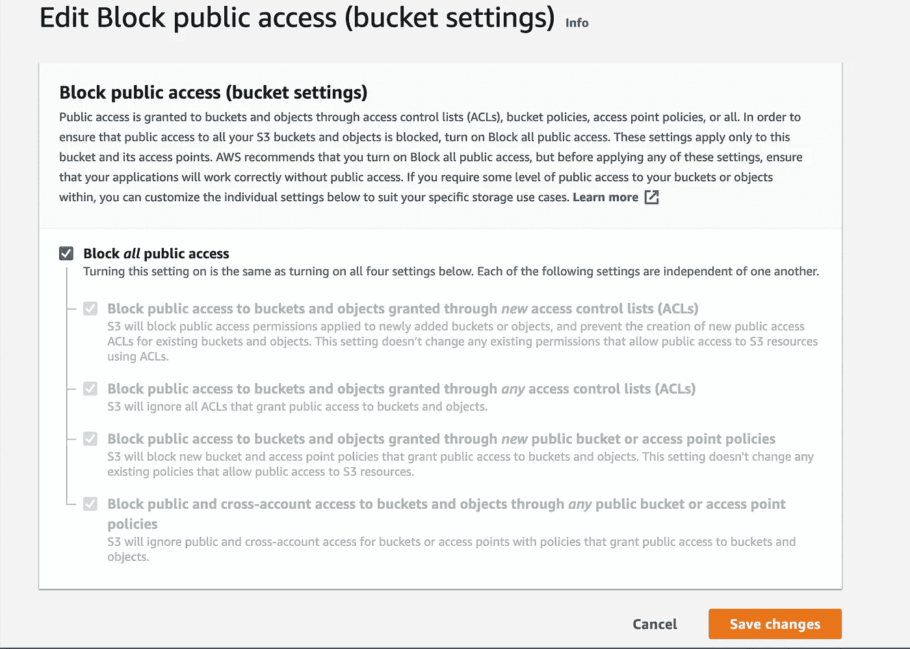

# AWS + React.js 全栈开发教程—构建无服务器锦标赛支架平台(第 3 部分:DevOps 和基础设施)

> 原文：<https://levelup.gitconnected.com/aws-react-js-full-stack-development-tutorial-build-a-serverless-tournament-bracket-platform-9ff472a124a0>


照片由[克里斯蒂安·威迪格](https://unsplash.com/@christianw?utm_source=medium&utm_medium=referral)在 [Unsplash](https://unsplash.com?utm_source=medium&utm_medium=referral) 上拍摄

# 第 3 部分:DevOps 和基础设施

我们将混合使用 Infastructure as Code (IaC)以及一些控制台操作步骤来将前端部署到公共互联网上。

# 为前端创建剩余的 AWS 资源

通常我会提倡使用一个叫做 AWS CloudFormation 的工具来创建下一个部分，但是在 web 控制台中一步一步地学习是一个更好的学习体验。如果你想跳过下一部分，你可以使用下面的命令运行我在这里包含的模板。

```
$ aws cloudformation create-stack --stack-name tournament-brackets-front-end --template-body ./front-end.yml --capabilities "CAPABILITY_IAM" "CAPABILITY_NAMED_IAM" "CAPABILITY_AUTO_EXPAND" --profile TournamentBrackets
```

无论您决定如何创建剩余的资源，都必须向 AWS 简单系统管理添加一个参数。一旦创建了 Cognito 用户池，需要注意的最重要的事情之一就是用户池的 ID。您可以通过执行以下命令从命令行找到它:

```
$ aws cognito-idp list-user-pools --max-results 10 --profile TournamentBrackets { "UserPools": [ { "CreationDate": XXXXXXXXXX.XXX, "LastModifiedDate": XXXXXXXXXX.XXX, "LambdaConfig": {}, "Id": "**us-east-1_xXxXXXXxx**", "Name": "TournamentBracketsUserPool" } ]}
```

你也可以在 https://console.aws.amazon.com/cognito/users 的 AWS 管理控制台点击“TournamentBracketsUserPool”来找到它。

一旦你有了这个 ID，打开 https://console.aws.amazon.com/systems-manager/[的 AWS 简单系统管理器控制台。](https://console.aws.amazon.com/systems-manager/)

在左侧导航面板的“应用程序管理”下，单击“参数存储”。


应用程序管理下的参数存储选项

然后点击“创建参数”。


“创建参数”按钮

对于名称，输入“`USER_POOL_ID`”，对于值，输入我们之前查找的 ID。


用于创建 SSM 字符串参数的 web 表单

输入数值后，点击“创建参数”。


“创建参数”按钮

现在，您应该看到您的字符串变量保存在系统管理器中。


保存在系统管理器中的变量

# 创建 AWS 代码提交报告

在[https://console.aws.amazon.com/codesuite/codecommit](https://console.aws.amazon.com/codesuite/codecommit)打开 AWS 代码提交控制台。点击“创建存储库”。对于存储库名称，输入“TournamentBracketsFrontend ”,然后单击“创建”。


创建存储库按钮


输入存储库名称

准备就绪后，单击创建。这将创建一个空存储库。我们稍后将需要配置 AWS CLI git 凭据帮助器，以便能够向它推送代码。

# 更新主机

您可能已经注意到，在访问上一个实验中由 Amplify CLI 提供的 UI 端点时，出现了 403 禁止错误。要解决这个问题，我们可以进入 https://s3.console.aws.amazon.com/s3/home[的网络控制台。搜索您的存储桶名称(应该是类似于`tournament-bracket-hosting-bucket-xxxx`的内容)。找到桶后，单击它以查看桶中的内容](https://s3.console.aws.amazon.com/s3/home)


空桶

如你所见，这里什么也没有。在下一部分中，我们将建立一个管道来构建前端资产并将其放入这个桶中。我们将从单击“权限”选项卡开始。


权限选项卡

选择“编辑”，然后选择“阻止所有公共访问”，然后选择“保存”。亚马逊 S3 日志传送组不需要对此存储桶进行写访问。



阻止所有公共访问

稍后，我们将通过 AWS CloudFront CDN 访问我们的网站。接下来，前往“属性”标签，向下滚动到“静态网站托管”部分。这里，我们希望将我们的 Bucket 网站端点复制到剪贴板，以便以后使用。


静态网站托管

## 为管道阶段之间的托管工件创建 S3 存储桶

在 https://s3.console.aws.amazon.com/s3/home 的[打开 AWS S3 控制台。点击“创建存储桶”。对于存储桶名称，请键入“锦标赛-支架-管道-”，后跟您的 AWS 帐号。](https://s3.console.aws.amazon.com/s3/home)


创建存储桶

接受剩余的默认配置并创建 bucket。


默认配置

## 创建 CloudFront 发行版

在[https://console.aws.amazon.com/cloudfront/](https://console.aws.amazon.com/cloudfront/)打开自动气象站云前控制台。点击“创建分销”。


创建分发

对于“交付方式”，选择“网络”。


Web 交付方法

在“原域名”内点击输入。这将弹出一个有效的 S3 桶的下拉列表，以用作原点。选择我们在前面步骤`tournament-bracket-hosting-bucket-xxxx`中创建的托管桶。


原始域名

对于“原始路径”,将其留空，并且不限制存储桶访问。对于“起点 ID ”,输入“Bucket_Origin”。


来源 ID

在“默认缓存行为设置”下，为“查看器协议策略”选择“将 HTTP 重定向到 HTTPS”。


将 HTTP 重定向到 HTTPS

在“默认缓存行为设置”下，为“基于选定请求头的缓存”选择“白名单”。添加 2 个自定义标题，“访问控制允许来源”和“内容类型”。


白名单标题

在“默认缓存行为设置”下，为“对象缓存”选择“自定义”。对于“最小 TTL”输入“86400”，对于“最大 TTL”输入“31536000”，对于“默认 TTL”输入“86400”。转发所有 Cookies 和查询字符串。


分发设置

最后，对于“默认根对象”，键入“index.html”。


默认根对象 index.html

接受其他所有内容的默认值，然后单击“Create Distribution”。创建发行版需要几分钟时间。

## 创建代码构建 IAM 角色

在[https://console.aws.amazon.com/iam](https://console.aws.amazon.com/iam)打开 AWS IAM 控制台。单击左侧导航面板中的“角色”。然后点击“创建角色”。受信任实体的类型将是“AWS 服务”,使用该角色的服务是“代码构建”。


代码构建用例

在下一页上，单击“创建策略”。


创建新的 IAM 策略

在“创建策略”屏幕上，单击“JSON”选项卡并在下面输入 JSON，在适用的地方填写您的 AWS 帐户 ID:

```
{
  "Version": "2012-10-17",
  "Statement": [
      {
          "Action": [
              "s3:GetObject",
              "s3:GetObjectVersion",
              "s3:GetBucketVersioning",
              "s3:PutObject"
          ],
          "Resource": [
              "arn:aws:s3:::tournament-brackets-pipeline-<YOUR AWS ACCOUNT ID>",
              "arn:aws:s3:::tournament-brackets-pipeline-<YOUR AWS ACCOUNT ID>/*"
          ],
          "Effect": "Allow"
      },
      {
          "Action": [
              "s3:GetObject",
              "s3:GetObjectVersion",
              "s3:GetBucketVersioning",
              "s3:PutObject",
              "s3:PutObjectAcl"
          ],
          "Resource": [
              "arn:aws:s3:::tournament-brackets-<YOUR AWS ACCOUNT ID>",
              "arn:aws:s3:::tournament-brackets-<YOUR AWS ACCOUNT ID>/*"
          ],
          "Effect": "Allow"
      },
      {
          "Action": [
              "logs:CreateLogGroup",
              "logs:CreateLogStream",
              "logs:PutLogEvents",
              "cloudfront:CreateInvalidation"
          ],
          "Resource": [
              "*"
          ],
          "Effect": "Allow"
      }
  ]
}
```

点击“审查政策”。在“审查策略”页面上，输入“CodeBuildRoot”作为名称，然后单击“创建策略”。


一旦您返回到“创建角色”页面，您应该会看到您的新策略在列表中被选中。点击“下一页:标签”进入下一页。


输入您希望附加的任何标签，然后单击“下一步:查看”。在“Review”页面上，为您的 IAM 角色输入一个名称，我们建议像“CodeBuildRole”这样简单的名称。准备好之后，点击“创建角色”。


接下来，我们将创建 CodeBuild 项目。在 https://console.aws.amazon.com/codesuite/codebuild 的[打开 AWS 代码构建控制台。单击“创建项目”或“创建构建项目”。](https://console.aws.amazon.com/codesuite/codebuild)


构建项目

在“创建构建项目”屏幕上，为“项目名称”输入一些简单的东西，如“pingpongbracts-CodeBuild ”,并附上您想要的任何标签。


创建生成项目

对于“Source provider ”,输入“AWS CodeCommit”并选择您在步骤 a 中创建的存储库。


来源提供商

在“环境”下，使用 Ubuntu 管理的映像(aws/codebuild/standard:2.0)和标准运行时。选择“总是使用此运行时版本的最新映像”。


环境

对于“服务角色”,使用现有的服务角色，并在“角色名称”下拉列表中选择我们在步骤 E 中创建的角色。允许 AWS CodeBuild 修改服务角色，以便它可以用于此生成项目。


服务角色

在“Buildspec”下选择“Insert build commands”并切换到编辑器视图。


构建规范

在编辑器中粘贴以下构建规范(确保仔细检查缩进并在注明的地方替换您的 bucket 名称):

对于“工件”,选择“无工件”,并选中“CloudWatch 日志”复选框。然后点击“创建构建项目”。


工件+日志

然后，我们将想要创建代码管道角色和管道。打开位于[https://console . AWS . Amazon . com/code suite/code pipeline/pipelines](https://console.aws.amazon.com/codesuite/codepipeline/pipelines)的 AWS 代码管道控制台。点击“创建管道”。


创建管道

对于“管道名称”，输入易于识别的内容。我们建议您输入“pingpongbractspipeline-”,后跟您的 AWS 帐户 Id。在“服务角色”下，选择“新服务角色”并选中“允许 AWS 代码管道创建服务角色，以便它可以与此新管道一起使用”。在“高级设置”下选择“自定义位置”,并给出我们在前面创建的桶。


管道设置

在“添加源阶段”页面上，选择“AWS CodeCommit”作为源提供者。从本地终端的 PingPongBrackets 目录中，执行以下命令，替换您的区域 ID(如果适用):

> git 远程添加代码提交 https://git-代码提交。<your aws="" region="" id="">. Amazon AWS . com/v1/repos/pingpongbracts</your>

在你的[里。gitconfig](https://git-scm.com/docs/git-config) 文件你将需要添加以下内容:

> [凭证]
> 
> 帮手=！aws —配置文件<your local="" aws="" profile="" name="">代码提交凭据-助手$@</your>
> 
> UseHttpPath = true
> 
> [用户]
> 
> name =
> 
> 电子邮件=
> 
> [证书]
> 
> helper = UseHttpPath=true

一旦完成，您就可以通过 HTTPS 将代码推送到您的 AWS CodeCommit repo。为此，请从 repo home 中的终端执行以下操作:

> git 推送代码提交主机

这将把 React 应用程序代码推送到 AWS CodeCommit repo，并启动管道。要查看管道的运行情况，请打开位于[https://console . AWS . Amazon . com/code suite/code pipeline/pipelines](https://console.aws.amazon.com/codesuite/codepipeline/pipelines)的 AWS 代码管道控制台。

# 结论

本教程的开发运维/基础架构部分到此结束。接下来，我们将填充后端功能的其余部分。