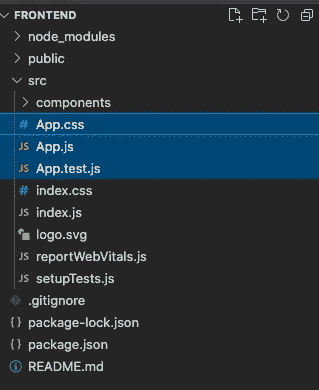

# AWS + React.js 全栈开发教程—构建无服务器锦标赛支架平台(第 2 部分:前端)

> 原文：<https://levelup.gitconnected.com/aws-react-js-full-stack-development-tutorial-build-a-serverless-tournament-bracket-platform-b6dfbd878d46>


照片由[阿尔瓦罗·雷耶斯](https://unsplash.com/@alvarordesign?utm_source=medium&utm_medium=referral)在 [Unsplash](https://unsplash.com?utm_source=medium&utm_medium=referral) 拍摄

# 第 2 部分:前端

如果你愿意，这个实验将提供一个动手编写 JavaScript 代码的机会。我们还将有机会使用 AWS 的名为“Amplify”的 React 库与后端基础设施进行接口。你可以在这里看到完整的前端代码。因为这是一个完整的教程，所以我在这个特定的实验室中浓缩了很多代码。如果你对更实用的编码感兴趣，萨曼莎·盖兹有一个很棒的深入教程叫做 React 101。

 [## React 101，第 1 部分:构建 GIF 搜索引擎

### 上次更新于 2017 年 6 月 1 日，以使用 Create React App、Redux Form v6、React-Router v4 和 Firebase v3。寻找旧的…

tighten.co](https://tighten.co/blog/react-101-building-a-gif-search-engine/) 

# 创建 React 应用

在这个实验中，我们将使用[NPM](https://www.npmjs.com/)—[node . js](https://nodejs.org/en/)的默认包管理器——来设置我们的前端。如今，创建一个 [React.js](https://reactjs.org/) 应用程序非常简单，有一个工具字面上叫做 [Create React App](https://create-react-app.dev/) ，你可以使用:

```
$ nvm use 16 && npx create-react-app frontend --use-npm && cd frontendNow using node v16.9.1 (npm v7.21.1)Creating a new React app in .../frontend.Installing packages. This might take a couple of minutes.
Installing react, react-dom, and react-scripts with cra-template...
...
```

这个项目的下一步，以及你为此写的任何前端代码，应该是安装`ESLint`。多年来，当我开始一个新项目时，我会参考来自 [@alonronin](http://twitter.com/alonronin) 的这篇关于媒体的文章:

[](https://medium.com/dailyjs/adding-eslint-to-your-project-7bd4feca35a8) [## 将 ESlint 添加到项目中

### 在这篇文章中，我将通过几个简单的步骤，使用……

medium.com](https://medium.com/dailyjs/adding-eslint-to-your-project-7bd4feca35a8) 

一旦你完成了 ESLint 的添加，下一步就是安装我们的前端代码所依赖的包。

# 材料-用户界面

多年来，一个名为 [Bootstrap](https://getbootstrap.com/docs/3.4/) 的前端样式框架统治着这片土地，当你浏览互联网时，你会发现到处都有。如今开发者已经远离它，开始使用[材质设计](https://next.material-ui.com/)。也许有一天会有更好的东西来代替材料，但是现在我们还在继续。

```
$ npm i -S @material-ui/core @material-ui/icons @mui/material @emotion/styled
```

# 反应路由器

React 应用程序能够改变路线，例如当访问`example.com/home`时，你点击“登录”，你将被重新路由到`example.com/login`。这里的技巧是你并没有真正得到一个新的页面或者 DOM。现有的网页更新了新的内容，而我们对此一无所知。这种类型的应用程序被称为[单页应用程序(SPA)](https://en.wikipedia.org/wiki/Single-page_application) 。为了使内容更新与路由变化相关联，我们使用标准的 [React 路由器库](https://reactrouter.com/)。

```
$ npm i -S react-router-dom
```

# AWS 放大器

用于处理后端 web 服务(如 API、认证代理等)。) [AWS 已经提供了一个库](https://amplify.aws/)，它消除了进行常规 SDK 调用的所有复杂性。Amplify 在 [AWS 的年度会议](https://reinvent.awsevents.com/)上宣布，名为 [re:Invent 于 2017 年](https://aws.amazon.com/blogs/mobile/announcing-aws-amplify-and-the-aws-mobile-cli/)发布，此后一直在大步前进。

```
$ npm i -S aws-amplify aws-amplify-react
```

# 类名

Classnames 用于动态组合一个字符串，作为某些 DOM 元素的`class`属性。这样你就可以用 CSS 来应用你的样式。

```
$ npm i -S classnames
```

# 删除样板文件

接下来，您终于可以在 IDE 中打开`frontend`项目并开始编码了。`src/index.js`文件附带了一些[样板代码](https://stackoverflow.com/questions/3992199/what-is-boilerplate-code)，我们将用下面的代码覆盖它们:

然后下一步是删除`App.js`、`App.js`和`App.test.js`，因为我们不再需要这些:



此时，你的 IDE 会对你大喊对`components/App`的引用是无效的。没关系，我们接下来会添加它们。

`components`、`constants`、`providers`、`utils`和`conf`目录(及其内容)还不存在，因此我们将从 GitHub repo 中逐个复制它们，并将其放在我们的`src/`文件夹中，同时了解它们的用途。

# 组件目录

components 目录是 React 程序员常用的文件夹，用来存放可重用的 UI 部分(比如按钮和输入)。这也是我们将使用它的目的。如你所见，它有卡片、导航、菜单和加载小部件等功能。所有这些都将被应用程序用来作为一个整体形成 UI。你可以[在这里](https://github.com/beatleboy501/PingPongBrackets/tree/master/src/components)下载组件。

# 常量目录

这个目录不是必需的，但是当涉及到可重用的常量变量时，它有助于组织代码(想想导航菜单选项)。您可以[在此](https://github.com/beatleboy501/PingPongBrackets/tree/master/src/constants)下载常量。

# 提供商目录

在 React 中使用 provider 模式向任何嵌套级别提供状态(在我们的例子中是调用 API 的服务),而不必通过 props 传递状态。您可以[在这里下载提供商](https://github.com/beatleboy501/PingPongBrackets/tree/master/src/providers)。

# utils 目录

这不是一个必需的目录，但它使我们的代码更干净，可以分离任何可重用的实用函数。你可以在这里下载实用程序。

# conf 目录

在这种情况下，Conf 是 configuration 的缩写。您可以更改 Material-UI 的样式主题或 AWS Amplify Auth 的用户属性。你可以在这里下载 conf。

# 配置放大器

既然已经添加了所有必需的依赖项和文件，我们将需要为您的计算机配置 AWS Amplify CLI。AWS Amplify 是一个 JavaScript 库，用于将移动和 web 应用程序连接到 AWS 云服务。

```
$ amplify configureFollow these steps to set up access to your AWS account:Sign in to your AWS administrator account:https://console.aws.amazon.com/Press Enter to continueSpecify the AWS Region? *region*: us-east-1 (or whatever region is closest to you)Specify the username of the new IAM user:? *user name*:  TournamentBracketsAdmin(Finish the following part in the web console, giving programmatic and console access and accepting defaults for all else. **Make sure to download the credentials CSV file**)? *accessKeyId*: (<YOUR_ACCESS_KEY_ID>)? *secretAccessKey*: (<YOUR_SECRET_ACCESS_KEY>)This would update/create the AWS Profile in your local machine? *Profile Name*:  TournamentBrackets
```

请注意，您可以在最后更新或创建 AWS CLI 配置文件。这与 Amplify CLI 不同，但两者是相关的。此时，您已经将 Amplify CLI 配置为计算机上的一项服务。接下来要做的是在当前目录中初始化一个 Amplify 应用程序。这将允许您添加诸如身份验证、存储、API 服务等内容。对于终端提示，请遵循以下文本。

```
$ amplify initNote: It is recommended to run this command from the root of your app directory
? Enter a name for the project frontend
The following configuration will be applied:Project information
| Name: frontend
| Environment: dev
| Default editor: Visual Studio Code
| App type: javascript
| Javascript framework: react
| Source Directory Path: src
| Distribution Directory Path: build
| Build Command: npm run-script build
| Start Command: npm run-script start? Initialize the project with the above configuration? Yes
Using default provider  awscloudformation? Please choose the profile you want to use TournamentBrackets
Adding backend environment dev to AWS Amplify Console app: x0xxxxx0xx0xxx
⠹ Initializing project in the cloud...
```

等一会儿，~去喝杯咖啡 *~，*什么的，然后等到你在终端上看到这个:

```
✔ Successfully created initial AWS cloud resources for deployments.
✔ Initialized provider successfully.
Initialized your environment successfully.Your project has been successfully initialized and connected to the cloud!
```

恭喜你，你的前端现在已经连接到 AWS 了。接下来，我们将在应用程序中添加身份验证功能——首先从本地开始。

```
$ amplify add authUsing service: Cognito, provided by: awscloudformationThe current configured provider is Amazon Cognito.? Do you want to use the default authentication and security configuration? Manual configuration
? Select the authentication/authorization services that you want to use: User Sign-Up & Sign-In only
 (Best used with a cloud API only)
? Please provide a friendly name for your resource that will be used to label this category in the project: TournamentBrackets
? Please provide a name for your user pool: TournamentBracketsUserPool
 Warning: you will not be able to edit these selections.
? How do you want users to be able to sign in? Email
? Do you want to add User Pool Groups? No
? Do you want to add an admin queries API? No
? Multifactor authentication (MFA) user login options: OFF
? Email based user registration/forgot password: Enabled (Requires per-user email entry at registration)
? Please specify an email verification subject:  Your Tournament Brackets Verification Code
? Please specify an email verification message: Your Tournament Brackets Verification Code is {####}
? Do you want to override the default password policy for this User Pool? No
 Warning: you will not be able to edit these selections.
? What attributes are required for signing up? Email, Family Name (This attribute is not supported by Login With Amazon.), Given Name (This attribute is not supported by Login With Amazon.) 
? Specify the app's refresh token expiration period (in days): 30
? Do you want to specify the user attributes this app can read and write? Yes
? Specify read attributes: Email, Family Name, Given Name
? Specify write attributes:
? Do you want to enable any of the following capabilities?
? Do you want to use an OAuth flow? Yes
? What domain name prefix do you want to use? tournament-bracket-auth
? Enter your redirect signin URI: [http://localhost:3000/](http://localhost:3000/) 
? Do you want to add another redirect signin URI No
? Enter your redirect signout URI: [http://localhost:3000/](http://localhost:3000/)
? Do you want to add another redirect signout URI No
? Select the OAuth flows enabled for this project. Authorization code grant
? Select the OAuth scopes enabled for this project. Phone, Email, OpenID, Profile, aws.cognito.signin.user.admin
? Select the social providers you want to configure for your user pool:
? Do you want to configure Lambda Triggers for Cognito? NoSuccessfully added auth resource TournamentBrackets locally
```

如您所见，Auth 可以高度定制，但我们为我们的解决方案选择了最简单的配置之一。检查 Amplify 状态，查看 Auth 是否已添加:

```
$ amplify statusCurrent Environment: dev| Category | Resource name     | Operation | Provider plugin   |
| -------- | ----------------- | --------- | ----------------- |
| Auth     | TournamentBrackets | Create    | awscloudformation |
```

我们将在前端应用程序中添加另一个类别，即托管。直到最近，这还不能用 Amplify CLI 配置，而且设置起来更复杂。现在，托管包含在 CLI 中，有几个选项可供您选择。首先，你可以选择自己管理或者让 Amazon 管理你的应用程序。我们将选择管理我们自己。下一个要做的决定是您是托管`prod`工作负载还是`dev`工作负载。这两种选择都涉及到在 S3 桶中托管静态资产。`prod`选项将使用 AWS 的名为 CloudFront 的 CDN 将它们分发到世界各地的缓存位置

```
$ amplify add hosting? Select the plugin module to execute Amazon CloudFront and S3
? Select the environment setup: DEV (S3 only with HTTP)
? hosting bucket name tournament-bracket-hosting-bucket
? index doc for the website index.html
? error doc for the website index.html
```

这些身份验证和托管配置只存在于本地，因此我们接下来将在云中创建它们。将 Amplify 项目推送到您的云环境中，将会在之前在 CloudFormation 中创建的基础栈中创建嵌套栈。注意:如果您遇到问题并正在重新创建 AWS 资源，请确保在重新开始之前删除现有的 CloudFormation 堆栈。

```
$ amplify push ✔ Successfully pulled backend environment dev from the cloud.Current Environment: dev| Category | Resource name     | Operation | Provider plugin   |
| -------- | ----------------- | --------- | ----------------- |
| Auth     | TournamentBrackets | Create    | awscloudformation |
| Hosting  | S3AndCloudFront   | Create    | awscloudformation |
? Are you sure you want to continue? Yes
⠏ Updating resources in the cloud. This may take a few minutes...✔ All resources are updated in the cloudHosting endpoint: ...
```

就像你的网站已经在网上发布了一样。它还没有完全运行，因为我们在登录后重定向到本地主机。让我们花点时间来回顾一下。到目前为止，我们已经创建了以下内容:

**基本堆栈**

*   IAM 角色
*   S3 水桶

**授权栈**

*   λ函数
*   IAM 政策和角色
*   Cognito 用户池和用户池客户端

**托管栈**

*   S3 水桶

因为这些资源是在 AWS CloudFormation 中使用 Infrastructure as Code (IaC)创建的，所以最好不要在 web 控制台中手动更新它们。对这些资源的任何更新只能通过 CloudFormation 完成。

# 修改 React 应用

该应用程序将有 6 个页面:*登录*，*创建一个新的括号*，*列出一个用户的所有括号*，*查看单个括号*，*上传*，以及*列出所有用户*。要在本地预览应用程序，您可以运行`$ npm start`。应用程序将在`http://localhost:3000/`运行。然而，如果没有后端，你就不能用它做很多事情。

让我们看看代码，并借此机会做一些现场编码:

`**src/aws-exports.js**`

这个文件是由 Amplify 自动生成的。它包含有关 AWS 地区、科宁托和 S3 的信息。当应用程序初始化时，这些信息作为配置传递给 Amplify JS 库。

`**amplify/**`

这个自动生成的目录包含用于 Auth 和 Hosting 类别的 CloudFormation 模板。CloudFormation 允许您使用一个简单的文本文件，以自动化和安全的方式建模和提供应用程序所需的所有资源。

`**src/index.js**`

这是一个做一些现场编码的机会。我们需要做一些改变，以挂钩放大到反应应用程序

*   在第 5 行，让我们添加一个新的行，并将 Amplify 导入到项目中
*   添加另一个新行并导入我们之前在`src/aws-exports.js`中看到的配置
*   再添加一行并将配置从 Amplify 库中传递给 configure 函数
*   最后，您的索引文件应该如下所示

`**src/components/App.jsx**`

*   在第 3 行导入一个[高阶组件](https://reactjs.org/docs/higher-order-components.html)，名为“ [withAuthenticator](https://docs.amplify.aws/ui/auth/authenticator/q/framework/react/#withauthenticator) ”。这将基本上用一个认证层包装你的整个应用程序。一切都开箱即用。不需要编写任何代码来存储用户会话或添加登录页面等等。
*   在第 15 行导入注册的配置
*   在第 48 行，将整个应用程序包装在“with authenticator”HOC 中。

您的`App.jsx`文件应该如下所示:

App.jsx

`**src/providers/InvokeApiContext.jsx**`

在这个文件中，我们添加了一个叫做 [React 上下文 API](https://reactjs.org/docs/context.html) 的东西。这是 React 应用程序中使用的一种模式，用于跨组件提供值，而不必显式地将它们传递到树的每一层。在这种情况下，我们希望能够全局访问的值是我们后端 API 的基本 URL。

属性指定了我们将要使用的 URL。因为我们还没有创建必要的后端资源(AWS API Gateway 和 AWS Lambda)，所以我们现在将保留这个值。

```
...state = { 
  base: ‘https://xxx.execute-api.us-west-2.amazonaws.com/mock/api' 
}...
```

# 结论

本教程的前端部分到此结束。接下来，我们将简要介绍 DevOps 和基础架构。在每个实验结束时，你应该在开发的所有方面都有了全面的经验。