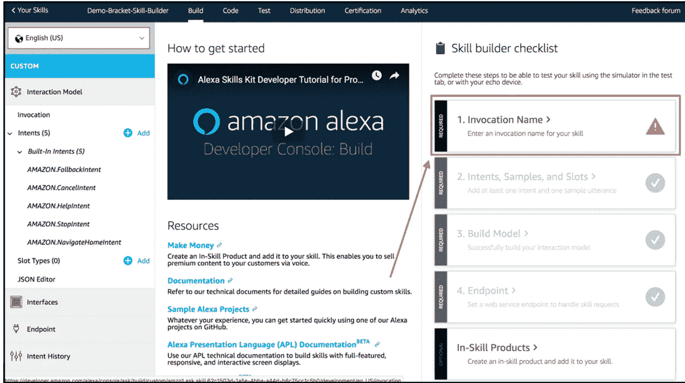

# AWS + React.js 全栈开发教程—构建无服务器锦标赛支架平台(第 5 部分:Alexa 技能)

> 原文：<https://levelup.gitconnected.com/aws-react-js-full-stack-development-tutorial-build-a-serverless-tournament-bracket-platform-bba56df47a5c>

由[耶戈·古格莱塔](https://unsplash.com/@lazargugleta?utm_source=medium&utm_medium=referral)在 [Unsplash](https://unsplash.com?utm_source=medium&utm_medium=referral) 上拍摄的照片

# 第 5 部分:Alexa 技能

VUI 代表语音用户界面。为了完成本实验的第一部分，我们需要在 AWS 管理控制台之外做一些工作。我们将使用 developer.amazon.com 的*，这是一个开发者为各种亚马逊平台构建应用程序的中心，比如 Fire TV 和 Echo devices。*

# 设置

首先，我们需要去[developer.amazon.com](https://developer.amazon.com/)创建一个档案。选择“Amazon Alexa”作为您个人资料的服务/技术:

亚马逊 Alexa

从顶部导航菜单中选择“技能构建者”:

技能建设者

然后选择“开始一项技能”

开始一项技能

点击“创建技能”

创造技能

创建我们的技能的唯一要求是填写技能名称并单击“创建技能”。我们选择了“演示-支架-技能-构建器”作为我们的技能名称:

技能名称

接下来，您可以选择从头开始创建任何东西，或者从一个模板开始创建。在这种情况下，我们将从头开始

从头开始

现在我们在技能生成器清单中。我们要设置的第一件事是[调用](https://developer.amazon.com/en-US/docs/alexa/interaction-model-design/design-the-invocation-name-for-your-skill.html)。首先单击“调用名称”:

填写“技能调用名称”并点击“保存模型”:

登录 AWS 控制台，点击 Cognito service

单击“管理用户池”,然后单击您的用户池

点击左侧边栏上的“域”

为您的 Alexa skill OAuth 流程输入一个域名，确保它可用并继续

请注意上面的 URL，因为它是许多后续步骤的基础。点击“应用客户端”并查看应用客户端(记下应用客户端 ID 和密码)。在 Alexa 开发者控制台点击“账户链接”和“切换账户链接”

向下滚动并抓取第一个重定向 URL

使用:

a.您在 Cognito 控制台中创建的域

b.Alexa 控制台的顶部重定向 URL

c.您在 Cognito 控制台上的应用客户端 ID

运行:

> $ python generate _ URIs . py<domain></domain>

返回 Alexa 开发人员控制台，准备好以下信息:

a.应用程序客户端 ID

b.应用程序客户端机密

c.用户信息 URI(脚本输出)

d.授权 URI(脚本输出)

e.访问令牌 URI(脚本输出)

用生成的信息填写 Alexa 帐户链接页面。

返回 Cognito 页面，点击“App Client Settings”，粘贴 3 个重定向 URL(用逗号分隔，无空格)，点击“authorization flow”复选框以匹配屏幕截图。

现在回到 AWS 控制台，打开 CloudFormation 服务

点击“创建堆栈”

选择“上传模板文件”,浏览到本次研讨会提供的 Lambda CloudFormation 模板，然后单击“下一步”。

将脚本输出中的堆栈名称和用户信息 URI 作为单个参数提供。

在提示中单击“下一步”,直到看到关于权限的最后一部分。该模板为 Alexa Lambda 提供了一个角色，因此您必须选中允许它这样做的复选框，然后单击“创建堆栈”

一旦部署了模板，单击“Resources”选项卡显示 IAM 角色和堆栈创建的 lambda。单击 lambda 资源链接，转到 Lambda 控制台。

在 Lambda 控制台的顶部，复制函数亚马逊资源号(ARN)来告诉 Alexa 技能使用什么端点。现在，回到 Alexa 开发者控制台，点击左侧边栏“端点”并将 Lambda ARN 粘贴到“默认区域”文本框，然后点击“保存端点”。

到目前为止，我们已经:

a.创建了一个 Alexa 开发者账户

b.创造了一个 Alexa 技能

c.已创建要验证的域(OAuth2.0)

d.正确配置了

e.创建了一个 AWS Lambda 函数，技能将启动

现在，我们只需要配置一种方法来调用我们的技能！

从左侧栏添加一个意图

创建调用短语(这些是你将要求括号助手做的来调用你的技能)

单击顶部的“测试”选项卡，并从下拉菜单中启用开发

尝试使用之前设置的短语“Alexa ask bracket helper to list my brackets”调用您的技能(这将向您的 Alexa 应用程序发送一个帐户链接卡，您将使用登录 bracket 网站时使用的相同凭据登录)。

转到您的 Alexa 应用程序，使用您的 bracket 网站凭据登录，以启用您的技能。

现在尝试在 Alexa 测试套件中再次调用您的技能，并查看您所在的支架！