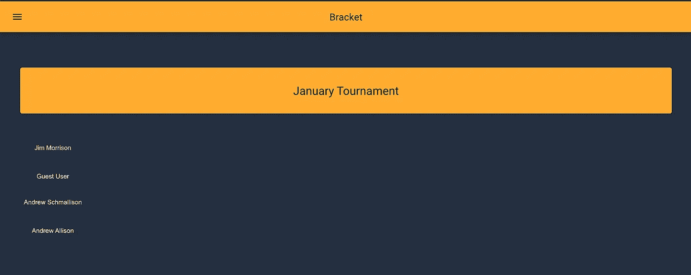

# AWS + React.js 全栈开发教程—构建无服务器锦标赛支架平台(第 1 部分:概述和设置)

> 原文：<https://levelup.gitconnected.com/aws-react-js-full-stack-development-tutorial-build-a-serverless-tournament-bracket-platform-f72023ed8831>



屏幕上显示程序运行的图片

# 第 1 部分:概述和设置

学习全栈开发是一项就业技能，可以帮助你度过当前就业市场的宏观环境。要开始学习这个，你不需要有很多以前的经验。最重要的是你的兴趣和学习意愿。我们将共同构建一个平台，使用一些业内最受欢迎的技能来管理锦标赛支架，包括 Amazon Web Services、Python、Javascript、React.js、Material-UI、Alexa 等。你可以[点击这里观看最终产品](https://d2xkt32vnfa5jb.cloudfront.net/)的演示。

## 主要部件的快速拆卸

**AWS**

[亚马逊网络服务](https://aws.amazon.com/)或 AWS 是世界上最大的云计算提供商。

**Alexa**

[Alexa](https://alexa.amazon.com/) 是亚马逊的虚拟助理技术。

**Python**

[Python](https://www.python.org/) 是一种脚本编程语言。

**JavaScript**

JavaScript 或 JS 是一种非常通用的编程语言，是万维网的核心技术之一，与 HTML 和 CSS 齐名。根据 StackOverflow.com 的说法，它是世界上最常用的编程语言。

**React.js**

[React](https://reactjs.org/) 是脸书开发的 JS 框架。

**物料界面**

[MUI](https://mui.com/) 是一个 React UI 样式库，最近从 [Bootstrap](https://getbootstrap.com/docs/3.4/) 那里接管了流行度。

## 概观

我们将使用 AWS 构建一个完整的无服务器平台。现在，我说“平台”是因为应用程序将有多个接口和微服务。将会有几个这样的实验，每个实验都建立在前一个实验的基础上，所以请确保按顺序完成它们。开始吧！

## 设置

**1。创建新的或使用现有的 AWS 帐户**

在[https://portal.aws.amazon.com/billing/signup#/start](https://portal.aws.amazon.com/billing/signup#/start)报名

**2。在该帐户中创建管理员角色/用户访问权限**

看 IAM:【https://console.aws.amazon.com/iam】T4。最佳实践是**永远不要**使用你的帐户的根凭证。

**3。安装 AWS-CLI**

https://docs . AWS . Amazon . com/CLI/latest/user guide/CLI-chap-install . html 中的说明(如果在 MacOS 上，建议自制)

```
$ aws --versionaws-cli/2.1.24 Python/3.7.4 Darwin/19.6.0 exe/x86_64 prompt/off
```

**4。安装 Python 3.7 和 pyenv**

在[https://www.python.org/downloads/](https://www.python.org/downloads/)和[https://github.com/pyenv/pyenv#installation](https://github.com/pyenv/pyenv#installation)下载安装说明

```
$ python3 --versionPython 3.9.2$ pyenv — versionpyenv 1.2.19
```

**5。用 nvm 安装 Node.js】**

在[https://github.com/nvm-sh/nvm#installation-and-update](https://github.com/nvm-sh/nvm#installation-and-update)下载和安装说明(首先安装 nvm，然后使用“nvm 安装<版本>安装您的节点版本)

```
$ nvm --version0.34.0$ nvm install 16Downloading and installing node v16.9.1...
Downloading [https://nodejs.org/dist/v16.9.1/node-v16.9.1-darwin-x64.tar.xz](https://nodejs.org/dist/v16.9.1/node-v16.9.1-darwin-x64.tar.xz)...
######################################################################### 100.0%
Computing checksum with sha256sum
Checksums matched!
Now using node v16.9.1 (npm v7.21.1)$ node --versionv16.9.1
```

6。安装 Docker 和 Docker 桌面

在[https://docs.docker.com/v17.12/install/#supported-platforms](https://docs.docker.com/v17.12/install/#supported-platforms)下载和说明

```
$ docker --versionDocker version 20.10.5, build 55c4c88
```

**7。安装 SAM-CLI**

在[https://docs . AWS . Amazon . com/server less-application-model/latest/developer guide/server less-Sam-CLI-install . html](https://docs.aws.amazon.com/serverless-application-model/latest/developerguide/serverless-sam-cli-install.html)下载和说明

```
$ sam --version
SAM CLI, version 1.31.0
```

**8。下载 AWS 云信息模板**

```
$ git clone [https://github.com/beatleboy501/PingPongBracketsMeta.git](https://github.com/beatleboy501/PingPongBracketsMeta.git)
```

**9。安装 GitBash (Windows 用户)**

本实验中包括的 shell 脚本无法在普通的 Windows 终端中运行，我没有包括 cmd/PowerShell 等效脚本。对于本实验中涉及使用终端的任何步骤，我建议您使用名为 GitBash 的工具。你可以在这里下载 git bash:[https://gitforwindows.org/](https://gitforwindows.org/)。

**10。安装一个 IDE**

如果您想使用 IDE，请选择您最喜欢的。出于所有意图和目的，我在本实验的示例中使用了 VSCode:

*vs code*:【https://code.visualstudio.com/Download 

*Atom*:[https://flight-manual . Atom . io/getting-started/sections/installing-Atom/](https://flight-manual.atom.io/getting-started/sections/installing-atom/)。

## 后续步骤

按照下一个实验中的[开始前端编程](https://medium.com/@andrewrobertallison/full-stack-development-tutorial-build-a-serverless-tournament-bracket-platform-part-2-b6dfbd878d46)