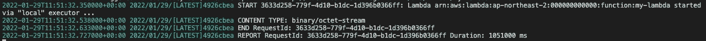

# AWS:使用 LocalStack 在本地运行 S3 触发的 Lambda

> 原文：<https://levelup.gitconnected.com/aws-run-an-s3-triggered-lambda-locally-using-localstack-ac05f03dc896>

在不离开本地环境的情况下测试您的代码

Jan Canty 在 [Unsplash](https://unsplash.com?utm_source=medium&utm_medium=referral) 上拍摄的照片

## **简介**

在本教程中，我们将创建一个 AWS Lambda —带有一个 S3 桶的文件上传调用。此外，我们将在本地测试它，而不需要使用 LocalStack 的 AWS 帐户。

一些先决条件:

*   码头工人
*   docker-撰写

如果我们的机器安装了 Docker 桌面，应该不错。

## **概述**

使用 LocalStack，我们将只使用三种服务:Lambda、S3 和日志。可选地，我们还可以包括 IAM 来创建角色和策略；然而，考虑到在使用 LocalStack 时它不会影响我们在 Lambda 和 S3 之间的集成，为了简洁起见，我们将跳过它。

因此，我们将采取以下几个步骤:

1.  使用 docker-compose 设置本地堆栈
2.  用 LocalStack 的端点 url 创建 Lambda 函数
3.  创建 S3 桶。同样，使用 LocalStack 的端点 url
4.  创建 S3 时段通知配置
5.  上传一个虚拟文件到 S3 桶
6.  通过日志检查 Lambda 的调用

现在，让我们详细介绍一下每个步骤。毕竟，大多数步骤(如果不是全部的话)只是使用来自 LocalStack 和 AWS 的现有模板进行配置和设置。

## **使用 docker-compose 设置本地堆栈**

下面是我们的 docker-compose.yml，我们将把它放在项目的根目录下:

从上面的配置中我们可以看到，我们已经通过一个环境变量列出了服务。此外，我们使用`4566`作为我们的边缘端口。

现在，使用我们项目根目录上的终端，让我们运行这个:
`docker-compose up`。

## 创建 Lambda 函数

在做任何事情之前，还是在我们项目的根目录下，让我们为 lambda 函数的源代码创建一个目录:`mkdir lambda-src`

接下来，我们可以直接从 AWS 获得模板，而不是从头开始创建代码；然而，为了节省我们更多的时间，下面是 index.js 的要点:

注意到上面的两行注释了吗？S3 客户端的这些参数:`endpoint`和`s3ForcePathStyle`，只有 LocalStack 才需要。如果我们将这个 Lambda 部署到 AWS，不要忘记删除它。

接下来，让我们使用 npm 快速安装 AWS-SDK:`npm i aws-sdk`

接下来，让我们看看我们的 package.json:

好像不错。现在，让我们确保`node_modules`存在。如果没有，让我们安装依赖项:`npm install`

假设一切就绪，同样在 lambda-src 目录中，让我们将源文件和 node_modules 一起压缩:`zip -r function.zip .`

最后，有了 function.zip 文件，让我们用 LocalStack 的端点 url 创建 Lambda 函数:

## 创建 S3 **桶及其通知配置**

类似于我们前面的 Lambda 函数，让我们用 LocalStack 的端点 url 创建 S3 桶:

接下来，让我们为 S3 存储桶创建一个通知配置 JSON 文件。这里，我们将`LambdaFunctionArn`和 S3 `events`一起设置为触发器。让我们将这个文件命名为`s3-notif-config.json`:

接下来，让我们运行这个命令来附加实际的触发器:

我们现在已经完成了所有必要的设置和配置。让我们调用 Lambda，将文件上传到 S3 存储桶。

## 将文件上传到 S3 存储桶

为了简单起见，让我们创建一个虚拟文件:`touch dummyfile.txt`

接下来，让我们将虚拟文件上传到 S3 存储桶:

## **检查 Lambda 函数的日志**

现在，下面是查看日志的命令:

最后，让我们通过 Lambda 函数的内容来验证它的调用:

不错！我们现在确信祈祷成功了。

和往常一样，这个演示的源代码可以在 [Github](https://github.com/emyasa/medium-articles/tree/master/aws-localstack/s3-triggered-lambda) 上获得。此外，这里的 [TLDR 版本](https://github.com/emyasa/medium-articles/tree/master/aws-localstack/s3-triggered-lambda#readme)。

如果您正在寻找更多与 AWS 相关的有趣文章，请随意查看:

 [## 在 Spring Boot 使用 AWS AppConfig 创建要素切换

### 无需重新启动服务器即可更改配置。

levelup.gitconnected.com](/create-features-toggles-using-aws-appconfig-in-spring-boot-7454b122bf91)  [## 使用 AWS Secrets Manager 的 Spring Boot 外部化数据库配置

### 实现高可用性、可扩展性和简单性

medium.com](https://medium.com/javarevisited/spring-boot-externalized-database-configuration-with-aws-secrets-manager-605f5ea3006a)