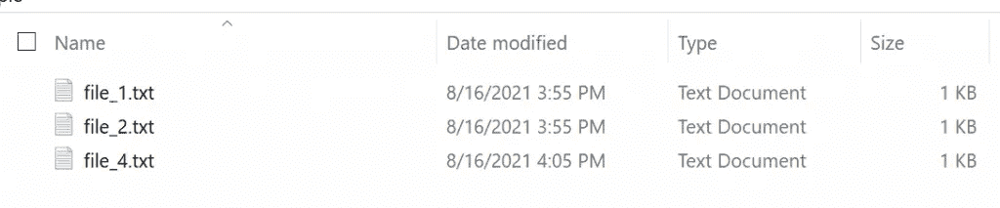
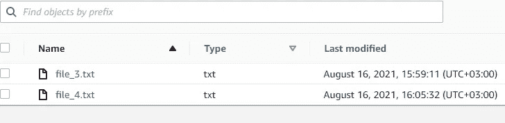
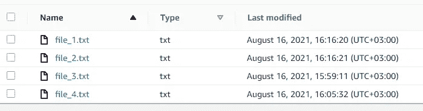
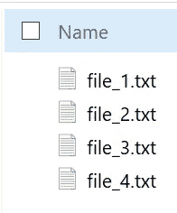

# AWS S3 同步示例

> 原文：<https://levelup.gitconnected.com/aws-s3-sync-example-fc53be7e646b>

## 如何将当前工作目录与 AWS S3 存储桶同步


[Unsplash](https://images.unsplash.com/photo-1606137039116-f771b914a6c7?ixid=MnwxMjA3fDB8MHxwaG90by1wYWdlfHx8fGVufDB8fHx8&ixlib=rb-1.2.1&auto=format&fit=crop&w=2100&q=80) 上的照片

[](https://jorgepit-14189.medium.com/membership) [## 用我的推荐链接加入媒体-乔治皮皮斯

### 阅读乔治·皮皮斯(以及媒体上成千上万的其他作家)的每一个故事。您的会员费直接支持…

jorgepit-14189.medium.com](https://jorgepit-14189.medium.com/membership) 

我们已经提供了[如何使用 AWS CLI](https://predictivehacks.com/how-to-interact-with-s3-using-aws-cli/) 与 S3 交互的示例。在本帖中，我们将展示如何将本地目录与 S3 同步。假设在我们的**本地目录**中有以下文件。

*   file_1.txt
*   file_2.txt
*   file_4.txt



而在**目的地 S3 斗**有以下文件:

*   file_3.txt
*   file_4.txt



我们的目标是通过将新的和更新的文件从源目录递归复制到目标目录来同步 S3 存储桶。让我们看看如何通过 AWS CLI 中的 [sync](https://docs.aws.amazon.com/cli/latest/reference/s3/sync.html) 命令轻松实现这一点。

```
aws s3 sync . s3:**//**gpipis**-**test**-**bucket**/**aws_sync_example**/**
```

输出

```
upload: .\file_1.txt to s3://gpipis-test bucket/aws_sync_example/file_1.txtupload: .\file_2.txt to s3://gpipis-test-bucket/aws_sync_example/file_2.txt
```

我们可以看到，只有 **file_1.txt** 和 **file_2.txt** 文件被上传到 S3 桶。



注意，如果本地文件的大小不同于 s3 对象的大小，本地文件的最后修改时间比 s3 对象的最后修改时间新，或者本地文件不存在于指定的桶和前缀下，则本地文件将需要上传。

我们可以反过来工作，也就是将 S3 桶定义为源，将本地目录定义为目标。例如:

```
aws s3 sync s3://gpipis-test-bucket/aws_sync_example/ .
```

输出

```
download: s3://gpipis-test-bucket/aws_sync_example/file_3.txt to .\file_3.txt
```



正如我们所看到的， **file_3.txt** 被添加到我们的本地目录中。

我们也可以同步 2 个 S3 存储桶，如下所示:

`aws s3 sync s3://mybucket s3://mybucket2`

最后，使用 sync 命令，我们可以执行更复杂的任务，例如通过排除或包含特定类型的文件，或者通过删除目标文件夹中存在但不在源文件夹中的文件来同步文件夹。

**例**:我们将任何存在于指定前缀和桶下，但不存在于本地目录中的文件删除。在这个例子中，用户将 bucket mybucket 同步到本地当前目录。本地当前目录包含文件 **test.txt** 和 **test2.txt** 。存储桶 mybucket 包含对象 **test3.txt** :

`aws s3 sync . s3://mybucket --delete`

输出:

```
upload: test.txt to s3://mybucket/test.txt
upload: test2.txt to s3://mybucket/test2.txt
delete: s3://mybucket/test3.txt
```

最后，如果我们想排除隐藏的文件和目录(。点文件和。点文件夹)

`aws sync --exclude "^\." ./ s3://mybucket`

[](https://jorgepit-14189.medium.com/membership) [## 用我的推荐链接加入媒体-乔治皮皮斯

### 作为一个媒体会员，你的会员费的一部分会给你阅读的作家，你可以完全接触到每一个故事…

jorgepit-14189.medium.com](https://jorgepit-14189.medium.com/membership) 

最初由[预测黑客](https://predictivehacks.com/?all-tips=aws-s3-sync-example)发布