# AWS S3M 模式:适用于 10 岁儿童的 Terraform 和 DevOps

> 原文：<https://levelup.gitconnected.com/aws-s3m-pattern-terraform-devops-for-a-10-years-child-dac4610017ff>

## 第 2 部分:地形和开发

# “技巧让您节省时间，轻松编码和部署您的 Terraform 配置文件”

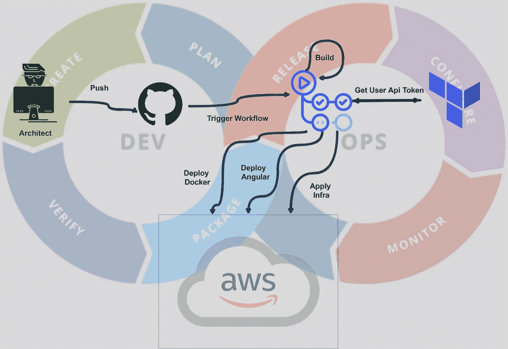

作为一名软件架构师或 FullStack 开发人员(有开发背景的人)，我总是对 Terraform 配置的语法感到恐惧(HashiCorp 配置语言:HCL)。

每次我读一个使用这种语法的文件的例子时，我什么也看不懂，也不知道为什么。

然而，我找出了原因:“这是因为我的大脑被格式化或编程为如何设计软件，如何制作算法来解决问题，等等…而不是其他”，所以我试图以这种心态理解 Terraform 配置文件，我将我对简单配置语言(HCL)的理解复杂化了，

所以我写了这个故事来与你分享技巧和诀窍，通过实现我以前写的 S3M 模式来更好地理解和部署 Terraform。

> 为了更好地理解实现的例子，请参考我以前的故事

[](https://naoufal-gafa.medium.com/aws-when-serverless-and-microservice-get-married-securely-6585f7856a0f) [## AWS S3M 模式:安全结合无服务器和微服务的 5 个步骤

### “使用这种抽象模式来构建复杂的云架构，可以节省您的时间”

naoufal-gafa.medium.com](https://naoufal-gafa.medium.com/aws-when-serverless-and-microservice-get-married-securely-6585f7856a0f) 

所以，我们走吧😉

> *先决条件:*
> 
> → AWS 账户
> 
> → [AWS 编程帐户](https://docs.aws.amazon.com/IAM/latest/UserGuide/id_users_create.html)，具有编程访问和管理权限
> 
> → [笔记本电脑中配置的 AWS CLI](https://docs.aws.amazon.com/cli/latest/userguide/install-cliv2.html)(如果您想从笔记本电脑运行 infra。AWS/配置)
> 
> →更好地理解 S3M 模式

# Terraform:什么？为什么？怎么会？

## 什么是 Terraform？

是一个 IaC 软件工具😲→下文作为代码软件工具😳→允许我们对基础设施进行编码的软件😜。

编码 infra 可以用两种方法来完成:命令式(How)或声明式(What)或两者结合。

***祈使:***

*   关注基础设施必须如何完成
*   定义需要以适当的顺序执行的特定命令，以便以期望的结论结束

***说明性*** :

*   关注最终的目标配置应该是什么
*   定义期望的状态，系统执行需要发生的事情以达到期望的状态

Terraform 是声明性的，所以现在你知道为什么作为一个软件架构师，我把事情复杂化，我的思想总是集中在如何(总是设计如何)上，但是如果你需要容易地理解 Terraform，你应该把你的思想转向什么，这样一切都会变得太容易😉

## 为什么要用？

谈到开发和移植，Terraform 是一个很好的工具。有理由考虑将 Terraform 作为 IaC 工具之一:

*   可移植性:这是 Terraform 解决的大问题:它使得在同一云提供商的不同环境(开发、前期、生产)中复制基础架构变得容易。此外，因为 Terraform 完全不受平台限制，所以如果公司决定更换云提供商，它可以为新的云提供商提供编码资源。
*   Terraform 允许您在一个配置文件中定义基础设施，并通过将您的代码放在源代码控制(Git)中，构建并部署它，使您能够轻松地跟踪基础设施的变化。
*   Terraform 有一个活跃的社区，并且是开源的，有一个巨大的社区正在围绕这个工具发展。很多人已经在用了，更容易找到知道怎么用的人，插件，扩展，专业支持等等。这也意味着地球正在以更快的速度进化。他们经常发布。
*   Terraform 的速度和操作都非常出色。Terraform 的一个很酷的地方是，它的 plan 命令可以让你在应用之前看到你将要应用的改变。

## 怎么用？

*   [下载最新版本并安装](https://www.terraform.io/downloads.html)
*   选择一个文件夹并创建一个文件。tf 扩展并编写这个简单的例子:

```
# Declare wish provider you want to use
provider "aws" {
   region = "us-east-2"
}# Declare a VPC
resource "aws_vpc" "s3m-vpc" {
    cidr_block = "10.0.0.0/16"
    enable_dns_hostnames = true
     tags = {
    "project" = "S3M"
    "tuto"="medium"
  }
}
```

*   在同一个文件夹中，打开一个终端并运行以下命令

```
terraform init
```

> 这个命令是为你的云提供商下载所有的依赖项(比如 npm install 或者开发者的 dotnet restore for)

```
terraform plan 
```

> 该命令用于创建执行计划。除非明确禁用，否则 Terraform 会执行刷新，然后确定需要执行哪些操作才能达到配置文件中指定的所需状态。
> 
> 您可以跳过此命令，直接应用 IaC，但是建议您在应用 infra 之前，先看看您的计划中有什么，并修复错误或缺陷

```
terraform apply
```

> `terraform apply`命令用于应用所需的更改，以达到所需的配置状态，或者由`terraform plan`执行计划生成的一组预先确定的动作。

*   您现在可以进入您的帐户，验证 VPC 是否是在**美国东部-2 地区**创建的
*   最后，要销毁您创建的内容，您可以运行以下命令:

```
terraform destroy
```

# 在复杂架构上实现 Terraform 的技巧

在这一节中，我会给你一些**技巧&窍门**来节省你编写**复杂架构**的时间。

我们就拿我之前写的 [**S3M 模式**](https://naoufal-gafa.medium.com/aws-when-serverless-and-microservice-get-married-securely-6585f7856a0f) 来举例。提醒一下这个架构:

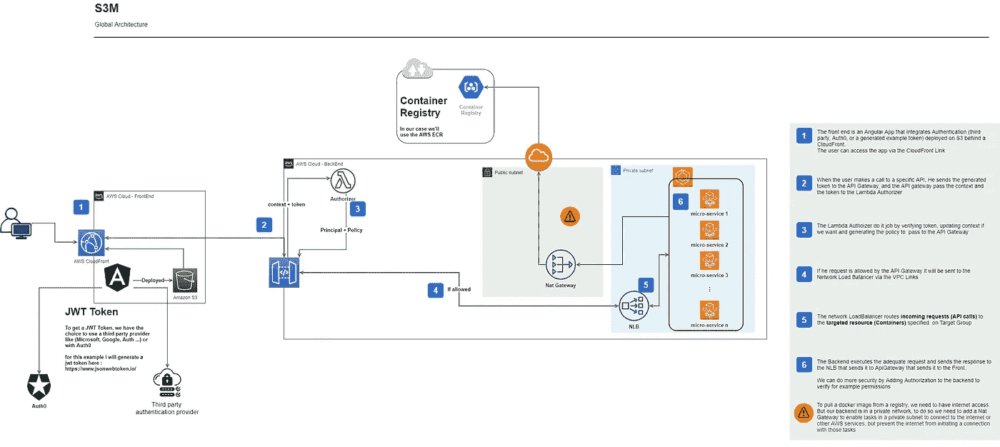

S3M 模式

[](https://naoufal-gafa.medium.com/aws-when-serverless-and-microservice-get-married-securely-6585f7856a0f) [## AWS S3M 模式:安全结合无服务器和微服务的 5 个步骤

### “使用这种抽象模式来构建复杂的云架构，可以节省您的时间”

naoufal-gafa.medium.com](https://naoufal-gafa.medium.com/aws-when-serverless-and-microservice-get-married-securely-6585f7856a0f) 

## ***提示 1:待办事项*** *列表* ***什么*** *我们想要的*😜：

如你所见，对于这个**模式**，我们需要这些**模块**:

1.  **VPC** 有三个**子网**(两个**私有**和一个**公有**)
2.  **APIGateway** 与 VPC **链接**
3.  **授权人**(**λ**和 **API 网关**)
4.  **ECS 集群 Fargat** 带有**任务定义**和**服务**
5.  **NLB** (带有**目标组**的网络负载平衡器)
6.  **S3** 为静态网站托管

## *技巧二:创建一个* ****。tf*** *文件用于每个* ***块*😄:**

1.  vpc.tf
2.  api-gateway.tf
3.  授权人. tf
4.  cluster.tf
5.  负载平衡器. tf
6.  s3.tf
7.  为了正确地组织我们的代码，我们还可以为不同的策略创建一个文件夹(JSON 文件)

## *提示三:将* ***魔法*******复制过去*😅***

1.  *O [***打开 AWS***](https://registry.terraform.io/providers/hashicorp/aws/latest/docs) 的 Terraform 文档*
2.  *对于每个文件:**复制并粘贴**配置，如下图所示:*

*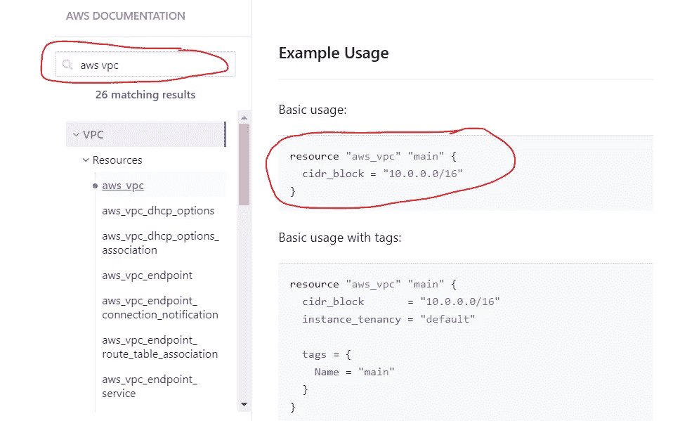*

*在地形上过滤*

*因此，举例来说，如果我们用 **S3M 模式**来实现文件 **vpc.tf** ，它看起来会像这样:*

> *Y ou 可以从 [***这里***](https://github.com/ngaffa/S3M_IAC)*克隆完整的例子，并遵循之前解释的“**如何使用它**”。**

> **如果你在问:**履行订单怎么办？**！我们应该从 VPC、ECS、APIGateway 还是……开始？******
> 
> ****答:不是你的问题😝，你不需要关心这个😃，你的工作是描述，而 Terraform 的工作是定义执行你的员工的最佳方式😉****

# ****DevOps 哲学****

## ****定义****

****什么是真正的 DevOps？ **DevOps 不是职称**😠，其实就是一套结合了软件开发( *Dev* )和 it 运营( *Ops* )的实践。****

****DevOps 计划可以通过以下方式为公司带来文化变革:****

*   ****转变运营、开发人员和测试人员在开发和**交付过程中的合作方式**😃。****
*   ****让这些团队紧密合作是企业采用 DevOps 的一个关键挑战😃。****
*   ****DevOps 不仅关乎工具链，也关乎文化。****

******因此，当一些公司在他们的工作流程中寻找 DevOps 工程师时，这意味着他们没有准备好改变他们的理念和文化，这可能只会加深开发人员和运营团队之间的脱节**😅**。******

## ****工具链****

****DevOps 工具适合一个或多个活动，这些活动支持特定的 **DevOps 计划**:计划、创建、验证、打包、发布、配置、监控和版本控制。更多信息请点击[此处](https://en.wikipedia.org/wiki/DevOps_toolchain#Plan)****

> ****在这个故事中，我将把重点放在这些工具上，以保持简单:**创建(代码)**，**打包(工件)**，**发布(部署)**，**配置(IaC)，版本控制。******

# ****使用 GitHub 动作自动化所有操作:(弄脏你的手)****

****既然你已经知道了**terra form**&**devo PS**是关于什么的，那么让我们用 **GitHub 动作**对**打包**、**发布**、**配置**后端、前端的**交付过程以及 IaC (Config)** 进行一些自动化吧****

******GitHub Actions** 通过 **CI/CD** 使我们所有软件工作流程的自动化变得更加容易。我们将用它从 **GitHub** 中**打包**、**发布、**和**配置**我们的代码。****

> *****先决条件*:****
> 
> ****→ GitHub 账户:你需要一个 GitHub 账户来克隆我的回购例子，以自动化和建立管道****
> 
> ****→ Terraform 免费帐户:在下面的 IAC 存储库中解释****

****对于自动化，我制作了 3 个管道，每个仓库一个:****

1.  ****[IaC 库](https://github.com/ngaffa/S3M_IAC)****
2.  ****[API 存储库](https://github.com/ngaffa/S3M-BackEnd)****
3.  ****[静态网站知识库](https://github.com/ngaffa/S3M-FrontEnd)****

****如你所见，对于每个回购，我都有一个位于**的 **Yaml** 文件。github/工作流**。该文件将由 GitHub 的**动作工作流解释，以运行构建和部署的管道。******

****为了更好的理解，所有的 Yaml 文件都有很好的注释😃****

1.  ****对于 IaC:管道将简单地应用我们的基础设施****
2.  ****对于 API:管道将**在 **docker 映像**中封装**我们的包，并将其推送到 **Ecr Repo******
3.  ****对于静态网站；管道将**构建**我们的 **Angular** 项目；并**将其部署**到 **S3 静态网站托管******

## ****IaC 知识库:****

****要自动部署 Terraform IaC 代码，您有两种选择:****

*   ****只需使用 Github Action:[https://acloudguru . com/blog/engineering/how-to-use-Github-actions-to-automate-terraform](https://acloudguru.com/blog/engineering/how-to-use-github-actions-to-automate-terraform)****
*   ****通过使用 Terraform Cloud Api(如下例):[https://learn . hashi corp . com/tutorials/terra form/github-actions](https://learn.hashicorp.com/tutorials/terraform/github-actions)****

****在我们的案例中，我选择使用 Terraform Cloud 来管理 terraform cloud workspace 上的所有 Terraform 员工和工作流，这样团队就可以轻松地管理和批准架构，并且它与 terraform 的工作流和数据深度集成，这使 terraform 变得更加方便和强大。****

****因此，首先你应该用 Terraform 创建一个免费帐户，并遵循以下步骤。****

*******1-创建你的组织*******

****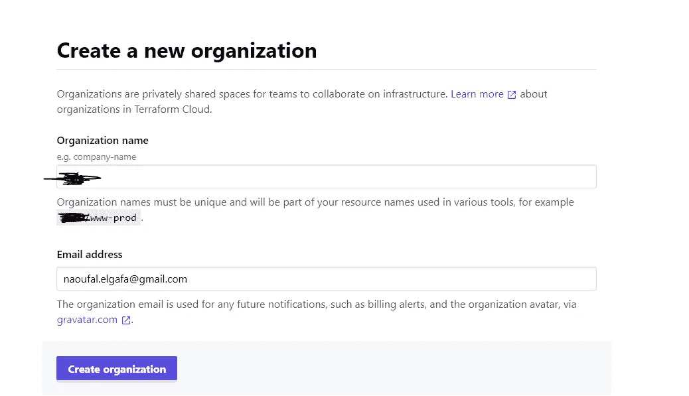****

****平台组织****

****一旦创建了组织，就该创建工作流了****

*******2-创建工作流*******

****为此，点击 API 驱动的工作流，如下图所示，并创建您的工作流****

****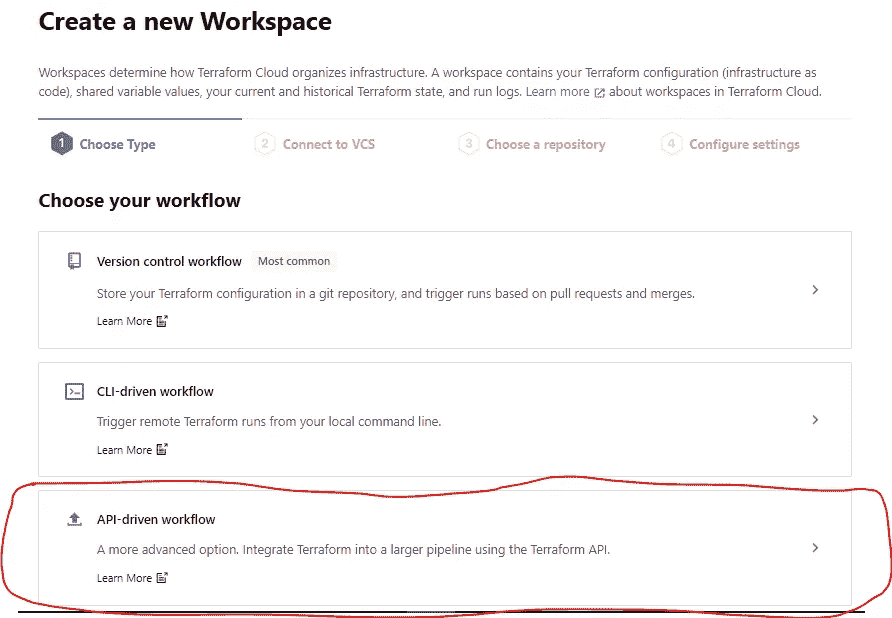****

****Terraform 工作流程****

****命名您的工作空间并创建它****

****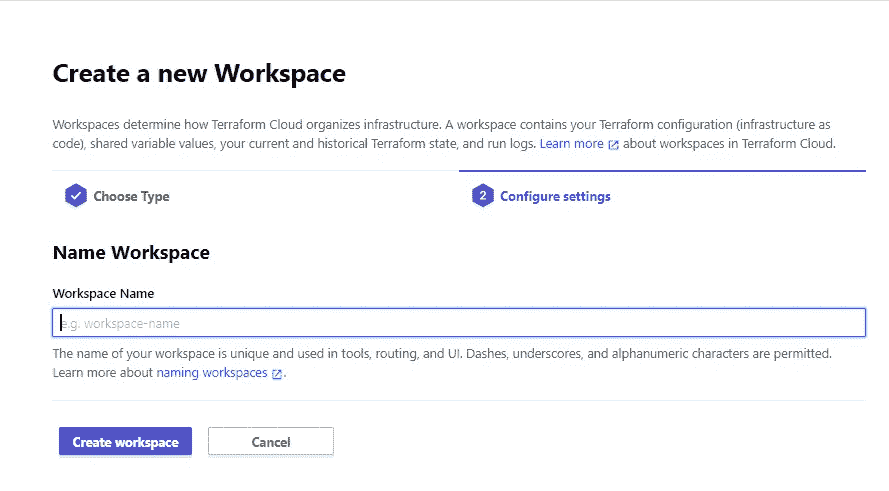****

****地形工作空间****

****创建工作空间后，terraform 将为您生成这段代码，以便在您的存储库中的主配置文件( **main.tf)** 中使用。****

****所以，复制粘贴这段代码(完整的例子可以在我的报告中找到****

```
****terraform {
  backend "remote" {
    organization = "your organization name"workspaces {
      name = "your workspace name"
    }
  }
}****
```

*******3-生成 Terraform 云用户 API 令牌:*******

*   ****转到:[https://app.terraform.io/app/settings/tokens](https://app.terraform.io/app/settings/tokens)并点击**“创建 API 令牌”******

****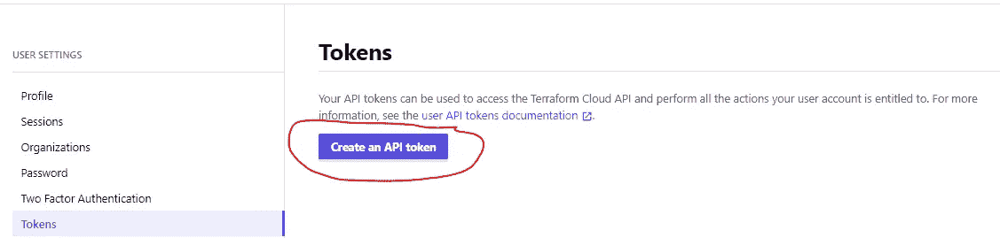****

****Terraform 用户 API 令牌****

*   ****给它一个描述以帮助您稍后识别这个令牌，然后单击**“创建 API 令牌”******

****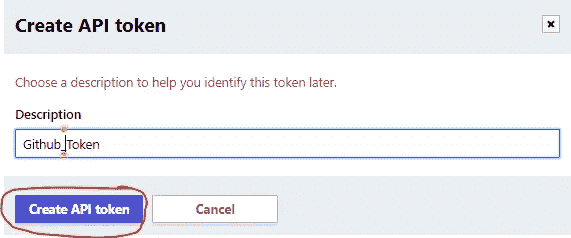****

*   ****复制生成的令牌****

****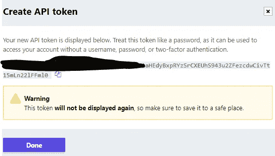****

****地形生成的令牌****

*******4-将生成的令牌作为 GitHub 秘密存储在 IaC 存储库:*******

****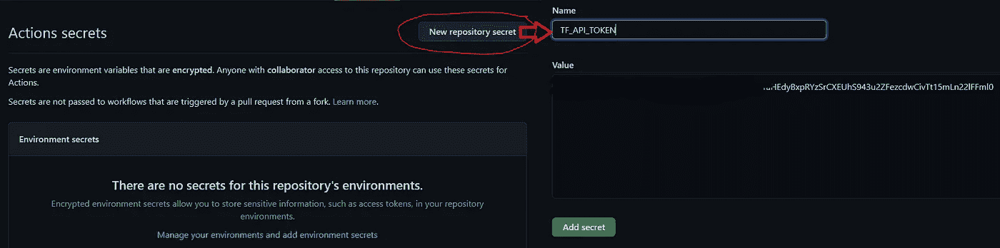****

****回购秘密****

****你可以点击查看 [GitHub 文档。](https://docs.github.com/en/actions/reference/encrypted-secrets#creating-encrypted-secrets-for-a-repository)****

*******5-在 Terraform Cloud 环境变量上存储 AWS 键:*******

****我们需要将我们的 **AWS 访问密钥**和**秘密密钥**保存在 T **erraform 环境变量**上，因此当 Github 管道运行时，它将使用这些凭证来**计划**和**将我们的**应用到下面的 **AWS 帐户**。****

****为此，请访问[https://learn . hashi corp . com/tutorials/terra form/cloud-workspace-configure](https://learn.hashicorp.com/tutorials/terraform/cloud-workspace-configure)并遵循以下步骤****

*   ****添加环境变量****

****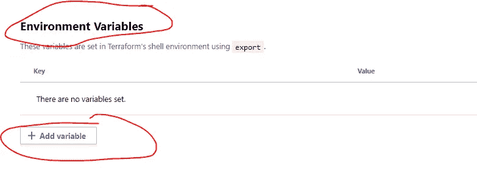****

****创建 Terraform 环境变量****

*   ****创建这两个环境变量，并使它们对**敏感**:****

****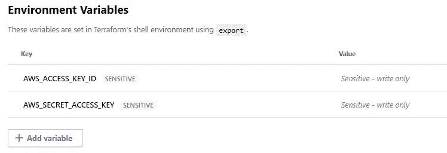****

****地球秘密****

****想了解更多关于在 Terraform 上管理秘密的信息，你可以关注这个[博客](https://blog.gruntwork.io/a-comprehensive-guide-to-managing-secrets-in-your-terraform-code-1d586955ace1)****

*******6-在 GitHub 上运行您的管道*******

****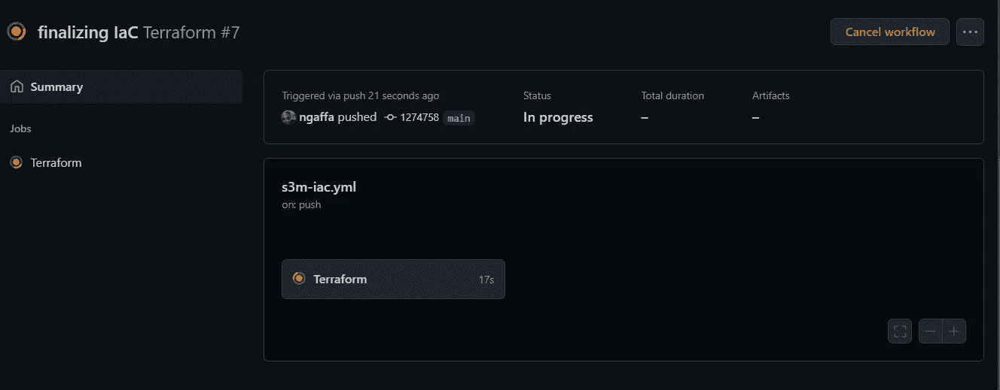****

****GitHub 管道****

## ****API 存储库:****

****在部署了我们的基础设施之后，现在是时候部署我们的 API 了，否则，管道将简单地将一个 docker 映像推入 ECR(仅此而已😄)****

****不要忘记在您的 **API 库**的秘密中添加 **AWS_ACCESS_KEY_ID** 和 **AWS_SECRET_ACCESS_KEY** ，并通过 **GitHub Action 选项卡**运行管道****

****完整的例子可以在 [**这里找到**](https://github.com/ngaffa/S3M-BackEnd)****

****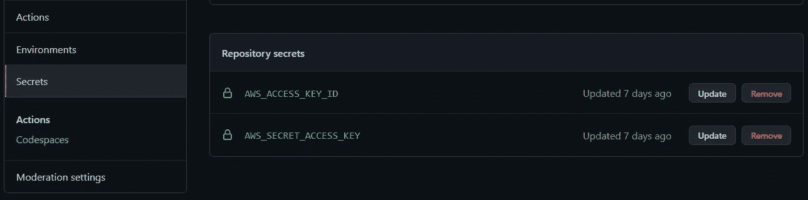****

****API 秘密****

## ****静态网站存储库:****

****因为我们没有将自定义域名附加到我们的 **API 网关**上，所以我们应该复制由 IaC 部署生成的**端点**，并将其传递到**静态网站**的环境变量中****

> ****另一个更复杂的选择是将环境变量存储在配置管理器中，如(AWS secrets manager)或使用云不可知工具，如 [SOPS](https://github.com/mozilla/sops)****

****1-转到您的 **APIGateway 仪表板**，点击创建的 **API** ，转到**阶段**和**复制**端点****

****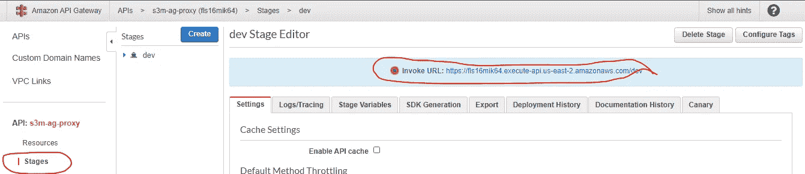****

****API 网关端点****

****2-转到您的**静态网站库**，更新环境文件并提交****

****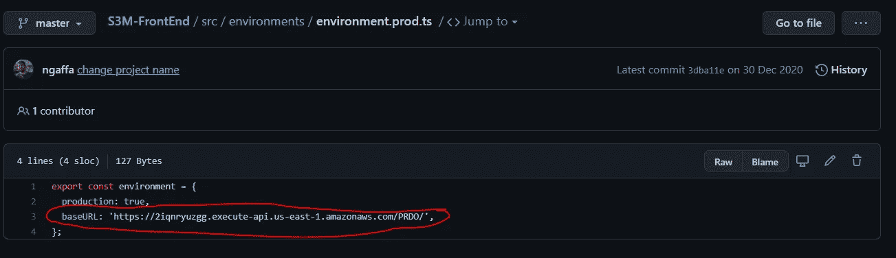****

****静态网站环境****

****3-运行您的管道(不要忘记在您的 API 存储库的秘密中添加 **AWS_ACCESS_KEY_ID** 和 **AWS_SECRET_ACCESS_KEY** ，并通过 **GitHub Action 选项卡运行管道)******

****4-通过进入你的 **s3 静态网站端点**，复制链接，粘贴到你的浏览器，点击**“获取天气”**按钮，检查是否一切正常****

****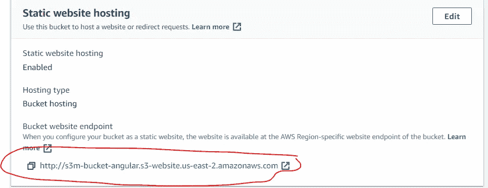****

****S3 链接****

****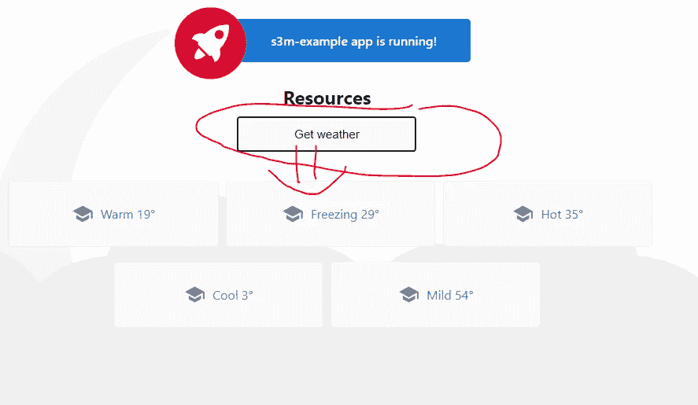****

****最后检查****

****Greaaaaaaaaaat，一切都自动化了，像魔法一样工作😄****

# ****结论****

****在现实生活中，**编码**和**管理**基础架构的源代码是一件很棒的事情，因为它允许**公司架构师**遵循所有的**变更集**，并且只应用变更，而不会破坏所有的基础架构。****

****在现实生活中，**编码**和**管理**下面的**源代码是一件很棒的事情，因为它允许**公司架构师**跟上所有的变化，并且只应用**必要的更新**而不破坏整个系统。******

******IaC 理念**也促进了**基础设施**的**可移植性******

*   ******不同云提供商之间******
*   ****不同**环境**的**同一个**云提供商之间****

****当我们将 IaC 与 **real DevOps 哲学**捆绑在一起时，我们节省了更多的流程**交付**的时间，同时**保持了**更好的**质量**代码**。******

****如果你是这些技术的新手 **(AWS，IaC，DevOps)** ，这个博客将帮助你理解不同砖块 **(AWS，IaC，DevOps)** 的顺序，并且将阻止你跟随许多教程和去各个方向。****

****我想顺便感谢 Soufian Belehrache 的技术建议。****

****如果您有任何意见，或者有什么不清楚的地方，请在我的 [Fb 页面](https://www.facebook.com/neogafa)、 [Twitter](https://twitter.com/NaoufalGafa) 或通过[我的网站](https://www.elgafa.com/)发表评论或联系我****

****最后，我有一个挑战给你:****

*   ****如果您还没有 GitHub 帐户，请创建一个****
*   ****创建一个 Terraform 免费帐户****
*   ****运用你在这个故事中学到的东西 ***“用 GitHub 动作自动化所有的部分:(弄脏你的手)*******
*   ****祝您好运****

****下一个故事再见，✌️.****

# ****参考****

*   ****[AWS 提供商的 Terraform 文档](https://registry.terraform.io/providers/hashicorp/aws/latest/docs)****
*   ****[地形定义](https://en.wikipedia.org/wiki/Terraform_(software))****
*   ****[地形介绍](https://blog.gruntwork.io/an-introduction-to-terraform-f17df9c6d180)****
*   ****[创建 Fargate ECS 任务](https://www.chakray.com/creating-fargate-ecs-task-aws-using-terraform/)****
*   ****[带地形的 ECS](https://github.com/alex/ecs-terraform/blob/master/services.tf)****
*   ****[带地形的授权人](https://gist.github.com/mendhak/8303d60cbfe8c9bf1905def3ccdb2176)****
*   ****[DevOps](https://en.wikipedia.org/wiki/DevOps#:~:text=DevOps%20is%20a%20set%20of,delivery%20with%20high%20software%20quality.)****