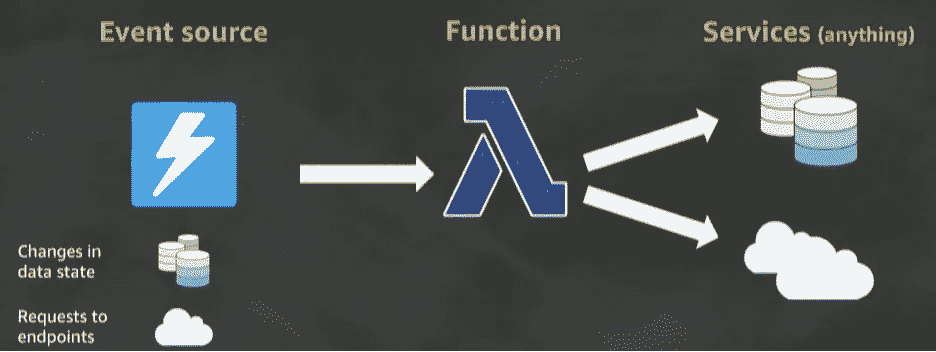
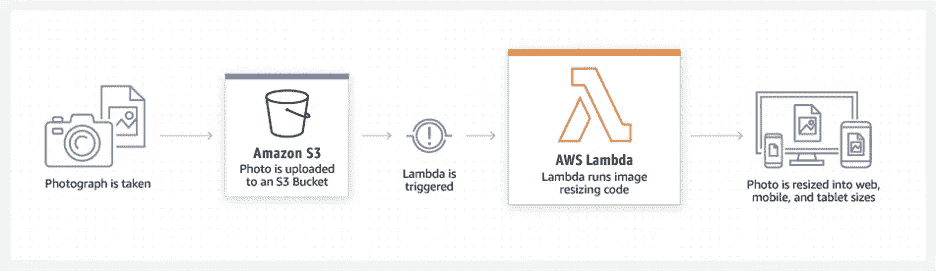
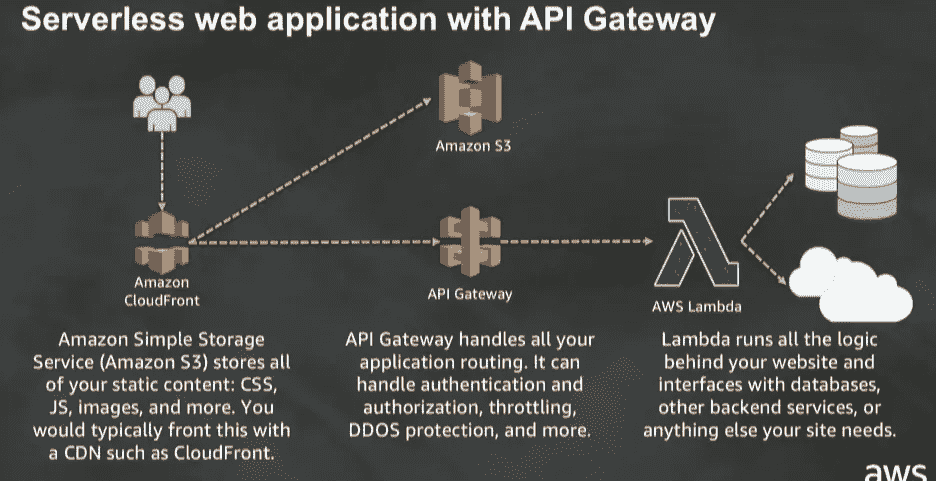
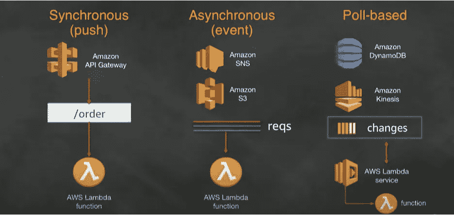
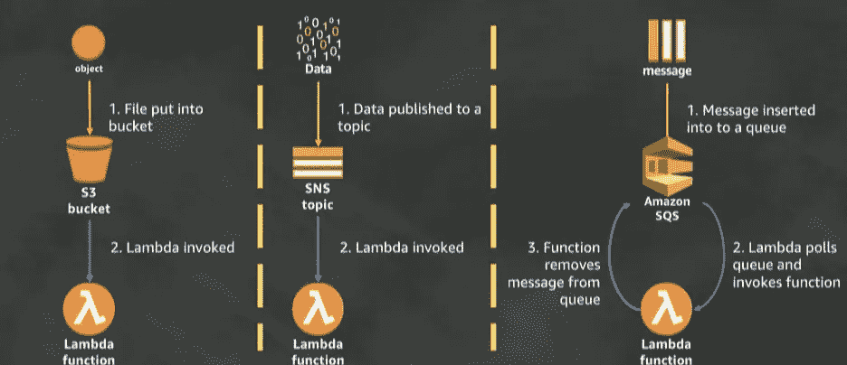
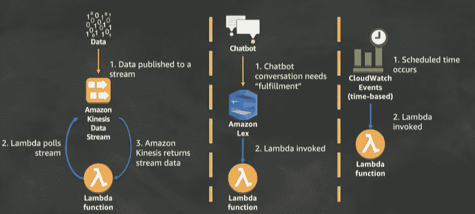
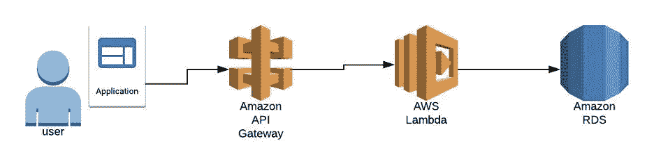
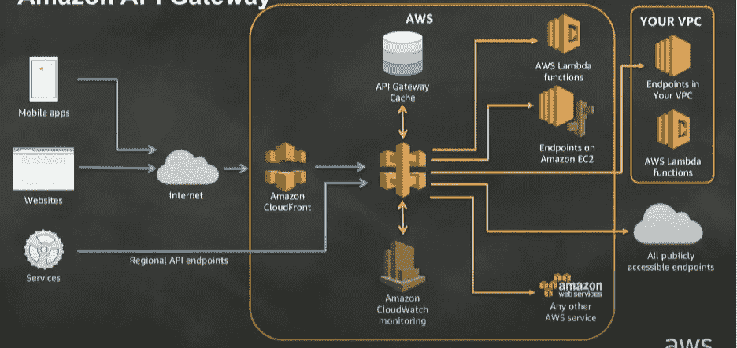

# AWS 虚拟无服务器架构

> 原文：<https://levelup.gitconnected.com/aws-serverless-architecture-for-dummies-fc9622908c2e>

# 概观

在这篇短文中，我们将介绍 AWS 架构的基础知识。在对一个无服务器的 web 应用程序进行渗透测试后，我决定创建这个概述，并希望它能被证明是有用的，作为对 AWS 无服务器架构的快速速成课程。

# **什么使得应用程序不需要服务器？**

一个无服务器应用通常由许多**微服务**组成。什么是微服务？微服务是一种独立的模块化服务，可以作为独立的服务进行部署。这意味着每个服务在一个域中只做一项工作，并且只做这项工作本身。

认证服务就是微服务的一个例子。身份验证服务接受凭证，验证真实性，并返回一个 JWT 令牌(一个验证您是您所说的那个人的令牌)。

每项服务通常被配置为尽可能利用云供应商或外部供应商的现有托管服务。这大大减少了维护服务所需的代码——这是开发人员走向无服务器的强大驱动力。

**AWS Lambda** 是功能即服务，充当微服务的“粘合代码”,并帮助跨域连接功能。



下面是一个使用 AWS Lambda 函数的示例，该函数用于对上传到 S3 存储桶(公共云存储资源)的照片执行操作。



# 简化的无服务器 Web 应用程序关系图



基本无服务器 AWS 架构概述

# 什么是 AWS Lambda？

**AWS Lambda** 是托管计算服务，当预先配置的事件触发其执行时，它将自动扩展并执行代码。这是什么意思？

这意味着在 AWS Lambda 函数中，我们可以对从**事件对象**传递给它的数据(Lambda 函数被调用时接收的数据)做任何我们需要做的事情。

以下是一些潜在 Lambda 事件触发器的示例:

*   将物体放入 S3 桶中
*   安排一个动作发生
*   修改数据库中的数据

# λ函数的剖析

**Handler()函数—** 调用时要执行的函数

**事件对象**—Lambda 函数调用期间发送的数据。例如，如果数据来自 API 网关，可能的事件对象有:

*   小路
*   头球
*   请求正文信息
*   其他参数

另一个例子是数据来自 S3 存储桶。可能的事件对象有:

*   存储桶名称
*   目标键
*   动作类型

**上下文对象—** 可用于与运行时信息交互的方法。常见用途是查找日志信息和其他相关项目。以下是上下文对象的一些示例:

*   请求 ID
*   日志组

## Lambda 函数示例

```
**def lambda_handler(event, context):****# TODO implement****Return {****‘statusCode’: 200,****‘body’: json.dumps(‘Hello World’)****}**
```

# Lambda 权限模型

有各种权限策略定义 Lambda 函数中发生的操作:

**执行策略—** 定义一个函数可以做什么。具体来说，它定义了一个函数可以通过 IAM 访问哪些 AWS 资源/ API 调用。

**功能策略—** 定义谁或什么可以访问功能。例如，假设我们有一个与 Lambda 函数交互的 S3 桶。函数策略将概述调用 Lambda 函数的 S3 桶上的动作。

# λ执行模型

在 AWS 无服务器架构中处理 Lambda 函数时，有 3 种主要的执行模型:



**同步(推送)——**与应用程序的主线程同步发生。假设我们有两个事件(A & B)。在同步模式中，A & B 相继发生而不是并行发生。

*   请求被发送到 API
*   API 网关被配置为与 Lambda 函数对话
*   收到一个响应，其中包含在 Lambda 函数中执行的操作的结果

**异步(事件)——**独立于应用程序的主线程发生。假设我们有两个事件(A & B)。在异步模式中，A & B 彼此同时发生。

*   请求被发送到 API
*   API 网关被配置为与 Lambda 函数对话
*   向 Lambda 函数发送请求
*   Lambda 函数执行并执行动作

**基于轮询—** 数据流由服务提供。Lambda 从流中轮询消息，然后提取消息/更改，并将它们传递给 Lambda 调用。

# 其他 Lambda 架构示例

下面是 AWS 无服务器架构中使用的 Lambda 的参考示例图。

## **Lambda 示例#1 的无服务器架构**



## Lambda 示例#2 的无服务器架构



# Lamda API

Lambda API 由所有其他跨所有模型调用 Lambda 的服务使用。因为每个 SDK 中都有一个客户端，所以 SDK 客户端调用 Lambda 函数，而 Lambda 函数又执行 Lambda 函数。

例如:

*   API 网关调用 Lambda API 来调用 Lambda 函数
*   S3 桶调用 Lambda API 来调用 Lambda 函数
*   您自己的定制代码调用 Lambda API 来调用 Lambda 函数

# API 网关基础

下图是无服务器 AWS 架构中的基本 API 网关图:



简而言之，API 网关使您能够创建端点。它还为您提供了在您建立的这些端点上为多个微服务创建统一 API 前端的能力。因此，API 网关通常与 Lambda 函数一起使用来创建 API 后端。如果您熟悉传统的 MVC 应用程序架构，您可以将 API 网关与路由管理器进行比较。

## API 网关的优势

API 网关使您能够在 REST(标准 HTTP 通信)和 websocket 端点(后端和前端之间的来回通信)之间进行选择。

API 网关对于认证和授权功能也非常有用。理想情况下，请求在触发 lambda 函数之前需要一个授权令牌。API 网关可以让您配置如何以集中的方式处理用户授权/认证逻辑。

例如，假设一个拥有认证令牌的用户在到达预期的 Lambda 函数之前向授权者 Lambda 函数发送了一个请求。授权者 Lambda 函数在接收到请求后，将向最初预期的 Lambda 函数发送允许请求，使用户能够访问资源或执行任何预期的动作。

API 网关还可用于:

*   请求架构验证
*   API 键
*   节流和 DDOS 保护
*   还有更多！

下面是无服务器 AWS 架构中 API 网关的一个更复杂的示意图，供您参考:



# 结论

感谢您阅读 AWS 无服务器架构速成概述！我希望它能对任何对无服务器架构感兴趣的人有用，并提供一个了解更多的基础。

我计划在不久的将来分享更多的见解和评论。要了解最新消息，请在 Twitter 上关注我！

[推特](https://twitter.com/obheda12)

**与我联系的其他平台:**

[GitHub](https://github.com/obheda12)

[领英](https://linkedin.com/in/omarbheda)