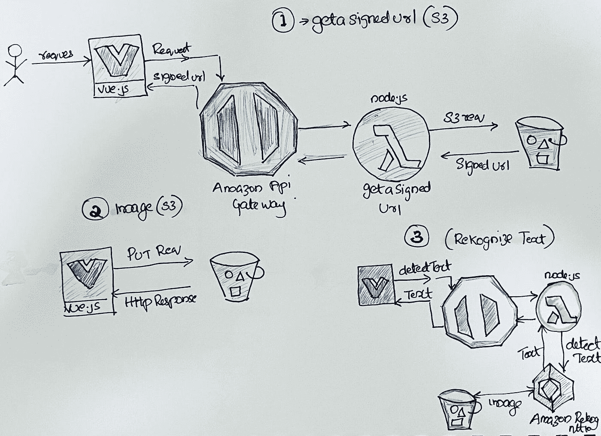
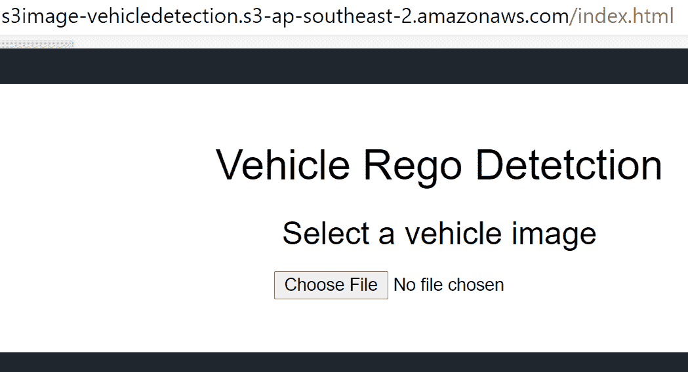
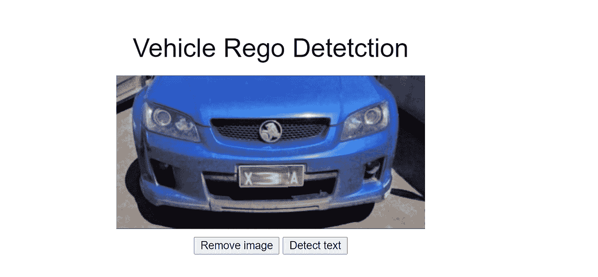
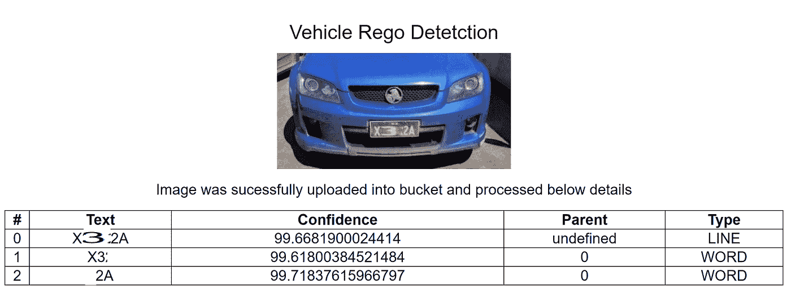

# 使用 AWS Lambda 和 Rekognition 框架的人工智能和无服务器计算。

> 原文：<https://levelup.gitconnected.com/aws-serverless-computing-faas-application-using-aws-lambda-and-aws-rekognition-saas-dbc072cee258>


斯科特·韦伯在 [Unsplash](https://unsplash.com?utm_source=medium&utm_medium=referral) 上拍摄的照片

不管与无服务器计算相关的许多神话和事实，我尝试在 AWS 栈上开发一个无服务器应用程序。无服务器架构的最佳用例之一是 REST APIs，它可以通过 AWS Lambda 和 API Gateway 在几分钟内快速构建。在这篇博文中，我将介绍如何实现无服务器计算，并展示这种方法的好处。你可以从这篇博文的 [GitHub repo](https://github.com/rollendxavier/serverless_computing) 中下载完整的代码，所有完整的设置都在那里有解释。

## 要求

我将使用 **Vue** 和 **Node.js** 创建一个前端应用程序，它将识别上传的车辆图像(或任何图像)并利用无服务器架构显示车辆注册细节。虽然这一过程很简单，但在更繁忙的应用程序中，这可能会对本地 web 服务器的性能产生显著的副作用。我在这里使用 AWS Lambda 作为我的无服务器应用程序，除了 AWS Lambda 和 Azure，还有其他无服务器框架，如 Google Cloud Functions、IBM OpenWhisk 和 Iron.io，它们都是强有力的竞争对手。

下面是这个应用程序所涉及的术语列表

*   无服务器计算:AWS
*   基础设施代码 IaC: AWS 服务器应用程序模型(SAM)
*   对象存储和基于事件的计算(AWS S3)
*   图像识别:AWS 识别框架
*   微服务架构
*   AWS: API 网关
*   安装的工具:AWS CLI、AWS SAM CLI 和 NodeJS 12。x，VS 代码
*   Axios 库，Vue.js JavaScript 框架

## 体系结构

下图解释了这个无服务器应用程序的架构。这是 Lambda 函数、事件源和其他资源的组合，它们一起工作来执行任务。请注意，无服务器应用程序不仅仅是一个 Lambda 函数，它还可以包括其他资源，如 API、数据库和事件源映射。

*这可能不是做这个项目的最佳方式，因为大多数层都可以简化(这里一个 lambda 可能就足够了，它上传并返回检测到的文本)，因为我试图探索 AWS Lambdas、API Gateway、Rekognition framework 等的功能，并制作了几个组件来更好地了解自己。*



我是一名. NET 开发人员，尝试过使用 javaScript 和 Node.js，而不是用 C#开发。我曾经使用 Axios 向 REST 端点发送异步 HTTP 请求，它是 Node.js 的一个基于妥协的 HTTP 客户端，可以在普通 JavaScript 中使用，也可以与 Vue 或 React 等库一起使用

## 第一部分

第一部分将调用一个 AWS [API 网关](https://aws.amazon.com/api-gateway/)/上传端点，调用 ImageUploadFunction lambda，并从 S3 桶获得一个[签名的 URL](https://docs.aws.amazon.com/AmazonS3/latest/dev/ShareObjectPreSignedURL.html) 。这里，lambda 函数调用 S3 服务，并需要提供 *S3WritePolicy* 来访问桶资源。

```
'use strict'

const AWS = require('aws-sdk')
AWS.config.update({ region: process.env.AWS_REGION })
const s3 = new AWS.S3()

// Change this value to adjust the signed URL's expiration
const URL_EXPIRATION_SECONDS = 300

// Main Lambda entry point
exports.handler = async (event) => {
  return await generateUploadUrl(event)
}

const generateUploadUrl = async function (event) {
  const randomKey = parseInt(Math.random() * 10000000)
  const Key = `${randomKey}.jpg`
  console.log(Key);
  // Get signed URL from S3
  const s3Params = {
    Bucket: process.env.UploadBucket,
    Key,
    Expires: URL_EXPIRATION_SECONDS,
    ContentType: 'image/jpeg',
  }

  console.log('Params: ', s3Params)
  const uploadURL = await s3.getSignedUrlPromise('putObject', s3Params)

  return JSON.stringify({
    uploadURL: uploadURL,
    Key
  })
}
```

**第二部分**

使用从 lambda 函数返回的 *signedUrl* 将文件从应用程序上传到 S3 存储桶。

```
const result = await fetch(response.uploadURL, {
            method: 'PUT',
            body: blobData
          })
```

**第三部分**

这是第二个无服务器 lambda 函数 ImageDetectFunction，它将从 S3 桶中读取上传的图像，并使用 [Amazon Rekognition](https://aws.amazon.com/rekognition/) 框架输出检测到的文本。Amazon Rekognition 用于实时人脸识别、图像中的文本识别、人脸检测等。并且 lambda 函数需要分配策略*RekognitionDetectOnlyPolicy*来执行 *detectText* 函数。

```
//Use this function to detect a text from the image uploaded into S3 Bucket
'use strict'

const AWS = require('aws-sdk')
AWS.config.update({ region: process.env.AWS_REGION })
var rekognition = new AWS.Rekognition();

console.log('Calling lmabda function detect with arguments');

// Lambda function entry point
exports.handler = async (event) => {
  return await processImage(event)
}

//function which will extract the text from the S3 bucket image
const processImage = async function (event) {

  try {
    var params = {
      Image: {
        S3Object: {
          Bucket: process.env.UploadBucket,
          Name: event['queryStringParameters'].Image
        }
      },
    };

    let data = await rekognition.detectText(params).promise();

    var table = '<table><tr><th>#</th><th>Text</th><th>Confidence</th><th>Parent</th><th>Type</th></tr>';
        // show each text data detected
        for (var i = 0; i < data.TextDetections.length; i++) {
          table += 
          '<tr><td>' + data.TextDetections[i].Id + '</td>'+
          '<td>' + data.TextDetections[i].DetectedText + '</td>' +
          '<td>' + data.TextDetections[i].Confidence + '</td>' +
          '<td>' + data.TextDetections[i].ParentId + '</td>'+
          '<td>' + data.TextDetections[i].Type + '</td></tr>'
        }
        table += '</table>';
        const response = {
          statusCode: 200,
          body: table
        }
        return response;

  } catch (error) {
    console.log(error);
    return error;
  }
}
```

# **部署**

这个框架的完整部署可以用一个简单的 [SAM](https://docs.aws.amazon.com/serverless-application-model/latest/developerguide/what-is-sam.html) 命令来执行，整个云结构在[模板中定义。Y](https://github.com/rollendxavier/serverless_computing/blob/main/template.yaml) 反洗钱文件。SAM 是 AWS CloudFormation 的扩展，完整的模板文件可以在 repo 中看到。你也可以使用 Terraform 来创建整个基础设施的代码。

```
AWSTemplateFormatVersion: 2010-09-09
Transform: AWS::Serverless-2016-10-31
Description: S3 Upload and text detection application

Resources:
  # HTTP API
  VehicleDetetctionApi:
    Type: AWS::Serverless::HttpApi
    Properties:   
      CorsConfiguration:
        AllowMethods:
          - GET
          - POST
          - DELETE
          - OPTIONS
        AllowHeaders:
          - "*"   
        AllowOrigins: 
          - "*"      

  ## Lambda functions 1
  ImageUploadFunction:
    Type: AWS::Serverless::Function 
    Properties:
```

# 测试

您可以使用 Postman 测试端点，或者可以将[index.html](https://github.com/rollendxavier/serverless_computing/blob/main/frontend/index.html)文件复制到 S3 桶中。更新对象的权限，使其对公众可读。(自述文件中解释了这些步骤。md)

在浏览器中，导航到 index.html 文件的公共 URL，使用 Vue.js 前端应用程序对此进行测试



选择“选择”,然后用文件选择器选择任何图像。这里我选择了一张汽车图片来展示应用程序如何检测注册细节



然后单击“检测文本”按钮，它将图像上传到 s3 存储桶中，当上传完成时，检测到的文本(大部分被屏蔽)将以表格格式显示。



# 结论

在这个示例应用程序中，我尝试了使用 AWS Lambda 函数利用完整的无服务器架构，并使用 SAM 模板(IaC)进行部署。这可以进一步扩展，以基于检测到的注册细节从一个 [Amazon Dynamo](https://aws.amazon.com/dynamodb/) 数据库中检索所有者信息。

# 分级编码

感谢您成为我们社区的一员！在你离开之前:

*   👏为故事鼓掌，跟着作者走👉
*   📰更多内容请查看[升级编码刊物](https://levelup.gitconnected.com/?utm_source=pub&utm_medium=post)
*   🔔关注我们:[推特](https://twitter.com/gitconnected) | [LinkedIn](https://www.linkedin.com/company/gitconnected) | [时事通讯](https://newsletter.levelup.dev)

🚀👉 [**加入升级人才集体，找到一份神奇的工作**](https://jobs.levelup.dev/talent/welcome?referral=true)