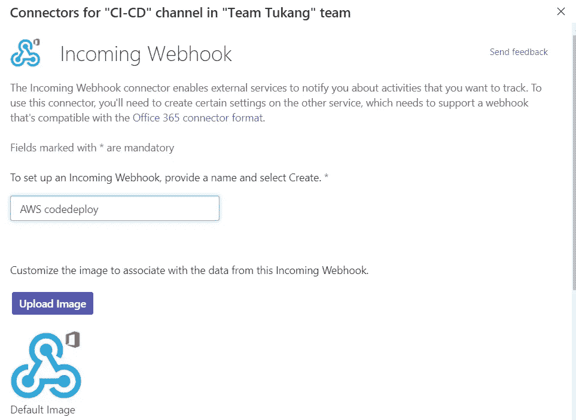

# 带 MS 团队的 AWS SNS/Lambda

> 原文：<https://levelup.gitconnected.com/aws-sns-lambda-with-ms-teams-27c36f669b3>

在我的设置中，我使用 Jenkins 作为 CI 工具来构建和测试 docker 映像，然后将其推送到 ECR，并使用代码 Deploy Blue Green 部署到 ECS 服务。

问题是我不能使用 Jenkins 的 office365ConnectorSend 向开发人员宣布 ECS 已经部署。这是因为 Jenkins 运行 AWS deploy 命令行，运行命令行并不意味着新服务会立即部署。熟悉代码部署的人都知道蓝绿色部署需要一段时间，所以 HTTP 调用必须来自 AWS SNS/Lambda，这是一个更可靠的信息源。从 CodeDeploy 中，您可以准确地告诉您的开发人员 code deploy 已经开始、成功或失败。

要开始，你需要在你的 MS 团队上创建一个连接器，这样你的 Lambda 函数就有一个 URI 可以调用。


点击配置传入网络挂钩



给它一个名字


复制 webhook URL

我设置了这个 Lambda 脚本来调用微软团队。我用它来创建 lambda 函数。将 webhook 粘贴到 url 变量中。

```
import urllib3
import json
import logging
http = urllib3.PoolManager()logger = logging.getLogger()
logger.setLevel(logging.INFO)def lambda_handler(event, context):
    logger.info("Event: " + str(event["Records"][0]["Sns"]["Message"]))
    url = "<Your MS Teams webhook>"
    message = json.loads(event["Records"][0]["Sns"]["Message"])

    deploymentGroupName = message["deploymentGroupName"]
    status = message["status"]
    if status == 'FAILED':
        color_name = '#D50A21'
    elif status == 'SUCCEEDED':
        color_name = '#2eb886'
    else:
        color_name = '#39A3E3'

summary = deploymentGroupName + " deployment " + status
    msg = {
    "[@type](http://twitter.com/type)": "MessageCard",
    "[@context](http://twitter.com/context)": "[http://schema.org/extensions](http://schema.org/extensions)",
    "themeColor": color_name,
    "summary": summary,
    "sections": [{
        "activityTitle": "CodeDeploy](https://teamsnodesample.azurewebsites.net/static/img/image5.png)CodeDeploy) " + deploymentGroupName,
        "activitySubtitle": summary,
        "activityImage": "[https://teamsnodesample.azurewebsites.net/static/img/image5.png](https://teamsnodesample.azurewebsites.net/static/img/image5.png)CodeDeploy)",
        "facts": [{
            "name": "Status",
            "value": status
        }],
        "markdown": True
    }]}

    encoded_msg = json.dumps(msg).encode('utf-8')
    resp = http.request('POST',url, body=encoded_msg)
    print({
        "message": str(resp),
        # "message": event['Records'][0]['Sns']['Message'], 
        "status_code": resp.status, 
        "response": resp.data
    })
```

请记住，`event[“Records”][0][“Sns”][“Message”]`实际上是一个 JSON 字符串，而不是一个 JSON 对象。您需要 json.loads 它，这样您就可以获取嵌套在其中的值。

接下来，创建一个 SNS 主题，并为其订阅 lamba 函数


然后在 CodeDeploy 部署组触发器中设置 SNS 警报


用事件创建触发器


记住，您需要单击高级箭头来创建触发器

当 Code Deploy 开始运行时，它会在部署的不同阶段向您发送消息。

