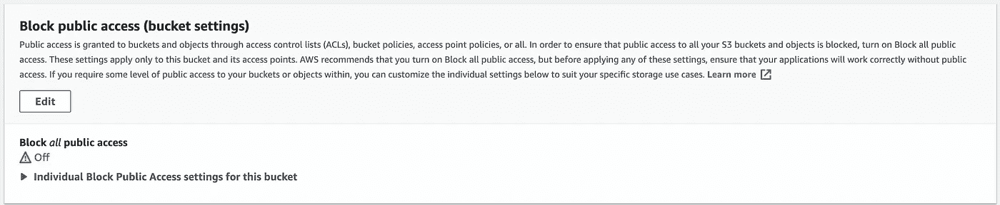
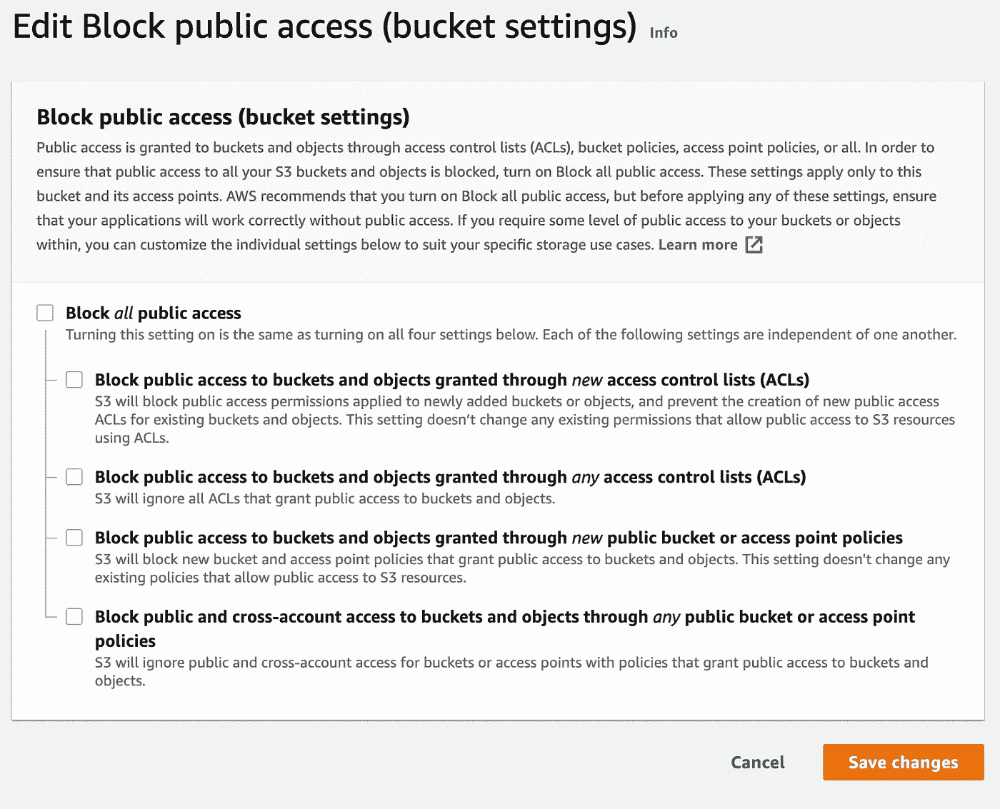
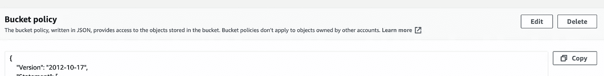
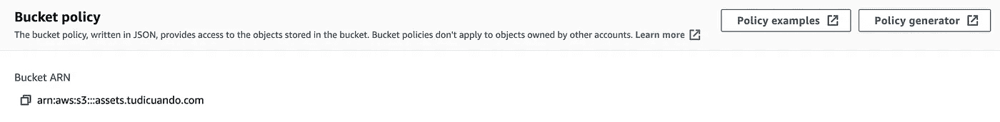
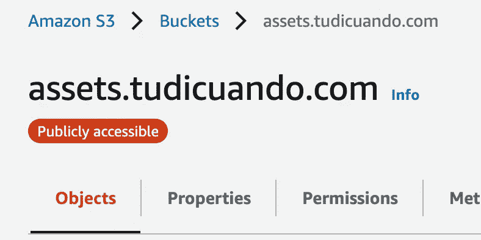
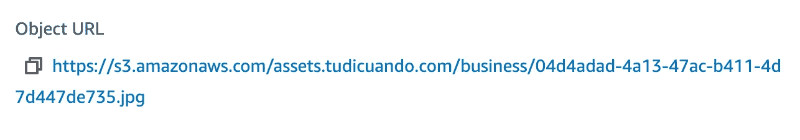
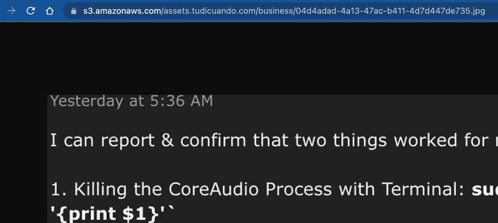

# 这就是你的 S3 水桶拒绝你进入的原因

> 原文：<https://levelup.gitconnected.com/aws-tips-how-to-fix-s3-bucket-permissions-access-denied-fcd239c8e6e4>

凯尔·格伦在 [Unsplash](https://unsplash.com?utm_source=medium&utm_medium=referral) 上的照片

## 不到 3 分钟就修好了

所以你可能正在使用一个 S3 桶来托管一个 react 网站或者想要向公众提供图像。

然而，似乎没有什么是有意义的，当试图使用 URL 查看对象时，访问被拒绝。

不用担心；解决这个问题非常简单。

我们开始吧。

# **1。取消选中** *阻止所有公共访问*

此复选框在您第一次创建存储桶时出现，因此如果您错过了它，请转到 S3 仪表板，单击您的存储桶并转到“权限”选项卡。

向下滚动，直到找到上面显示的部分，单击编辑，取消选中该框，并点击保存按钮。

我们已经走了一半，这可能不是你的问题，但以防万一，这是一个好主意。

让我们最头疼的总是那些微小的粗心错误。

# 2.没有为存储桶设置权限策略

让我告诉你，在 AWS 中，一切都需要许可。

权限非常好，可以帮助我们构建安全的应用程序，但是对于初学者来说，这很容易忘记，而且有点奇怪。

如果您停留在“权限”选项卡中，向下滚动直到您找到下面的部分。

点击编辑，我们就可以开始编辑策略了。

注意，您可以很容易地复制您的 bucket 名称(ARN ),稍后您会用到它。

如果有的话，删除编辑器中的任何内容，并复制下面的代码片段。

让我们更好地理解这个政策在做什么。

> 效果:我们想用行动做什么(也可以被否定)
> 
> **负责人**:谁能执行动作(*)表示任何人，所以是公开的
> 
> **动作**:我们希望允许执行什么动作。GetObject 允许读取访问
> 
> **资源:**我们希望将此规则应用于 S3 存储桶的哪个路径。

*/*表示我们桶中的所有路线*

还记得你的水桶上面的 ARN 编辑吗？点击复制图标，用你的桶的 ARN 替换 assets.tudicuando.com 的 T21。

点击保存。

当您向上滚动并看到您的存储桶名称时，Ddashobard 应该会显示一个红色徽章。

无论哪种方式，上传一张图片，并通过进入(图片的)属性标签和复制对象 URL 来测试它的“公开性”。

现在把它粘贴到你的浏览器中，Viola！你提供了一个图像。

就是这样；你的桶现在正式公开了😎并准备提供一些可怕的照片。📸

如果您想了解有关不同 AWS 服务的更多信息，请关注我的未来内容，我将在其中分享关于使用 AWS 构建生产就绪的 web 应用程序的见解和教程。