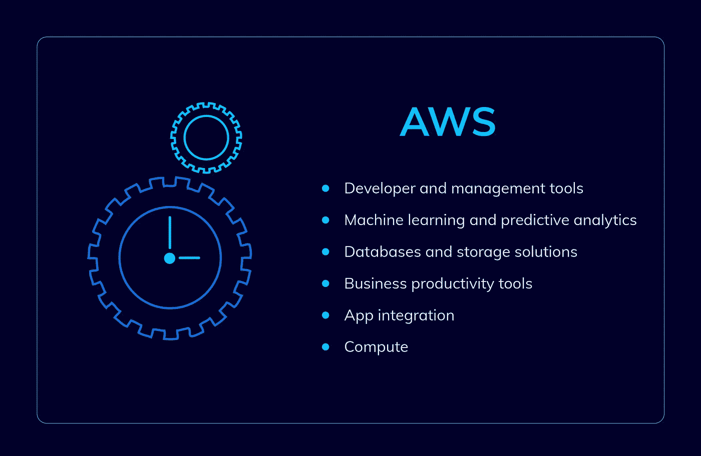
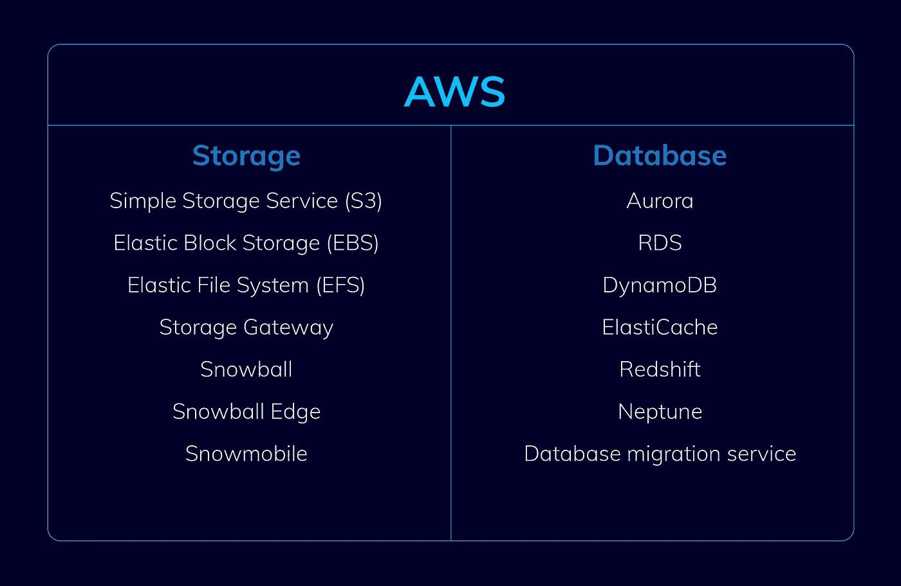
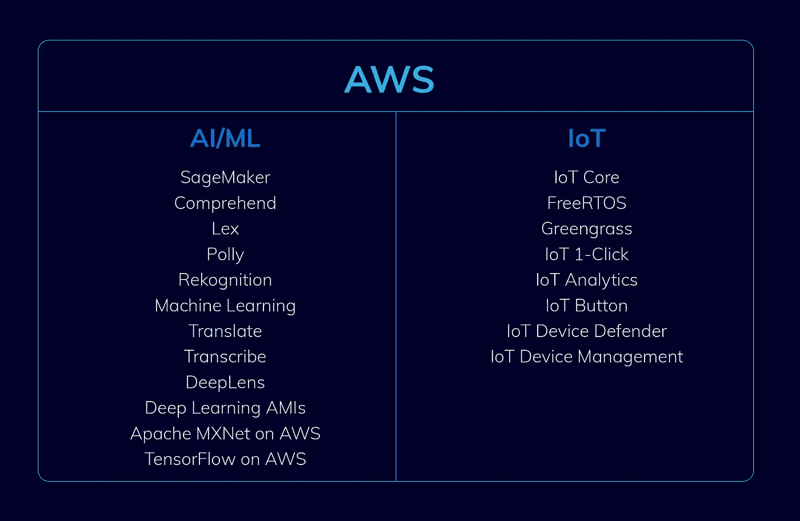
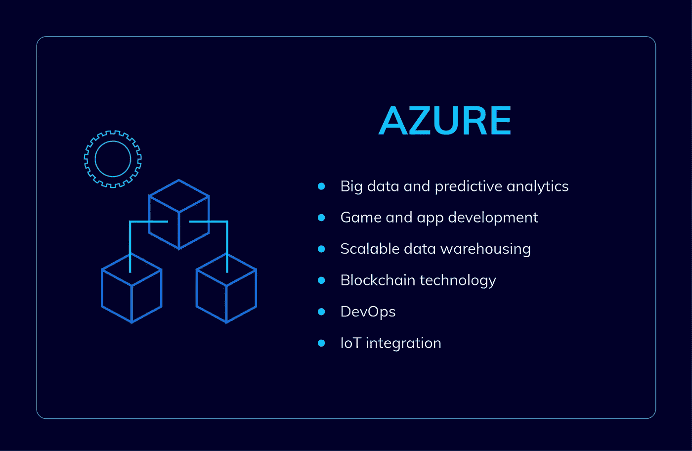
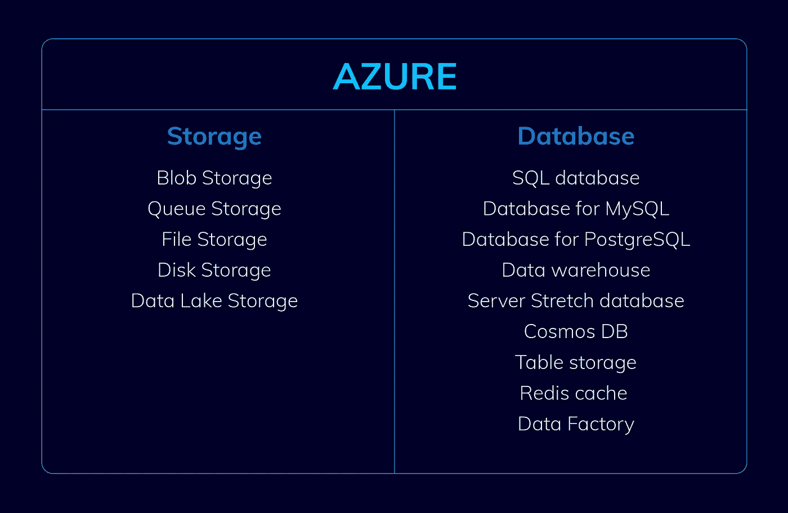
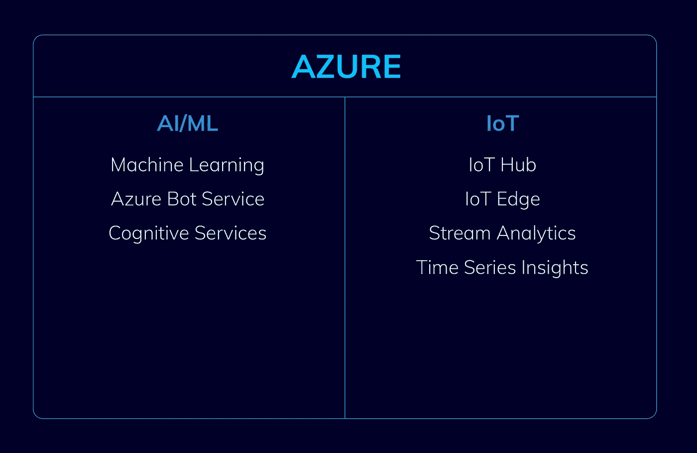
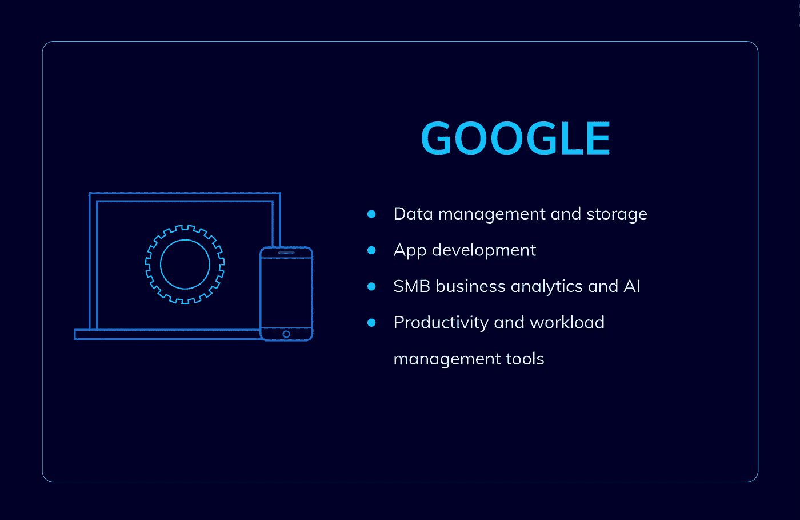
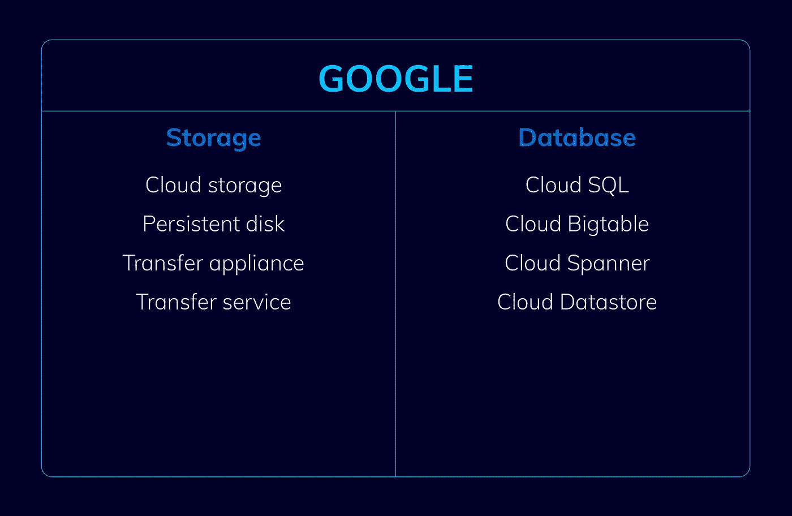
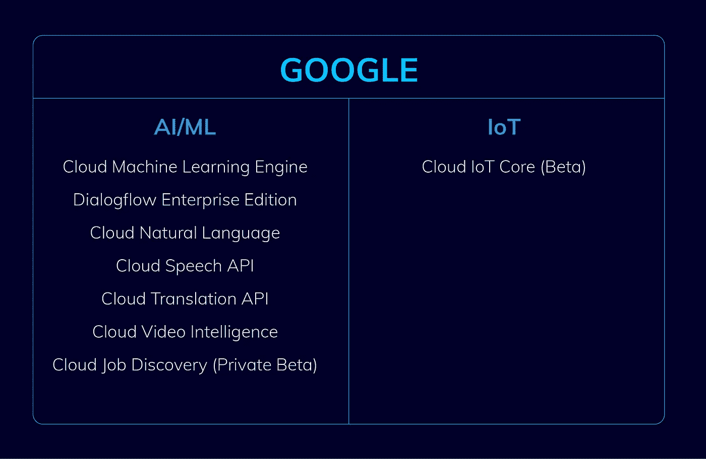

# AWS vs. Azure vs. Google:详细的云比较

> 原文：<https://levelup.gitconnected.com/aws-vs-azure-vs-google-detailed-cloud-comparison-b075a35fc8b8>

## 让我们决定哪朵云要飞…

云的采用正在接管多个地区和行业。公司发现采用云计算后，他们在竞争激烈的市场中变得更加敏捷。企业现在不必花费时间和金钱来维护和购买自己的服务器，而是可以使用云服务提供商提供的现成的专业基础架构。

随着工作负载迁移和云原生应用开发的加剧，2021 年 Q2 的云平台解决方案投资飙升 36%，达到 470 亿美元。至于云计算的市场份额，[科纳仕公司 2021](https://www.canalys.com/newsroom/global-cloud-services-q2-2021) 报告指出 Azure 占 22%，AWS 占 37%，谷歌云占 8%。

让我们比较一下所谓的‘三巨头’云提供商:AWS vs. Azure vs. Google。系好安全带，前路漫漫！

# 一、什么是云计算？

简而言之，[云计算是通过互联网交付计算服务](https://inveritasoft.com/services/devops-services-and-solutions)，如云数据存储、服务器、存储、软件、网络、智能和分析。

# **如何选择合适的云平台？**

技术和业务需求必须是决定您选择的主要因素。考虑云解决方案可能需要的功能、应用程序集成和预算。您的决策应该基于云提供商为实现您的业务目标所提供的机会。

我们希望这种云服务的比较将有助于您确定项目的匹配。

# **亚马逊网络服务**

## **特性**

[亚马逊网络服务](https://aws.amazon.com/)毫不夸张地说，它是世界上最全面、最广泛采用的公共云平台。它的特点是分析、AR & VR、应用集成、区块链、计算、客户参与、开发工具、机器学习、虚拟机发布、物联网、移动、机器人服务，并且该列表远非详尽无遗。开发人员需要的每一项功能都可以通过 AWS 轻松访问。

正如你可能看到的，AWS 提供了无数的功能，使其从其他公共云平台中脱颖而出。亮点包括以下服务:

*   **移动友好访问。**它包括 AWS Mobile Hub(允许开发、测试、配置和监控移动应用程序)和 AWS Mobile SDK(借助该功能，您的移动应用程序可以访问 S3、DynamoDB 和 Lambda)。
*   **无服务器云功能。**亚马逊网关和 API 会运行你的代码并伸缩它。你唯一要做的就是用手机上传代码。通过管理所有流程，AWS 解放了您的时间，因此您可以将所有的精力和努力投入到应用程序的构建中。
*   **贮藏。**您可以使用以下亚马逊存储之一:亚马逊简单存储服务(数据备份、分析和存档的好选择)；亚马逊冰川(用作长期储存)；Amazon EBS(为具有 EC-2 实例的应用程序的持续数据存储提供块级存储卷)。
*   **数据库**。AWS 数据库完全由亚马逊服务管理。根据用途使用不同类型的数据库。
*   **合规与安全**。由于被多家公司使用，Amazon 为存储的数据提供了最大的安全性。
*   **AWS 市场。AWS Marketplace 于 2012 年推出，允许搜索和购买任何你喜欢的软件。您还可以使用 Marketplace 的一键式部署和启动，无需支付额外费用。**

AWS 工具

AWS 存储和数据库

AWS AI、ML 和 IoT

## **主要优势**

正如我们之前提到的，云提供商中的市场领导者可以夸耀数据库、计算、分析、存储、网络、管理、移动、开发人员工具、机器学习、物联网、安全和企业应用程序中的服务的广度和深度，总之，您会发现超过 175 种服务。

AWS 在 2006 年提供了公共 IaaS。由于他们已经经历了近 14 年的发展，另一个优势是 IaaS 和整个 AWS 生态系统的成熟也就不足为奇了。更重要的是，AWS 拥有[全方位全球覆盖](https://www.cloudcruiser.com/aws-azure-google-cloud/)和一个安全的网络，保证您即使在最敏感的应用程序中也能找到您需要的内容。

此外，作为其众多智能产品的一部分，AWS 提供了 DeepLens，这是一款人工智能相机，用于构建和实施用于光学字符识别和图片或物体检测的机器学习技术。AWS 已经发布了 Gluon，这是一个开源的深度学习库，允许开发人员和非开发人员在事先不了解人工智能的情况下快速创建神经网络。事实上，AWS 提供了多样化的机器学习和人工智能解决方案。用于训练和部署机器学习模型的 SageMaker 是另一项 AWS 服务。它还包括 Lex 对话接口，支持 Alexa 应用程序，以及 Greengrass 物联网通信和 Lambda 云托管处理。

## **弱点**

一些优势可能同时变成劣势。大量的 AWS 服务和选项吸引了客户，同时也让客户感到有些害怕。许多公司认为，员工需要接受关于 AWS 生态系统的适当培训，才能恰当地管理它。AWS 还需要大量的设置工作，这是其他云服务无法做到的，它们提供“开箱即用”的解决方案。许多人认为 AWS 的一个巨大缺点是缺乏像微软提供的特定“混合云”解决方案。

## **云价格对比**

当提到 AWS 与 Azure 和谷歌的定价时，AWS 的价格非常有竞争力，因为成本结构和云市场份额的竞争日益激烈。对于创业公司和个人，它提供免费的服务等级。此外，开发团队可以按秒购买服务器，而不是按小时。用户还可以使用 [AWS 定价计算器](https://calculator.aws/#/)来估算其架构解决方案的成本，以及配置符合其独特业务或个人需求的成本估算。

# **微软 Azure**

## **特性**

微软 Azure 提供了与 AWS 几乎相同的功能和服务。然而，有一些额外的功能可能对那些没有找到完全适合其需求的 AWS 平台的企业有益。该平台提供了大规模部署和管理虚拟机的机会。它允许在几分钟内以您需要的任何容量进行处理和计算。AWS 和 Azure 都处理运行大规模并行批处理计算的软件，这是相对于谷歌云平台的优势。

*   **数据弹性。Azure 云存储让您的数据在微软数据中心保持安全。默认情况下，你保存在 Azure 存储中的任何信息都会有三份以上的副本。如果数据可用性有任何问题，您仍然可以从其他两个副本访问它。**
*   **数据安全。** Azure 以多种方式加密数据。默认情况下，Azure 存储服务都启用了[存储端加密](https://docs.microsoft.com/en-us/azure/storage/common/storage-service-encryption) (SSE)，使用 256 位 AES 加密。 [Azure Key Vault](https://docs.microsoft.com/en-in/azure/key-vault/) 允许客户使用自己的密钥进行加密。
*   **BCDR(业务连续性/灾难恢复)集成。** Azure 存储可以与用户的 BCDR 战略集成，并提供备份和灾难恢复选项。 [Azure Backup agent](https://docs.microsoft.com/en-us/azure/backup/backup-configure-vault) 和 [Azure Site Recovery](https://docs.microsoft.com/en-us/azure/site-recovery/) 用于数据中心的备份和恢复。
*   **产能管理。** [StorSimple](https://docs.microsoft.com/en-in/azure/storsimple/) ，混合架构存储，满足企业业务的所有存储需求。数据通过自动数据分层功能放置在 SSD、HDD 或云存储层中。还有内置的重复数据删除和压缩功能，有助于优化存储容量使用。
*   **单窗格操作。**它允许连接各种数据源，收集和分析日志，并提供见解。OMS 还提供自动化和安全解决方案，以简化混合基础设施的工作流程。

Azure 工具

Azure 存储和数据库

Azure AI，ML，IoT

## **主要优势**

微软在 Azure 上提供了很大的折扣，这对新客户很有吸引力。而且不是唯一的一个优势，因为那些选择了 Azure 的人通常都很喜欢它，不会更换平台。Azure 的独特之处在于它专注于混合云设置。大型企业需要真正的混合云设置，Azure 提供了这种设置。此外，如果您正在使用微软提供的其他服务(如。NET)它们很容易与现有的基础设施集成。

微软在 Azure 上提供机器学习和机器人服务，作为其在机器学习和人工智能领域大量投资的一部分。Bing Web 搜索 API、文本分析 API、人脸 API、计算机视觉 API 和自定义视觉服务都是可用的认知服务。微软还为物联网提供许多管理和分析服务，以及功能，即他们基于云的解决方案。此外，Azure 提供了许多工具来帮助维护微软软件。Windows Server R2 中的 Windows Server Backup 和 Windows Server 通过 Azure Backup 链接。Visual Studio 应用程序通过 Visual Studio Team Services 托管在 Azure 上。

## **弱点**

虽然 Azure 是微软生态系统用户的最佳选择，但它对其他操作系统的支持有限。AWS 在这场战斗中获胜是因为它的定制潜力。

## **云价格对比**

微软 Azure 对现有客户和新客户都有折扣和积分。与 AWS 不同，Azure 按分钟向用户收费，没有最低分钟数。那些决定做出短期承诺的人也会对漂亮的定价模型感到惊讶。

# **谷歌云服务**

## **特色**

[谷歌云](https://cloud.google.com/)平台相对来说是个新人。除了 Windows server 版本，谷歌还支持几代 Linux，并为开发者提供多种服务，比如 App Engine 产品。在这个服务器的帮助下，开发者可以不用处理服务器，以一种敏捷的方式创建应用。

*   **云存储。**与其他云数据存储相比，谷歌云存储使用超快速持久磁盘，并提供持久对象存储。Hadoop 和 Google 首创的大表技术像大查询，大表，Hadoop，大查询技术都是集成的，完全支持。如果你正在寻找与机器学习或大数据分析相关的东西，谷歌云是一个完美的选择。
*   **云功能。**Google 上的超高速无服务器平台，允许构建基于事件的微服务。不需要开发者资源管理来允许事件触发功能。
*   **谷歌容器引擎。**它允许在 Google Cloud 上运行由 Kubernetes 触发的 docker 容器。
*   **计算。**与 AWS 和 Azure 类似，Google Compute Engine 允许用户将虚拟机部署到特定区域和可用性组，并且已经超越了竞争对手。谷歌云在 Azure 和 AWS 中大放异彩的另一个原因是，它不像其他提供商那样需要预热。

谷歌工具

谷歌存储和数据库

谷歌 AI、ML 和 IoT

## **主要优势**

虽然谷歌占据了最小比例的市场份额，但它仍然拥有大量的粉丝，因为他们证明了自己是一个可行的 IaaS 竞争对手。直观简单和易于使用的界面使该平台在三大平台中脱颖而出。谷歌在大数据分析和 ML 应用方面的专业知识使客户能够轻松利用谷歌云服务中的专业知识。它还允许用户通过 GCP 享受高质量的网络、存储、计算和数据库。谷歌与竞争对手的不同之处在于服务的数量。虽然这个数字不是很高，但是开发者可以通过查看移动应用项目的需求来找到一个完美的匹配。

谷歌云包括基本语言、语音、翻译等 API，以及其他创新工具。除此之外，它还提供物联网和云平台功能，尽管只是测试版。在 AI 开发方面，谷歌云现在是主导者。TensorFlow 是一个用于开发机器学习应用程序的开源软件库，在这方面值得称赞。TensorFlow 在程序员中是一种强大的语言。

## **弱点**

最大的缺点之一是谷歌云平台是一个 B2C 业务，大型企业发现使用他们的云服务很有挑战性。作为三巨头中最新的云，谷歌在产品种类上是最不成熟的。

## **云价格对比**

和 Azure 一样，谷歌也是按分钟计费的，但是它最少要 10 分钟。使用简单的每分钟费率和自动折扣选项的可能性使谷歌云有别于其他平台。

# **AWS vs Azure vs Google:你会选择什么平台？**

现在是你做决定的时候了。正如所反映的，当您确切地知道您的项目需要什么时，选择什么样的云提供商就很简单了。我们希望[云服务的比较](https://inveritasoft.com/blog/flutter-vs-react-native-vs-native-deep-performance-comparison)对您有所帮助，并为您未来的选择提供一些关于云计算的额外知识。

如果你正在寻找一个可靠的云开发合作伙伴，请随意敲开 inVerita 的大门。

*该出版物于 2022 年 2 月 23 日更新。*