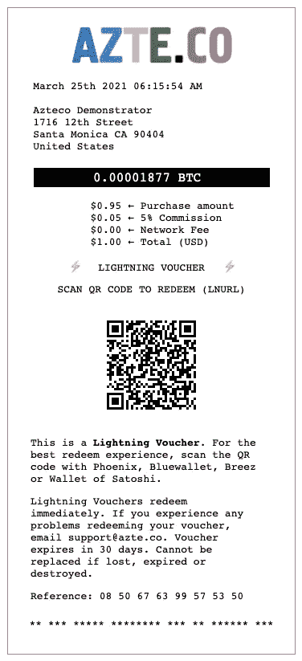
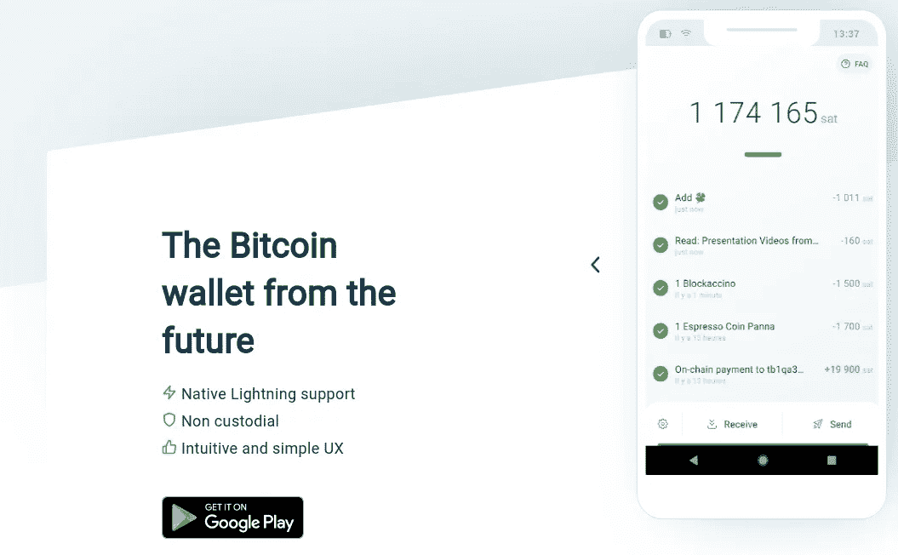
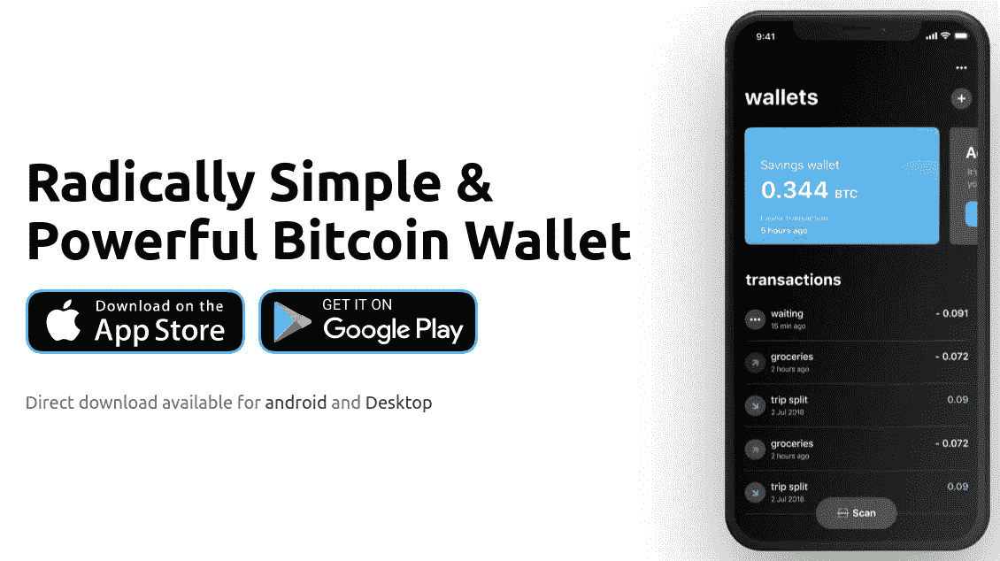
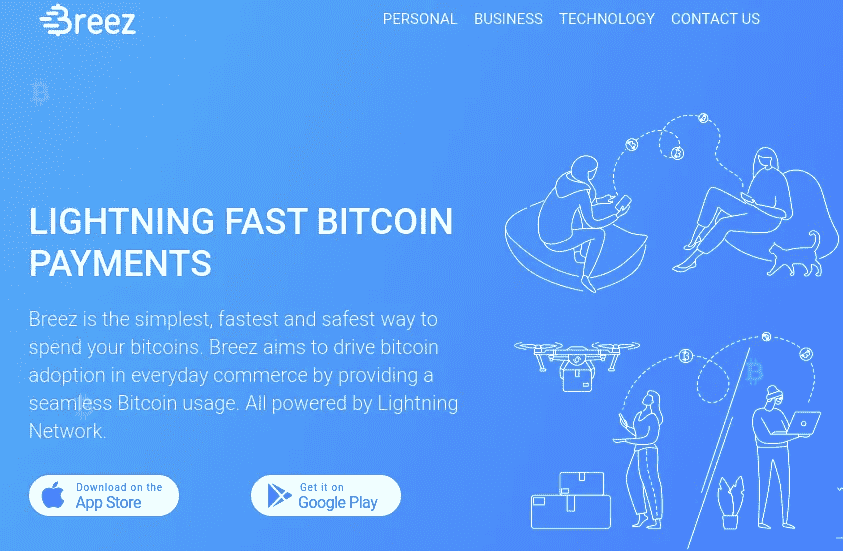
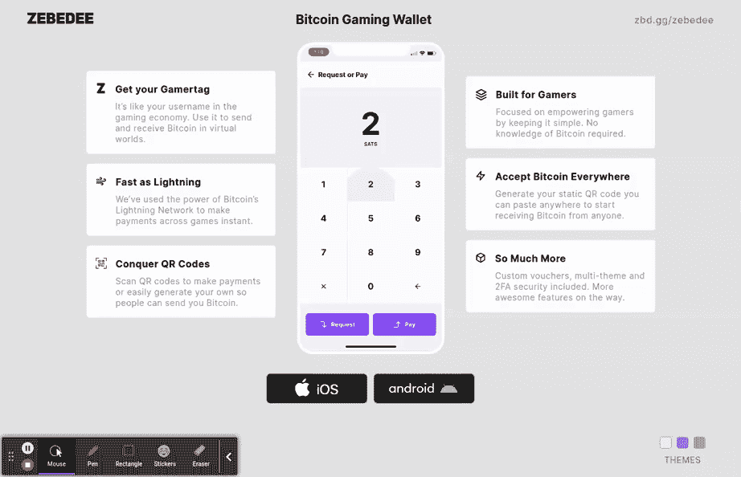
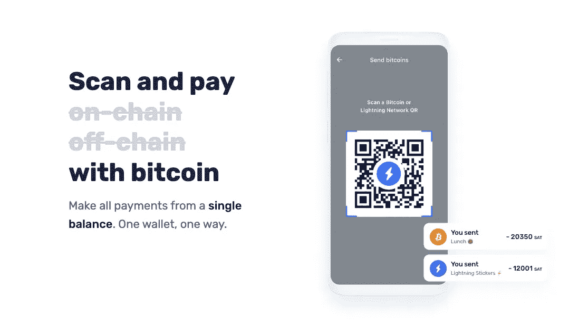
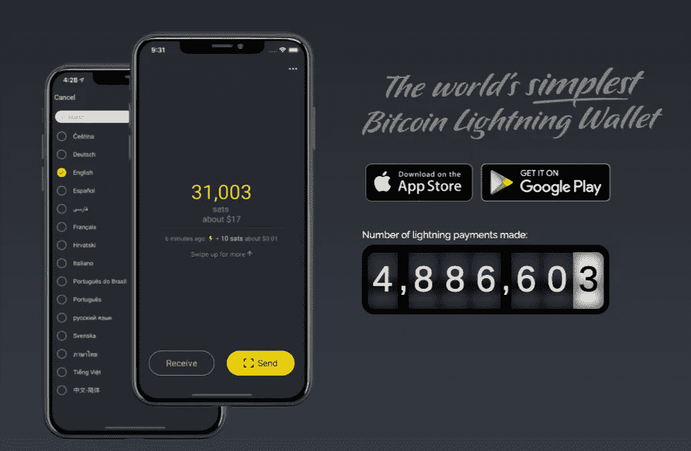
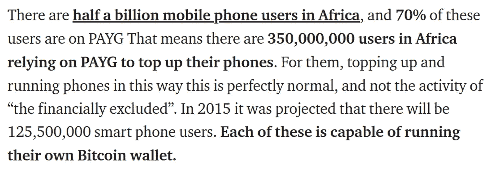

# 阿兹特克闪电。现在没有人会被比特币落下。

> 原文：<https://levelup.gitconnected.com/azteco-lightning-now-no-one-gets-left-behind-in-bitcoin-2b750f094ccf>

闪电划过夜空，法定货币四分五裂。在白光的漩涡中，响起最清晰的滚雷声。

在 Azteco，我们已经对 Lightning 进行了一年多的实验，改进了我们的思维和用户体验设计，以完美地表达我们的精神。现在，我们已经准备好向任何地方的任何人提供引人注目、不可抗拒的服务，恢复比特币早期的体验，在默认情况下，你可以几乎免费发送和接收比特币。

## 为什么是闪电？

在比特币的早期，你可以以几便士的成本发送和接收它。正是基于这种体验，比特币成为“互联网货币”的梦想诞生了。

随着少数人使用比特币，很少有人明白随着这个新的、新颖的网络开始增长，[对其容量的必要自然限制](https://medium.com/@beautyon_/the-bitcoin-gauntlet-e9e721297aca)将很快导致低价值交易命题的终结。

这是分层网络思想开始形成的点，其中比特币是基础，“第一层”网络层，新的层叠加在其上，上层协议的竞争开始了。这场竞赛的赢家将是比特币默认的“消费者层”，第一层是企业或网络运营商层。

闪电赢得了这一层的竞赛。它“类似于比特币”，不需要信任，就像第一层一样，任何地方的任何人都可以作为对等方加入，而无需任何人、财团或实体的许可或监督，无论意图是否良好。

## 闪电是什么？

闪电就是比特币。打个比方，把闪电想象成你把一美元钞票兑换成 100 便士时得到的东西。当你这样做时，你就有能力用一便士一次一个地支付一便士糖果。

想象一下，你拿着一张 100 美元的钞票走进一家一便士糖果店，试图用它来买一便士的糖果。店主会认为你是*疯子*。他可能会生气。然而，如果你给他一便士买一便士的糖果，一切都很好。闪电就是这样工作的；它允许你将比特币分解成便士，然后以接近零的成本花掉这些便士。在网上。往返于世界任何地方。

就像你装满硬币的存钱罐一样，有一天，你可能会想把所有的金属都变成纸币。为此，你去银行，他们清点零钱，给你纸币。闪电也是一样。如果你有足够的理由和需要，你可以将你的闪电比特币转换为“链上”比特币。但是如果你从来不这样做，它仍然可以像比特币一样被消费，就像便士可以像钱一样被消费一样。

## 闪电是什么样子的？

它看起来就像比特币，因为 ***闪电就是比特币*** 。这就像早期的比特币一样，但这一次，没有任何上限或技术障碍，可以服务于数十亿人。你扫描二维码，在钱包上发送和接收比特币，它就能工作。只是它的*更快*和*更便宜*。

再者，Lightning 是完全 ***无信任*** 的，上面的每个人都是对等的，没有任何领主或指定的网络运营商或担保人。它是真正的点对点和开放的，就像比特币一样，不需要特别的邀请、价值测试或其他央行式的反比特币游戏才能加入。就像比特币一样，闪电在它的每个过程中都是为每个人服务的。它在每一层都是开放的。

## 我能在哪里得到它？

你可以通过购买阿兹特克闪电代金券，以与获得比特币完全相同的方式获得它。相同的凭证。同样方便。同样的比特币… *但是更好。*

再一次，把它想象成去银行要 100 美元。你可以要一张 100 美元的钞票，5 X 20 美元，10 X 10 美元或 100 X 1 美元或 1000 便士。这取决于你想用你的钱做什么(这*是*“你的钱”……不是吗？)，你挑面额搭配。如果你想买一辆 100 美元的自行车，你就买一辆本·富兰克林。如果你想回到糖果店，你挑选 100 便士的纸币，总共 99 美元。购买阿兹特克闪电代金券时，这种选择和效用现在是可能的。

无论你是用[西庇太](https://zebedee.io/)购买游戏中的物品，还是用[购买一杯咖啡](https://youtu.be/bOTwojmc50M)，用闪电兑换的阿兹特克代金券，你可以用少量比特币支付你需要购买的一切。

再一次。您现在可以通过闪电兑换 Azteco 优惠券。这意味着你可以通过闪电或“链上”比特币获得 100 美元的代金券。根据网络条件的不同，如果你选择把你的比特币放在链子上，你将被收取网络费用，从不到 1 美元到 9 美元(T21)或更多。

或者…

你可以以 0 美元的价格获得 100 美元的比特币。收件人不必为了发送或花费他们收到的东西而等待。他们可以立即把它发送给任何一个有闪电钱包的人。

转述一下，用信用卡买任何东西都不能付五分钱。你当然不能在没有许可的情况下用一分钱支付给全球任何地方的任何人。现在**可以**了。那就是… *力量*。很少有人理解这个想法有多么强大。

## 有哪些钱包可以用？

你可以用闪电兑换一张阿兹特克代金券到凤凰城

或者进入 [Bluewallet](https://bluewallet.io/) …

或者进[breeze](https://breez.technology/)…

或者变成[西庇太](https://zebedee.io/) …

或者 [Muun](https://muun.com/) …

或者是聪聪的[钱包。](https://www.walletofsatoshi.com/)

或者放进这些精美的钱包和工具中…

[**BLW**](https://lightning-wallet.com/)[**Blixt**](https://github.com/hsjoberg/blixt-wallet)[**Coinos**](https://coinos.io/)[**LNbits**](https://lnbits.org/)[**@ lntxbot**](https://t.me/lntxbot)

这使得总共有 **15 个钱包集成**，再加上 [Pine](https://pine.pm/) 和 [Edge](https://edge.app/) ，总共有 **17 个钱包**可以兑换 Azteco 代金券。随着服务定在“[闪电标准](https://saifedean.com/)”上，还会有更多的服务出现(两个已经确定在开发中)。

## 对比特币的影响

比特币 over Lightning 意味着任何拥有廉价安卓手机的人都可以免费兑换 1 美元的 Azteco Lightning 代金券。这意味着在全球范围内，数十亿人可以用很少的钱以私人的、即时的方式使用比特币。这意味着任何地方的任何人都可以在他们的手机上存储任何数量的比特币，并立即向任何人传输任何数量的比特币。

Azteco 充分展示了企业为这数十亿用户提供服务的潜力，我们正在开放供应商地点，平等地为没有银行账户的人群、游戏人群和成熟的美国咖啡爱好者提供服务。

 [## 完美风暴

### 剧情简介。比特币非常适合 PAYG 的预付费手机用户。卓越的 Bitrefill 服务…

medium.com](https://medium.com/@beautyon_/the-perfect-storm-9cf65206de7a) 

从。“完美风暴”，现在带着闪电！

除此之外，我们现在可以通过 [Machankura 8333](https://cointelegraph.com/news/bitcoin-without-internet-sms-service-allows-sending-btc-with-a-text) 访问 500，000，000 个“功能手机”用户，这使得非智能手机(所谓的“功能手机”)用户也可以访问比特币

如果你想亲自尝试这一惊人的新功能，并且你在 Twitter 上，DM @azteco_ on Twitter，并且(如果你符合条件)我们很乐意向你发送一小部分比特币和 Azteco Lightning 代金券。准备大吃一惊吧。你会问我们一遍又一遍被问到的同一个问题， ***“为什么事情不像这样简单呢？!"*** *。*

*特别感谢*[*@ BootstrapBandit*](https://twitter.com/BootstrapBandit)*编写了这个优雅的库，让每个人都有可能使用它，感谢 Bluewallet 的 Igor，感谢他的知识，感谢 Acinq 的 Pierre-Marie 和 Lightning Labs 的慷慨人们，他们单枪匹马地确保了比特币在每个经济阶层的全部承诺都能优雅、道德和美好地实现。这些真的是极品中的极品！*