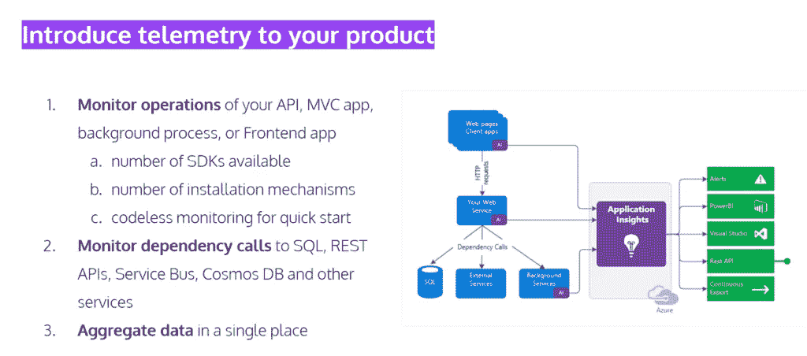
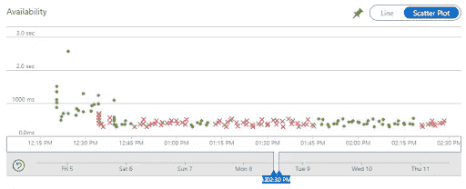
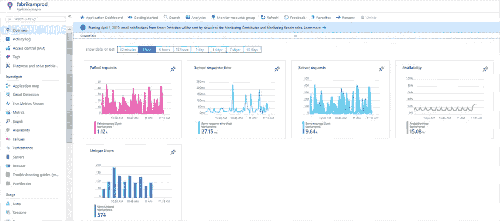
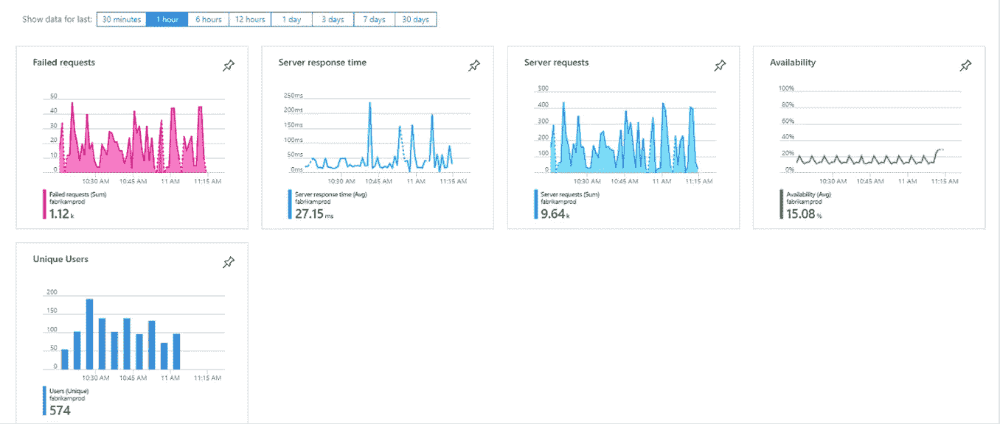
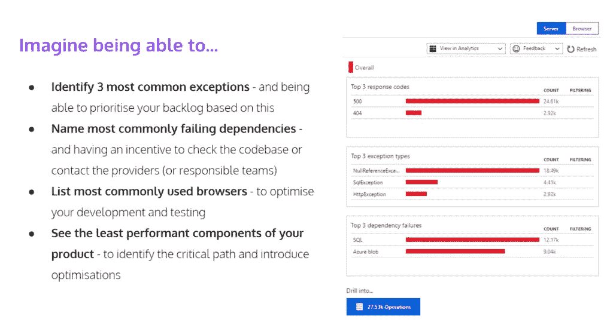
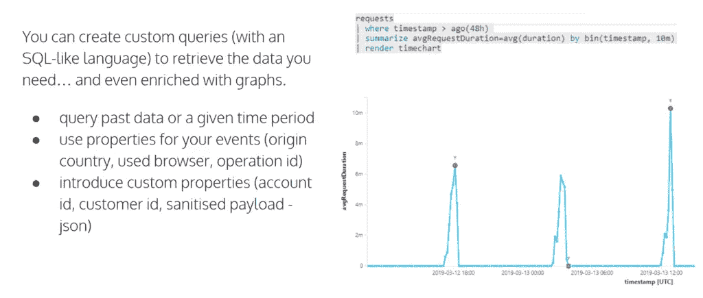
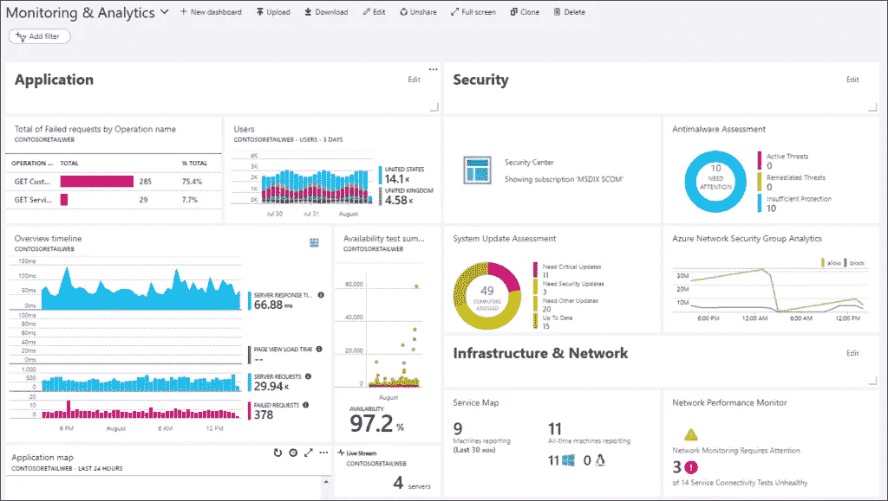
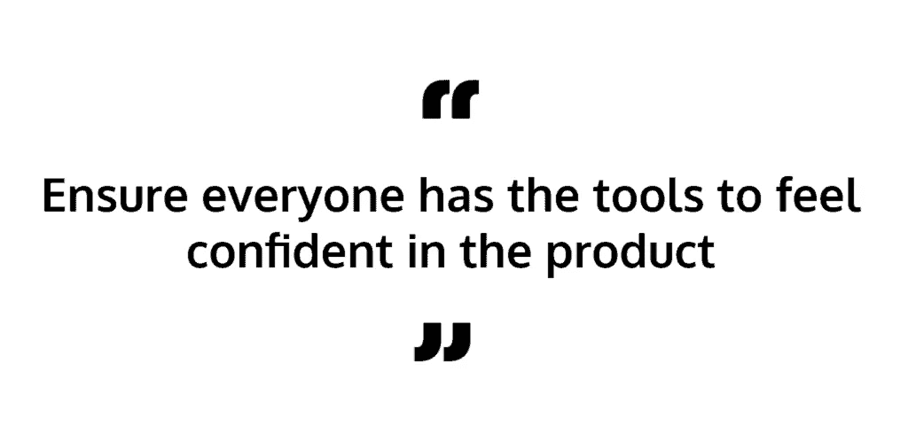

# Azure App Insights:收集业务关键信息

> 原文：<https://levelup.gitconnected.com/azure-app-insights-collecting-business-critical-information-ad2101e11afd>

## 使用应用洞察实时获取产品洞察并解决问题

一旦你把你的软件发布到产品中，你想要确保它成功地成为你的顾客或客户的有价值的资源。因此，当涉及到解决问题时，保持 it 高度可用并采取快速和明确的措施就成了当务之急。利用应用洞察，您可以增强产品信心并实时解决问题。

Zartis 的技术负责人 Michal Szymczak 就此主题举办了一场网络研讨会。在这篇文章中，我们收集了他对*使用 Azure Application Insights* 收集业务关键信息的想法。

## 但是首先，什么是应用洞察？

[**Application Insights**](https://docs.microsoft.com/en-us/azure/azure-monitor/app/app-insights-overview)**是 Azure Monitor 的一个特性，是一个面向开发者和 DevOps 专业人员的可扩展应用性能管理(APM)服务，用来监控你的实时应用。**

在一个理想的场景中，你对你的产品正在取得的成功充满信心，你应该能够马上回答这些问题:

*   所有系统组件都在相互通信吗？
*   你能多快发现产品中的问题？
*   你如何着手检查哪里出了问题？你是猜测的，还是利用科学信息提出的假设？
*   您能快速解决您的问题吗？
*   一旦做好了，你知道是不是修好了？
*   最重要的是，谁先发现问题？是你还是你的客户？

通过能够确定而快速地解决这些问题，您可以提高产品的可靠性和声誉。Azure Application Insights 是微软 Azure 的一个产品，如果你已经在 Azure 上，开始使用这项服务非常容易。如果你没有使用 Azure——它也有一个免费层供你使用。

App Insights 是一款遥测应用程序，可监控您可能拥有的各种应用程序和产品的运行，无论是 API、MVC 应用程序、后台数据处理器、前端应用程序还是移动应用程序等。您有许多可用于应用洞察的 SDK。这意味着它不仅适用于。NET 和 C#，还可以用 Java 等。最近我们甚至发现了一个针对 PHP 的 [SDK。使用 SDK 是最显而易见的选择，尤其是对开发人员而言，但是您也可以进行无代码监控。](https://github.com/microsoft/ApplicationInsights-PHP)

【Application Insights 将为您做的是监控各种依赖关系。如果你有 Azure 之外的其他资源，比如对 SQL 或 NoSQL 数据库的依赖，Rest 和其他 RestAPI 服务，服务总线实例等，所有这些依赖，所有这些调用，所有这些你的产品和这些服务之间的交互都将被记录下来。即使您的微服务分散在多个地方，Application Insights 也会将它们全部集中到一个地方。可以说，这是一个巨大的好处，因为它允许您在一个地方查询所有内容。

此外，您还可以将不同的组件相互关联起来，并检查是否需要考虑某些交互或相关性。正如你在上面的图表中看到的，你可以导出见解，或者你可以直接在 Azure Portal 上使用 API。您还可以导出到 Power BI 或自定义数据源，因为您可能希望您的数据团队查看它。

# 让我们更深入地了解应用洞察中最重要的 3 项技术:

1.  **监控系统可用性**
2.  **了解产品运营**
3.  **使信息透明可用**

# 使用应用洞察监控系统的可用性

监控您的应用程序的可用性，我们称之为健康检查。您希望确保您的产品对于您的客户来说是可及的，并且是完全可操作的。您还想在出现问题时第一时间得到通知。

在上面的图表中，实际上是由 Application Insights 生成的，您可以跟踪绿点后面的可用性，而红叉显示您的产品何时不完全可用。您可以在全球范围内进行某些检查，看看该应用程序是否可以在西班牙、美国或日本使用。事实上，你可以得到实时通知是最重要的方面，因为你可以在你的客户甚至知道出了问题之前采取行动。

理想情况下，对于健康检查，您应该实现核心依赖项。如果您需要一个 SQL 数据库连接来使应用程序工作，请将它包括在您的健康检查中，这样，如果您无法与数据库通信，服务将被识别为不健康，您将能够做出反应。

如果您有非核心资源，例如 Redis 缓存，它可能会增强您的应用程序，但并不是应用程序正常工作所必需的，那么也要考虑这些额外的依赖项。无论你是想说服务质量下降没问题，还是认为应用程序完全不健康，这都取决于你。

这里有一些非常有用的东西，尤其是如果你正在与 ASP.NET 核心合作，看看这个在 Github 上被称为 [*诊断健康检查*的项目，你会得到一个庞大的健康检查列表，这是社区提供的。](https://github.com/Xabaril/AspNetCore.Diagnostics.HealthChecks)

# 使用应用洞察了解产品运营

现在，我们已经进行了运行状况检查，但老实说，这是关于您的系统的非常高级的信息—它是否在工作，哪些组件可能会出现故障，但也仅此而已。应用洞察的力量来自于对产品运营的理解。App Insights 将为您收集遥测信息，这些信息将从您的产品推送至其服务器。收集的内容类型包括请求、异常、指标、相关性、跟踪(==您的日志)、自定义事件:

默认情况下，将为您记录所有未处理的异常，但是您也可以在代码中记录特定的异常。

您可以监控 CPU 利用率、可用存储、内存使用等指标。如果您整夜都在处理数据，那么您可能想看看您的队列中或任何时候都有多少请求需要处理。

我们提到了依赖关系，如 SQL、其他 API、服务总线——这些都是内置的，但是如果您通过不常见的连接机制使用非常特殊的东西，如第三方服务，您可以自己编写代码。

利用跟踪日志来增强您的调试会话或带有低级信息的生产故障分析。

最后，您可以自定义事件。这对于开发和产品相关方面都很有用。**通过应用洞察，事情可以是技术性的，但也可以是面向业务的。**例如，如果你想知道新客户何时注册，是否有人购买了某样东西或进入了游戏的某个特定关卡，你可以在每次发生这种情况时得到通知。这些是您可能希望得到通知的事情的一些示例，因为它们可能会触发或影响您的一些业务决策。

上面是一些显示可用性和请求响应时间的基本图表。所有请求都会返回到对响应时间的洞察，因此您可以获得平均值，并查看某些请求是否花费了比平均值更长的时间，或者某些请求是否特别快。

在某一点上，你会意识到实际上你需要更多。你希望能够自己进行查询，你希望能够自己创建图表。有一个选项可以通过一种叫做自定义查询语言的东西来查询日志。这是一种 SQLite 语言，允许您检索被视为关系数据库的数据，您甚至可以用图形丰富这些结果，如下图所示:

您可以为事件使用属性。有些是内置的，如产地、国家、使用的浏览器和操作 ID。

让我们更深入地了解一下**操作 ID，**，因为这是一个有趣的操作。随着每个请求的到来，将要发生的每个日志都会有一个唯一的标识符。但是，当您请求显示某个产品页面时，它实际上会生成许多对数据库的调用，以从微服务获取产品和库存可用性，微服务将检查产品是否可用，以及其他调用。所有这些都将共享操作 ID，这将使您可以很容易地通过该操作 ID 进行查询，并查看所有请求以及与之相关的所有遥测数据。正如您可能想象的那样，这将极大地简化您的故障诊断过程。

Application Insights 的另一个很酷的功能是，您可以看到依赖关系图——本质上是应用程序图。您可以在一个图形中看到应用程序的所有组件、它们之间的关系、它们的健康状况——既可以单独看到，也可以看到它们的整体性能。

通常，这是开始分析的一个非常好的地方。此外，当向加入您团队的新开发人员介绍您的系统时，这可能是一个非常有用的工具。您可以向他们展示所有的组件、最新的架构图、开发团队目前正在做的工作等等。

# 使信息透明可用

因此，我们已经通过健康检查收集了所有这些信息，我们已经收集了所有这些遥测数据，最终我们现在可以查询和可视化事物。最重要的是确保所有这些数据对你的团队都是可用的，并且你培训人们或者向他们展示如何使用这些数据。如果你是一个团队领导，你独享所有这些能力和信息，这是行不通的。如果其他团队成员在您不在时正确利用应用洞察，他们将能够快速处理问题。

**要看到在你的应用中实现应用洞察的好处，你需要训练你的软件开发人员使用从中得到的数据。**

让您的团队参与进来的一个方法是创建仪表板。下面我们来看看这个例子。在左侧，您可以从 App Insights 获得信息。在右侧，您可以看到一些额外的安全和网络信息。因此，您可以拥有跨越多条信息的仪表板。仅通过查看这些图表，您就能够识别:

*   你的用户细分是什么？
*   你们产品的供货情况如何？
*   时间表是什么，平均响应时间是多少？

如果你的团队习惯于在他们怀疑某些东西不工作时，或者当他们被告知某些东西不工作时，检查这一点，他们将会非常非常迅速地得到所有可用的信息。

现在的挑战是建立正确的通知系统，以便正确的人可以在正确的时间对特定的问题采取行动。对于业务关键情况，无论是否在工作时间内，您都必须迅速采取行动。如果发生什么事情，您希望能够通知您的团队，而 Application Insights 的监控功能允许您这样做。您可以发送电子邮件或短信，推送通知，也可以发送延期通知。您可以使用 web 钩子来通知相关的服务关于特定的情况。

Slack 并不是开箱即用的。然而，有一个逻辑应用程序，你可以把它安装到你的 Azure 环境中，它将能够使用 web 钩子把它发送到 Slack 的 web 钩子上。所以不是直线，但是可以用。

如果运行状况检查出现问题，您可以通知不同的人，而不是通知应用程序性能下降的人。但是，你仍然需要推送信息，而不是拉取信息。这样你也可以消除不可避免的人为错误，并巧妙应对。你不希望你的团队成员每个小时都收到通知，因为那样他们会对这种通知麻木。

如果你想让你的团队成员在发布了对生产非常重要的东西后，能够回家睡个好觉，确保他们可以使用这些东西。一旦有事情发生，他们就会知道他们有自己的工具，他们不必再去猜测了。

经过几个月的应用洞察，他们将开发出这种有机的产品信心。

信心是一门科学，不是信仰。我们应该对我们的产品有信心，我们应该以具体的科学信息为基础。

*最初发表于*[T5【https://www.zartis.com】](https://www.zartis.com/azure-application-insights/)*。*