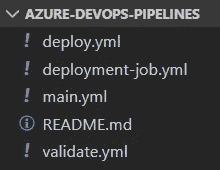
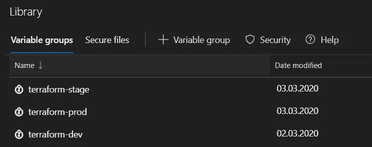
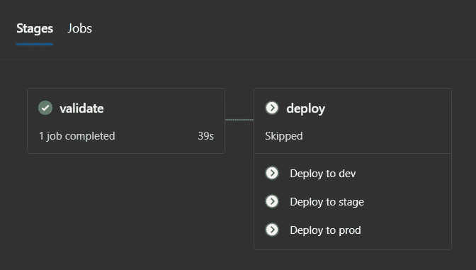

# Azure DevOps 多阶段部署

> 原文：<https://levelup.gitconnected.com/azure-devops-multi-stage-deployments-708a54700a85>

卢克·帕默在 [Unsplash](https://unsplash.com?utm_source=medium&utm_medium=referral) 上的照片

[多级管道](https://docs.microsoft.com/en-us/azure/devops/pipelines/get-started/multi-stage-pipelines-experience?view=azure-devops)特性是 Azure DevOps 中相对较新的特性，目前处于预览模式。这个特性允许您将部署过程分成多个阶段，并在多个项目中重用它们。管道以`yaml`格式描述。在本文中，我将描述如何配置 Terraform 模板的部署，以便在 Azure 中提供基础设施。

你可以在前一篇文章中读到更多关于我使用 Terraform 的经验:

 [## 使用 Terraform 将基础设施部署到 Azure

### 首先，什么是 Terraform？这是一个很好的工具，可以用代码(IaC)以声明的方式描述你的云基础设施。主要的…

medium.com](https://medium.com/@viktors.telle/deploy-infrastructure-to-azure-using-terraform-b55cbab13929) 

## 要解决的问题

我有一个任务，为三个环境配置 Terraform 模板的部署:开发、试运行和生产。

这个任务听起来很简单，但是我以前没有使用`yaml`和多级管道的经验。

所以我的旅程从阅读关于`yaml`的[文档](https://docs.microsoft.com/en-us/azure/devops/pipelines/yaml-schema?view=azure-devops&tabs=schema%2Cparameter-schema)开始，过了一会儿，它变成了我在学习和实施期间访问过的最受欢迎的资源。

## 模板结构

一开始，我创建了一个单独的 Git 存储库，用于存储其他项目可以使用的部署模板。

`main.yml`是切入点，由`validate` 和`deploy` 阶段组成。

验证阶段检查 Terraform 配置在语法上是否有效。反过来，部署阶段使用部署作业执行实际的部署。

## 部署作业

让我们来谈谈执行部署的实际代码。根据微软的建议，我选择使用类型为[部署作业](https://docs.microsoft.com/en-us/azure/devops/pipelines/yaml-schema?view=azure-devops&tabs=schema%2Cparameter-schema#deployment-job)的作业。

> 部署作业具有以下优势:
> 
> **部署历史**:您可以获得跨管道的端到端部署历史，直到特定的资源和部署状态，以便进行审计。
> 
> **应用部署策略**:您定义如何部署您的应用程序。

我选择了`runOnce`部署策略，因为它涵盖了我的 Terraform 模板部署用例，也是最简单的一个。下面是一个采用`runOnce`策略的部署作业的示例。

您可能会注意到，实际的部署步骤是在一个单独的模板文件中定义的，因为它们在每个环境中都可以重用。部署作业包含以下步骤:

*   从资源库中签出源代码。
*   任务[用变量组中的真实值替换变量标记](https://marketplace.visualstudio.com/items?itemName=qetza.replacetokens)。下一段将详细介绍变量组。
*   初始化 Terraform 配置，包括下载`[azurerm](https://www.terraform.io/docs/providers/azurerm/index.html)`提供程序，并连接到 Terraform 状态的中央`[backend](https://www.terraform.io/docs/backends/types/azurerm.html)`存储器。
*   验证 Terraform 模板。
*   显示将应用于基础结构的更改列表。
*   如果有更改，应用更改。

## 可变组

您可以使用变量组来存储常见的部署变量。我利用它们来定义变量，比如 Azure 存储帐户访问密钥、Azure 服务主体客户端机密，等等。

除了在变量组的名称中添加环境后缀之外，我没有找到更好的方法来按照环境分隔变量。

Azure DevOps 还提供了一种[链接变量组和 Azure Key Vault](https://docs.microsoft.com/en-us/azure/devops/pipelines/library/variable-groups?view=azure-devops&tabs=yaml#link-secrets-from-an-azure-key-vault) 的方法。为此，您需要设置一个[服务连接](https://docs.microsoft.com/en-us/azure/devops/pipelines/library/service-endpoints?view=azure-devops&tabs=yaml#create-a-service-connection)来连接到您的 Azure 订阅。我使用了 [Azure 资源管理器(ARM)](https://docs.microsoft.com/en-us/azure/devops/pipelines/library/service-endpoints?view=azure-devops&tabs=yaml#sep-azure-resource-manager) 服务连接。在我看来，这是一种更稳健的存储秘密的方式，因为它们集中存储，也可以在其他地方使用。

## 把所有东西放在一起

最后，我创建了以下部署管道:

由`validate`和`deploy`两个阶段组成。部署阶段有三个作业，每个环境一个。部署作业的执行基于涉及 Git 存储库分支名称的条件:

*   `Deploy to dev`在`refs/heads/dev*`分支管道被触发时执行。
*   `Deploy to stage`在`refs/heads/rel*`分支创建时执行。
*   `Deploy to prod`在`refs/heads/rel*`分支合并到`master`时执行。

## 模板用法示例

当您有多个使用共享模板的 Git 存储库时，将该模板存储在单独的 Git 存储库中并重用它是一个好主意。

我已经在这里添加了共享部署模板:

 [## viktors-telle/azure-devo PS-terra form-pipeline-template

### Azure DevOps 的 Terraform 模板部署管道。—viktors-telle/azure-devo PS-terra form-pipeline-template

github.com](https://github.com/viktors-telle/azure-devops-terraform-pipeline-template) 

下面是示例`yaml`文件，它使用了上面存储库中定义的模板。

您也可以在此查看样本:

 [## 维克托斯-特勒/蔚蓝-德沃普斯-地形-管道

### 通过在 GitHub 上创建帐户，为 viktors-telle/azure-devo PS-terraform-pipeline 开发做出贡献。

github.co](https://github.com/viktors-telle/azure-devops-terraform-pipeline) 

## 包裹

我能够实现将 Terraform 配置部署到多个环境的预期目标，但多级管道在文档方面不知何故感觉不完整，并且应该有一种更方便的方法来基于不同的环境定义变量组。让我们看看这些问题是否会在最终版本中得到解决。