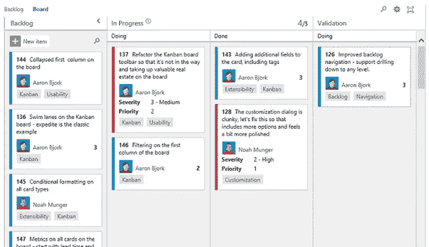
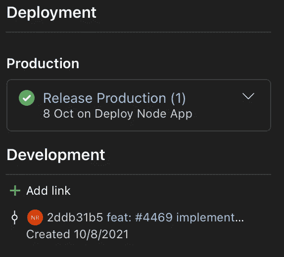
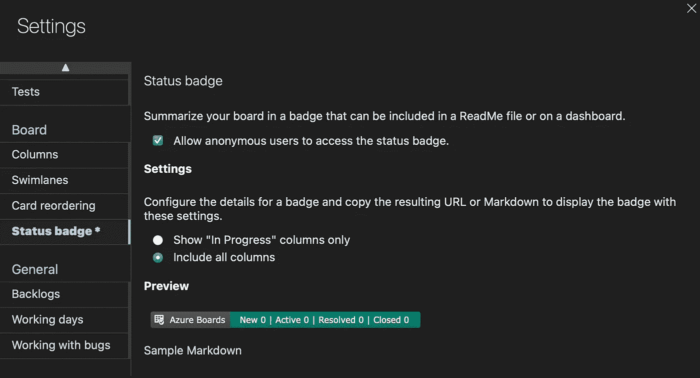

# Azure DevOps 关于管道和电路板的提示和技巧

> 原文：<https://levelup.gitconnected.com/azure-devops-tips-and-tricks-for-pipelines-and-boards-27bbd5da725c>

Azure DevOps 中最重要的功能，如何以集成的方式使用它们，以及它们的优势。

照片由[在](https://unsplash.com/@comparefibre?utm_source=medium&utm_medium=referral) [Unsplash](https://unsplash.com?utm_source=medium&utm_medium=referral) 上对比纤维

大多数关于 Azure DevOps 的文章都在谈论管道的工作方式。如何构建，如何部署。有些是关于电路板和工作条目的，但是很少有人写所有这些模块是如何相互集成的。

如果您使用 Azure DevOps 的多个模块以及它们如何相互交互，这篇文章旨在提供一个视图。

# 源代码

照片由[扬西·敏](https://unsplash.com/@yancymin?utm_source=medium&utm_medium=referral)在 [Unsplash](https://unsplash.com?utm_source=medium&utm_medium=referral) 拍摄

就集成而言，明智地选择您的源代码库提供者非常重要。如果你的源代码托管在 Azure DevOps 的 Repos 或 GitHub 中，那么你就被覆盖了，但如果你使用 Bitbucket、Gitlab 或任何其他提供商……嗯……就没那么多了。

例如，你可以很容易地设置与 Github，Bitbucket，当然还有 DevOps 的 Repos 的持续集成。对其他提供者做同样的事情可能需要更多的工作(和变通办法)，稍后会有更多的介绍。

可以说，如果你正在寻找 Azure DevOps 提供的所有可能性的完整(或更简单)访问，那么你应该考虑将你的代码转移到 GitHub 或 DevOps 的 Repos。

# 管道

我不打算讨论如何创建构建和发布管道，你可以查看周围的许多资源。所以我假设你已经有了一个构建和发布的工作流程。那么…你从这里去哪里？

## **可见性和反馈**

由 [Austin Distel](https://unsplash.com/@austindistel?utm_source=medium&utm_medium=referral) 在 [Unsplash](https://unsplash.com?utm_source=medium&utm_medium=referral) 上拍摄的照片

我认为自动化构建和部署工作流最重要的方面之一是每个人必须从每个管道的结果中获得的可见性和反馈。如果构建通过或不通过，如果部署停滞或产生错误，团队应该被实时通知。

**实时通知**
下*项目设置>通用>服务挂钩*可以设置很多服务和不同类型的触发器。如果你使用松弛或团队，那么这是必须的。只需从列表中选择其中一个，并设置触发器，如*构建完成*、*发布创建*、*发布部署完成*或*运行阶段等待批准*(当您有需要手动批准的阶段时很有用)。

**状态徽章**

徽章也提供了这种洞察力，但它们并不是真正的通知系统。然而，这是你的文档中的一个重要元素，Azure DevOps 为你提供了很多。你可以从每个构建管道的目标分支获得一个徽章。只需点击 pipeline，在右上角的三点菜单中，您将看到“状态徽章”选项。

> 提示:您可以通过将&label=MyCustomLabel 添加到图像 URL 来更改构建徽章的标签。因此您可以清楚地识别构建的类型(例如，开发构建或阶段构建)。

发布管道提供了他们自己的一套徽章(有点隐藏的功能 IMMO)。要找到它们:*编辑管道>选项>集成>检查“启用部署状态标记”。*

# 公告板和工作项目

Azure DevOps 在“Boards”菜单项下为项目经理提供了一组很好的选项。通过不同的卡片类型及其状态、分配、看板、自定义仪表板、待办事项、自定义查询等等来管理任务。我自己不是 PM，所以我真的不能评论它与其他系统相比如何，但它看起来相当体面。

## **更进一步**

在董事会下组织和管理你的任务可能非常酷，但这只是硬币的一面。将您的任务直接连接到您的源代码和部署管道，是在项目经理和开发人员之间建立桥梁的一个很好的方式。

如果你已经使用过电路板，你一定会注意到右边的“部署”和“开发”栏。当然，您可以在源代码中手动配置提交并将提交链接到工作项，但是自动设置会更好(也更容易)。

## **输入常规提交**

现在，这并不是最近的新闻，传统的提交和将问题链接到代码提交已经存在很长时间了(不用说，如果你没有使用它，你真的应该使用它)。Azure DevOps 的问题是，自动集成只适用于内部 Repos 或 GitHub(因此我之前提到了明智选择)。

*   **使用 Azure 的 Repos** 只需提交代码，引用提交标题或描述中的工作项 ID，使用格式:#1234。
*   **使用 GitHub**
    首先你必须进入*项目设置> GitHub 连接>连接你的 GitHub 账户。*建立连接后，一切工作方式与 Repos 相同。

> 提示:如果您遵循传统的提交准则，您可以通过在提交消息中使用“fix: #123”、“fixes: #123”或“fixed: #123”来自动将工作项的状态更改为 closed。

您还可以链接构建管道，但前提是您使用的是 Repos。只需点击管道，转到设置，您应该会看到一个复选框“自动链接本次运行中包含的工作项目”。

## **优点**

*   **直接在工作项中检查相关的代码变更。**
    正如您在上面的图片(开发部分)中所看到的，遵循这些约定提供了到与该工作项相关的源代码变更的直接链接。
*   **直接在工作项中检查部署状态。**
    当包含带有工作项目 ID 的提交的发布被触发时，这也会被自动填充。要激活此功能，您还需要编辑发布管道 *>选项>集成>检查"*向董事会报告部署状态 *"* ，并选择阶段和部署类型。

因此，项目经理和开发人员现在不仅可以跟踪某个特定任务发生了哪些变更，还可以跟踪它们是何时发生的，以及它们是何时发布到某个特定环境中的。

## 更多徽章！

另外，如果你真的喜欢你的徽章，你也可以从徽章上得到一个不错的工作项目总结。只需点击*板>板>右上角“配置团队设置”>状态徽章。您应该会看到如下所示的屏幕。*

如果你知道 Azure Devops 的任何更酷的提示和技巧，请随时分享！

## 资源:

 [## 链接工作项以支持可追溯性——Azure Boards

### 通过将工作项链接到其他工作项，您可以跟踪相关的工作，查看工作的层次结构，查看依赖项，以及…

docs.microsoft.com](https://docs.microsoft.com/en-us/azure/devops/boards/queries/link-work-items-support-traceability?view=azure-devops&tabs=new-web-form#work-items-linked-to-git-code-development)  [## Azure 板-GitHub 集成- Azure 板

### 使用本指南将 Azure Boards 与一个或多个 GitHub 库连接起来。此连接使用 Azure Boards 应用程序…

docs.microsoft.com](https://docs.microsoft.com/en-us/azure/devops/boards/github/?toc=%2Fazure%2Fdevops%2Fboards%2Ftoc.json&bc=%2Fazure%2Fdevops%2Fboards%2Fbreadcrumb%2Ftoc.json&view=azure-devops)