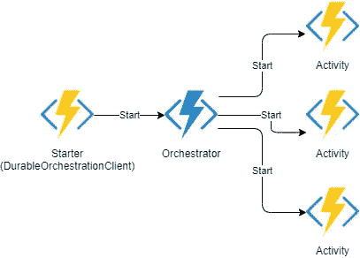
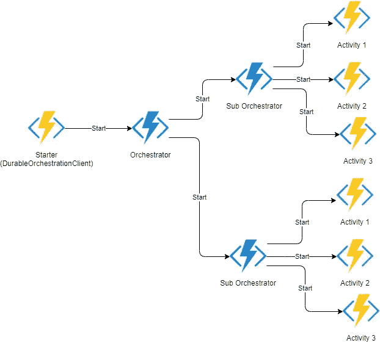
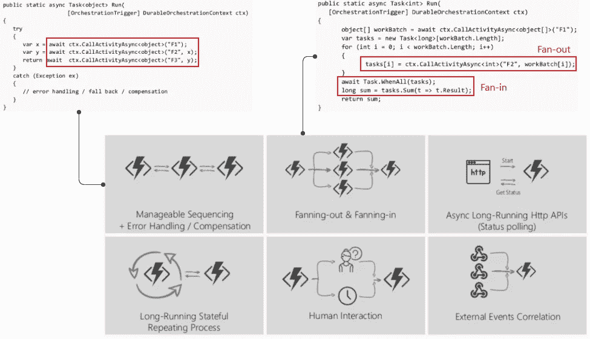
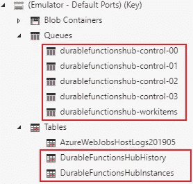
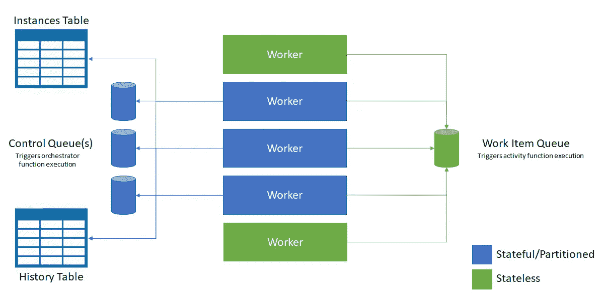
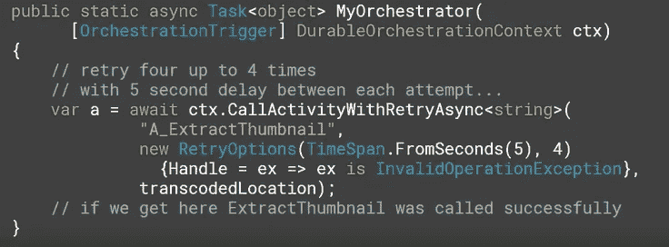

# Azure 持久功能

> 原文：<https://levelup.gitconnected.com/azure-durable-functions-ec535551751b>

Azure 持久功能有助于在无状态功能的代码中定义有状态的工作流。


**耐用功能简单来说:**

*   Azure 函数的扩展
*   无服务器环境中的有状态函数
*   在代码中定义工作流

## 持久功能的主要优势

持久功能的一些主要优点是

*   功能的并行执行(扇出>扇入)
*   中央错误处理
*   通过“Orchestrator 函数”易于理解函数之间的依赖关系

# 概观



耐久功能概述

**启动函数**:简单的 Azure 函数，通过调用 Orchestrator 函数来启动编排。它使用了一个`OrchestrationClient`绑定。

OrchestrationClient 负责启动/停止编排器并监控它们的状态。

**Orchestrator 函数**:在代码中定义有状态工作流，并调用活动函数。活动调用期间休眠，唤醒时重放。这也为定义工作流和执行实际活动提供了关注点的分离。

orchestrator 函数中的代码必须是确定性的，因为在流程中，代码将被反复执行，直到所有活动函数完成。通过使用`OrchestrationTrigger`将一个函数声明为 orchestrator

**编排功能限制:**

*   确定性:没有 NewGuid()，Random，DateTime。现在，Http 调用等。
*   无阻塞:没有 I/O 操作(例如:表存储逻辑等。)，没有线程. sleep 等..
*   在不使用上下文的情况下，永远不要启动任何异步操作

**活动函数**:简单的 Azure 函数，执行工作流中的单个步骤，可以接收或返回数据。活动函数使用一个`ActivityTrigger`,这样就可以被编排器调用

## **子编排:**

持久函数也支持子编排。这个特性使我们能够创建协调多个活动的子协调器。一个编制器函数可以使用`CallSubOrchestratorAsync`或`CallSubOrchestratorWithRetryAsync`方法调用另一个编制器函数。

它可以方便地用于:

*   复杂的编排
*   在需要重试机制的情况下。
*   在活动函数中需要延迟的情况下。活动功能中的延迟将被视为功能执行时间的一部分，因此将被计费，而 orchestrator 中的定时器延迟不会被计费，因为 orchestrator 将进入睡眠状态，直到定时器被触发。



副指挥

# 模式



# 持久功能内部机制

持久函数利用了**存储队列。队列中的消息**触发下一个函数。编排状态保存在**存储表中。**它利用事件源播放当前事件并触发下一个事件。



持久功能存储队列和表

**事件源事件:**

在工作流执行期间，会为以下活动存储事件:

*   Orchestrator 已启动
*   活动 1 已安排
*   Orchestrator 进入睡眠状态(没有为其注册明确的事件)
*   Orchestrator 启动(唤醒) >活动 1 完成
*   计划的活动 2
*   编制器已完成

**存储表:**

*   **DurableFunctionsHubInstances**:包含每个 orchestrator 实例的记录及其输入、最终输出和运行时状态
*   **durablefunctionshubhhistory:**包含每个 orchestrator 实例的事件源事件。



持久功能内部机制

***注意*** *:上面提到的表&队列名称是持久函数的默认名称；如果存储在不同的功能应用之间共享，那么建议在 host.json 中指定自定义集线器名称*

```
*Function Version 2.0 host.json:**"extensions": {* *"durableTask": {* *"hubName": "PeppolSupportedDocumentUpdaterHub"* *}
}*
```

# 监测进展

带有 HttpTrigger 的 Starter / OrchestrationClient 可以返回带有“CreateCheckStatusResponse”的响应，该响应包含可用于监控工作流进度的“statusQueryGetUri”。

```
statusQueryGetUri:[http://{BaseUri}/runtime/webhooks/durabletask/instances/{Instance](http://localhost:7071/runtime/webhooks/durabletask/instances/{instance)Id}?taskHub=DurableFunctionsHub&connection=Storage&code={FunctionKey}
```

如果涉及子任务，则可以通过向“statusQueryGetUri”添加以下附加查询参数来监控子任务的进度/输出:

```
 &showHistoryOutput=true&showHistory=true
```

# 延迟和重试机制

语境。CreateTimer，可用于在链中的单个任务执行之间添加延迟。

```
var activityTask = context.CallActivityAsync<ActivityLog>(nameof(FunctionName), inputValueToFunction);//add 3-sec delay between execution of tasks
var timeToStart = await context.CurrentUtcDateTime.AddSeconds(3);var delayedActivityTask =  context.CreateTimer(timeToStart, CancellationToken.None).ContinueWith(t => activityTask);tasks.Add(delayedActivityTask);await Task.WhenAll(tasks);var result = tasks.Select(task => task.Result).ToList();return result;
```

Activity 函数可以在 Orchestrator 中重试，也可以指定每次重试之间的延迟。也可以选择指定要重试活动的异常。



重试“InvalidOperationException”的活动函数

## 其他资源:

[](https://docs.microsoft.com/en-us/azure/azure-functions/durable/durable-functions-overview?tabs=csharp#application-patterns) [## 持久功能概述- Azure

### Azure 函数的持久函数扩展介绍。

docs.microsoft.com](https://docs.microsoft.com/en-us/azure/azure-functions/durable/durable-functions-overview?tabs=csharp#application-patterns) [](https://www.serverless360.com/blog/azure-durable-functions-patterns-best-practices) [## 持久功能模式的 Azure 最佳实践|无服务器 360

### 在 Serverless360 博客的上一篇文章中，我们介绍了持久功能，后来讨论了何时选择持久…

www.serverless360.com](https://www.serverless360.com/blog/azure-durable-functions-patterns-best-practices) [](https://docs.microsoft.com/en-us/azure/azure-functions/durable/durable-functions-sub-orchestrations?tabs=csharp) [## 持久功能的子流程- Azure

### 除了调用活动函数，orchestrator 函数还可以调用其他 orchestrator 函数。比如说…

docs.microsoft.com](https://docs.microsoft.com/en-us/azure/azure-functions/durable/durable-functions-sub-orchestrations?tabs=csharp)