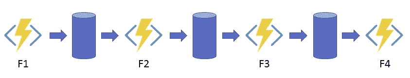

# Azure 持久功能模式

> 原文：<https://levelup.gitconnected.com/azure-durable-functions-patterns-49a2c81bddfb>

有时候，无状态的 Azure 功能无法帮助你设计复杂解决方案的无服务器架构。这就是持久功能发挥作用的地方。

照片由[SAWA 孝治](https://unsplash.com/@haru88?utm_source=medium&utm_medium=referral)在 [Unsplash](https://unsplash.com?utm_source=medium&utm_medium=referral) 上拍摄

**持久函数**是 Azure 函数的扩展，通过它你可以使用一个或多个 orchestrator 函数定义一个有状态的工作流。您可以专注于业务逻辑，而不用担心管理状态和检查点。

在本文中，在开始讨论常见的持久函数模式之前，有必要(用很少的话)解释一下存在哪些类型的持久函数，以及它们各自的作用。

# 功能类型

使用持久函数，您可以使用不同类型的函数协同工作来达到一个共同的目标。每个功能在工作流程中扮演不同的角色。

*   **管弦乐功能**。顾名思义，这种类型的功能编排工作流。在这里，您可以决定如何以及何时调用其他函数。Orchestrator 函数必须是 ***确定性的*** ，这意味着结果在后续执行之间永远不会改变，因此您可以在这种类型的函数中执行的操作受到约束。
*   **活动功能。**你可以把一个活动函数想象成一个 ***worker*** 由 orchestrator 调用，负责一项任务并执行一些活动以完成它。
*   **实体功能。**它提供了读取和更新小 ***状态*** 的方法。实体具有唯一的身份和内部状态。您可以通过标识符引用实体，并读取和更新其状态。
*   **客户端功能。**这是您工作流程的 ***入口点*** 。有必要触发编排器或实体功能。客户端函数使用*持久客户端输出绑定*，并且可以像经典 Azure 函数一样被所有可用的触发器触发。

# 建筑模式

基本上，有六种适用于持久功能的典型模式类型:

1.  函数链接
2.  扇出/扇入
3.  异步 HTTP APIs
4.  监视
5.  人际互动
6.  集合商

## 1.函数链接

这种模式非常简单，由链接函数组成，因此一个函数的输出是下一个函数的输入。这意味着以特定的顺序执行功能。这可以通过在 orchestrator 中调用它们来实现，在 orchestrator 中可以指定执行链。

使用异步调用，每个调用都必须使用 *await/yield* 关键字，以便在调用下一个函数之前等待函数的响应。

## 2.扇出/扇入

如果使用前面的模式按顺序执行函数，这种模式被认为是并行执行。通过异步执行一个活动函数**的多个实例**，可以很容易地扇出，类似于并行执行多个任务。然后，您只需等待每个功能结束，然后汇总结果或继续您的工作流程。

在 orchestrator 内部，您必须跟踪活动函数的状态。

## 3.异步**HTTP**API

这是一个**内置的**模式，当您的工作流由**长时间运行的**操作组成时，这非常有用。这种模式背后的思想是，一旦客户端函数结束执行，就提供一个端点，通过这个端点可以检查执行的状态。基本上，客户端函数触发 orchestrator，然后返回一组由持久函数扩展公开的 webhook HTTP APIs 端点，您可以使用这些端点来查询状态、发送事件或终止执行。

## **4。监视器**

monitor 模式旨在自动执行状态检查过程。与*异步 HTTP API*模式相比，客户端不需要检查 orchestrator 执行的状态。通过计时器，您可以定义轮询速率，并在满足特定条件时定期检查。

您可以定义一个活动函数，当您正在检查的条件得到验证时调用该函数，并执行一些操作来通知用户，例如，您可以使用 [SendGrid](https://sendgrid.com/) 发送电子邮件，或者使用 [Twilio](https://www.twilio.com/) SMS 服务发送 SMS。也就是说，您可以公开 webhook HTTP API 来检查监视器的状态，并在需要时终止执行。

## 5.人际互动

有时，您的业务逻辑可能需要人工交互。在自动化流程中处理它们通常很复杂，因为您需要定义一些**逻辑来等待响应**(人类不像机器那样响应)，并在交互没有在时限内到达的情况下退出执行或执行默认操作。

这种模式的一个常见例子是询问用户是否同意执行。同样，在这种情况下，您可以使用 Twilio SMS 服务来发送验证码，并使用另一个函数来公开 webhook API 端点，用户可以通过该端点发送接收到的代码。

## 6.集合商

这种模式利用实体功能来聚合来自一个或多个来源(如事件中心)的数据。您可以在很长一段时间内成批接收数据，也可以不接收。使用这种模式，您可以为想要聚合的指标创建一个实体实例，它拥有状态。

客户端应该能够查询聚合值。

# 参考

*   Microsoft Azure 文档

# 分级编码

感谢您成为我们社区的一员！在你离开之前:

*   👏为故事鼓掌，跟着作者走👉
*   📰查看[级编码出版物](https://levelup.gitconnected.com/?utm_source=pub&utm_medium=post)中的更多内容
*   🔔关注我们:[推特](https://twitter.com/gitconnected) | [LinkedIn](https://www.linkedin.com/company/gitconnected) | [时事通讯](https://newsletter.levelup.dev)

🚀👉 [**将像你这样的开发人员安置在顶级创业公司和科技公司**](https://jobs.levelup.dev/talent/welcome?referral=true)