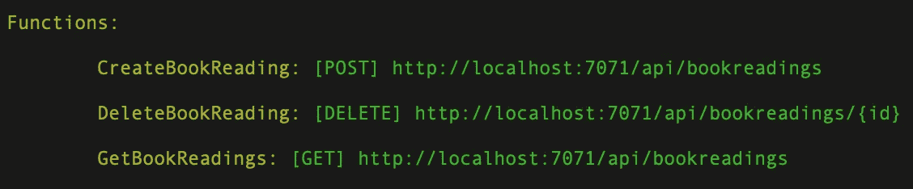
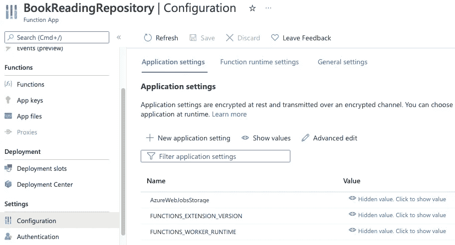
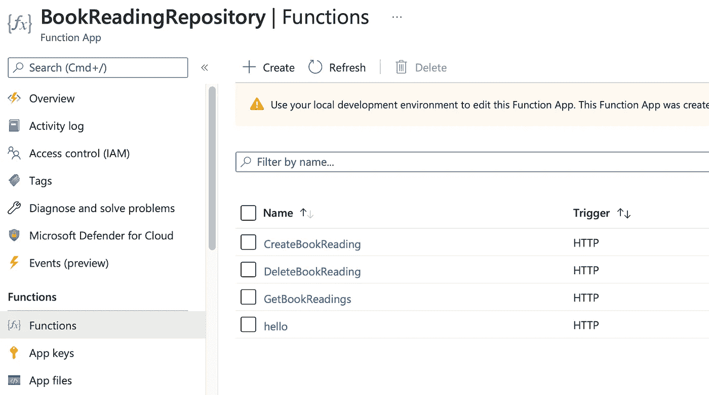
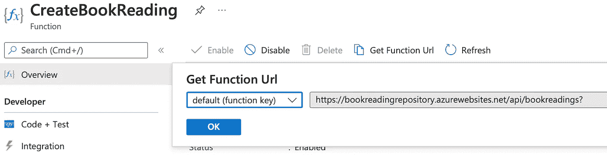

# Azure 函数和 MongoDB

> 原文：<https://levelup.gitconnected.com/azure-functions-and-mongodb-f0abffdd574b>

## 如何开发一个与 MongoDB 通信的 Azure 函数

在我的第二篇关于 *Azure 函数的文章中，*我想继续我的第一篇超级基础文章并展示如何创建一个与 *MongoDB* 通信的 *Azure 函数*。因此，will 将构建一个小应用程序，其中包含您想要阅读的书籍列表。

# TL；速度三角形定位法(dead reckoning)

对于那些没有耐心的人，这里有一个我创建的库的链接，展示如何在一个 *Azure 函数*中使用 *MongoDB* 。

 [## GitHub-iam Noah 1/book reading-API:展示如何在 Azure 中使用 MongoDB 的示例应用程序…

### 示例 Azure Functions Visual Studio 解决方案。允许存储书籍的优先列表。可以作为阅读…

github.com](https://github.com/iamNoah1/bookreading-api) 

# 先决条件

确保为我们的 *Azure Function* 和 *MongoDB* 之旅准备好相应的环境。您可以使用的工具有很多种，但是除了强制性的东西之外，我在这里会给出一些偏好:

*   。安装了. Net 核心框架
*   Visual Studio 已安装
*   *蔚蓝*账户
*   *坞站*已安装(可选)
*   *Azure 功能*核心工具(可选)

# 入门指南

我们将通过以下步骤直接切入主题:

*   在 *Azure* 上用 *MongoDB* API 创建一个 *Azure Cosmos DB* 。因此，转到 *Azure* 门户并创建一个 *Azure Cosmos DB* 。下一步选择 Azure Cosmos DB API for MongoDB。选择一个资源组或创建一个新的资源组，并输入实例的名称。
*   对于本地开发，在本地运行一个 *MongoDB* 。我推荐使用 docker，因为它简单快捷:`docker run -d -p 27017:27017 mongo`将在本地启动一个 *MongoDB* 实例，运行在默认端口上。
*   打开 Visual Studio。
*   创建一个新的 *Azure Function* 项目(参见[上一篇博客](https://iamnoah1.medium.com/my-first-azure-function-59bc9c9aedbf))。只要确保选择 HTTP 触发器和匿名授权级别。

# 调整

现在我们有了默认的 *Azure Function* 模板，是时候做以下调整了:

*   包含默认 *Azure 函数*的生成类是以项目名称命名的，因此我们需要调整类、文件和 *FunctionName* 注释。我将这个类命名为`BookReadingController`，并将 *FunctionName* 注释的值设置为`CreateBookReading`，因为它将表示用于添加您想要阅读的新书的端点。
*   继续添加你希望你的应用拥有的 Azure 功能。我继续创建、列出和删除端点:

*   添加 *MongoDB。驱动*和 *MongoDB。使用 *NuGet* 包管理器，编辑项目文件，或者通过在项目根目录中运行以下命令，获得*对项目的依赖关系:`dotnet add package MongoDB.Driver`和`dotnet add package MongoDB.Bson`。

# 坚持

对于与持久性相关的代码，我们需要几样东西。我们将需要建立到 *MongoDB* 的连接，这是一个实体类，用于将数据库条目映射到一个公开 CRUD 操作的所谓的 repository 类。

## 实体

创建一个代表我们实体的类，并将其命名为`BookReading`。为该实体提供您认为合适的任何字段。除了 id 之外，我还会提供描述和优先级。

## 数据库管理器

现在，为了与 *MongoDB 进行通信，*我创建了一个名为`BookReadingDBManager`的单独的类，它封装了基本的功能。创建到 *MongoDB* 的连接并检索最后的优先级就是基本功能的例子。

# 执行

此时，我们应该已经准备好运行我们的 Azure 函数了。我们有两种情况。本地运行或者在 *Azure* 上运行。

## 在本地

要在本地运行该项目，您需要在您的机器上安装一个 *MongoDB* 实例，这一点在入门部分已经提到过。我喜欢在这种情况下使用 *Docker* ，因为它简单快捷。只需运行`docker run -d -p 27017:27017 mongo`来启动一个运行在默认端口上的 *MongoDB* 实例。不要忘记将环境变量`MONGO_DB_CONNECTION_STRING`设置为`mongodb://localhost:27017/`。

接下来是开始我们的项目。您可以使用 *Visual Studio* (代码)或使用命令行来完成，这是我的首选方式:在项目根目录中的`func start`。输出显示了哪些端点是公开的。

现在只需使用浏览器、邮差或我新喜欢的工具[失眠](https://insomnia.rest/)调用该功能。

## 在 Azure 上

通过 *Visual Studio* 在 *Azure* 上部署相当容易，然而，我认识到在 *macOS* 和 *Windows10* 上安装 *Visual Studio* 的发布向导是不同的。我将尽可能保持以下步骤的通用性。

**展开**

*   在 *Visual Studio* 项目的上下文菜单中选择 publish。你必须登录你的 *Azure* 账户。
*   接下来，你要么需要创建一个新的*应用服务*和*服务计划*(这将在向导的帮助下完成)，要么从你的 *Azure* 订阅中选择一个现有的。
*   创建新的*应用服务*时，您必须指定一些设置，如*应用服务*的名称，选择*订阅*和*资源组*。如果你以前和 *Azure* 一起工作，你应该已经有了一个*资源组*。但是不用担心，你也可以随时创建新的。
*   创建新的*服务计划*也是如此。在这里，我们必须给出一个名称，选择一个地区，以及由您希望专门用于您的职能部门的资源数量决定的定价。
*   在 *macOS* 上，向导的最后一步是指定存储该功能的存储帐户。我记得在 windows10 上，这是在向导的第一步中设置的。无论如何，在这里你也可以选择一个现有的存储帐户或创建一个自定义的飞行。惊喜吧。
*   现在，为部署的 Azure 函数设置环境变量很重要。因此，我们首先需要获取连接字符串。因此，只需导航到我们之前创建的 *Cosmos DB* 并转到左侧导航面板上的“连接字符串”。复制主连接字符串或辅助连接字符串。
*   使用 *Visual Studio 代码*和 *Azure* 插件，添加环境变量相当容易。我不知道 *Visual Studio* 在 *Windows* 上的情况，但是，在新的 *Visual Studio for Mac* 的预览版上，这似乎是不可能的。然而，我们总是可以通过 *Azure* 门户来设置环境变量。因此，我们导航到 *Azure Function* 资源，并点击左侧导航面板上的配置部分。并添加新的应用程序设置条目，用上一步复制的连接字符串填充环境变量`MONGO_DB_CONNECTION_STRING`。

## 测试

在这篇文章中，将这些功能部署到 Azure 需要大量的工作。现在我们可以在 *Azure* 上测试 *Azure 功能*。耶。

*   请注意，在*窗口 10* 的向导之后显示的网站 URL，或者应该在 *macOS* 上自动打开的网站 URL，并不是该功能的实际 URL，它只是该功能空间的基本 URL。
*   要获得该函数的实际 URL，请转到 *Azure 门户*并找到您的 *Azure Function* 资源。点击它。有点混乱，但是 *Azure* 上 *Azure 函数*的高层 *Azure* 资源是一个*函数 App* 。在这个*功能 App 里面，*你可以看到不同的单个 *Azure 功能*。在我们的例子中，我们为每个 CRUD 操作定义了一个 *Azure 函数*。现在，进入左侧的*功能*并选择您想要测试的 *Azure 功能*。

*   在最上面，你应该会看到一个按钮“获取函数 URL ”,它给出了具体的 Azure 函数的 Url，可以用于 Postman、curl 或失眠症。

# 结论

使用*与来自 *Azure 函数*的 *MongoDB* 一起工作。Net* 和做别的*没多大区别。Net* 应用。使用 Azure 函数至少有一个主要优势，那就是成本相关。Azure 函数“休眠”直到它们通过指定的触发器被执行。这样，它们只在“存活”期间产生成本。至少这是默认行为。使用高级计划，*功能*可以一直保持运行。关于 *Azure Functions* 的另一件好事是 *Azure* 将自动负责缩放*函数*。

我想说，使用 *Azure Functions* 是一种快速产生价值的好方法，而不必过多考虑操作方面的事情。但公平地说，虽然你不必考虑所有与运营相关的事情，但与其他运营模式相比，也有更多的限制。

更多的灵活性，需要考虑更多的事情，或者更少的灵活性，但也需要考虑更少的事情。明智地选择。

让我知道你对 Azure Functions，Functions as a Service 的看法。我很高兴收到任何反馈。

# 分级编码

感谢您成为我们社区的一员！在你离开之前:

*   👏为故事鼓掌，跟着作者走👉
*   📰查看[升级编码出版物](https://levelup.gitconnected.com/?utm_source=pub&utm_medium=post)中的更多内容
*   🔔关注我们:[Twitter](https://twitter.com/gitconnected)|[LinkedIn](https://www.linkedin.com/company/gitconnected)|[时事通讯](https://newsletter.levelup.dev)

🚀👉 [**加入升级人才集体，找到一份神奇的工作**](https://jobs.levelup.dev/talent/welcome?referral=true)