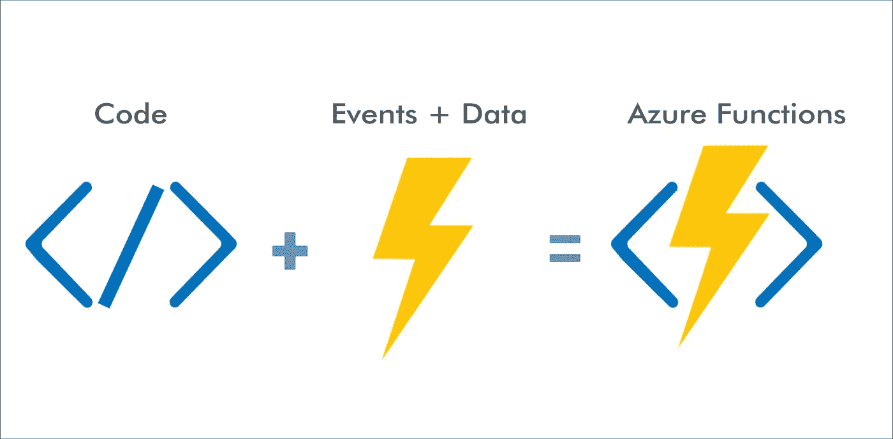
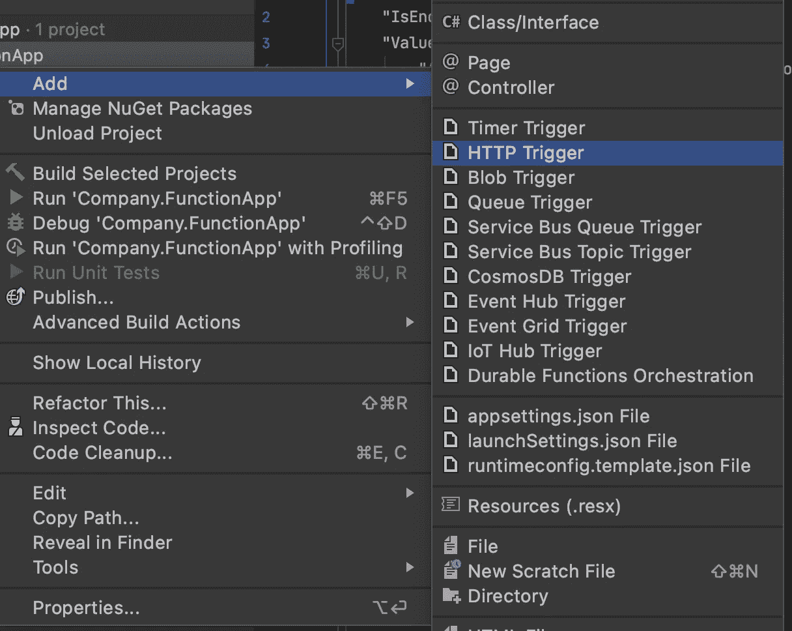
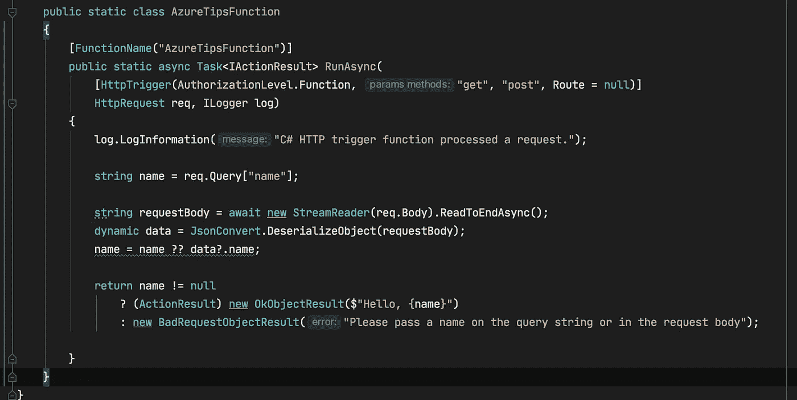

# Azure Functions 最佳实践——以两种不同的方式重用客户端实例

> 原文：<https://levelup.gitconnected.com/azure-functions-best-practice-reuse-client-instances-in-two-different-ways-9482841d3131>



一个 zure Functions 是微软 Azure Cloud 上提供的一个事件驱动的无服务器计算服务。您可以在您的 IDE 中非常轻松地创建一个新的 Azure Functions 应用程序，如 Visual Studio 2019、Visual Studio Code、Rider 等。因为我在 Mac 上使用 Rider，所以我创建了一个新的 Azure Functions 解决方案，并在 Rider 的解决方案中添加了一个新功能。



在我们的函数中有一个名为 AzureTipsFunction 的静态类和一个名为 RunAsync 的静态方法。(其实对**依赖注入**的支持是从 **Azure Functions 2.x** 开始的。所以那些 IDE 应该使用另一个模板来生成代码)。

您可以轻松地在本地运行它，或者将其发布到 Azure cloud，让更多人可以访问它。

虽然开发一个 Azure Functions app 很容易，但是如果不小心，也会遇到很严重的问题。例如，你应该记住 Azure 函数应用程序中的函数共享连接，如 HTTP 连接、数据库连接等。许多库提供了外部资源的抽象，这些库管理自己与资源的连接，如 HttpClient、QueueClient 等。

因此，如果您的函数代码看起来像这样，它将在每次调用函数时创建一个新的 HTTP 客户端实例。

```
public static class AzureTipsFunction
{
    [FunctionName("AzureTipsFunction")]
    public static async Task<IActionResult> RunAsync(
        [HttpTrigger(AuthorizationLevel.Function, "get", "post", Route = null)]
        HttpRequest req, ILogger log)
    {
        log.LogInformation("C# HTTP trigger function processed a request.");

        **using (var client = new HttpClient())**
        {
            var client = new HttpClient();
            var response = await client.GetAsync("[http://jiadongchen.com](http://jiadongchen.com)");
            ...
            ...
        }
    }
}
```

在运行您的功能应用程序时，您可能会遇到`**Host thresholds exceeded: Connections**`异常或其他一些性能问题。

那么如何解决这个问题呢？这是我们将在这篇文章中讨论的主题，即“在你的 Azure Functions 应用程序中重用客户端实例”。我将介绍在 Azure Functions 应用程序中实现实例重用的两种方法。

# # 1 静态客户端

不要在每次调用一个函数时都创建一个新的 HttpClient 实例(和其他客户机),而应该为所有调用使用一个 HttpClient 实例。

在 Azure 函数中实现它的最简单的方法是在函数的运行代码之外将 HttpClient 声明为静态的。

```
// Create a single, static HttpClient
**private static HttpClient httpClient = new HttpClient();**public static async Task Run(string input)
{
    var response = await httpClient.GetAsync("[http://jiadongchen.com/](http://jiadongchen.com/)");
    // Rest of function
}
```

这样，每个函数调用都将重用 HttpClient 的同一个实例，这非常容易实现。

但是，随着代码量的增加，这种方法不容易维护。当然，您可以将 HttpClient 的声明放在一个助手类中，但这仍然很难维护。想象一下另一个程序员不知道这个 helper 类的存在…

# # 2 使用依赖注入。NET Azure 函数

所以，我更倾向于第二种方式。

正如我在本文开头提到的，对依赖注入的支持始于 **Azure Functions 2.x** 。所以我们可以不使用静态函数类/方法，而是像其他 ASP 一样，添加一个带有`FunctionsStartup` assembly 属性的`Startup`类来注册我们需要的服务。NET 项目。然后，为了使我们的依赖关系在函数中可用，我们应该使用构造函数注入。

那么代码将变成如下所示。

```
[**assembly: FunctionsStartup**(typeof(MyNamespace.Startup))]namespace MyNamespace
{
    public class **Startup** : FunctionsStartup
    {
        public override void Configure(IFunctionsHostBuilder builder)
        {
            **builder.Services.AddHttpClient();** //builder.Services.AddSingleton<IMyService>((s) => {
            //    return new MyService();
            //}); builder.Services.AddSingleton<ILoggerProvider, MyLoggerProvider>();
        }
    }
}
```

我们在启动类中注册 HttpClient。

```
public class AzureTipsFunction
{
    **private readonly HttpClient _http;** **public AzureTipsFunction(HttpClient httpClient)**
    {
 ***_http = httpClient;***    } [FunctionName("AzureTipsFunction")]
    public async Task<IActionResult> RunAsync(
        [HttpTrigger(AuthorizationLevel.Function, "get", "post", Route = null)]
        HttpRequest req, ILogger log)
    {
        ...
    }
}
```

我们移除了 AzureTipsFunction 类的静态修饰符，并向该类添加了一个构造函数，以将 HttpClient 依赖注入到这个 HTTP 触发的函数中。

我个人认为这是在 Azure Functions 应用中实现客户端实例重用的一种更优雅的方式！

好了，以上就是我想在本帖中与大家分享的“在你的 Azure Functions app 中重用客户端实例”的两种实现方式，你可以在下面找到更多有用的链接！

# 有用的链接

[](https://docs.microsoft.com/en-us/azure/azure-functions/manage-connections?WT.mc_id=DT-MVP-5001664) [## 管理 Azure 函数中的连接

### 功能应用中的功能共享资源。这些共享资源包括连接:HTTP 连接、数据库…

docs.microsoft.com](https://docs.microsoft.com/en-us/azure/azure-functions/manage-connections?WT.mc_id=DT-MVP-5001664) [](https://docs.microsoft.com/en-us/azure/architecture/antipatterns/improper-instantiation?WT.mc_id=DT-MVP-5001664) [## 不正确的实例化反模式-云应用的性能反模式

### 不断地创建一个对象的新实例会影响性能，而这个对象本来是要创建一次的，然后…

docs.microsoft.com](https://docs.microsoft.com/en-us/azure/architecture/antipatterns/improper-instantiation?WT.mc_id=DT-MVP-5001664) [](https://docs.microsoft.com/en-us/azure/azure-functions/functions-dotnet-dependency-injection?WT.mc_id=DT-MVP-5001664) [## 在中使用依赖注入。NET Azure 函数

### Azure Functions 支持依赖注入(DI)软件设计模式，这是一种实现

docs.microsoft.com](https://docs.microsoft.com/en-us/azure/azure-functions/functions-dotnet-dependency-injection?WT.mc_id=DT-MVP-5001664) 

感谢您的阅读，希望对您有所帮助。

在聊天

[](https://www.linkedin.com/in/chenjd/) [## 陈家东-高级软件开发人员-X 公司| LinkedIn

### 大家好，我是陈家东陈(@chen_jd)。我是个有经验的人。NET 开发者，2015 年 10 月起成为微软 MVP。我最后一次…

www.linkedin.com](https://www.linkedin.com/in/chenjd/)